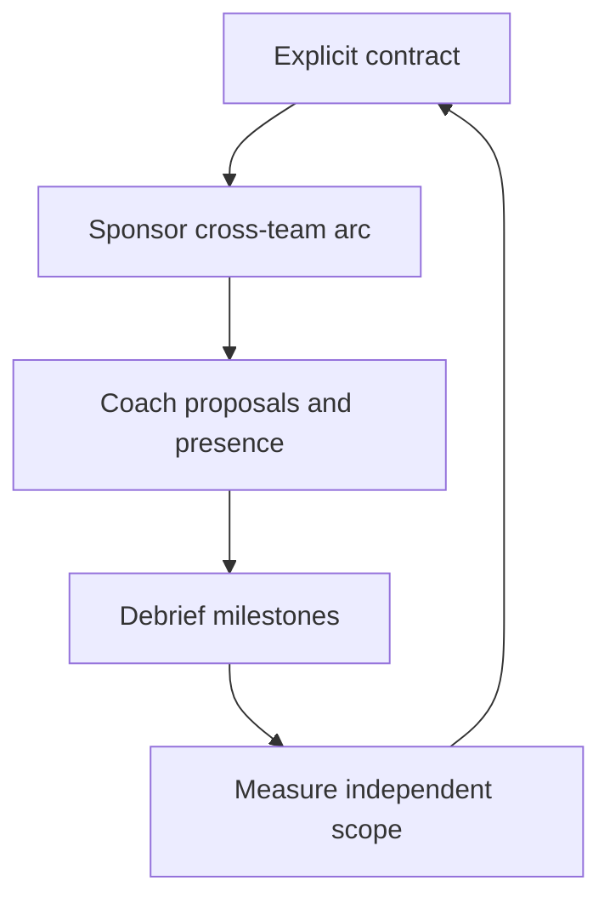

# Mentoring Senior Engineers

> **Core skill:** Growing senior engineers toward staff-level scope, influence, and judgment — through explicit contracts, sponsored arcs, and coaching that targets the gap, not the craft.

## Why This Matters

Mentoring changes clientele at staff level. Juniors need craft; seniors need the three gaps that separate them from staff: scope (team-sized to org-sized problems), influence (leading without authority), and judgment (deciding under ambiguity). Teaching craft to a senior is noise; sponsoring an org-scale arc is signal.

The multiplication logic is direct: every senior you grow into staff-level judgment is a second person who can see the whole. The org's ceiling is not its staff headcount — it is the pipeline of seniors being deliberately grown toward it. Mentoring seniors is also how your own scope expands: you cannot sponsor what you cannot see, and the sponsorship forces you to keep seeing more.

## The Senior-to-Staff Gap

| Dimension | Senior Engineer | Staff Engineer | The Mentoring Target |
|---|---|---|---|
| **Scope** | Owns team-sized problems | Owns org-sized problems | Cross-team arcs with named outcomes |
| **Influence** | Leads within the team | Moves rooms they do not own | Presence coaching, proposal sponsorship |
| **Judgment** | Decides with context | Decides under ambiguity | Framing, trade-offs, second-order thinking |
| **Visibility** | Known for delivery | Known for leverage | Writing, reviews, decision ownership |

The gap is not skill; it is altitude. A senior who can already do staff work at team scale needs practice at org scale — and that practice is what the mentoring relationship exists to arrange.

## Mentoring Contracts

Senior mentoring needs an explicit contract; drift is how both parties waste the time:

| Contract Element | Question It Answers | Good Practice |
|---|---|---|
| **Goals** | What are we growing, exactly? | Two or three named outcomes, written |
| **Cadence** | How often do we meet? | Biweekly, fixed, rescheduled rarely |
| **Duration** | How long does this run? | Three to six months, then renegotiate |
| **Mechanism** | How does the growth happen? | Arcs, proposal reviews, observed meetings |
| **Exit criteria** | When is it done? | The mentee runs the arc without you |

The contract's real function is making the mentee the owner: they set the goals, run the arc, and bring the material. Your job is the questions and the sponsorship, not the energy.

## The Mentoring Portfolio

Two to four concurrent relationships, deliberately diverse:

| Diversity Dimension | Why It Matters | Portfolio Example |
|---|---|---|
| **Archetype** | Staff has multiple shapes, not one | One strategy-leaning, one operator-leaning |
| **Team** | Different seams, different lessons | One from your area, one from elsewhere |
| **Stage** | Pipeline needs depth, not just the top | One near-promotion, one two years out |
| **Style** | Different strengths to grow | One strong writer, one strong mobilizer |

Four is the practical ceiling: each relationship needs real attention, and attention is the scarcest staff resource. A portfolio of one is a bottleneck; a portfolio of six is a schedule.

## Mentoring Mechanics for Seniors

### Arc Sponsorship

Give them the cross-team problem they cannot give themselves:

- Pick an arc with org-level visibility and a named outcome
- Hand over the outcome, not the method
- Debrief the arc at milestones: framing, stalls, politics

### Proposal Coaching

Their drafts are where judgment becomes visible:

- Review their proposals before they circulate
- Push on framing: what decision, for whom, by when
- Teach the structure, not just the content

### Presence Coaching

The meetings they lead, with you observing:

- Agree beforehand what you are watching for
- Debrief after: what landed, what did not
- Escalate your own presence out as theirs grows in

## Measuring Mentoring Impact

| Signal | What It Shows |
|---|---|
| Their arcs land without your rescue | Independent scope handling |
| Their proposals circulate and get adopted | Influence growing without you |
| They sponsor others' work | The pattern is multiplying |
| They are asked into rooms you are not in | Visibility is now theirs |
| Their promotion case writes itself | The growth was real, not coached |

The uncomfortable measure: can they do the next arc without you? If the answer is still no after a cycle, the contract was comfortable, not developmental.

## When Mentoring Isn't Working

| Cause | Signal | Response |
|---|---|---|
| **Chemistry** | Meetings feel dutiful; nothing deep surfaces | Be honest; hand off to a better-fit mentor |
| **Readiness** | Goals set, nothing acted on between meetings | Renegotiate scope down or pause |
| **Mismatch** | The gap is motivation, not capability | Refer to management; mentoring cannot fix drive |
| **Your capacity** | Sessions get cancelled by you repeatedly | Reduce the portfolio; quality over count |

The honest close is part of the craft: a mentoring relationship that is not working should end explicitly, with a referral or a reset — not fade into calendar noise.



## Practical Applications

### Senior Mentoring Checklist

- [ ] Write the contract: goals, cadence, duration, exit criteria
- [ ] Keep two to four relationships, deliberately diverse
- [ ] Sponsor one org-scale arc per mentee per cycle
- [ ] Review their proposals before they circulate
- [ ] Observe one meeting they lead; debrief it
- [ ] Check at each milestone: could they do this without you?

### Mentoring Contract Template

```markdown
# Mentoring Contract: [Mentee Name]

## Goals
1. [Named outcome]
2. [Named outcome]
3. [Named outcome]

## Cadence and Duration
- Meetings: [biweekly, time, place]
- Duration: [months], renegotiated at [date]

## Mechanisms
- Arc: [cross-team problem with named outcome]
- Proposal coaching: [which drafts, by when]
- Presence coaching: [which meetings, observation plan]

## Exit Criteria
- [ ] Mentee runs the arc without staff involvement
- [ ] Proposal circulates and is adopted independently
- [ ] Next arc scoped by the mentee alone

## Review
- Milestone reviews: [dates]
- Final review: [date]
```

## Common Pitfalls

| Pitfall | Why It Is a Problem | Better Approach |
|---|---|---|
| **Craft mentoring** | Teaching coding to a senior wastes the altitude gap | Target scope, influence, and judgment |
| **Contract-free drift** | Meetings that meander grow nobody | Write goals, cadence, and exit criteria |
| **Single heir** | One mentee becomes the only pipeline | Keep a diverse portfolio of two to four |
| **Doing it for them** | Rescuing the arc teaches dependence | Hand over outcomes; let them struggle in view |
| **Comfortable relationships** | Friendly chats that never stretch | Every cycle ends with a harder ask |
| **Unclosed endings** | Failed relationships fade into calendar noise | Close explicitly, with a referral or reset |

## Success Indicators

- Mentees run org-scale arcs without your rescue
- Their proposals and presence carry without you in the room
- At least two credible staff candidates are in your pipeline
- Mentees begin mentoring others themselves
- The portfolio stays at two to four, with honest closes

## Related Topics

- [[02_Judgment_Transfer]]: the teaching mechanism for the gap
- [[05_Growing_the_Next_Staff]]: the pipeline this feeds
- [[04_Writing_as_Scaling]]: mentoring that scales through documents
- [[career-path/02_Senior_Software_Engineer/07_Mentoring_and_Team_Leadership/01_Technical_Mentoring|Technical Mentoring (Senior)]]: the 1:1 craft this builds on
- [[career-path/11_Engineering_Manager/01_People_Development/00_overview|People Development (EM)]]: the manager's parallel

## Summary

Mentoring senior engineers is the staff multiplication move: close the altitude gap in scope, influence, and judgment through explicit contracts, diverse portfolios of two to four, sponsored cross-team arcs, proposal coaching, and observed presence. Measure success by independence — can they run the next arc without you — and close relationships honestly when chemistry, readiness, or motivation is the blocker. Every senior grown is the org seeing the whole twice.
