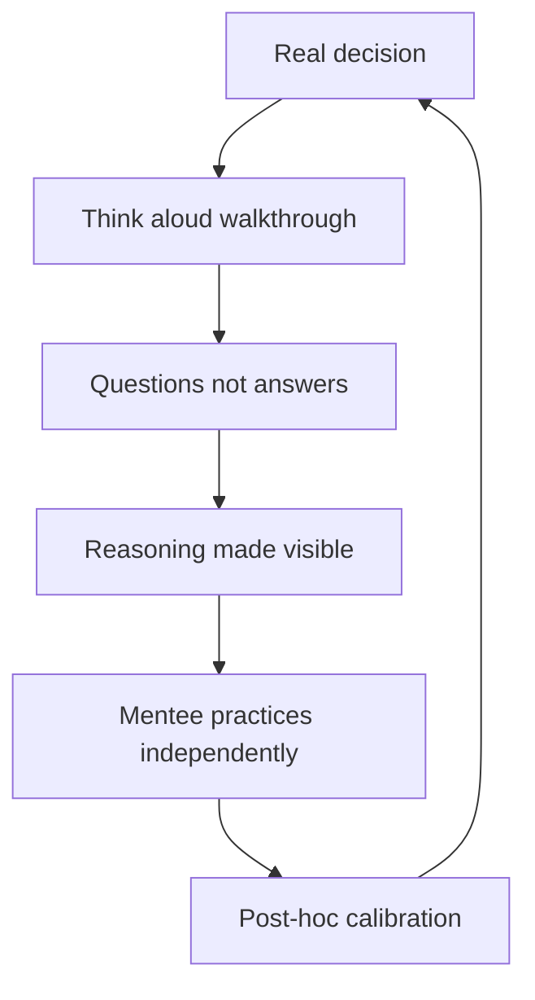

# Judgment Transfer

> **Core skill:** Teaching thinking, not solutions — through case walkthroughs, decision reviews, shadowing, and post-hoc analysis that make staff-level reasoning visible and learnable.

## Why This Matters

Knowledge transfers easily: write it down, and it is available. Judgment transfers hard: it is tacit, contextual, and lived — the product of hundreds of decisions and their aftermaths. You cannot hand someone your judgment; you can only make your reasoning visible while they practice their own, and coach the practice.

Judgment is the staff differentiator: how a problem gets framed, which options get generated, which trade-offs get accepted, what second-order effects get noticed. All of it happens inside heads, which is why it so rarely transfers. The staff engineer who can make that invisible process visible is multiplying the org's hardest-to-replace asset.

## Why Judgment Transfers Differently

| Dimension | Knowledge | Judgment |
|---|---|---|
| Form | Explicit, documentable | Tacit, contextual |
| Transfer | Write it, teach it, document it | Model it, practice it, debrief it |
| Failure mode | Stale or missing docs | The mentee repeats your process, not your reasoning |
| Time to transfer | Days to weeks | Quarters to years |
| Evidence | Tests, checklists | Decisions made well under ambiguity |

The mistake is treating judgment as knowledge: a one-hour explanation of how you think, and done. Judgment transfers through repeated exposure to real decisions with real stakes and real debriefs — which is why the mechanisms below all involve actual work.

## Transfer Mechanisms

| Mechanism | How It Works | When to Use |
|---|---|---|
| **Case walkthroughs** | Think aloud through a real past or live decision | Building framing and trade-off fluency |
| **Decision reviews** | Their decision, your questions, no answers | Testing and sharpening their reasoning |
| **Shadowing** | They join your proposals, escalations, reviews | Exposure to staff-level situations |
| **Post-hoc analysis** | What would you have done, and why | Calibrating against actual outcomes |

### Case Walkthroughs

Pick a real decision — ideally one with a known outcome. Walk it aloud: how you framed it, what options you saw and rejected, where you were uncertain, what you would do differently. Then reverse it: have them walk their own case while you listen for framing, options, and second-order awareness. The replay is where the tacit becomes visible.

### Decision Reviews

Their decision, your questions — the Socratic loop:

- What decision are we actually making, and for whom?
- What options did you reject, and on what evidence?
- What would have to be true for this to fail?
- What does this push out, and who pays for it?

The discipline is questions, not answers. Every answer you give is a judgment they do not practice.

### Shadowing

They attend the rooms you attend — proposal reviews, escalations, design councils — with a debrief afterward: what did you notice, what would you have done, what surprised you. Shadowing without debrief is just a meeting; with debrief it is a curriculum.

### Post-Hoc Analysis

Months later, revisit the decision: what actually happened, what did you predict, what did you miss? The calibration loop — prediction, outcome, lesson — is how judgment compounds.

## The Judgment Portfolio

Recurring decision types at staff level, tracked per mentee:

| Decision Type | Example | Growth Signal |
|---|---|---|
| **Framing** | Turning a vague ask into a decision | Names the decision and audience unprompted |
| **Trade-off acceptance** | Choosing what to give up | States the cost and the owner of the cost |
| **Escalation timing** | When to move a risk up | Escalates with options, early |
| **Scope judgment** | What is staff-sized vs team-sized | Picks the altitude correctly |
| **Political reading** | Who must be aligned, and in what order | Maps stakeholders before proposing |

The portfolio is the mentee's recurring practice ground — the same decision types reappear, each cycle slightly harder.

## Making Thinking Visible

Your reasoning, in writing, on a cadence:

| Practice | What It Produces |
|---|---|
| Decision journals | A record of your reasoning others can read |
| Annotated proposals | The "why" written next to the "what" |
| Postmortem narratives | Your read of what went wrong and why |
| Debrief write-ups | The lesson, not just the event |

The rule: if you made a significant judgment call, someone else should be able to reconstruct your reasoning from what you wrote. Writing is how judgment leaves your head — and it is the only way it can multiply.

## Assessing Judgment Growth

| Dimension | Novice Signal | Growth Signal |
|---|---|---|
| **Framing quality** | Accepts the question as given | Reframes the question before answering |
| **Option generation** | Two options, one obvious | Real alternatives, including do nothing |
| **Second-order awareness** | Names the immediate effect | Names the effect and the effect of the effect |
| **Trade-off honesty** | Hides the cost of the choice | States the cost and who bears it |
| **Calibration** | Confident regardless of track record | Confidence tracks the evidence |

Assessment is qualitative and longitudinal — one decision tells you little; a portfolio of decisions over a year tells you the trajectory.



## Practical Applications

### Judgment Transfer Checklist

- [ ] Run one case walkthrough per month on a real decision
- [ ] Review their decisions with questions, never answers
- [ ] Bring them into one staff-level room per cycle, with debrief
- [ ] Keep a decision journal they can read
- [ ] Track the judgment portfolio: framing, options, second order
- [ ] Revisit decisions post-hoc for calibration

### Decision Review Question Bank

```markdown
# Decision Review: [Their Decision]

## Framing
- What decision are we actually making?
- For whom, and by when?

## Options
- What did you reject, and on what evidence?
- What would "do nothing" cost?

## Risk
- What has to be true for this to fail?
- What is the second-order effect?

## Trade-offs
- What does this push out?
- Who pays the cost you are not paying?

## After the outcome
- What did you predict?
- What happened, and what do you learn?
```

## Common Pitfalls

| Pitfall | Why It Is a Problem | Better Approach |
|---|---|---|
| **Answer-giving** | Every answer is a judgment they don't practice | Questions, not answers |
| **Knowledge framing** | Lectures about judgment transfer nothing | Real decisions, real stakes, debriefs |
| **No post-hoc loop** | Without outcomes, judgment never calibrates | Revisit decisions months later |
| **Hidden reasoning** | Judgment you never narrate stays yours | Write the reasoning down |
| **Abstract cases only** | Hypotheticals lack the stakes that teach | Use real decisions with real consequences |
| **No portfolio view** | One decision says nothing about growth | Track recurring decision types over time |

## Success Indicators

- Mentees reframe questions before answering them
- Their options include the ones you would have generated
- Second-order effects are named before they materialize
- Your reasoning is reconstructable from what you wrote
- Their decisions calibrate: predictions get more accurate over time

## Related Topics

- [[01_Mentoring_Senior_Engineers]]: the relationship judgment transfer runs through
- [[04_Writing_as_Scaling]]: writing as the visibility mechanism
- [[05_Systems_Thinking_and_Organizational_Design/00_overview|Systems Thinking and Organizational Design]]: the model toolkit to transfer
- [[01_The_Staff_Role_and_Scope/00_overview|The Staff Role and Scope]]: what staff judgment is for
- [[career-path/02_Senior_Software_Engineer/07_Mentoring_and_Team_Leadership/00_overview|Mentoring and Team Leadership (Senior)]]: the 1:1 craft this builds on

## Summary

Judgment transfers through exposure, not explanation: case walkthroughs that replay real decisions, decision reviews built on questions, shadowing in staff-level rooms, and post-hoc analysis that calibrates prediction against outcome. Make your reasoning visible in writing, track each mentee's judgment portfolio across framing, options, and second-order awareness, and measure growth longitudinally — because judgment, once transferred, is the org's most durable asset.
