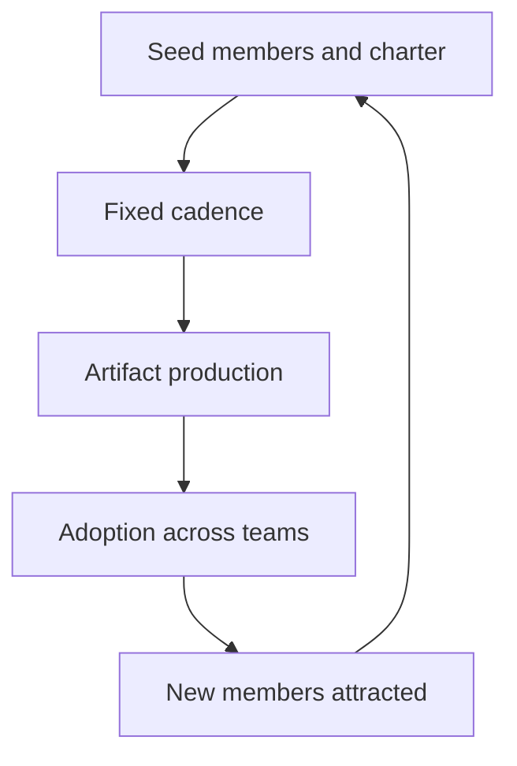

# Communities of Practice

> **Core skill:** Building cross-team learning structures — guilds, chapters, working groups — that spread practice, surface problems, and grow people without becoming governance.

## Why This Matters

Teams learn what they need and no more. The org-level problem is that each team learns it separately: the same migration pattern rediscovered five times, the same review lesson re-learned in every squad, the same incident cause recurring because nobody compared notes. Communities of practice are the structure that makes one team's learning everyone's learning.

Communities are also the staff engineer's force multiplier for teaching: a guild spreads your practice on a schedule you do not attend, and it surfaces the org's real problems — the divergences, the friction, the skills nobody has — faster than any survey. A well-run community of practice is the org learning on its own.

## What Communities Are For and Not For

| For | Not For |
|---|---|
| Spreading practice across teams | Making decisions for teams |
| Surfacing shared problems | Governing architecture |
| Growing people's skills | Enforcing standards |
| Producing shared artifacts | Being the place work gets assigned |
| Building cross-team relationships | Replacing 1:1 mentoring |

The boundary is the failure mode: a community that starts governing becomes a committee, and committees do not attract volunteers. Communities influence by producing artifacts people choose to adopt; the moment adoption is mandated, the community is dead and the governance body has arrived.

## Community Forms

| Form | Scope | Example | Duration |
|---|---|---|---|
| **Guild** | Cross-team practice area | The reliability guild: on-call, runbooks, chaos practice | Ongoing |
| **Chapter** | Craft within a discipline | The backend chapter: language and framework practices | Ongoing |
| **Working group** | Time-boxed output | The migration working group: standardize the event bus | Bounded |

Guilds and chapters are standing structures with rotating energy; working groups are temporary and should be treated that way — a working group that does not end has become a guild that forgot to say so.

## Starting a Community

| Step | What It Involves |
|---|---|
| **Seed members** | Four to eight people who genuinely care, from different teams |
| **Charter** | One paragraph: purpose, scope, what it is not for |
| **Cadence** | A fixed rhythm that survives calendar chaos: monthly is typical |
| **Output commitment** | What the community produces, on a schedule |

The output commitment is the load-bearing wall. A community with an output — a standard proposal, a review checklist, a learning session — has a reason to exist that survives enthusiasm. A community without one is a book club with no book.

## Running Them

Lightweight rituals, rotating leadership:

| Ritual | Why It Works |
|---|---|
| **Standing agenda** | The same three slots each time: problem surfacing, practice sharing, artifact work |
| **Rotating chair** | No permanent host, no single point of energy |
| **Artifact-first meetings** | Every session moves a document, checklist, or proposal |
| **Open doors** | Members come and go; the community survives individuals |

The staff role in running: be a reliable founding member, then recede. A community that still needs you to run it after a year is a dependency, not a community.

## Community Outputs

| Output | Purpose | Example |
|---|---|---|
| **Standards proposals** | Influence through quality, not mandate | A recommended incident-severity rubric |
| **Review checklists** | Practice encoded for everyday use | A production-readiness review checklist |
| **Learning sessions** | Skills spread on a schedule | Quarterly deep dives on incident patterns |
| **Pattern library** | Reusable solutions with trade-offs | A migration playbook adopted by three teams |

Outputs are the community's product and its proof. The question at every meeting: what artifact leaves this room?

## Measuring Communities

Measure artifacts and adoption, not attendance:

| Measure | What It Shows |
|---|---|
| **Artifacts produced** | The community is doing work |
| **Adoption across teams** | The practice is spreading |
| **New members joining** | The value is visible |
| **Divergence declining** | The org is converging on practice |

Attendance is the vanity metric: a full room with no output is a meeting, and a small room shipping artifacts is a community. Judge communities by what they ship and what gets adopted.

## Letting Communities Die Gracefully

Communities have lifecycles, and endings are part of the practice:

| Signal | Response |
|---|---|
| Output has stalled for two cycles | Name it: pause, restructure, or end |
| The purpose has been absorbed elsewhere | Declare the win and close |
| The same five people carry everything | Recruit or close; burnout is not a membership model |
| A working group's problem is solved | Close it with a written outcome |

A graceful closing — with the artifacts archived and the win declared — keeps the door open for the next community. A community kept alive by guilt is how learning structures become meetings.



## Practical Applications

### Community Checklist

- [ ] Charter written: purpose, scope, and explicit "not for"
- [ ] Four to eight seed members from different teams
- [ ] Fixed cadence and a standing agenda
- [ ] Output commitment named before the first meeting
- [ ] Leadership rotates; you are not the permanent host
- [ ] Artifacts and adoption measured, attendance ignored

### Community Charter Template

```markdown
# Community Charter: [Name]

## Purpose
[What this community exists to spread or solve]

## Scope
- In scope: [topics, activities]
- Out of scope: [governance, decisions, assignments]

## Membership
- Seed members: [names and teams]
- Open door: [how people join]

## Cadence
[Monthly, standing agenda]

## Output Commitment
- Artifact: [what is produced]
- Schedule: [when it ships]
- Adoption target: [which teams should adopt]

## Leadership
- Rotation: [how the chair rotates]
- Founding sponsor: [who starts it, and when they recede]
```

## Common Pitfalls

| Pitfall | Why It Is a Problem | Better Approach |
|---|---|---|
| **Governance drift** | Communities that decide become committees nobody joins | Influence through artifacts, never mandate |
| **No output commitment** | Meetings without artifacts die of irrelevance | Every session moves a document |
| **Founder dependency** | The community runs only when you run it | Rotate leadership; recede on purpose |
| **Attendance metrics** | Full rooms with no output are theater | Measure artifacts and adoption |
| **Zombie communities** | Kept alive by guilt, not value | Close gracefully with a declared win |
| **Working groups that never end** | Temporary bodies become permanent committees | Time-box everything with an "output" |

## Success Indicators

- Communities ship artifacts on schedule without you chairing
- Practices adopted from communities spread across teams
- Membership rotates and newcomers join on their own
- Divergence in practice declines org-wide
- Communities end gracefully when their purpose is done

## Related Topics

- [[01_Mentoring_Senior_Engineers]]: the relationships communities amplify
- [[04_Writing_as_Scaling]]: artifacts as the community's product
- [[06_Teaching_Architecture_Thinking]]: the review guild as a community
- [[02_Cross_Team_Technical_Leadership/00_overview|Cross-Team Technical Leadership]]: where community influence lands
- [[career-path/05_Tech_Lead/06_Process_and_Quality_Stewardship/06_Continuous_Improvement_Rhythm|Continuous Improvement Rhythm (Tech Lead)]]: the team-level rhythm

## Summary

Communities of practice are the org's self-learning structures: guilds, chapters, and time-boxed working groups that spread practice, surface problems, and produce artifacts — never governance. Start with seed members, a charter, a cadence, and an output commitment; run them with lightweight rituals and rotating leadership; measure artifacts and adoption, not attendance; and close them gracefully when their purpose is done. The test of a community is that it learns without you.
