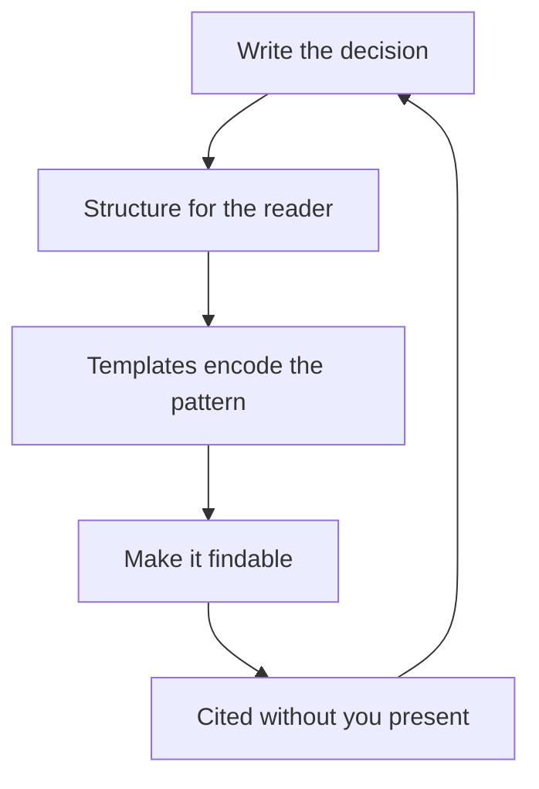

# Writing as Scaling

> **Core skill:** Making thinking reusable in documents — proposals, strategies, postmortems, standards, guides — so the org reads without you present.

## Why This Matters

A staff engineer's time is the org's scarcest technical resource, and every meeting you attend is a conversation that happens once. Writing is the superpower that breaks the attendance constraint: a document is read by dozens, at their own pace, months later, without you in the room. One well-written decision scales; one well-run meeting scales to the people who were there.

Writing is also how judgment becomes organizational memory. The proposal you write is the decision the org can revisit; the postmortem you write is the lesson the org can learn twice; the standard you write is the practice the org can follow when you are gone. An org's institutional intelligence is largely its document quality.

## The Writing Portfolio

| Document Type | Purpose | Audience | Cadence |
|---|---|---|---|
| **Proposals** | Decisions with reasoning | Decision-makers | As decisions arise |
| **Strategies** | Direction with trade-offs | Leadership and affected teams | Quarterly to annually |
| **Postmortems** | Lessons from incidents | The whole org | After every serious incident |
| **Standards** | Practice encoded | Every team that touches the area | When divergence hurts |
| **Guides** | How to do the work | New and existing engineers | Continuously maintained |

The portfolio is deliberate: each document type has a job, and the staff engineer ships all of them, not just the ones they enjoy.

## Writing Quality Bar

| Dimension | Bar | Failure Mode |
|---|---|---|
| **Clarity** | One reading, one meaning | Jargon and hedge language |
| **Structure** | The decision is findable in thirty seconds | The history is before the decision |
| **Decision-orientation** | Options, trade-offs, recommendation | Description without a decision |
| **Honesty** | Costs and risks named, not hidden | Advocacy dressed as analysis |

The staff writer's test for every document: if the reader remembers one thing, is it the thing the document exists to say? Structure the document so that one thing is unmissable.

## Templates as Organizational Memory

Templates are the org's accumulated writing judgment:

| Template | What It Encodes |
|---|---|
| Proposal template | The decision structure the org values |
| Postmortem template | The learning structure that works |
| Standard template | The adoption structure that spreads |
| Review checklist | The criteria the org has learned to apply |

The staff move is not writing every document — it is writing the templates that make everyone's documents good. A template that forces the decision, the options, and the cost is worth a hundred documents you could have written yourself.

## Encouraging a Writing Culture

| Practice | How It Works |
|---|---|
| **Doc reviews** | Review each other's documents like code: structure, clarity, decision |
| **Doc days** | A scheduled half-day for writing and maintaining docs |
| **Cited documents** | Link decisions to their source documents everywhere |
| **Write-aloud culture** | Proposals circulate in writing before meetings happen |
| **Template reuse** | New documents start from the template, not a blank page |

Culture is what makes the writing sustainable: if writing is a solo burden, it stops when you are busy; if it is a shared practice with reviews and rituals, it continues when you are gone. The staff role is modeling the practice and making it easier than not writing.

## The Readability Test

The bar for every staff document: would a new senior understand it in one pass?

| Test | Question |
|---|---|
| **First-pass test** | Can a new senior extract the decision and reasoning in one read? |
| **Skip test** | Can a busy reader get the gist from the first page? |
| **Context test** | Does it stand alone, or does it assume the meeting? |
| **Six-month test** | Would it make sense to someone who missed all context? |

The document that fails these tests is not too long — it is too inside. Rewrite for the new senior; the experts will still understand, and the org gains a reader.

## Archiving and Findability

Writing that cannot be found does not exist:

| Practice | Why |
|---|---|
| **Decision records linked from code** | The code says what; the record says why |
| **Naming conventions** | Findable by convention, not by memory |
| **One canonical location** | No duplicated, drifting copies |
| **Staleness markers** | Old documents say they are old; nobody trusts a silent doc |
| **Searchable archives** | Closed communities' artifacts stay accessible |

Findability is the quiet half of writing as scaling. A brilliant proposal that nobody can locate scaled to exactly one reader.



## Practical Applications

### Writing Checklist

- [ ] Every significant decision ships as a written proposal
- [ ] Documents pass the first-pass test before circulation
- [ ] Templates exist for proposals, postmortems, and standards
- [ ] Doc reviews are a real practice, not an occasional favor
- [ ] Decision records are linked from the code they decided
- [ ] Old documents carry staleness markers

### Decision Document Template

```markdown
# Decision: [Title]

- Date: [YYYY-MM-DD]
- Status: proposed / decided / superseded

## Decision
[One paragraph: what is being decided]

## Context
[What is true, what changed, what is uncertain]

## Options Considered
| Option | Cost | Benefit | Risk |
|---|---|---|---|
| [Option] | [cost] | [benefit] | [risk] |

## Trade-offs Accepted
[What we give up, and who bears it]

## Recommendation
[The choice and the reasoning]

## Review Conditions
[When this decision should be revisited]
```

## Common Pitfalls

| Pitfall | Why It Is a Problem | Better Approach |
|---|---|---|
| **Meeting-first culture** | Decisions made in rooms scale to the room | Circulate the document; meet to decide |
| **Inside writing** | Documents only the author's team understands | Write for the new senior; one-pass test |
| **Advocacy without trade-offs** | Documents that hide costs get discounted | Name costs and risks first |
| **Template-less org** | Every document reinvents the structure | Ship templates, not just documents |
| **Unfindable knowledge** | Written but lost is the same as unwritten | Link records from code; name by convention |
| **Burden writing** | Writing as solo duty dies under load | Doc days, doc reviews, shared practice |

## Success Indicators

- Your documents are cited in rooms you have never entered
- Decisions are made from written proposals, not meeting memory
- Templates are reused org-wide with visible structure
- A new senior can navigate the org's decisions in one pass
- Writing continues on cadence when you are on leave

## Related Topics

- [[02_Judgment_Transfer]]: writing as the visibility mechanism
- [[03_Communities_of_Practice]]: artifacts as the community's product
- [[07_Knowledge_Continuity]]: documents as the continuity backbone
- [[03_Technical_Strategy/00_overview|Technical Strategy]]: strategies as documents

## Summary

Writing is the staff scaling superpower: proposals, strategies, postmortems, standards, and guides that the org reads without you present, on its own schedule, forever. Hold documents to the one-pass readability test, encode the org's judgment in templates, build a culture of doc reviews and doc days, and make everything findable. A document that scales is a meeting that happened once and kept happening.
