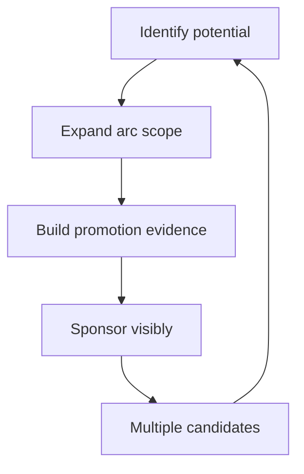

# Growing the Next Staff

> **Core skill:** Building the staff pipeline deliberately — identifying potential, expanding arc scope, sponsoring promotion cases, and growing multiple candidates so the org never depends on one.

## Why This Matters

Staff impact is scarce, and the org's ability to scale it depends on a pipeline that most orgs never build deliberately. Candidates are not found at promotion time; they are identified years earlier, given arcs that stretch them, and sponsored through the evidence that promotion requires. Without the pipeline, staff promotion becomes a lottery of visibility — and the org gets the staff engineers it deserved by accident.

The staff engineer is the only role that can build this pipeline from inside: you know what the job actually requires, you can see who is doing fragments of it, and you have the credibility to sponsor. Growing the next staff is also the strongest form of succession insurance — a staff function that survives its incumbent is a staff function, not a person.

## Identifying Potential

| Signal | What It Looks Like |
|---|---|
| **Systems view** | Explains problems in structure, not just events |
| **Natural alignment work** | Gets people moving without being asked to |
| **Influence instincts** | Chooses the right rooms and moments, early |
| **Ambiguity comfort** | Frames the vague problem instead of waiting |
| **Leverage orientation** | Prefers the change that multiplies, not the one that impresses |

Potential is behavioral, not positional: the senior who quietly unblocks two teams is more staff-shaped than the one who owns the biggest service. The identification practice is scanning for these behaviors in rooms you share, then checking the hypothesis with a stretch arc.

## Development Paths

| Path | How It Works | Fit |
|---|---|---|
| **Arc expansion** | Each cycle, a bigger cross-team arc with a named outcome | The generalist staff shape |
| **Archetype apprenticeship** | Structured exposure to a staff archetype: strategy, operations, architecture | The specialist staff shape |
| **Portfolio rotation** | Deliberate variety of problem types over a year | Building breadth before depth |

Both paths share the same rule: scope is grown in arcs, not in titles. The candidate should be doing staff-sized work with staff-level accountability at least a cycle before the promotion conversation starts.

## The Promotion Case for Staff Candidates

Staff promotion evidence is org-scale impact, not excellence:

| Evidence Type | Team-Level (Not Enough) | Staff-Level (The Case) |
|---|---|---|
| **Scope** | "Led the migration" | "The migration unblocked three teams and set the platform pattern" |
| **Influence** | "Gave a good talk" | "Standards adopted org-wide without mandate" |
| **Judgment** | "Made good calls" | "Decisions held up under ambiguity, with recorded reasoning" |
| **Multiplication** | "Mentored two people" | "Built the review guild and the pipeline behind them" |
| **Continuity** | "Knows the system" | "The system survives their leave; succession exists" |

The case writes itself from the arc record — which is why the arcs come first. A candidate with a year of sponsored, documented org-scale arcs needs no heroic narrative; the evidence is the work.

## Sponsorship vs Mentorship

| Dimension | Mentorship | Sponsorship |
|---|---|---|
| **Activity** | Develops the person | Advocates for the person |
| **Visibility** | Behind the scenes | In rooms they are not in |
| **Capital** | Your time | Your reputation, spent for them |
| **Moment** | Continuous | At decision points: arcs, cases, promotion |
| **Risk** | Low | Real: your judgment is on the line |

Mentorship teaches; sponsorship stakes your credibility on their behalf — putting their name forward for the arc, the room, the case. The staff practice is doing both: develop privately, advocate publicly, and keep the advocacy honest enough to survive the promotion committee's questions.

## The Staffing Table

The succession view: who could hold which arc if you left?

| Arc | Current Holder | Backup | Readiness |
|---|---|---|---|
| Platform strategy | You | [Name] | Growing, needs two more cycles |
| Architecture guild | You | [Name] | Ready with sponsorship |
| Risk register | You | [Name] | Needs exposure |

| Readiness Level | Meaning | Action |
|---|---|---|
| Ready | Could take the arc now | Delegate it |
| Growing | Needs one or two more cycles | Expand scope, add exposure |
| Potential | Shows signals, untested | First stretch arc |

The table is reviewed quarterly and it is the honest measure of your own succession — a table where every row says "you" is a pipeline of one.

## Growing Multiple Candidates

No single heir:

| Practice | Why |
|---|---|
| Identify three or more candidates, not one | One heir is a bottleneck with a name |
| Differentiate arcs by strength | Each candidate grows their own shape |
| Cross-expose candidates | They learn from each other, not just from you |
| Never promise the seat | The org decides; the pipeline supplies |

A pipeline with depth changes the promotion conversation from "who" to "when" — and protects both the org and the candidates from the single-heir failure where one person's readiness gates everything.

## The First Staff Promotion in an Org

Paving the path is different from running the existing path:

| Step | What It Involves |
|---|---|
| **Name the job** | Write what staff means here: scope, expectations, evidence |
| **Build the case standard** | The evidence bar, shared with leadership |
| **Manage expectations** | Others who felt "next" need the honest read |
| **Protect the first** | The first promotion sets the pattern; make it defensible |
| **Document the path** | The next candidates walk a paved road |

The first staff promotion is a precedent, not an event: it teaches the org what staff is worth and how it is earned. Pave it carefully and the second and third become routine.



## Practical Applications

### Pipeline Checklist

- [ ] Maintain a named candidate list with readiness levels
- [ ] Each candidate holds an arc bigger than their title
- [ ] Promotion evidence is org-scale and documented, not anecdotal
- [ ] Sponsorship is visible; mentorship is continuous
- [ ] The staffing table shows backups for your own arcs
- [ ] No single heir: three or more candidates in the pipeline

### Staffing Table Template

```markdown
# Staffing Table: [Date]

## Candidate Pipeline
| Candidate | Signals | Current Arc | Readiness | Next Step |
|---|---|---|---|---|
| [Name] | [signals] | [arc] | growing / ready | [step] |

## Arc Succession
| Arc | Holder | Backup | Readiness |
|---|---|---|---|
| [Arc] | [name] | [name] | ready / growing / potential |

## Promotion Cases
| Candidate | Evidence Summary | Case Owner | Target Cycle |
|---|---|---|---|
| [Name] | [org-scale impact] | [name] | [cycle] |
```

## Common Pitfalls

| Pitfall | Why It Is a Problem | Better Approach |
|---|---|---|
| **Accidental pipeline** | Hoping staff emerge from visibility lottery | Identify, arc, and sponsor deliberately |
| **Single heir** | One candidate gates everything and stalls | Grow three or more, differentiated |
| **Excellence evidence** | Team excellence does not equal staff impact | Build org-scale, documented cases |
| **Mentorship only** | Developing without advocating gets no one promoted | Sponsor in rooms they are not in |
| **Promising the seat** | Pre-committing corrupts the process | The org decides; the pipeline supplies |
| **Unpaved first path** | The first promotion sets a bad precedent | Name the job and the evidence bar first |

## Success Indicators

- Three or more credible staff candidates in the pipeline
- Candidates hold org-scale arcs with documented evidence
- At least one staff promotion cycle completes without you as the case owner
- The staffing table shows backups for every arc you hold
- The first staff promotion left a paved, documented path

## Related Topics

- [[01_Mentoring_Senior_Engineers]]: the development layer of the pipeline
- [[02_Judgment_Transfer]]: the judgment the candidates must grow
- [[01_The_Staff_Role_and_Scope/00_overview|The Staff Role and Scope]]: the job the pipeline feeds
- [[career-path/11_Engineering_Manager/06_Technical_Context_for_Managers/05_Hiring_and_Growing_with_Technical_Judgment|Hiring and Growing with Technical Judgment (EM)]]: the manager's parallel

## Summary

Growing the next staff is deliberate pipeline work: identify behavioral potential, expand arc scope cycle by cycle, build org-scale promotion evidence, sponsor candidates in rooms they cannot enter, maintain a staffing table with backups for your own arcs, and grow multiple candidates so no single heir gates the org. The first staff promotion paves the path for the rest — and the whole practice is the strongest form of succession insurance a staff engineer can leave behind.
