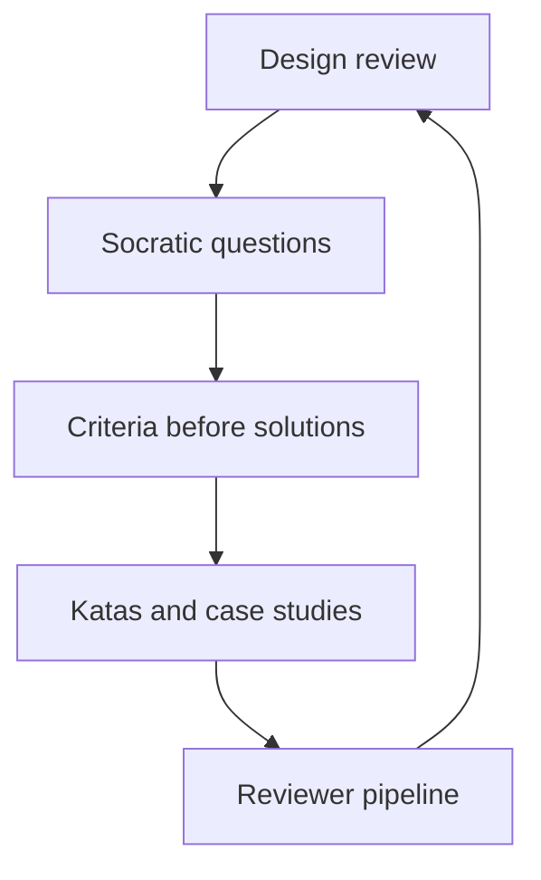

# Teaching Architecture Thinking

> **Core skill:** Spreading the architectural lens — boundaries, trade-offs, evolution over time — through design reviews, katas, reading practice, and a growing cadre of reviewers.

## Why This Matters

An org with one person who thinks architecturally has one architecture opinion; an org where the lens is common property makes better decisions everywhere. Architectural thinking is teachable — it is a discipline of asking boundary, trade-off, and evolution questions — but it is rarely taught. Most engineers absorb it accidentally, from proximity, which is why it concentrates in the few who got the proximity.

Teaching architecture thinking is the staff engineer's leverage play: every senior who can hold a design review well is a second pair of architectural eyes; every team that asks criteria questions before proposing solutions stops needing you at the table. The spread of the lens is the spread of your judgment.

## What Architectural Thinking Is

| Element | The Question | Non-Architectural Default |
|---|---|---|
| **Boundaries** | Where is the seam, and who owns it? | "Put it where it's convenient" |
| **Trade-offs** | What does this choice cost, and for whom? | "This is the best way" |
| **Evolution** | What happens to this decision in two years? | "It works today" |
| **Constraints** | What must be true for this to hold? | Ignoring the load-bearing assumptions |
| **Reversibility** | How hard is this to undo? | Treating everything as permanent |

The lens is a set of questions, which is exactly why it can be taught — and exactly why it must be practiced, because questions without practice are vocabulary.

## Teaching Through Design Reviews

The design review is the classroom; Socratic questioning is the method:

| Practice | How It Works |
|---|---|
| **Criteria before solutions** | Ask what must be true before discussing what to build |
| **Socratic questions** | "What breaks if this scales tenfold?" — never the answer first |
| **Trade-off forcing** | "What are you giving up, and who pays?" |
| **Reversibility probe** | "How do we undo this in a year?" |
| **Evolution question** | "What does this look like in two years?" |

The discipline: when a review participant proposes a solution, the teaching move is the question that makes the criteria visible — not agreement, not correction. The review that ends with the proposer understanding their own trade-offs has taught more than the review that ended with the right answer.

## Architecture Katas and Case Studies

Practice on real and fictional systems, away from the pressure of production:

| Practice | How It Works | Cadence |
|---|---|---|
| **Architecture kata** | A bounded problem, a time box, a design, a review | Monthly |
| **Case study** | A real system's story, read and dissected | Quarterly |
| **Retrospective design** | Redesign a system you know, with hindsight | Quarterly |

Katas build the muscle cheaply: no production stakes, pure judgment practice. Case studies build the pattern library — the recurring shapes of systems and their failures. Both convert the lens from knowledge into reflexes.

## The Architecture Reading List Practice

The reading list is how the lens gets its depth:

| Source | What It Teaches | Example |
|---|---|---|
| **Papers** | The theory behind the shapes | The original Conway paper, CAP, the fallacies of distributed computing |
| **Postmortems** | How designs fail in the real world | Public incident write-ups, dissected for design lessons |
| **System stories** | How great systems evolved | Architecture blogs and retrospectives, read critically |
| **Classics** | The durable canon | The timeless architecture and design texts |

The practice is not the list — it is the discussion. A monthly session where three people argue about one paper transfers more than a personal library ever will.

## Growing Reviewers

The review guild is the org's architectural teaching engine:

| Stage | What the Reviewer Learns |
|---|---|
| **Observer** | Watches reviews with a checklist of the questions |
| **Participant** | Asks questions with a mentor present |
| **Lead reviewer** | Runs reviews alone, debriefed after |
| **Reviewer mentor** | Trains the next observer |

The guild's output is reviewers, not reviews. Each reviewer who reaches lead level is architecture thinking spread to one more person — and the guild is how the teaching outlives any single session.

## Architecture Onboarding for New Seniors

New seniors inherit the lens faster with a deliberate path:

| Onboarding Step | What It Covers |
|---|---|
| **System tour** | The boundaries, not just the components |
| **Decision history** | The ADRs and the reasoning behind them |
| **Review shadowing** | Two reviews observed before one is led |
| **Kata participation** | One practice round before production pressure |
| **Constraint briefing** | The org's load-bearing constraints, and why |

The goal is not faster ramp-up to code; it is faster ramp-up to judgment. A senior who understands why the boundaries exist will defend them; one who does not will propose solutions that violate them.

## Measuring Spread

| Signal | What It Shows |
|---|---|
| **ADRs written unprompted** | The documentation habit has spread |
| **Criteria-first reviews** | The questioning discipline has spread |
| **Cross-team review requests** | The lens is trusted beyond one team |
| **Kata attendance** | The practice is valued |
| **Reviewer pipeline** | New reviewers are reaching lead level |

The honest measure is unprompted behavior: ADRs appearing from teams you never briefed, reviews that open with criteria, juniors asking trade-off questions. The lens has spread when it no longer needs you to demonstrate it.



## Practical Applications

### Teaching Checklist

- [ ] Every design review you run opens with criteria questions
- [ ] One architecture kata runs monthly, with a review
- [ ] The reading list has a monthly discussion session
- [ ] The review guild has observers, participants, and leads
- [ ] New seniors get the architecture onboarding path
- [ ] ADRs appear from teams without your prompting

### Review Question Card

```markdown
# Architecture Review Questions

## Boundaries
- Where is the seam, and who owns both sides?
- What crosses the boundary, and what never should?

## Trade-offs
- What is this choice giving up, and who pays?
- What alternative was rejected, and on what evidence?

## Evolution
- What does this look like in two years?
- What would force a redo, and how reversible is that?

## Constraints
- What must be true for this design to hold?
- Which assumption is most likely to break?

## Adoption
- Who must change their work for this?
- What makes adoption the path of least resistance?
```

## Common Pitfalls

| Pitfall | Why It Is a Problem | Better Approach |
|---|---|---|
| **Answer-giving reviews** | Corrections teach the answer, not the lens | Question until the criteria are visible |
| **Solution-first culture** | Designs proposed before constraints are named | Criteria before solutions, always |
| **Kata-less practice** | The lens without practice is vocabulary | Run katas monthly, without production stakes |
| **Guild without pipeline** | A review club that never grows reviewers | Stages: observer, participant, lead, mentor |
| **Onboarding to code** | Ramping seniors into code, not judgment | Boundary tours and decision history first |
| **Unmeasured spread** | Assuming the lens spread because you taught it | Count unprompted ADRs and criteria-first reviews |

## Success Indicators

- Design reviews open with criteria, run by people you trained
- ADRs appear from teams without your involvement
- Katas run on cadence with growing attendance
- The reviewer pipeline promotes observers to leads
- New seniors defend boundaries they did not design

## Related Topics

- [[03_Communities_of_Practice]]: the review guild as a community
- [[02_Judgment_Transfer]]: the same teaching mechanics, architectural flavor
- [[04_Writing_as_Scaling]]: ADRs and decision records as the spread mechanism
- [[03_Technical_Strategy/00_overview|Technical Strategy]]: the architectural direction to teach
- [[career-path/02_Senior_Software_Engineer/03_Architecture_and_Design_Judgment/00_overview|Architecture and Design Judgment (Senior)]]: the foundation this builds on

## Summary

Teaching architecture thinking spreads the lens from one person to the org: run design reviews as Socratic classrooms with criteria before solutions, build the muscle with katas and case studies, deepen it with a discussed reading list, grow reviewers through a staged guild pipeline, and onboard new seniors into judgment before code. Measure success by unprompted behavior — ADRs written, criteria-first reviews, juniors asking trade-off questions. The lens has spread when it no longer needs you.
