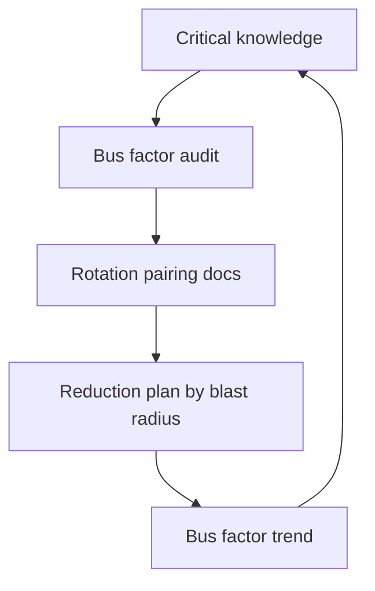

# Knowledge Continuity

> **Core skill:** Treating knowledge as an org asset — auditing critical knowledge, reducing bus factor by blast radius, and building mechanisms that survive attrition, reorgs, and time.

## Why This Matters

Knowledge is the org's least managed asset and its most fragile one. The expert departs and the system becomes a mystery; the re-org scatters the people who held the context; the undocumented decision is re-litigated by people who were not there; the tribal knowledge decays silently as its holders move on. Every one of these is a knowledge event, and none of them is handled by a process — because the process is the thing missing.

Continuity is a risk discipline: knowledge concentration is a risk with a blast radius, and it belongs in the same register as any other. The staff engineer's job is making the invisible asset visible — measuring the bus factor, mapping critical knowledge, and building the mechanisms that keep the org smart when the smart people leave.

## Knowledge as Org Asset

| Knowledge Type | Where It Lives | What It Is Worth |
|---|---|---|
| **System knowledge** | The engineers who built and run systems | Operating, changing, and debugging speed |
| **Decision knowledge** | The reasoning behind the architecture | Avoiding re-litigation and re-errors |
| **Process knowledge** | The why behind the how | Keeping practices alive past their founders |
| **Relationship knowledge** | Who to talk to, who decides | Navigating the org efficiently |

The asset frame changes the questions: not "can we replace the person" but "what knowledge leaves with them, and what does losing it cost." Replacing a person is HR; preserving the knowledge is engineering.

## Continuity Threats

| Threat | Mechanism | Example |
|---|---|---|
| **Attrition** | Knowledge walks out the door | The payments expert leaves; changes freeze |
| **Reorgs** | Context scatters with people | The team that held the platform story is dissolved |
| **Time decay** | Knowledge goes stale silently | The runbook describes a system that no longer exists |
| **Tribal knowledge** | Critical facts exist only in heads | The deployment order nobody wrote down |
| **Single-expert concentration** | One person gates everything | Bus factor of one on the critical path |

Each threat has a different clock and a different mechanism — which is why the audit comes before the plan: you cannot defend against threats you have not named.

## The Continuity Audit

| Audit Component | What It Produces |
|---|---|
| **Bus factor map** | Per system and per capability: how many people can run and change it? |
| **Critical knowledge inventory** | What must be known for the org's most important outcomes |
| **Documentation coverage** | Which critical knowledge is written, current, and findable |
| **Single-expert list** | The people who gate systems, decisions, or processes |

The audit answers one question per critical item: if the holder vanished tonight, what happens, and how bad is it? The answers ranked by blast radius are the reduction plan's input.

## Continuity Mechanisms

| Mechanism | How It Works | Best For |
|---|---|---|
| **Documentation ownership** | Every system has a named doc owner, reviewed on cadence | System and decision knowledge |
| **Rotation** | People rotate through critical areas on a schedule | Single-expert concentration |
| **Pairing programs** | Deliberate pairing in high-risk areas | Tacit system knowledge |
| **Succession plans for systems** | A named backup per critical system, with exposure | Operational continuity |
| **Decision records** | Reasoning written at decision time | Decision knowledge |

The mechanisms are complements, not alternatives: rotation spreads exposure, pairing transfers the tacit half, documentation catches the explicit half, and decision records preserve the why. The common design principle: knowledge should have at least two holders and one written form.

## The Bus Factor Reduction Plan

Prioritized by blast radius, scheduled like any other work:

| Priority | Item | Blast Radius | Mechanism | Owner | By When |
|---|---|---|---|---|---|
| 1 | Payments system | Org-wide outage risk | Pair + document | [Name] | [Date] |
| 2 | Build pipeline | All teams slowed | Ownership docs | [Name] | [Date] |
| 3 | Legacy billing logic | Compliance exposure | Rotation | [Name] | [Date] |

```markdown
# Bus Factor Reduction Plan: [Area]

## Audit Findings
| System / Capability | Current Bus Factor | Blast Radius | Critical Knowledge |
|---|---|---|---|
| [Name] | [1-2-3+] | [scope] | [what must be known] |

## Reduction Actions
| Item | Mechanism | Owner | Target Date | Success Criterion |
|---|---|---|---|---|
| [Item] | pair / rotate / document | [Name] | [Date] | [measurable] |

## Review
- Audit cadence: [quarterly]
- Next full audit: [date]
```

The plan's rule: fix the highest blast radius first, measure by bus factor change, and treat every item as real work with an owner and a date.

## Continuity in Reorgs

Reorgs are knowledge events with a known date — the rituals must be scheduled:

| Ritual | What It Preserves |
|---|---|
| **Pre-reorg knowledge inventory** | What exists before the scattering |
| **Handoff documentation** | The written state of every owned system |
| **Knowledge transfer sessions** | Time-boxed pairing between old and new owners |
| **Post-reorg ownership review** | Confirming every system has a named owner in the new structure |

The failure mode is treating reorgs as pure structure events: boxes move, people scatter, and the knowledge that made the boxes work evaporates. The staff habit is asking "what knowledge is at risk in this reorg" before the org chart is final.

## Measuring Continuity

| Measure | What It Shows |
|---|---|
| **Bus factor trend** | Whether concentration is falling over time |
| **Onboarding speed** | How fast new people reach competence |
| **Single-expert count** | The residual concentration inventory |
| **Docs current coverage** | Whether written knowledge is trustworthy |
| **Departure impact** | What actually happened when someone left |

Onboarding speed is the honest outcome metric: if a new engineer reaches competence in weeks where it once took quarters, the knowledge is in the system, not the people.

## Continuity as Risk Management

Continuity findings belong in the risk register like any other exposure:

| Register Entry | Example |
|---|---|
| Risk | Bus factor of one on the payments system |
| Price | Change freeze and outage risk if the holder leaves |
| Mitigation | Pairing, documentation, rotation, with owners |
| Review | Quarterly re-audit of the bus factor map |

The link works both ways: the risk register makes continuity visible to leadership, and the continuity audit feeds the register with priced findings. Knowledge risk treated as risk gets funded; knowledge risk treated as HR gets hoped about.



## Practical Applications

### Continuity Checklist

- [ ] Run the continuity audit quarterly: bus factor map and critical inventory
- [ ] Every critical system has at least two holders and one written form
- [ ] The reduction plan ranks items by blast radius, with owners and dates
- [ ] Reorgs trigger the knowledge rituals before the structure lands
- [ ] Continuity findings are priced in the risk register
- [ ] Onboarding speed is measured as the outcome metric

## Common Pitfalls

| Pitfall | Why It Is a Problem | Better Approach |
|---|---|---|
| **Hero dependence** | Relying on the expert who can always fix it | Build the second holder and the written form |
| **Documentation theater** | Docs written, never read, already stale | Doc ownership with review cadence |
| **Unmeasured concentration** | Bus factor assumed, never counted | Run the audit; publish the map |
| **Reorg amnesia** | Structure changes without knowledge rituals | Schedule handoffs before the chart lands |
| **HR framing** | "We'll hire when they leave" | Treat knowledge risk in the register, priced |
| **Unprioritized reduction** | Fixing the easy bus factors first | Rank by blast radius, always |

## Success Indicators

- Bus factor trends up across critical systems over quarters
- Onboarding time for critical areas measurably shrinks
- Every critical system has a named backup holder
- Reorgs include scheduled knowledge transfer rituals
- Continuity findings sit in the risk register with owners and prices

## Related Topics

- [[02_Judgment_Transfer]]: the transfer mechanisms in action
- [[04_Writing_as_Scaling]]: documents as the continuity backbone
- [[05_Growing_the_Next_Staff]]: the pipeline that replaces knowledge loss
- [[06_Technical_Risk_and_Judgment/00_overview|Technical Risk and Judgment]]: continuity as a priced risk
- [[career-path/05_Tech_Lead/05_Team_Development_and_Mentoring_Leadership/00_overview|Team Development and Mentoring Leadership (Tech Lead)]]: the team-level continuity practice

## Summary

Knowledge continuity is risk management for the org's most fragile asset: audit bus factor and critical knowledge quarterly, rank the reduction plan by blast radius, and run the mechanisms — documentation ownership, rotation, pairing, succession plans — that give every critical item two holders and one written form. Reorgs get their rituals, continuity findings get priced into the register, and onboarding speed becomes the outcome metric. The org that manages its knowledge survives its people; the org that does not is one departure from a mystery.
