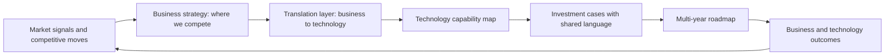

# Connecting Technology to Business Strategy

> **Core skill:** The principal engineer translates between market direction and technical implications — building the strategy translation layer where business capability maps to technology capability, and working with CFO, CPO, and CEO to co-develop strategy as a shared language.

## Why This Matters

Organizations routinely produce two strategies that do not speak to each other: the business strategy written in revenue, market share, and product categories, and the technology strategy written in platforms, architectures, and migrations. The gap between them is where ambition dies — the business promises what the technology cannot deliver, and the technology builds what the business cannot sell.

The principal engineer closes this gap by building a translation layer: business capabilities mapped to technology capabilities, cost structures modeled against growth assumptions, and market timing translated into platform readiness. This is not a bridging role between two functions — it is the synthesis that makes strategy possible at all.

## The Strategy Translation Layer

The translation layer converts business direction into technical implications and surfaces technical constraints as business risks. It operates in both directions.

| Translation Direction | Input | Output | Example |
|----------------------|-------|--------|---------|
| **Business → Technology** | Market expansion into APAC | Data sovereignty architecture, regional deployment, latency requirements | "To serve APAC, we need regional data planes within 18 months" |
| **Business → Technology** | New product category launch | Platform extensibility requirements, API strategy, partner integration | "The platform must support third-party integrations at launch" |
| **Technology → Business** | Core platform approaching end-of-life | Risk of service degradation, cost of delay, migration timeline | "Delaying platform modernization adds $X million in operational risk per quarter" |
| **Technology → Business** | Emerging technology maturity curve | Competitive window, absorptive capacity, build-vs-buy timing | "AI capability will be table stakes in 24 months; our window to differentiate is the next 12" |

## Business Capability to Technology Capability Mapping

The core artifact of the translation layer is a map that connects what the business does to what the technology provides. This map makes both sides honest about dependencies.

| Business Capability | Technology Capability | Current Maturity | Target Maturity | Investment Required |
|--------------------|-----------------------|------------------|-----------------|---------------------|
| Real-time customer personalization | Event streaming, ML inference pipeline, feature store | Partial: batch only | Real-time, sub-100ms | $X million, 18 months |
| Global multi-currency billing | Multi-region ledger, currency conversion service, compliance engine | Single region, single currency | Multi-region, 12 currencies | $X million, 24 months |
| Partner ecosystem integration | Public API platform, developer portal, sandbox environment | Internal APIs only | Public, documented, versioned | $X million, 12 months |
| Regulatory reporting automation | Data lineage, audit trail, scheduled report generation | Manual, spreadsheet-driven | Automated, auditable, scheduled | $X million, 9 months |

The map is a living artifact reviewed alongside the business strategy. When the business adds a capability, the map reveals the technology investment required. When technology costs shift, the map surfaces which business capabilities are affected.

## Working with the C-Suite

The principal engineer works directly with CFO, CPO, and CEO — not as a delegate from engineering, but as a peer who brings the technology view to strategy formation.

| Executive | What They Need from the Principal | What the Principal Needs from Them |
|-----------|----------------------------------|-----------------------------------|
| **CEO** | Technology's role in competitive positioning; which bets are differentiating vs table stakes | Strategic direction, market priorities, growth thesis |
| **CFO** | Cost curves for technology bets; capital allocation trade-offs; risk-adjusted returns | Budget parameters, investment horizon, cost of capital assumptions |
| **CPO** | Platform readiness for product roadmap; build-vs-buy recommendations by product area | Product strategy, market timing, customer needs by segment |
| **COO** | Operational impact of technology choices; automation opportunities; risk posture | Operational priorities, process constraints, regulatory landscape |

| Interaction Pattern | Description | Frequency |
|--------------------|-------------|-----------|
| Strategy co-development | Principal participates in strategy formation, not just downstream planning | Annual, with quarterly touchpoints |
| Investment review | Technology investment cases presented alongside business cases | Per budget cycle |
| Risk and assumption review | Technology risks surfaced as business risks with mitigation options | Quarterly |
| Board preparation | Technology narrative integrated into board materials | Per board cycle |

## Strategy as Shared Language

When technology strategy and business strategy share a language, the quality of decisions improves. The shared language is built on concepts both sides understand.

| Shared Concept | Business Meaning | Technology Meaning |
|---------------|-----------------|-------------------|
| **Capability** | What the organization can do for customers | What the platform can do for the business |
| **Investment** | Capital allocated to a business outcome | Capacity allocated to a technology outcome |
| **Risk** | Probability of missing a business target | Probability of a technology failure mode |
| **Maturity** | Market readiness of a product | Production readiness of a platform |
| **Velocity** | Speed of market response | Speed of delivery capability |



## Practical Applications

### Translation Layer Checklist

- [ ] A business-capability-to-technology-capability map exists and is reviewed with strategy
- [ ] Every major business initiative has a technology feasibility assessment before commitment
- [ ] Technology cost curves are modeled against business growth assumptions
- [ ] The principal participates in strategy formation sessions, not just downstream planning
- [ ] Technology risks are surfaced as business risks with quantified impact
- [ ] The shared language is documented and used consistently in executive communications

### Executive Communication Template

```markdown
# Technology Implications of [Business Initiative]

## Business Intent
[One paragraph: what the business plans to do and why]

## Technology Required
| Capability | Current State | Required State | Investment |
|-----------|--------------|----------------|------------|

## Feasibility Assessment
- [Capability one]: [Ready / Needs investment / Not feasible in timeframe]
- [Capability two]: [Ready / Needs investment / Not feasible in timeframe]

## Risks and Mitigations
| Risk | Business Impact | Mitigation |
|------|----------------|------------|

## Recommendation
[One paragraph: go, go with conditions, or no-go with rationale]
```

## Common Pitfalls

| Pitfall | Why It Is a Problem | Better Approach |
|---------|---------------------|-----------------|
| **Technology strategy written in isolation** | Business commits to direction the platform cannot support | Co-develop strategy with C-suite participation from the start |
| **Translation layer missing** | Business and technology speak different languages; assumptions diverge | Build and maintain the capability map as a shared artifact |
| **Technology feasibility assessed after commitment** | Sunk cost prevents honest reassessment | Assess feasibility before business commitments are made public |
| **Executive communication in engineering terms** | C-suite disengages; technology loses a seat at the strategy table | Translate everything into business outcomes, cost, and risk |
| **One-way translation only** | Technology constraints never shape business strategy | Surface technology-imposed business risks early and regularly |

## Success Indicators

- The capability map is referenced in both business and technology strategy discussions
- Business leaders initiate strategy conversations with the principal before committing to direction
- Technology feasibility assessments precede public business commitments
- The shared language appears consistently in executive and board materials
- Technology risks are discussed in business terms at the executive level

## Related Topics

- [[01_Technology_Strategy_at_Enterprise_Scale]]
- [[03_Investment_Strategy_and_Capital_Allocation]]
- [[02_Enterprise_and_Systems_of_Systems_Thinking/00_overview|Enterprise and Systems of Systems Thinking]]
- [[04_Organizational_Influence/00_overview|Organizational Influence]]
- [[career-path/03_Staff_Engineer/03_Technical_Strategy/06_Working_With_Product_Strategy|Working With Product Strategy (Staff)]]

## Summary

Connecting technology to business strategy means building a translation layer where business capabilities map to technology capabilities, cost curves model against growth assumptions, and the principal works directly with the C-suite to co-develop strategy in a shared language. The capability map is the living artifact that makes both sides honest about dependencies, and the principal is the person who keeps the translation current.