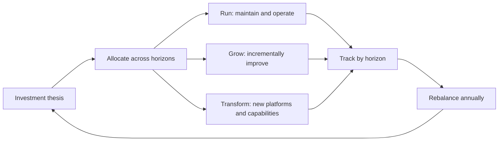

# Investment Strategy and Capital Allocation

> **Core skill:** The principal engineer builds the case for major technology investments — constructing ROI models, option value arguments, and risk-adjusted returns for technical bets, and presenting technology investment to the board in the language of capital allocation.

## Why This Matters

Technology investment at the principal level is not about budget requests — it is about capital allocation. The principal competes for organizational capital against every other investment the company could make: new markets, acquisitions, sales capacity, return to shareholders. Winning requires building cases that the CFO and board can evaluate alongside their other choices.

This discipline separates the principal from the staff engineer. The staff engineer contributes to investment cases written by others. The principal owns the investment thesis — framing technology choices as capital allocation decisions with explicit returns, risks, and alternatives. The memo that moves capital is the memo that speaks the board's language.

## The Investment Case Framework

Every major technology investment deserves a case that answers the questions a board member would ask.

| Question | What the Investment Case Must Provide |
|----------|--------------------------------------|
| Why this, why now? | The forcing function: market shift, platform risk, competitive threat, or growth opportunity |
| What are the options? | At least three: do nothing, optimize incrementally, and the proposed investment |
| What is the return? | Quantified: revenue growth, cost reduction, risk mitigation, or option value |
| What could go wrong? | Key risks with probability and impact; the downside case |
| What is the exit path? | How the investment can be reduced or redirected if assumptions break |
| How does it compare? | Ranking against other investment options the organization faces |

## ROI Models for Technology Investments

Technology ROI is not always revenue. The principal frames returns across four categories.

| Return Type | Definition | Example | Quantification |
|------------|------------|---------|----------------|
| **Revenue growth** | Technology directly enables new or expanded revenue | New product platform, API monetization | Projected revenue attribution, time to market advantage |
| **Cost reduction** | Technology reduces operational or infrastructure costs | Platform consolidation, automation | Current cost baseline minus projected cost, over investment horizon |
| **Risk mitigation** | Technology reduces probability or impact of a material risk | Security modernization, regulatory compliance, platform end-of-life migration | Expected loss without investment minus expected loss with investment |
| **Option value** | Technology creates future choices that do not exist today | Platform extensibility, capability that enables unplanned adjacent markets | Model as a real option: cost of the option vs value of the opportunity it unlocks |

## Risk-Adjusted Return for Technical Bets

Technology investments carry technical risk that financial models often miss. The principal models risk-adjusted return by layering technology-specific factors onto standard financial analysis.

| Risk Factor | How It Distorts ROI | Adjustment |
|------------|--------------------|------------|
| **Technology maturity** | Emerging tech produces overly optimistic timelines | Apply a maturity discount: pre-release technology gets 2-3x timeline multiplier |
| **Organizational absorptive capacity** | Teams cannot adopt as fast as the investment assumes | Model adoption as an S-curve with a ramp, not instantaneous |
| **Integration complexity** | New technology must integrate with existing systems; cost is underestimated | Add an integration complexity factor: 1.5-3x the standalone cost estimate |
| **Key-person dependency** | Success depends on specific individuals who may leave | Identify single points of failure; add redundancy cost or probability-weighted discount |
| **Vendor and ecosystem risk** | Reliance on external platforms, standards, or vendors | Model vendor continuity scenarios; include migration cost in the downside case |

## The Investment Memo Format

Every major technology investment case is captured in a memo. The memo is the artifact the board and CFO evaluate.

```markdown
# Investment Memo: [Investment Name]

## Thesis
[One paragraph: what we believe, why it creates value, why now]

## Options Considered
1. **Do nothing**: [Cost, risk, outcome]
2. **Incremental optimization**: [Cost, risk, outcome]
3. **Proposed investment**: [Cost, risk, outcome]

## Financial Case
| Year | Investment ($M) | Expected Return ($M) | Net ($M) |
|------|----------------|---------------------|----------|
| Year 1 | | | |
| Year 2 | | | |
| Year 3 | | | |

## Return Type
- [ ] Revenue growth
- [ ] Cost reduction
- [ ] Risk mitigation
- [ ] Option value

## Risk-Adjusted Assessment
| Risk | Probability | Impact | Mitigation |
|------|------------|--------|------------|

## Key Assumptions
- [Assumption one]: [What we will monitor]
- [Assumption two]: [What we will monitor]

## Exit Criteria
[What signals would cause us to reduce or redirect this investment]

## Recommendation
[One paragraph: invest, invest with conditions, or do not invest]
```

## Multi-Year Capital Allocation for Technology

The principal shapes how technology capital is allocated across horizons, not just within a single budget cycle.



| Horizon | Allocation Target | Investment Type | Review Cadence |
|---------|-------------------|-----------------|----------------|
| Run | 50-60% | Maintenance, operations, reliability, security baseline | Continuous, managed by operations |
| Grow | 20-30% | Incremental improvement, feature velocity, scaling | Quarterly, managed by product and engineering |
| Transform | 10-20% | New platforms, new capabilities, strategic bets | Quarterly portfolio review, annual board review |

The allocation is a target, not a formula. Organizations that underinvest in Transform drift toward irrelevance. Organizations that overinvest in Transform starve the present.

## Presenting Technology Investment to the Board

The board evaluates technology investment alongside every other use of capital. The principal's presentation must earn its place on the agenda.

| Board Communication Principle | Application |
|------------------------------|-------------|
| Lead with the decision, not the explanation | "We recommend investing $X million over Y years to achieve Z" |
| Compare to alternatives | "The alternative is not investing and accepting A risk, or investing differently and getting B outcome" |
| Show, do not tell, the return | Trended metrics from prior investments build credibility for new asks |
| Name the risks before the board does | Preempt skepticism by stating key risks and mitigations upfront |
| Connect to strategy | Every investment ask references the strategy document it derives from |

## Practical Applications

### Investment Case Checklist

- [ ] Every major technology investment has a written memo in the standard format
- [ ] At least three options are compared: do nothing, optimize, and invest
- [ ] Return is classified by type: revenue, cost, risk mitigation, or option value
- [ ] Technology-specific risk factors are modeled and adjusted
- [ ] Multi-year capital allocation targets exist and are reviewed annually
- [ ] Board presentations lead with the decision, compare alternatives, and name risks
- [ ] Exit criteria are stated and tracked

## Common Pitfalls

| Pitfall | Why It Is a Problem | Better Approach |
|---------|---------------------|-----------------|
| **ROI presented as precision** | Technology ROI projections are estimates; precision creates false confidence | Present ranges with explicit assumptions; model the downside case |
| **Only one option presented** | The board has no basis for comparison; investment feels like a fait accompli | Always present at least three options: do nothing, optimize, invest |
| **Technology risk ignored in financial model** | Financial returns look better than they are because technical failure modes are omitted | Layer technology-specific risk adjustments onto every model |
| **Investment memo too long** | Decision-makers do not read it; decisions happen without it | Enforce a two-page cap; details go in appendices |
| **No exit criteria** | Investment continues long after assumptions break | State exit criteria in the memo and track them at every review |
| **Transform allocation starved** | Short-term pressure consumes long-term investment; drift toward irrelevance | Protect Transform allocation with explicit board-level commitment |

## Success Indicators

- Technology investment cases are evaluated alongside business investment cases on the same criteria
- The board approves technology investments with the same rigor as other capital allocation
- At least one investment was redirected or reduced because exit criteria triggered
- Multi-year capital allocation targets are stable across budget cycles
- Prior investment returns are tracked and build credibility for future asks

## Related Topics

- [[01_Technology_Strategy_at_Enterprise_Scale]]
- [[02_Connecting_Technology_to_Business_Strategy]]
- [[04_Multi_Year_Technology_Roadmapping]]
- [[05_Technology_Portfolio_Management]]
- [[career-path/03_Staff_Engineer/03_Technical_Strategy/03_Capacity_and_Investment_Allocation|Capacity and Investment Allocation (Staff)]]

## Summary

Investment strategy and capital allocation means building cases for technology investments that compete for organizational capital on equal footing — framing returns across revenue, cost, risk, and option value, adjusting for technology-specific risks, and presenting to the board in the language of capital allocation. The investment memo is the artifact that moves capital; the principal is the author who earns the board's trust by modeling honestly and tracking returns.