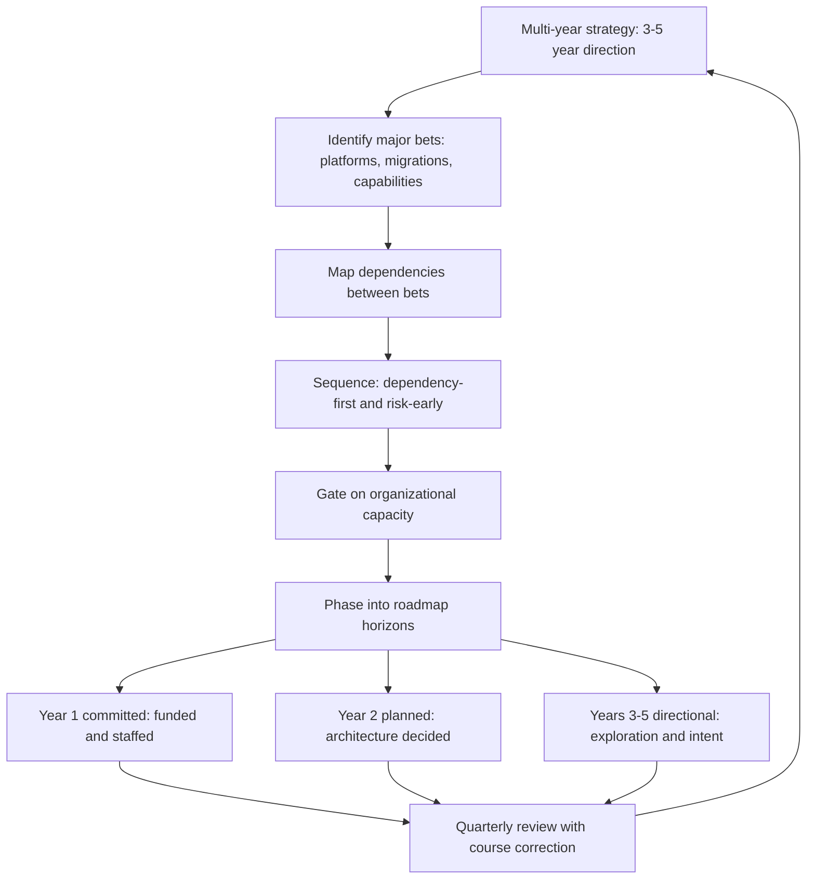

# Multi-Year Technology Roadmapping

> **Core skill:** The principal engineer builds roadmaps that span beyond the annual cycle — sequencing major technology bets across 3-5 years, designing platform modernization arcs, and creating roadmaps that survive leadership changes by distinguishing commitment from direction.

## Why This Matters

Annual planning cycles produce annual roadmaps. But the decisions that determine an organization's technology trajectory — platform selection, architecture modernization, capability build-out — unfold over years, not quarters. A roadmap confined to an annual horizon optimizes for the next twelve months at the expense of the next five years.

The principal engineer builds the multi-year roadmap that sequences major bets, phases platform evolution, and creates enough clarity that teams can make local decisions without derailing the long arc. This roadmap must survive the leadership changes, re-orgs, and market shifts that will certainly occur during its horizon — which means it must distinguish commitments from directions, and hard dates from intentions.

## Roadmap Beyond the Annual Cycle

| Horizon | Timeframe | Nature of Content | Review Cadence |
|---------|-----------|-------------------|----------------|
| **Year 1** | Months 1-12 | Committed: funded, staffed, specific deliverables | Quarterly within the annual cycle |
| **Year 2** | Months 13-24 | Planned: architecture decisions made, sequencing established, capacity estimated | Bi-annual, adjust as Year 1 delivers |
| **Years 3-5** | Months 25-60 | Directional: platform evolution arcs, capability targets, technology bets in exploration | Annual refresh with strategy cycle |

The roadmap narrows from directional to committed as time approaches. Content in Year 3 is intentionally broad — it is direction, not promise. Content in Year 1 is specific enough that a team can open the roadmap and know what to build next quarter.

## Platform Modernization Arcs

Platform modernization is the most common multi-year roadmap pattern. It fails in predictable ways: treating it as a single big-bang migration, underestimating the coexistence period, or forgetting that the business keeps running while the platform changes.

| Phase | Duration | What Happens | Success Criteria |
|-------|----------|--------------|-----------------|
| **Assess** | 3-6 months | Inventory current state, model target state, size the arc | Target architecture documented; migration cost estimated; business impact modeled |
| **Enable** | 6-12 months | Build the new platform foundations; establish migration tooling and patterns | First service migrated in production; migration playbook validated |
| **Coexist** | 12-24 months | Old and new platforms run in parallel; services migrate incrementally | Migration velocity established; business impact measured per migration |
| **Migrate** | 12-24 months | Bulk migration; old platform receives only critical fixes | Majority of traffic on new platform; old platform in sustainment mode |
| **Sunset** | 6-12 months | Old platform decommissioned; residual capabilities absorbed or retired | Old platform off; cost reduction realized |

The coexistence phase is where most modernization arcs stall. The principal ensures coexistence has an end date — not just a start.

## Sequencing Major Bets Across Time

Major bets compete for the same organizational capacity. Sequencing them is an optimization problem: maximize strategic progress while respecting capacity constraints and dependency chains.

| Sequencing Principle | Description | Example |
|---------------------|-------------|---------|
| **Dependency-first** | Build capabilities that other bets depend on before the bets that consume them | Platform API layer before partner ecosystem |
| **Risk-early** | Sequence the riskiest assumption test as early as possible | Validate the novel technology before committing the full migration |
| **Value-staggered** | Deliver incremental value at each phase; no multi-year gap between investment and return | Each platform migration phase delivers measurable cost reduction |
| **Capacity-gated** | Start a new bet only when capacity from a prior bet releases | Do not start three migrations simultaneously |



## Making Roadmaps That Survive Leadership Changes

Leadership changes are the most common cause of roadmap failure. A new executive arrives, questions everything, and the roadmap becomes a casualty of the transition. The principal designs roadmaps to survive this.

| Survival Strategy | How It Works |
|-------------------|-------------|
| **Ground bets in business capabilities, not technology preferences** | A bet justified by "we need event-driven architecture" dies with the sponsor; a bet justified by "real-time customer experience requires sub-100ms data access" survives because the business need persists |
| **Deliver visible value within the first year** | If the roadmap produces nothing measurable for 18 months, a new leader will cancel it. Every arc must have a Year 1 value delivery |
| **Make non-goals explicit** | When a new leader proposes a direction the roadmap already considered and declined, the non-goals section provides context without defensiveness |
| **Document the alternatives considered** | Show that the chosen path was not arbitrary — it was selected from options with documented trade-offs |
| **Separate commitment from direction** | Year 1 is committed; Years 3-5 are direction. A new leader can reshape direction without breaking commitments |

## Roadmap-as-Commitment vs Roadmap-as-Direction

The distinction between commitment and direction is the roadmap's most important structural feature.

| Aspect | Commitment (Year 1) | Direction (Years 3-5) |
|--------|---------------------|----------------------|
| **Specificity** | Specific deliverables with dates | Capability targets and platform arcs |
| **Funding** | Allocated and approved | Estimated for planning purposes |
| **Staffing** | Teams assigned | Capacity model, not named teams |
| **Change process** | Formal change control; stakeholder sign-off | Annual refresh with strategy cycle |
| **Accountability** | Delivery against commitments is tracked | Direction is reviewed for continued relevance |
| **Communication** | "We are building X by Q3" | "We intend to move toward Y over the next 3 years" |

## Practical Applications

### Multi-Year Roadmap Checklist

- [ ] The roadmap has three horizons: Year 1 committed, Year 2 planned, Years 3-5 directional
- [ ] Platform modernization arcs include explicit coexistence and sunset phases
- [ ] Major bets are sequenced by dependency, risk, value, and capacity
- [ ] Every bet is grounded in a business capability, not a technology preference
- [ ] Year 1 includes at least one visible value delivery for every major arc
- [ ] Non-goals and alternatives considered are documented
- [ ] Commitment and direction are clearly distinguished in all communications

### Roadmap Communication Template

```markdown
# Technology Roadmap: [Horizon]

## Year 1: Committed
| Quarter | Deliverable | Business Outcome | Owner |
|---------|------------|-----------------|-------|

## Year 2: Planned
| Half | Capability Target | Estimated Investment | Dependencies |
|------|------------------|---------------------|-------------|

## Years 3-5: Direction
| Arc | Target State | Key Assumptions |
|-----|-------------|----------------|

## Non-Goals
- [What we are not doing and why]
- [What we are not doing and why]

## Risks to the Roadmap
| Risk | Likelihood | Mitigation |
|------|-----------|------------|
```

## Common Pitfalls

| Pitfall | Why It Is a Problem | Better Approach |
|---------|---------------------|-----------------|
| **Everything is committed** | When everything is a promise, nothing can change without breaking trust | Distinguish commitment from direction; change direction through refresh, not apology |
| **No Year 1 value delivery** | Long arcs without visible progress lose sponsorship | Every arc delivers measurable value in Year 1 |
| **Technology-preference justification** | Bets die when the champion leaves | Ground every bet in a business capability that outlasts any individual |
| **Coexistence without an end date** | Old and new platforms run indefinitely; cost doubles | Give the coexistence phase an explicit end date with triggers |
| **Capacity ignored in sequencing** | Three migrations started simultaneously; none finish | Gate new bets on capacity release from prior bets |
| **Roadmap as a static artifact** | Updated annually, irrelevant within a quarter | Quarterly review with course correction; annual refresh with strategy |

## Success Indicators

- Year 1 commitments are delivered or formally re-planned with stakeholder agreement
- Platform modernization arcs include active coexistence phases with published end dates
- New leadership does not discard the roadmap — they reshape direction within the existing structure
- Non-goals are cited to decline work that would derail the roadmap
- The roadmap narrows from directional to committed as time horizons approach

## Related Topics

- [[01_Technology_Strategy_at_Enterprise_Scale]]
- [[03_Investment_Strategy_and_Capital_Allocation]]
- [[05_Technology_Portfolio_Management]]
- [[06_Strategic_Technology_Decisions]]
- [[career-path/03_Staff_Engineer/03_Technical_Strategy/01_Writing_Technical_Strategy|Writing Technical Strategy (Staff)]]

## Summary

Multi-year technology roadmapping means building a roadmap with three horizons — committed, planned, and directional — that sequences major bets across time, phases platform modernization with explicit coexistence and sunset periods, and distinguishes commitment from direction so the roadmap survives leadership changes. The principal ensures every arc delivers value in Year 1, grounds bets in business capabilities, and gates new starts on capacity.