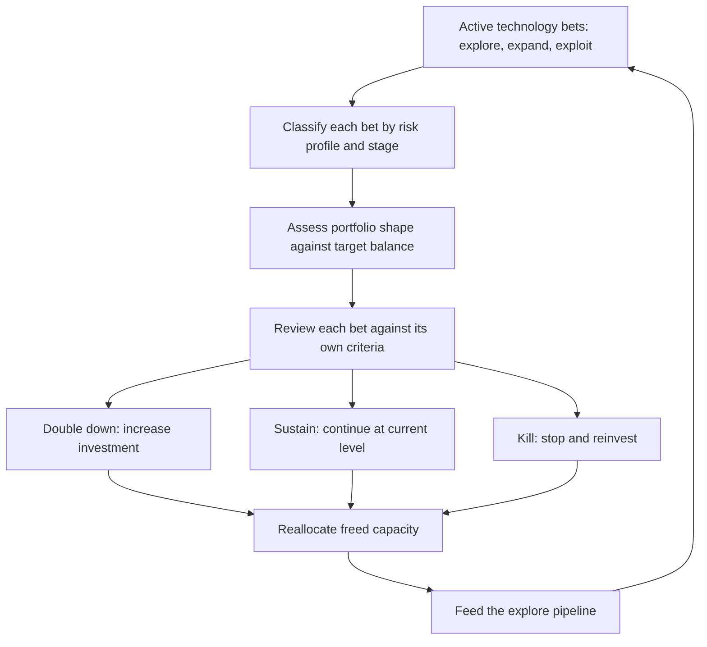

# Technology Portfolio Management

> **Core skill:** The principal engineer manages a portfolio of technology bets across risk profiles — explore, expand, exploit — balancing the portfolio, conducting regular reviews, killing bets that are not working, and reinvesting freed capacity into the next set of opportunities.

## Why This Matters

Individual technology bets are evaluated on their own merits. But bets do not exist in isolation — they compete for finite organizational capacity, and their combined shape determines whether the organization innovates, optimizes, or stagnates. A portfolio with nothing but safe bets drifts toward irrelevance. A portfolio with nothing but moonshots never ships.

The principal engineer manages the portfolio as a portfolio: balancing risk profiles, reviewing bets as a set, and making the hard decision to kill bets that are not working. This is the discipline that prevents the organization from accumulating a graveyard of half-funded, never-canceled initiatives.

## The Explore-Expand-Exploit Framework

Every technology bet falls into one of three risk profiles. The portfolio's shape across these profiles determines its health.

| Profile | Definition | Risk Level | Investment Size | Time to Value | Success Rate Expectation |
|---------|-----------|------------|-----------------|---------------|-------------------------|
| **Explore** | Investigating a new technology, market, or capability with high uncertainty | High: most will not succeed | Small: experiments, prototypes | 3-12 months per experiment | 10-30% succeed to Expand |
| **Expand** | Scaling a proven capability; the bet is derisked but not yet at full investment | Medium: known unknowns, scaling challenges | Medium: dedicated team, growing investment | 6-18 months to reach Exploit | 50-70% succeed to Exploit |
| **Exploit** | Operating a mature capability at scale; optimizing efficiency and reliability | Low: proven, predictable | Large: sustained operational investment | Continuous return | 90%+ sustain |

## Portfolio Balance

A healthy portfolio has a deliberate shape. The shape is not a formula — it reflects the organization's strategy and market position.

| Organization Context | Explore | Expand | Exploit |
|---------------------|---------|--------|---------|
| Market leader defending position | 10-15% | 20-25% | 60-70% |
| Challenger disrupting an incumbent | 20-30% | 30-40% | 30-50% |
| New entrant building from zero | 40-50% | 30-40% | 10-20% |
| Turnaround: fixing technical debt | 5-10% | 50-60% | 30-40% |

The balance is reviewed at every portfolio review. A shift in market position or strategy should shift the portfolio shape.

## The Portfolio Review Cadence

Regular review is the discipline that keeps the portfolio honest. Without it, bets accumulate, capacity fragments, and the portfolio drifts.

| Review Level | Frequency | Scope | Participants |
|-------------|-----------|-------|--------------|
| **Bet-level review** | Monthly or per commitment point | Single bet: thesis still valid, evidence, next step | Bet owner, principal, relevant engineering lead |
| **Portfolio review** | Quarterly | All bets: shape, balance, capacity allocation | Principal, CTO, engineering leadership |
| **Strategic portfolio review** | Annual | Portfolio shape against strategy; major rebalancing | Principal, CTO, CEO, CFO |

## Killing Bets

Killing a bet is the hardest portfolio management action and the most important. Organizations that cannot kill bets cannot innovate — capacity is trapped in failing initiatives.

| Kill Signal | What It Means | Action |
|-------------|---------------|--------|
| **Thesis invalidated** | The belief that justified the bet is no longer true | Kill immediately; no further evidence needed |
| **Exit criteria triggered** | Pre-agreed failure signal has been observed | Kill on schedule; the criteria were agreed before the bet started |
| **Opportunity cost exceeds expected value** | A better use of the capacity exists | Redirect capacity to the higher-value bet |
| **Absorptive capacity exceeded** | The organization cannot integrate the bet's output | Pause or kill; the bet will fail regardless of its merit |
| **No progress against commitment points** | The bet is stuck; repeated reviews show no movement | Kill after two consecutive reviews with no progress |

The kill decision is always uncomfortable. The principal makes it easier by establishing kill criteria at the start, reviewing bets against written predictions, and celebrating the kill as a learning event, not a failure.

## Reinvesting Freed Capacity

When a bet is killed or completes, its capacity returns to the portfolio. Without deliberate reinvestment, capacity is absorbed by the loudest voice, not the best opportunity.

| Reinvestment Principle | Description |
|-----------------------|-------------|
| **Return to the portfolio, not the team** | Freed capacity is portfolio capacity, not the previous team's entitlement |
| **Prioritize against the pipeline** | Freed capacity is allocated to the highest-priority bet in the pipeline, not the most convenient |
| **Reserve for Explore** | A portion of freed capacity always returns to Explore to maintain the innovation pipeline |
| **Track reinvestment decisions** | Every kill decision includes a reinvestment decision; both are recorded |

## The Portfolio Dashboard

The principal maintains a one-page portfolio view that makes the shape, health, and capacity allocation visible.

| Portfolio Element | What It Shows |
|-------------------|---------------|
| **Bet inventory** | Every active bet: name, profile, stage, owner, next review date |
| **Portfolio shape** | Current allocation across Explore, Expand, Exploit vs target |
| **Capacity allocation** | Engineer-months per bet; total consumed vs available |
| **Pipeline** | Candidate bets awaiting capacity: priority order, estimated size |
| **Health indicators** | Bets behind schedule, bets past review date, bets without exit criteria |

## Practical Applications

### Portfolio Management Checklist

- [ ] Every active bet is classified by risk profile: Explore, Expand, or Exploit
- [ ] The portfolio has a target shape appropriate to the organization's strategy and market position
- [ ] Quarterly portfolio reviews are held with engineering leadership
- [ ] Kill criteria are established at bet initiation and honored when triggered
- [ ] Freed capacity is deliberately reinvested, not absorbed by default
- [ ] A portfolio dashboard is maintained and visible to stakeholders
- [ ] The Explore pipeline has at least 3 candidate bets at any time

## Common Pitfalls

| Pitfall | Why It Is a Problem | Better Approach |
|---------|---------------------|-----------------|
| **Portfolio review as status update** | Review becomes a slide presentation; no decisions are made | Structure the review around decisions: double down, sustain, or kill |
| **No kill criteria** | Bets are never killed because there is no trigger to justify it | Establish kill criteria at bet initiation; make them specific and observable |
| **Killing seen as failure** | Teams hide struggling bets to avoid the stigma | Celebrate kills as learning events; publicly credit teams for honest evaluation |
| **Freed capacity absorbed by loudest voice** | Capacity returns to whoever asks first, not the best opportunity | Allocate freed capacity against the portfolio pipeline with explicit prioritization |
| **Explore starved** | Short-term pressure consumes Explore capacity; innovation pipeline dries up | Protect Explore allocation as a portfolio constraint, not a discretionary line item |
| **Portfolio shape never adjusted** | Market shifts, but portfolio stays locked in last year's shape | Review and adjust the target shape at every strategic portfolio review |

## Success Indicators

- The portfolio shape shifts deliberately in response to strategy changes
- At least one bet is killed per portfolio review cycle on criteria, not embarrassment
- Freed capacity is reinvested in pipeline bets within one planning cycle
- The Explore pipeline is never empty — candidate bets are always waiting for capacity
- The portfolio dashboard is the artifact used in leadership discussions, not a special presentation

## Related Topics

- [[03_Investment_Strategy_and_Capital_Allocation]]
- [[04_Multi_Year_Technology_Roadmapping]]
- [[06_Strategic_Technology_Decisions]]
- [[career-path/03_Staff_Engineer/03_Technical_Strategy/02_Technology_Betting|Technology Betting (Staff)]]
- [[career-path/03_Staff_Engineer/03_Technical_Strategy/05_Strategy_Review_and_Adaptation|Strategy Review and Adaptation (Staff)]]

## Summary

Technology portfolio management means managing a collection of bets across risk profiles — Explore, Expand, Exploit — balancing the portfolio against strategy and market context, holding regular reviews that produce decisions, killing bets that are not working against written criteria, and deliberately reinvesting freed capacity into the next set of opportunities. The principal maintains the portfolio dashboard that makes the shape, health, and allocation visible, and ensures the Explore pipeline never runs dry.