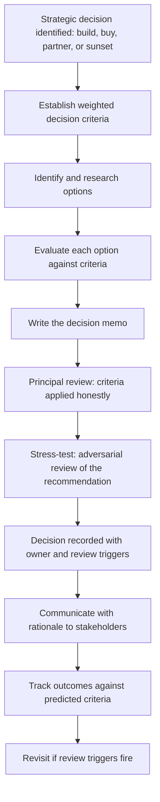

# Strategic Technology Decisions

> **Core skill:** The principal engineer serves as the ultimate technical reviewer for enterprise-defining choices — build, buy, or partner; major platform selection; technology sunset — producing decision memos that survive organizational pressure and create durable commitment.

## Why This Matters

Some technology decisions define the organization for years. The choice of a core platform, the decision to build rather than buy a capability, the sunset of a legacy system that hundreds of engineers depend on — these are not architecture decisions. They are enterprise-defining choices with consequences that outlast the careers of the people making them.

The principal engineer is the person who ensures these decisions are made well: with explicit criteria, honest evaluation of alternatives, documentation that survives the decision, and the organizational courage to hold the line when pressure mounts to reverse a sound choice.

## The Decision Memo Format

Every enterprise-defining technology decision gets a memo. The memo is the artifact that makes the decision durable — it captures the reasoning, the alternatives considered, and the criteria by which the decision can later be judged.

```markdown
# Decision Memo: [Decision Name]

## Context
[One paragraph: what is being decided, why now, what is at stake]

## Decision
[One sentence: the decision, stated clearly enough to be wrong]

## Criteria
| Criterion | Weight | Why It Matters |
|-----------|--------|----------------|
| [Criterion one] | [High/Medium/Low] | [Rationale] |

## Options Evaluated
| Option | Strengths | Weaknesses | Assessment Against Criteria |
|--------|----------|------------|---------------------------|

## Alternatives Considered and Rejected
- [Alternative]: [Why rejected]

## Risks and Mitigations
| Risk | Likelihood | Impact | Mitigation |
|------|-----------|--------|------------|

## Reversibility
[One-way door or two-way door; if reversible, under what conditions]

## Decision Review Triggers
[What evidence would cause us to revisit this decision]

## Communication Plan
[Who needs to know, in what sequence, with what message]

## Owner
[Name]

## Date
[Date]
```

## Build, Buy, or Partner

The build-buy-partner decision is the most consequential choice the principal reviews. Each option carries distinct risks that must be surfaced before the decision.

| Option | When Appropriate | Key Risks |
|--------|-----------------|-----------|
| **Build** | The capability is differentiating; no suitable external option exists; the organization has the talent to build and maintain it | Underestimating long-term maintenance cost; key-person dependency; build diverges from market standards |
| **Buy** | The capability is commodity; external options are mature; integration cost is lower than build cost | Vendor lock-in; product roadmap divergence; switching cost accumulates silently |
| **Partner** | The capability requires ecosystem scale; joint development shares cost and risk; no single party has all the required expertise | Partner misalignment over time; IP ownership disputes; partner deprioritizes the joint work |

| Decision Factor | Build | Buy | Partner |
|----------------|-------|-----|---------|
| Strategic differentiation | High | Low | Medium |
| Time to value | Slowest | Fastest | Medium |
| Long-term cost | Highest upfront, lower marginal | Lower upfront, recurring license | Shared upfront, shared marginal |
| Control | Full | Vendor-dependent | Negotiated |
| Risk of obsolescence | Internal investment risk | Vendor roadmap risk | Partner commitment risk |

## Major Platform Selection

Platform selection decisions lock the organization into an ecosystem for years. The principal evaluates platforms against criteria that extend beyond technical fit.

| Evaluation Dimension | Questions |
|---------------------|-----------|
| **Technical fit** | Does the platform solve the problem? Does it integrate with existing systems? Is the architecture compatible with our constraints? |
| **Ecosystem maturity** | Is there a healthy community, talent pool, and third-party ecosystem? Will the platform exist in 5 years? |
| **Organizational absorptive capacity** | Can our teams learn this platform? Do we have or can we hire the talent? |
| **Vendor health and trajectory** | Is the vendor financially stable? Is their roadmap aligned with our needs? What happens if they are acquired? |
| **Total cost of ownership** | License, infrastructure, training, migration, ongoing operations, exit cost |
| **Regulatory and compliance** | Does the platform meet our data sovereignty, security, and compliance requirements? |



## Technology Sunset

Sunsetting a technology is harder than adopting one. The costs are immediate; the benefits are deferred. The principal ensures sunset decisions are made with the same rigor as adoption decisions.

| Sunset Phase | Activities | Success Criteria |
|-------------|-----------|-----------------|
| **Announce** | Declare the sunset with timeline and rationale; identify affected systems and teams | Every affected team knows the timeline and their responsibilities |
| **Freeze** | No new features or integrations on the sunsetting technology | Freeze is enforced; exceptions require principal approval |
| **Migrate** | Move consumers to the replacement; provide tooling, patterns, and support | Migration velocity is tracked; blocked teams are escalated |
| **Sustain** | Critical fixes only; no enhancement; support contract transitions to minimal | Support costs decrease on plan |
| **Retire** | Technology decommissioned; residual artifacts cleaned up | Technology is off; cost reduction is realized; no undocumented consumers remain |

## Making Decisions That Survive Organizational Pressure

Enterprise-defining decisions attract pressure. A vendor relationship sours, a new executive prefers a different platform, a team resists migration. The principal builds decisions to survive this pressure.

| Survival Strategy | How It Works |
|-------------------|-------------|
| **Document the alternatives considered** | When a new alternative is proposed, the memo shows it was evaluated and why it was rejected |
| **Name the criteria and their weights** | A decision challenged on outcome can be re-evaluated against the original criteria — if criteria shifted, that is a different conversation |
| **Establish review triggers, not expiration dates** | The decision stands until a trigger fires — new evidence, not elapsed time |
| **Communicate the rationale, not just the decision** | Teams that understand why are less likely to resist than teams given an edict |
| **Own the decision personally** | The principal's name is on the memo; accountability is not diffused across a committee |

## Practical Applications

### Strategic Decision Checklist

- [ ] Every enterprise-defining technology decision has a written memo in the standard format
- [ ] Build-buy-partner evaluations weigh strategic differentiation, time to value, and total cost of ownership
- [ ] Platform selections include vendor health, ecosystem maturity, and exit cost in the evaluation
- [ ] Sunset decisions have explicit phases with freeze, migrate, sustain, and retire gates
- [ ] Decisions include review triggers — the evidence that would cause reconsideration
- [ ] The rationale is communicated, not just the decision
- [ ] The principal's name is on the memo as owner

## Common Pitfalls

| Pitfall | Why It Is a Problem | Better Approach |
|---------|---------------------|-----------------|
| **Decision by consensus without a memo** | Consensus drifts; nobody remembers why the decision was made; pressure to reverse is unopposed | Write the memo with criteria and alternatives before seeking consensus |
| **Build-by-default** | Not-invented-here syndrome; the organization builds commodity capabilities it should buy | Apply the build-buy-partner framework with explicit criteria for each decision |
| **Platform selection on technical fit alone** | Vendor fails, ecosystem collapses, talent cannot be hired | Evaluate ecosystem maturity, vendor health, and organizational absorptive capacity |
| **Sunset without a timeline** | Technology is announced as sunset but never actually retired | Sunset includes dated phases: freeze, migrate, sustain, retire |
| **Decision reversed under pressure without revisiting criteria** | The loudest voice wins; decisions have no durability | Establish review triggers; a decision is revisited when triggers fire, not when pressure mounts |
| **No owner named** | Accountability diffuses across a committee; nobody ensures the decision sticks | The principal's name is on the memo; ownership is personal and visible |

## Success Indicators

- Enterprise-defining decisions have written memos that are referenced when the decision is challenged
- Build-buy-partner decisions are made against explicit criteria, not organizational inertia
- Sunset technologies progress through dated phases and are actually retired
- Decisions are revisited when review triggers fire, not when organizational pressure mounts
- Teams can articulate the rationale for major decisions, not just the outcome

## Related Topics

- [[01_Technology_Strategy_at_Enterprise_Scale]]
- [[04_Multi_Year_Technology_Roadmapping]]
- [[05_Technology_Portfolio_Management]]
- [[03_Decision_Governance_and_Principles/00_overview|Decision Governance and Principles]]
- [[career-path/03_Staff_Engineer/03_Technical_Strategy/04_Saying_No_at_Scale|Saying No at Scale (Staff)]]

## Summary

Strategic technology decisions at the principal level mean serving as the ultimate technical reviewer for enterprise-defining choices — applying the build-buy-partner framework, evaluating platforms beyond technical fit, managing technology sunset with dated phases, and producing decision memos that survive organizational pressure by documenting criteria, alternatives, and review triggers. The principal's name is on the memo; accountability is personal and the decision endures.