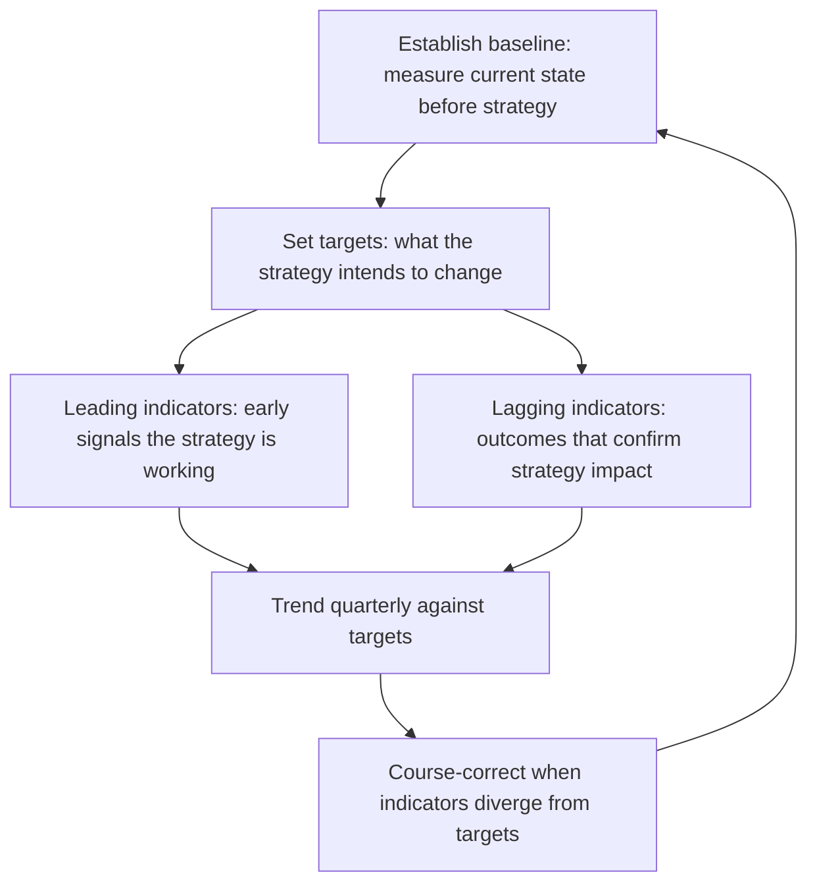

# Measuring Strategy Impact at Scale

> **Core skill:** The principal engineer defines org-wide technology metrics that measure strategic outcomes — not team velocity — establishing board-level technology KPIs, measuring what the strategy changed, and conducting the annual strategy impact review.

## Why This Matters

Organizations measure what they manage, but most technology measurement is inward-facing: velocity, uptime, throughput. These metrics tell you whether teams are busy, not whether the strategy is working. The principal engineer bridges this gap: defining metrics that connect technology investment to strategic outcomes and measuring what the strategy actually changed.

Without strategic measurement, strategy is a belief system, not a management discipline. The principal makes strategy testable by defining the metrics that would show it is working — and the metrics that would show it is not.

## Strategic Outcomes vs Operational Metrics

The distinction between strategic outcomes and operational metrics is the most important measurement decision the principal makes.

| Dimension | Operational Metrics | Strategic Outcomes |
|-----------|-------------------|-------------------|
| **What they measure** | Team output and system health | Whether the strategy is producing intended results |
| **Example** | Deployment frequency, cycle time, p99 latency | Platform adoption rate, time-to-market for new capabilities, technology cost as percentage of revenue |
| **Audience** | Engineering teams and managers | C-suite, board, strategy review |
| **Cadence** | Daily, weekly, per sprint | Quarterly, annually |
| **Action on signal** | Team-level adjustment | Strategy-level course correction |
| **Ownership** | Engineering leads, platform teams | Principal engineer, CTO |

Strategic outcomes are not aggregations of operational metrics. You cannot add deployment frequencies across teams and call it strategy impact. Strategic outcomes measure the system-level effects the strategy intended to produce.

## Board-Level Technology KPIs

The board needs a small set of technology metrics that connect to business outcomes. More than six and they blur; fewer than four and they miss dimensions.

| KPI Category | Example KPIs | What It Tells the Board |
|-------------|-------------|------------------------|
| **Technology investment efficiency** | Technology spend as percentage of revenue; run-grow-transform allocation ratio; return on technology investment | Whether technology investment is proportionate and productive |
| **Platform health and risk** | Critical vulnerability remediation time; platform end-of-life exposure; system availability for revenue-generating services | Whether technology risk is managed and platforms are sustainable |
| **Strategic bet progress** | Platform adoption against target; time-to-market for new capabilities; technology capability maturity scores | Whether the strategy is producing results |
| **Organizational technology capability** | Engineering hiring vs attrition; internal promotion rate; technology skills coverage against strategy needs | Whether the organization can execute the strategy |

| KPI | Definition | Target | Trend Direction |
|-----|-----------|--------|-----------------|
| Technology spend / revenue | Total technology cost divided by total revenue | Industry-benchmarked | Stable or declining |
| Run-Grow-Transform ratio | Percentage of technology spend by horizon | 50-60% Run, 20-30% Grow, 10-20% Transform | Transform protected at target |
| Platform adoption rate | Percentage of eligible workloads on target platform | 80%+ by roadmap date | Increasing per plan |
| Critical vulnerability MTTR | Mean time to remediate critical vulnerabilities | <48 hours | Declining |
| Strategic capability maturity | Assessed maturity of capabilities named in strategy | Per roadmap target | Improving per plan |

## Measuring What the Strategy Changed

The most important measurement is the counterfactual: what is different because the strategy existed? This requires measuring before the strategy, establishing targets, and measuring after.



| Measurement Type | Definition | Example | Cadence |
|-----------------|-----------|---------|---------|
| **Baseline** | State before strategy implementation | Platform adoption 15%; capability maturity score 2.1; time-to-market 9 months | Once, at strategy initiation |
| **Leading indicator** | Early signal that the strategy is working | Migration velocity increasing; pilot teams reporting productivity gains | Monthly |
| **Lagging indicator** | Outcome that confirms strategy impact | Platform adoption reached 80%; capability maturity score improved to 3.8; time-to-market reduced to 3 months | Quarterly, annually |
| **Counterfactual** | What would have happened without the strategy | Cost trend without platform consolidation; risk trajectory without security investment | Annual strategy impact review |

## The Annual Strategy Impact Review

The annual strategy impact review is the principal's most important recurring event. It asks: did the strategy work, and what do we change?

| Review Element | Questions Addressed |
|---------------|-------------------|
| **Outcome vs target** | Did each strategic bet produce the outcomes it targeted? If not, why not? |
| **Investment vs return** | Did the capital allocated produce the expected return? Was it the right allocation? |
| **Assumption validation** | Which strategy assumptions held? Which broke? What changed in the environment? |
| **Portfolio rebalancing** | Does the portfolio shape still match the strategy? What shifts are needed? |
| **Metric refresh** | Are the right things measured? Do the KPIs still connect to the strategy? |
| **Next cycle direction** | What changes in the next strategy cycle based on what was learned? |

## The Strategy Impact Dashboard

The principal maintains a dashboard that makes strategy impact visible at a glance. It is the artifact used in board presentations and strategy reviews.

| Dashboard Element | Content |
|-------------------|---------|
| **Strategy thesis summary** | One line per bet: target, current, trend arrow |
| **Outcome scorecard** | 4-6 strategic KPIs: baseline, target, current, trend |
| **Investment allocation actual vs target** | Run-Grow-Transform actual vs target, by quarter |
| **Risk register** | Top 5 risks to strategy: status, trend, mitigation owner |
| **Assumption tracker** | Key assumptions: still valid, under stress, or broken |

## Practical Applications

### Strategy Measurement Checklist

- [ ] Strategic outcomes are defined separately from operational metrics with different audiences and cadences
- [ ] 4-6 board-level technology KPIs exist, are trended quarterly, and connect to business outcomes
- [ ] Baselines are established before strategy implementation begins
- [ ] Leading and lagging indicators are defined for each strategic bet
- [ ] An annual strategy impact review is held with explicit outcome-vs-target evaluation
- [ ] Key strategy assumptions are tracked and flagged when stressed or broken
- [ ] A strategy impact dashboard is maintained and used in board and leadership reviews

### Strategy Impact Review Template

```markdown
# Annual Strategy Impact Review: [Year]

## Strategy Thesis Recap
[One paragraph: what the strategy intended to achieve]

## Outcome vs Target
| Strategic Bet | Target | Actual | Variance | Explanation |
|--------------|--------|--------|----------|-------------|

## Investment vs Return
| Investment | Allocated | Spent | Return Type | Delivered | Gap |
|-----------|----------|-------|-------------|-----------|-----|

## Assumption Validation
| Assumption | Status: Held / Stressed / Broken | Implication |
|-----------|--------------------------------|-------------|

## Portfolio Shape
| Horizon | Target | Actual | Recommendation |
|---------|--------|--------|---------------|

## Metrics Refresh
| KPI | Keep / Change / Drop | Rationale |
|-----|---------------------|-----------|

## Next Cycle Recommendations
[Specific changes for the next strategy cycle]
```

## Common Pitfalls

| Pitfall | Why It Is a Problem | Better Approach |
|---------|---------------------|-----------------|
| **Velocity as strategy metric** | Team output does not measure strategy impact; busy teams can produce no strategic progress | Define strategic outcomes that measure system-level effects, not team-level output |
| **Too many KPIs** | Board and executives cannot track more than six metrics; measurement becomes noise | Limit board-level KPIs to 4-6; everything else is operational |
| **No baseline** | Without a baseline, you cannot measure what the strategy changed | Measure current state before strategy implementation begins |
| **Leading indicators missing** | By the time lagging indicators show failure, it is too late to course-correct | Define leading indicators that signal direction early enough to act |
| **Annual review skipped** | Strategy continues without evaluation; assumptions break silently | Hold the annual strategy impact review on the calendar; do not defer it |
| **Metrics never refreshed** | KPIs measure last year's strategy; current strategy has no measurement | Refresh metrics at every annual review; drop what no longer connects to strategy |
| **Dashboard built, not used** | Dashboard exists in a tool but never appears in leadership discussions | Make the dashboard the standard artifact for board and strategy review presentations |

## Success Indicators

- Board-level KPIs are trended and discussed at every board meeting
- The annual strategy impact review produces concrete changes to the next strategy cycle
- At least one KPI was dropped or replaced because it no longer connected to strategy
- Leading indicators provide early warning before lagging indicators confirm failure
- The strategy impact dashboard is the default artifact for technology discussions at the executive level

## Related Topics

- [[01_Technology_Strategy_at_Enterprise_Scale]]
- [[03_Investment_Strategy_and_Capital_Allocation]]
- [[05_Technology_Portfolio_Management]]
- [[05_Future_Readiness_and_Research/00_overview|Future Readiness and Research]]
- [[career-path/03_Staff_Engineer/03_Technical_Strategy/05_Strategy_Review_and_Adaptation|Strategy Review and Adaptation (Staff)]]

## Summary

Measuring strategy impact at scale means defining org-wide technology metrics that measure strategic outcomes rather than team velocity, establishing 4-6 board-level KPIs that connect to business results, measuring what the strategy actually changed by establishing baselines and tracking leading and lagging indicators, and conducting the annual strategy impact review that validates assumptions, evaluates outcomes against targets, and shapes the next strategy cycle. The principal maintains the dashboard that makes strategy impact visible and testable.