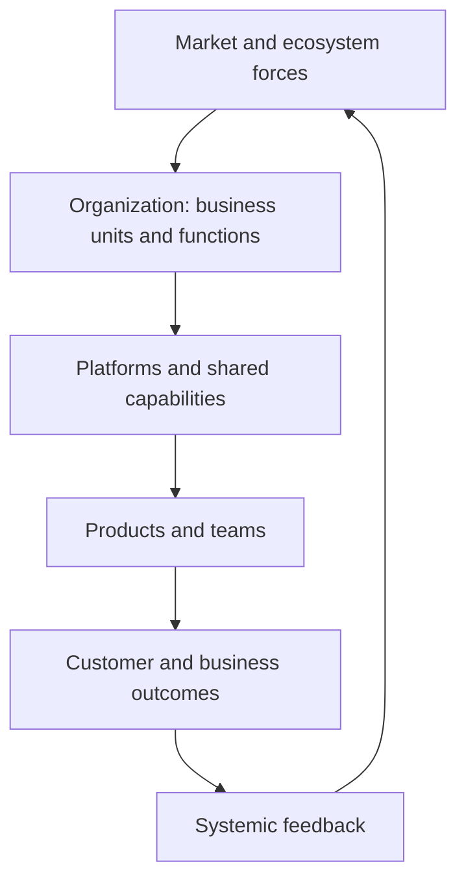

# Enterprise and Systems of Systems Thinking

> **Core capability:** The principal engineer sees the organization as a system of systems — understanding how business units, platforms, ecosystems, and markets interact, and designing for the emergent behavior that no single team can control.

## Why This Matters

At staff level, systems thinking is a diagnostic lens: trace recurring problems to structure and incentives. At principal level, the system IS the product — the organization, its platforms, its ecosystem partners, its regulatory environment. The principal engineers a system whose components are entire departments and independent systems, where the architecture decisions are organizational, not just technical.

This is the layer where Conway's Law becomes Conway's Strategy: designing the organization and its systems together to produce the outcomes the business needs. The principal's contribution is seeing second-order effects nobody else has the scope to see, and acting on them before they become the next re-org.

## Topics in This Capability Area

| Topic | Core Skill | When It Matters |
|-------|------------|-----------------|
| [[01_Enterprise_Systems_Thinking]] | Reading the organization as a system of interconnected capabilities | Strategy; investment; org design |
| [[02_Systems_of_Systems_Architecture]] | Architecting across independent, evolving systems | Platform strategy; acquisitions; ecosystem evolution |
| [[03_Ecosystem_and_Industry_Analysis]] | Understanding market forces, standards, and partner ecosystems | New markets; competitive positioning |
| [[04_Organizational_Dynamics_at_Scale]] | How large orgs behave: incentives, politics, Conway effects | Re-orgs; transformations; capability building |
| [[05_Long_Term_Consequence_Analysis]] | Projecting second, third, and systemic effects of decisions | Major investments; architecture choices; sunset |
| [[06_Technical_Due_Diligence]] | Evaluating companies, platforms, and capabilities for M&A | Acquisitions; vendor selection; partnership |
| [[07_Regulatory_and_Geopolitical_Thinking]] | Understanding how regulation and geopolitics shape technology choice | Global operations; data sovereignty; compliance |

## The Enterprise as System

The principal's scope: the whole diagram, not any single node.

## Staff vs Principal

| Activity | Staff Engineer | Principal and Distinguished Engineer |
|----------|----------------|---------------------------------------|
| Systems scope | Multi-team interactions | Organization, ecosystem, market |
| Conway application | Reads org structure in the architecture | Co-designs org structure and system architecture |
| Due diligence | Reviews technical proposals | Leads technical evaluation of acquisitions and partnerships |
| Consequence horizon | 1-2 year effects | 3-5+ year systemic effects across business units |

## Practical Applications

### Enterprise Thinking Checklist

- [ ] The organization's capability map exists and is used in strategy discussions
- [ ] Major architecture decisions account for organizational, ecosystem, and regulatory effects
- [ ] Acquisition and partnership evaluations include a technical due diligence framework
- [ ] Long-term consequence analysis is part of the strategy review process
- [ ] Regulatory and geopolitical constraints are surfaced in architecture decisions

## Common Pitfalls

| Pitfall | Why It Is a Problem | Better Approach |
|---------|---------------------|-----------------|
| **Org chart as the system** | The system includes partners, regulators, ecosystems | Map the full system — not just reporting lines |
| **Due diligence after the deal** | Technical risks discovered post-acquisition are expensive | Pre-deal due diligence as a repeatable process |
| **Ignoring second-order effects** | Local optimization produces global dysfunction | Scenario planning; systemic feedback analysis |
| **Regulation as afterthought** | Architecture designed then retrofitted for compliance | Regulation as architecture driver from inception |

## Success Indicators

- Architecture decisions account for ecosystem and regulatory effects
- Due diligence processes produce technical evaluations used in investment decisions
- The organization's capability map is a living artifact used in strategy
- Second-order effects of major decisions are discussed before, not after

## Related Capabilities

- [[01_Technology_Strategy/00_overview|Technology Strategy]]: strategy built on enterprise systems understanding
- [[03_Decision_Governance_and_Principles/00_overview|Decision Governance and Principles]]: governance that accounts for organizational dynamics
- [[career-path/03_Staff_Engineer/05_Systems_Thinking_and_Organizational_Design/00_overview|Systems Thinking and Organizational Design (Staff)]]: the foundation this scales
- [[career-path/15_Solutions_and_Enterprise_Architect/00_overview|Solutions and Enterprise Architect]]: the enterprise architecture specialty

## Summary

Enterprise and systems-of-systems thinking means reading the full system — organization, platforms, ecosystem, regulation — and co-designing technology and organization to produce the right emergent behavior. The principal's scope is the whole diagram; their contribution is seeing the second-order effects before they become the next crisis.