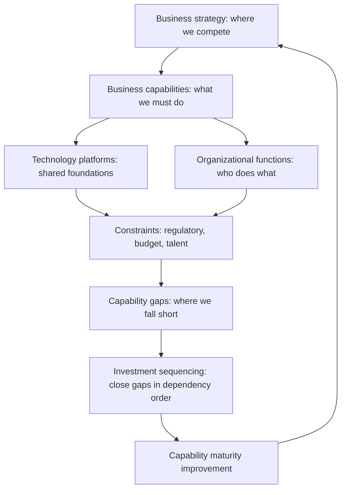

# Enterprise Systems Thinking

> **Core skill:** The principal engineer reads the organization as a system of interconnected capabilities — mapping business units, functions, platforms, and capabilities beyond the org chart, and using capability-based planning to guide investment and architecture decisions.

## Why This Matters

Most people read the organization through its org chart: reporting lines, hierarchies, boxes. The principal engineer reads the organization as a system: capabilities connected by dependencies, information flows, and incentives. The org chart tells you who reports to whom; the system map tells you why things break.

This is the lens that reveals why local optimization produces global dysfunction, why two teams with aligned goals produce conflicting outcomes, and why the best technical solution fails when dropped into the wrong organizational context. The principal's contribution is the ability to see the system that produces the outcomes before diagnosing the outcomes themselves.

## The Organization as a System

An organization is a system of interconnected elements. The principal maps these elements and their relationships to understand behavior.

| System Element | Definition | Example |
|---------------|------------|---------|
| **Capabilities** | What the organization can do: the units of value delivery | Fraud detection, payment processing, customer onboarding |
| **Platforms** | Shared technology foundations that multiple capabilities depend on | Data platform, identity service, API gateway |
| **Functions** | Organizational units with specific responsibilities | Engineering, product, security, legal |
| **Information flows** | How data, decisions, and signals move between elements | Architecture review process, budget allocation, incident response |
| **Incentive structures** | What people are rewarded and penalized for | OKRs, promotion criteria, budget accountability |
| **Constraints** | What limits the system's behavior | Regulatory requirements, budget caps, talent availability |

## Capability-Based Planning

Capability-based planning starts with what the organization needs to do and works backward to what must exist to do it. It is the alternative to project-based planning, which starts with what we plan to build and hopes it matches what is needed.

| Planning Dimension | Project-Based Planning | Capability-Based Planning |
|-------------------|----------------------|--------------------------|
| **Starting point** | "We will build X by Q3" | "We need the ability to do Y" |
| **Focus** | Deliverables | Outcomes |
| **Adaptability** | Low: scope defined upfront | High: capability can be delivered through multiple paths |
| **Measurement** | On time, on budget | Capability maturity improvement |
| **Investment framing** | Cost of the project | Investment to achieve a capability level |

| Capability Planning Step | Activities |
|-------------------------|------------|
| **Identify capabilities** | Map what the organization must be able to do to execute its strategy |
| **Assess maturity** | Rate each capability on a maturity scale: absent, ad-hoc, defined, managed, optimized |
| **Prioritize gaps** | Identify capabilities where the gap between current and required maturity is largest or most consequential |
| **Define target states** | For each priority capability, describe the target maturity level and the evidence that confirms it |
| **Sequence investments** | Build the multi-year plan that closes capability gaps in dependency order |

## The Enterprise Architecture View

The enterprise architecture view is the map of capabilities, platforms, and their relationships. It is the principal's primary tool for understanding systemic behavior.



## Mapping the Organization Beyond the Org Chart

The org chart is the most misleading map of the organization because it shows hierarchy, not dependency. The principal builds maps that reveal what the org chart hides.

| Map Type | What It Shows | Use |
|----------|--------------|-----|
| **Capability dependency map** | Which capabilities depend on which others | Identifying single points of failure; sequencing investment |
| **Information flow map** | How decisions, data, and signals move through the organization | Finding bottlenecks, delays, and information asymmetry |
| **Platform dependency map** | Which products and services depend on which platforms | Platform migration planning; risk assessment |
| **Incentive alignment map** | What each function is rewarded for, and where incentives conflict | Diagnosing recurring friction between teams |
| **Decision rights map** | Who can decide what, and where decisions get stuck | Governance design; removing decision bottlenecks |

## The Principal's Political Map

The enterprise system includes power, influence, and incentives. The principal maps these not to play politics but to understand what will actually happen when a decision is made.

| Map Element | Questions to Answer |
|-------------|-------------------|
| **Decision-makers** | Who has authority over the decisions that affect the system? Where does formal authority differ from actual influence? |
| **Incentive conflicts** | Where are two functions rewarded for outcomes that conflict with each other? |
| **Information asymmetry** | Who knows things others do not? Where does this create risk? |
| **Coalitions** | Which groups naturally align? Which are in tension? How does this shape outcomes? |
| **Change capacity** | How much change can the organization absorb simultaneously? Where is change fatigue concentrated? |

The political map is a diagnostic tool, not a manipulation tool. The principal uses it to design system changes that align with incentives rather than fighting them.

## Practical Applications

### Enterprise Systems Thinking Checklist

- [ ] A capability map exists that covers the organization's business and technology capabilities
- [ ] Capability maturity is assessed with a consistent scale and current-vs-target gaps are identified
- [ ] Platform and capability dependencies are mapped and used in sequencing decisions
- [ ] Incentive structures are understood and considered in architecture and process design
- [ ] The political map is maintained and consulted before major organizational or technical changes
- [ ] Capability-based planning informs investment decisions alongside project-based planning

### Capability Maturity Assessment Template

```markdown
# Capability Maturity Assessment: [Capability Name]

## Definition
[What the capability enables the organization to do]

## Current Maturity
| Dimension | Rating (1-5) | Evidence |
|-----------|-------------|----------|
| People | | |
| Process | | |
| Technology | | |
| Data | | |
| Governance | | |

## Target Maturity
| Dimension | Target Rating | Required Investment | Timeline |
|-----------|--------------|-------------------|----------|

## Dependencies
- [Capability A]: [Nature of dependency]
- [Capability B]: [Nature of dependency]

## Risks of Gap
[What happens if this capability gap is not closed]
```

## Common Pitfalls

| Pitfall | Why It Is a Problem | Better Approach |
|---------|---------------------|-----------------|
| **Org chart as the system** | Reporting lines hide dependencies; the real system includes partners, regulators, and platforms outside the org | Map capabilities, dependencies, and information flows beyond the org chart |
| **Project-based planning without capability view** | Projects deliver outputs; capabilities deliver outcomes. Project success does not guarantee capability improvement | Complement project planning with capability-based planning and maturity measurement |
| **Ignoring incentive structures** | The best-designed system fails when it asks people to act against their incentives | Map incentive structures; design changes that align with or reshape incentives |
| **Capability map built once, never updated** | The map diverges from reality; decisions are made against stale information | Review the capability map alongside the strategy refresh cycle |
| **Political map used for manipulation** | The principal's credibility depends on being seen as system-aware, not political | Use the political map to design better systems; never to maneuver against individuals |

## Success Indicators

- The capability map is a living artifact used in strategy and investment discussions
- Investment decisions reference capability maturity gaps with explicit targets
- Platform migration and investment sequencing account for capability dependencies
- Recurring organizational friction is diagnosed as system design issues, not personality conflicts
- The principal is trusted as an honest broker who reads the system without playing politics

## Related Topics

- [[02_Systems_of_Systems_Architecture]]
- [[04_Organizational_Dynamics_at_Scale]]
- [[05_Long_Term_Consequence_Analysis]]
- [[02_Enterprise_and_Systems_of_Systems_Thinking/00_overview|Enterprise and Systems of Systems Thinking]]
- [[career-path/03_Staff_Engineer/05_Systems_Thinking_and_Organizational_Design/00_overview|Systems Thinking and Organizational Design (Staff)]]

## Summary

Enterprise systems thinking means reading the organization as a system of capabilities, platforms, functions, and incentives — mapping dependencies beyond the org chart, using capability-based planning to guide investment, and understanding the political and incentive structures that determine whether a well-designed system actually works. The principal maintains the capability map that is the organization's shared view of what it can do and what it needs to become.