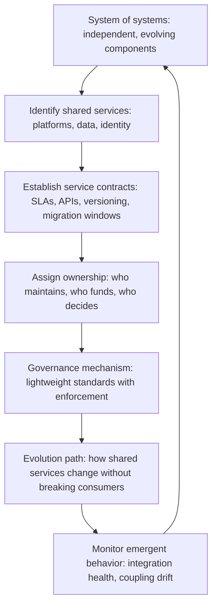

# Systems of Systems Architecture

> **Core skill:** The principal engineer architects across independent, evolving systems — establishing interoperability standards, governing shared services, and anticipating emergent behavior that no single system owner can predict or control.

## Why This Matters

Most architecture is single-system architecture: a bounded application, service, or platform under one team's control. At the principal level, the architect works across systems of systems — collections of independent systems, each with its own owners, lifecycles, and incentives, that must interoperate to produce enterprise outcomes. The architecture is not a design you draw; it is a set of constraints, standards, and governance mechanisms that shape behavior across autonomous actors.

This is the layer where emergent behavior dominates. Two systems that work perfectly in isolation can produce catastrophic failure when integrated. The principal's contribution is designing the interfaces, standards, and governance that make the system of systems behave coherently without requiring centralized control.

## Characteristics of Systems of Systems

A system of systems (SoS) has properties that single systems do not. The principal designs for these properties rather than fighting them.

| SoS Property | Definition | Architectural Implication |
|-------------|------------|--------------------------|
| **Operational independence** | Each constituent system operates independently and serves a useful purpose on its own | Cannot assume all systems are available, healthy, or cooperative at any moment |
| **Managerial independence** | Each system has its own owners, budget, roadmap, and incentives | Architecture must work through governance and standards, not directives |
| **Geographic distribution** | Systems span regions, data centers, and legal jurisdictions | Latency, data sovereignty, and network reliability shape what is possible |
| **Evolutionary development** | Each system evolves on its own lifecycle; the SoS never has a single upgrade moment | Interfaces must support versioning, migration, and backward compatibility |
| **Emergent behavior** | The SoS produces behaviors that no individual system was designed to produce | Testing in isolation is insufficient; integration behavior must be monitored continuously |

## Interoperability Standards

Interoperability is the core architectural problem in a system of systems. The principal establishes the standards that make systems composable without requiring them to know about each other.

| Standard Layer | What It Defines | Example |
|---------------|----------------|---------|
| **Data interchange** | Common formats and schemas for data that crosses system boundaries | Standard event schema, canonical data model for key entities |
| **Interface contracts** | How systems expose and consume capabilities: API style, versioning, error handling | REST with OpenAPI 3.0, gRPC with Protobuf, async event with CloudEvents |
| **Identity and access** | How systems authenticate and authorize across boundaries | OAuth 2.0, mutual TLS, service identity with SPIFFE |
| **Observability** | How system behavior is observed, traced, and alerted across boundaries | Distributed tracing with W3C Trace Context, standard metrics format, log correlation IDs |
| **Resilience patterns** | How systems handle failure of other systems | Circuit breakers, bulkheads, graceful degradation, standard retry policies |

| Standard Adoption Pattern | When to Use |
|--------------------------|-------------|
| **Mandatory for new systems** | Standard is mature; cost of non-compliance is high; enforcement is feasible |
| **Mandatory at integration boundary** | System internals are autonomous; only the interface must comply |
| **Opt-in with incentives** | Standard is emerging; compliance is rewarded with platform benefits |
| **Recommended with migration path** | Legacy systems; standard adoption is phased alongside modernization |

## Governance of Shared Services

Shared services — platforms, data stores, identity providers — are the integration points where systems of systems become coupled. The principal governs these services to prevent them from becoming bottlenecks.



| Governance Model | Description | When Appropriate |
|-----------------|-------------|-----------------|
| **Platform team owns** | A dedicated team builds, maintains, and evolves the shared service | High-traffic, mission-critical shared services |
| **Federated ownership** | Multiple teams contribute; governance body sets standards and resolves disputes | Shared services where multiple teams have deep domain expertise |
| **Internal open source** | Any team can contribute; maintainers approve changes; consumers self-serve | Mature shared services with broad adoption and low coordination cost |
| **Market model** | Multiple implementations compete; consumers choose; standards ensure interoperability | Capabilities where diversity is strategic and switching cost is manageable |

## Emergent Behavior in Multi-System Environments

Emergent behavior is the most dangerous property of systems of systems — and the one most often ignored until it causes an incident. The principal anticipates it.

| Emergent Behavior Type | Description | Detection Strategy |
|-----------------------|-------------|-------------------|
| **Cascading failure** | Failure in one system triggers failure in dependent systems, which triggers further failures | Chaos engineering at integration boundaries; circuit breaker enforcement |
| **Thundering herd** | Multiple systems react to the same event simultaneously, overwhelming a shared dependency | Rate limiting at integration points; jitter in scheduled operations |
| **Inadvertent feedback loops** | System A's action triggers System B's reaction, which triggers System A again, amplifying the effect | Integration monitoring with anomaly detection; design reviews for cyclic dependencies |
| **Coupling drift** | Systems designed to be loosely coupled become tightly coupled as assumptions accumulate | Coupling metrics: number of systems that must change together; regular coupling audits |
| **Silent data corruption** | Data crosses system boundaries and is transformed incorrectly at each step; errors accumulate | Data quality checks at integration boundaries; reconciliation processes |

## The SoS Architect Role

The principal as SoS architect does not design individual systems. They design the rules that systems must follow to interoperate safely.

| Responsibility | Activities |
|---------------|-----------|
| **Interface governance** | Define mandatory interface standards; review new integrations for compliance; manage versioning and deprecation |
| **Shared service strategy** | Decide which capabilities become shared services; assign ownership models; govern evolution |
| **Emergent behavior monitoring** | Establish integration monitoring; run cross-system chaos experiments; investigate systemic incidents |
| **Coupling management** | Measure and trend coupling; intervene when coupling threatens autonomy; enforce loose coupling at architectural reviews |
| **Standards evolution** | Evolve standards as technology and organizational maturity advance; manage migration from old to new standards |

## Practical Applications

### SoS Architecture Checklist

- [ ] Interoperability standards exist for data interchange, interface contracts, identity, observability, and resilience
- [ ] Shared services have explicit contracts: SLAs, APIs, versioning, and migration windows
- [ ] Governance models for shared services are assigned and functioning
- [ ] Integration boundaries are monitored for emergent behavior: cascading failures, coupling drift, feedback loops
- [ ] Coupling metrics are measured and trended; coupling drift triggers architectural intervention
- [ ] Cross-system chaos experiments are conducted regularly

### Interface Standard Template

```markdown
# Interface Standard: [Standard Name]

## Scope
[Which system boundaries this standard applies to]

## Requirements
| Layer | Requirement | Compliance Check |
|-------|-----------|-----------------|

## Versioning Policy
[How breaking and non-breaking changes are managed]

## Migration Path
[How existing systems move from current state to this standard]

## Governance
[Who owns the standard; how it evolves; how exceptions are granted]
```

## Common Pitfalls

| Pitfall | Why It Is a Problem | Better Approach |
|---------|---------------------|-----------------|
| **Designing the SoS as a single system** | Assumes centralized control over independent actors; the architecture collapses under autonomy | Design constraints, standards, and governance; accept that the SoS is never fully designed |
| **Standards without migration path** | Legacy systems cannot comply; standard becomes aspirational while real systems diverge | Every standard includes a migration path with milestones and sunset dates for old patterns |
| **Shared services without governance** | Shared service becomes a bottleneck; consumers wait on a team with different priorities | Assign ownership and governance model before the service becomes critical |
| **Ignoring emergent behavior until incidents** | Integration failures are treated as one-off incidents; root causes in coupling and feedback loops persist | Establish integration monitoring; treat systemic incidents as architecture feedback |
| **Coupling as afterthought** | Systems become accidentally coupled; any change requires coordination across multiple teams | Measure coupling; intervene when coupling metrics trend upward |

## Success Indicators

- Integration failures are rare and, when they occur, are contained by resilience patterns
- Shared services have clear ownership, contracts, and evolution paths
- Standards adoption is measured and increasing; legacy exceptions have sunset dates
- Coupling metrics are stable or declining; new systems adopt loose coupling by default
- Cross-system incidents produce architecture changes, not just operational fixes

## Related Topics

- [[01_Enterprise_Systems_Thinking]]
- [[03_Ecosystem_and_Industry_Analysis]]
- [[05_Long_Term_Consequence_Analysis]]
- [[01_Technology_Strategy/00_overview|Technology Strategy]]
- [[career-path/06_Software_Architect/01_Architecture_Fundamentals/00_overview|Architecture Fundamentals (Architect)]]

## Summary

Systems of systems architecture means designing across independent, evolving systems — establishing interoperability standards at every layer, governing shared services with explicit ownership and contracts, anticipating emergent behavior through monitoring and chaos engineering, and managing coupling so that systems remain autonomous while producing coherent outcomes. The principal designs the rules that systems follow, not the systems themselves.