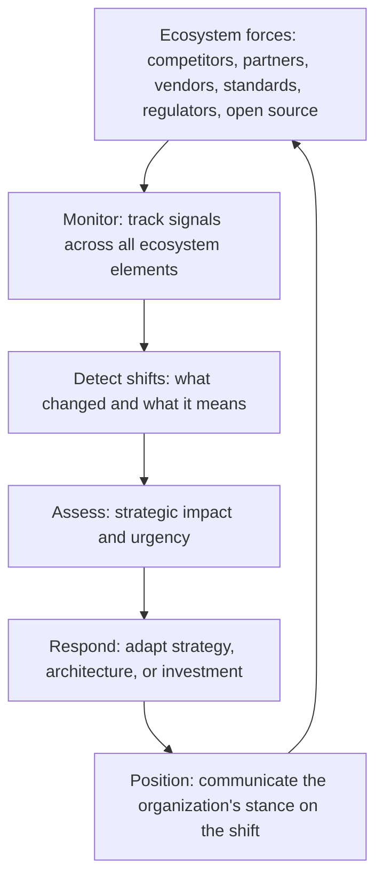

# Ecosystem and Industry Analysis

> **Core skill:** The principal engineer reads market forces beyond the organization — competitors, partners, standards bodies, regulators — building the technology ecosystem map, anticipating how ecosystem shifts drive technology strategy, and shaping open-source ecosystem strategy.

## Why This Matters

No organization builds technology in a vacuum. Every technology choice exists within an ecosystem of competitors, partners, standards, regulators, and open-source communities. A decision that looks optimal within the organization's walls can be catastrophic when the ecosystem shifts — a vendor is acquired, a standard is abandoned, a competitor open-sources your differentiator.

The principal engineer builds the ecosystem map that makes these forces visible and uses it to anticipate shifts before they become constraints. This is the external counterpart to enterprise systems thinking: just as the principal reads the internal system of capabilities and incentives, they read the external system of market forces and technology evolution.

## The Technology Ecosystem Map

The ecosystem map captures the external forces that shape technology choices. It is maintained alongside the enterprise capability map and reviewed on the same cadence.

| Ecosystem Element | What to Track | Why It Matters |
|------------------|--------------|----------------|
| **Competitors** | Their technology bets, platform choices, build-vs-buy decisions, open-source contributions | Reveals where the market is heading; identifies competitive threats and differentiation opportunities |
| **Partners** | Their technology roadmaps, API strategies, platform dependencies, integration requirements | Partnership commitments create technology dependencies; partner shifts create risk |
| **Vendors** | Product roadmaps, financial health, acquisition risk, pricing trajectory | Vendor lock-in risk; platform selection must account for vendor trajectory |
| **Standards bodies** | Emerging standards, adoption curves, competing standards, deprecation signals | Standards create ecosystems; betting on the wrong standard is expensive to unwind |
| **Open-source communities** | Project health, governance models, contributor diversity, fork risk, license changes | Open-source dependencies create both opportunity and risk |
| **Regulators** | Proposed regulations, enforcement timelines, jurisdictional scope, industry precedents | Regulation can mandate or prohibit technology choices; timeline is as important as content |

## How Ecosystem Shifts Drive Technology Strategy

Ecosystem shifts are the external forcing functions that demand strategy adaptation. The principal monitors for shifts and translates them into strategic implications.

| Ecosystem Shift | Example | Strategic Implication |
|----------------|---------|----------------------|
| **Competitor open-sources a core capability** | A competitor releases their ML platform as open source | Differentiator becomes commodity; shift investment to the next differentiation layer |
| **Key vendor acquired** | Your database vendor is acquired by a competitor | Vendor risk escalates; begin migration planning even if not yet executed |
| **Standard consolidation** | Two competing standards merge or one wins | Bet on the consolidating standard; plan migration from the losing standard |
| **Regulatory change** | New data sovereignty regulation requires in-region data processing | Architecture must support regional deployment; timeline drives investment urgency |
| **Community fork** | A critical open-source project forks; community splits | Assess which fork has momentum; plan for dual-support during transition |
| **New entrant disruption** | A new competitor enters with a radically different technology approach | Evaluate whether the approach is a threat; consider whether to adopt or counter-position |



## Competitive Technology Analysis

The principal analyzes competitor technology choices not to copy them but to understand their strategic intent and identify where the organization can differentiate.

| Analysis Dimension | Questions |
|-------------------|-----------|
| **Technology stack** | What platforms, languages, and infrastructure do they use? What do they build vs buy? |
| **Architecture signals** | What can be inferred from their public APIs, job postings, conference talks, and open-source contributions? |
| **Investment patterns** | Where are they hiring? What acquisitions have they made? What patents have they filed? |
| **Platform strategy** | Do they expose their internal platforms as products? Do they build ecosystems around their technology? |
| **Talent flow** | Where do their engineers go? Where do they hire from? What skills are they building? |

| Competitive Signal | What It Tells You |
|--------------------|-------------------|
| Job postings for skills you do not have | They are betting on a capability you lack |
| Open-source contributions to a project you depend on | They may be building influence over your dependency |
| Acquisition of a vendor you use | Your vendor relationship is about to change |
| Conference talks about architecture decisions you also face | How they solved a problem you share — useful intelligence |
| API changes that remove capabilities | They are pivoting; capabilities you integrated with may disappear |

## Open-Source Ecosystem Strategy

Open source is not a binary choice — it is an ecosystem strategy with multiple engagement models. The principal determines where the organization consumes, contributes, leads, or competes.

| Engagement Model | Description | When to Use |
|-----------------|-------------|-------------|
| **Consume** | Use open-source projects as dependencies; minimal contribution | Commodity capabilities; no strategic differentiation |
| **Contribute** | Active contribution to projects the organization depends on | Critical dependencies; shaping the roadmap benefits the organization |
| **Lead** | Create and govern an open-source project; build an ecosystem around it | Differentiating capability where ecosystem adoption creates network effects |
| **Compete** | Build proprietary alternative to an open-source project | The open-source project's direction is incompatible with the organization's needs |
| **Fork** | Maintain a divergent version of an open-source project | The project's governance or direction has become hostile; fork is temporary or permanent |

| Open-Source Risk | Mitigation |
|-----------------|------------|
| **Project abandonment** | Assess community health and contributor diversity before deep dependency; maintain the ability to fork or replace |
| **License change** | Track license changes; prefer permissive licenses for deep dependencies; have a license change response plan |
| **Governance capture** | Single-vendor projects are governance capture risks; prefer foundation-governed projects for critical dependencies |
| **Security neglect** | Monitor vulnerability disclosure patterns; assess project responsiveness to security issues |
| **Ecosystem fragmentation** | When a project forks, assess fork momentum before committing; plan for transition costs |

## Practical Applications

### Ecosystem Analysis Checklist

- [ ] An ecosystem map exists covering competitors, partners, vendors, standards, regulators, and open-source communities
- [ ] Ecosystem shifts are monitored on an ongoing basis and assessed for strategic impact
- [ ] Competitive technology analysis is conducted regularly and informs strategy, not just curiosity
- [ ] Open-source dependencies are classified by criticality and have engagement model decisions
- [ ] Vendor risk is assessed for every strategic vendor with migration planning where risk is high
- [ ] Regulatory horizon scanning is integrated into technology strategy and architecture decisions

### Ecosystem Shift Assessment Template

```markdown
# Ecosystem Shift Assessment: [Shift Name]

## What Changed
[Specific event or trend: who, what, when]

## Strategic Impact
| Affected Area | Impact (High/Medium/Low) | Rationale |
|--------------|-------------------------|-----------|

## Urgency
[Immediate / Within 6 months / Within 12 months / Monitor]

## Response Options
| Option | Cost | Risk | Strategic Fit |
|--------|------|------|--------------|

## Recommendation
[One paragraph with rationale]

## Monitoring Triggers
[What would escalate or de-escalate this shift's priority]
```

## Common Pitfalls

| Pitfall | Why It Is a Problem | Better Approach |
|---------|---------------------|-----------------|
| **Ecosystem analysis as annual exercise** | Shifts happen continuously; annual review catches them too late | Continuous monitoring with quarterly structured assessment |
| **Competitor copying** | Adopting competitor technology choices without understanding their context | Analyze competitor intent and context; decide whether to follow, ignore, or counter-position |
| **Open-source treated as free software** | No contribution, no governance engagement, no risk assessment | Classify every open-source dependency by criticality; engage proportionally |
| **Vendor risk ignored until acquisition** | By the time the vendor is acquired, migration options are limited | Assess vendor risk continuously; maintain migration plans for strategic vendors |
| **Standards bet without adoption tracking** | Bet on an emerging standard that never achieves critical mass | Track standard adoption curves; set decision triggers based on adoption milestones |

## Success Indicators

- Ecosystem shifts are identified and assessed before they become constraints on strategy
- Competitive analysis informs strategy without driving reactive copying
- Open-source dependencies have explicit engagement models appropriate to their criticality
- Vendor risk assessments are current and trigger migration planning before risk materializes
- Regulatory horizon scanning produces architecture decisions ahead of compliance deadlines

## Related Topics

- [[01_Enterprise_Systems_Thinking]]
- [[02_Systems_of_Systems_Architecture]]
- [[07_Regulatory_and_Geopolitical_Thinking]]
- [[01_Technology_Strategy/00_overview|Technology Strategy]]
- [[career-path/03_Staff_Engineer/05_Systems_Thinking_and_Organizational_Design/00_overview|Systems Thinking and Organizational Design (Staff)]]

## Summary

Ecosystem and industry analysis means reading market forces beyond the organization — competitors, partners, vendors, standards bodies, regulators, and open-source communities — building the ecosystem map that makes these forces visible, anticipating how shifts drive technology strategy, and developing an open-source engagement strategy that matches the organization's dependency on and contribution to the open-source ecosystem. The principal monitors continuously, assesses strategically, and ensures the organization is positioned for the ecosystem it inhabits, not the one it wishes existed.