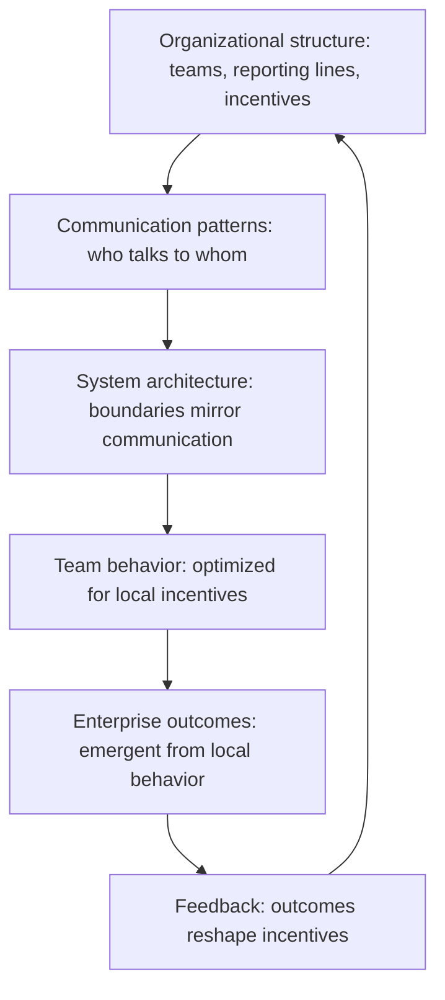

# Organizational Dynamics at Scale

> **Core skill:** The principal engineer understands how large organizations actually behave — reading incentive structures, political dynamics, and Conway effects at enterprise scale, navigating without becoming political, and designing system changes that work with organizational reality rather than against it.

## Why This Matters

Large organizations do not behave the way their org charts suggest. They behave the way their incentives, power structures, and information flows actually shape. The principal who designs for the org chart is designing for a fiction. The principal who designs for organizational dynamics designs for what will actually happen.

This is not about office politics — it is about system design at the organizational layer. The same rigor the principal applies to technical systems — understanding dependencies, failure modes, emergent behavior — applies to the organizational system. The difference is that the organizational system is made of people with goals, fears, and incentives, and it resists being re-architected by fiat.

## How Large Organizations Actually Behave

The gap between formal structure and actual behavior widens with organizational scale. The principal reads the actual behavior to understand what is really happening.

| Formal Structure Says | Actual Behavior Often Is |
|----------------------|--------------------------|
| "Teams are autonomous" | Teams are autonomous until their decisions affect someone with more political capital |
| "Decisions are data-driven" | Decisions are made by the highest-paid person's intuition, then data is gathered to support them |
| "We encourage risk-taking" | Risk-taking is celebrated when it succeeds and punished when it fails; teams learn to avoid visible risk |
| "Cross-functional collaboration is valued" | Cross-functional work is invisible in performance reviews; what gets measured is individual team output |
| "We have a flat hierarchy" | Informal power structures and access to information create hierarchy that is more powerful than the formal one |

| Observable Dynamic | What It Tells the Principal |
|--------------------|---------------------------|
| Where do escalations actually land? | The real decision-makers, regardless of org chart authority |
| What gets funded without rigorous justification? | The untouchable priorities; strategic leverage points |
| What repeatedly fails to get funded despite clear ROI? | The organizational blind spots; areas where incentives are misaligned |
| Who gets promoted and why? | The behaviors the organization actually rewards |
| Which teams grow and which shrink? | Where the organization is actually investing, regardless of stated strategy |

## Conway at Enterprise Scale

Conway's Law states that organizations design systems that mirror their communication structures. At enterprise scale, this is not a curious observation — it is a design constraint as fundamental as latency or consistency.

| Conway Effect | Enterprise Manifestation | Mitigation |
|--------------|------------------------|------------|
| **Team boundaries become system boundaries** | Each business unit builds its own version of the same capability | Shared platforms with strong governance; capability-based funding |
| **Communication cost drives coupling** | Teams that talk build integrated systems; teams that do not build isolated systems | Deliberate communication architecture: who talks to whom, about what, how often |
| **Incentive structures shape architecture** | Teams rewarded for velocity build monoliths; teams rewarded for reliability build platforms | Align incentives with the architecture you want; change incentives before demanding change |
| **Re-orgs produce re-architectures** | Every re-org triggers a wave of system redesign to match new team boundaries | Design systems with stable interfaces that survive team boundary changes |



The principal reads this loop and intervenes at the points where intervention produces the desired emergent behavior. The most powerful intervention point is incentives — change what people are rewarded for, and architecture follows.

## Incentive Structures

Incentive structures are the hidden architecture of organizational behavior. The principal maps them as carefully as they map technical dependencies.

| Incentive Type | Example | Effect on Technical Behavior |
|---------------|---------|----------------------------|
| **Performance review criteria** | "Ship features on time" | Teams favor velocity over quality, accumulate technical debt, resist platform work |
| **Budget allocation** | "Use it or lose it" annual budgets | Inefficient spending at year-end; reluctance to fund multi-year investments |
| **Promotion criteria** | "Led a high-visibility project" | Engineers prefer new projects over maintaining existing systems; platform work is invisible |
| **Headcount allocation** | Headcount tied to revenue, not capability need | Growing teams hoard headcount; shrinking teams cannot maintain their systems |
| **Recognition systems** | "Hero culture" rewards incident responders | Perverse incentive against building reliable systems; reliability work is invisible |

| Incentive Realignment | Mechanism | Effect |
|----------------------|-----------|--------|
| Platform work in performance criteria | Include platform contribution as a measured dimension in reviews | Platform teams get talent; maintenance is valued |
| Multi-year budget commitments | Allow budget to carry across fiscal years for multi-year investments | Year-end spending inefficiency eliminated; long-term investment enabled |
| Team outcomes over individual heroics | Reward system reliability, not incident response | Teams invest in reliability; incident rate drops |
| Capability-based headcount | Allocate headcount against capability maturity targets | Headcount flows to capability gaps, not to the loudest voice |

## The Principal's Political Map

The principal maintains a political map — not to play politics, but to understand what will actually happen when a decision is made. The map is private, updated continuously, and used for system design, not personal advantage.

| Political Map Element | What to Know |
|----------------------|-------------|
| **Power centers** | Who has the authority (formal and informal) to block or enable decisions? Where does power actually reside, independent of titles? |
| **Alliance structures** | Which leaders align naturally? Which are in tension? How do these alliances shape what gets built? |
| **Information asymmetry** | Who knows things others do not? Where does this create risk or opportunity? |
| **Change appetite** | Who is hungry for change and who is change-fatigued? Where is the capacity for transformation? |
| **Untouchable domains** | What systems, teams, or priorities cannot be challenged regardless of merit? |

## Navigating Without Becoming Political

The principal's credibility depends on being seen as an honest broker — system-aware but not self-interested. This requires deliberate discipline.

| Principle | Practice |
|-----------|----------|
| **Advocate for the system, not for yourself** | Every recommendation is grounded in system outcomes, never in personal advancement |
| **Make the map visible selectively** | Share system insights openly; keep the political map private |
| **Never weaponize what you know** | Use understanding of incentives to design better systems, never to undermine individuals |
| **Be wrong in public, correct in private** | Admit errors openly; never let an error stand because correcting it would be politically inconvenient |
| **Document reasoning, not just decisions** | When a decision is controversial, the written rationale is the defense — not the principal's political capital |
| **Stay in the system designer role** | When asked to take sides in a political conflict, reframe the question as a system design problem |

## Practical Applications

### Organizational Dynamics Checklist

- [ ] The actual behavior of the organization is understood — not just the formal structure
- [ ] Conway effects are consciously designed: communication structures are shaped to produce desired architectures
- [ ] Incentive structures are mapped and their effect on technical behavior is understood
- [ ] Incentive realignments are proposed alongside architectural changes, not as afterthoughts
- [ ] The political map is maintained as a private diagnostic tool, not a manipulation tool
- [ ] The principal is consistently seen as an honest broker who advocates for system outcomes

### Incentive Alignment Assessment Template

```markdown
# Incentive Alignment Assessment: [Architecture or System Change]

## Desired Behavior
[What we need teams to do differently]

## Current Incentives
| Team/Function | What They Are Rewarded For | Does This Align With Desired Behavior? |
|--------------|---------------------------|---------------------------------------|

## Incentive Conflicts
| Conflict | Effect | Resolution |
|----------|--------|------------|

## Recommended Incentive Changes
| Change | Mechanism | Expected Effect | Timeline |
|--------|----------|-----------------|----------|
```

## Common Pitfalls

| Pitfall | Why It Is a Problem | Better Approach |
|---------|---------------------|-----------------|
| **Designing for the org chart** | The formal structure is a poor predictor of actual behavior at scale | Design for incentive structures, communication patterns, and power dynamics |
| **Ignoring Conway effects** | Architecture and organization evolve in tension; ignoring it produces constant friction | Co-design organization and architecture; use Conway deliberately |
| **Incentive change as afterthought** | Demanding new behavior without changing what people are rewarded for | Align incentives before or alongside the behavior change |
| **Playing politics** | The principal who is seen as political loses credibility as an honest broker | Use political understanding for system design; never for personal maneuvering |
| **Assuming rational actors** | People respond to incentives as they experience them, not as they are documented | Observe actual behavior; incentives are what gets rewarded, not what policy says |
| **One-size incentive design** | Different teams need different incentive structures to produce the desired system behavior | Tailor incentives to the behavior each team needs to exhibit |

## Success Indicators

- Architecture decisions account for Conway effects: team boundaries and system boundaries are deliberately aligned
- Incentive realignments precede or accompany major technical changes
- The principal is trusted as an honest broker by leaders across the organization
- Organizational friction is diagnosed as system design issues rather than personality conflicts
- System changes persist because they align with incentives, not because they are enforced

## Related Topics

- [[01_Enterprise_Systems_Thinking]]
- [[05_Long_Term_Consequence_Analysis]]
- [[03_Decision_Governance_and_Principles/00_overview|Decision Governance and Principles]]
- [[04_Organizational_Influence/00_overview|Organizational Influence]]
- [[career-path/03_Staff_Engineer/05_Systems_Thinking_and_Organizational_Design/00_overview|Systems Thinking and Organizational Design (Staff)]]

## Summary

Organizational dynamics at scale means understanding how large organizations actually behave — reading incentive structures, political dynamics, and Conway effects, maintaining a private political map for system design, navigating without becoming political, and designing technical and organizational changes that work with the real incentive landscape rather than the formal org chart. The principal is the honest broker who understands the system deeply enough to change it without being consumed by it.