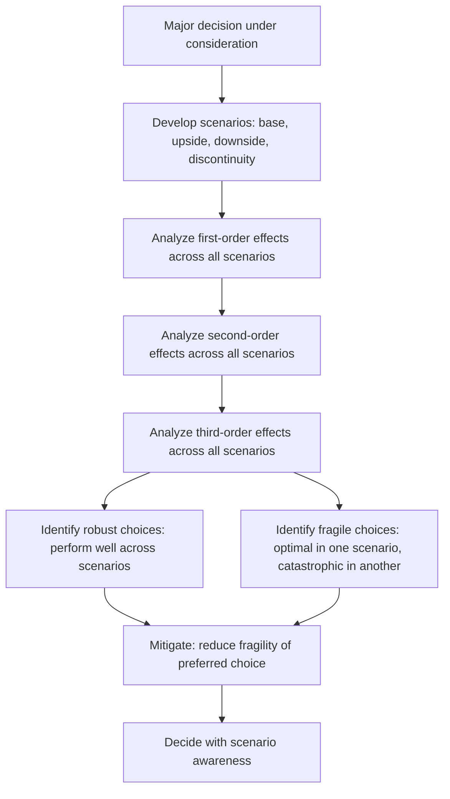

# Long Term Consequence Analysis

> **Core skill:** The principal engineer projects the 3-5 year effects of major decisions — conducting scenario planning, analyzing second and third order effects, recognizing when local optimization becomes global dysfunction, and running the pre-mortem at enterprise scale.

## Why This Matters

Most decisions are made on first-order effects: what happens immediately and directly. The decisions that define enterprises — platform choices, architecture commitments, organizational designs — play out over years, and their most important consequences are not the ones visible at the time of the decision. The second-order effect of a platform migration is not the migration itself; it is the organizational capability built or lost, the ecosystem position gained or surrendered, the talent attracted or repelled.

The principal engineer projects these consequences before the decision is made. This is the hardest thinking the principal does — not because the analysis is complex, but because the organization resists hearing that its preferred choice has consequences nobody wants to own.

## First, Second, and Third Order Effects

Every decision produces effects at multiple orders. Most organizations stop at the first.

| Order | Definition | Example: Adopting a New Database |
|-------|-----------|----------------------------------|
| **First order** | Immediate, direct consequence | Teams must learn the new database; initial migration cost incurred |
| **Second order** | Consequence of the first-order effect, one step removed | Hiring pipeline shifts to the new database skill; existing database expertise atrophies; vendor relationship deepens |
| **Third order** | Systemic consequence, multiple steps removed | Organization becomes dependent on vendor roadmap; database choice shapes which problems are easy and which are hard; architecture evolves around database capabilities |

| Analysis Question | First Order | Second Order | Third Order |
|------------------|------------|-------------|-------------|
| What changes? | Direct output of the decision | How people, processes, and adjacent systems adapt to the first-order change | How the system's long-term behavior shifts |
| Who is affected? | Immediate stakeholders | Adjacent teams, partners, customers | The organization's future options, ecosystem position, talent strategy |
| When does it manifest? | Immediately to months | Months to 2 years | 2-5+ years |
| Is it reversible? | Often yes, with cost | Sometimes, with significant cost | Rarely; third-order effects become the new baseline |

## Scenario Planning

Scenario planning is the discipline of exploring multiple plausible futures and testing decisions against each. The principal uses it to ensure decisions are robust across futures, not just optimal for the most likely one.

| Scenario Type | Description | Example |
|--------------|-------------|---------|
| **Base case** | The most likely future given current trends | Market grows at projected rate; technology evolves along current trajectory |
| **Upside** | A future more favorable than expected | Market grows faster; competitor stumbles; technology breakthrough accelerates capability |
| **Downside** | A future less favorable than expected | Market contracts; key vendor fails; regulation imposes new constraints |
| **Discontinuity** | A future where a fundamental assumption breaks | A new entrant rewrites the competitive landscape; a technology shift makes current platforms obsolete |



## When Local Optimization Becomes Global Dysfunction

The principal's unique vantage point reveals when individually rational decisions produce collectively irrational outcomes. This is the most common failure mode at scale.

| Local Optimization | Global Dysfunction | How the Principal Sees It |
|-------------------|-------------------|--------------------------|
| Each team chooses its own database | No shared data layer; cross-team data integration is manual and fragile | The capability dependency map reveals data fragmentation as a systemic risk |
| Each team builds its own authentication | Users have multiple identities; security surface area explodes; compliance is impossible to prove | The enterprise architecture view reveals duplicated capability with systemic cost |
| Each business unit optimizes its own P&L | Shared platform investment is starved; each BU free-rides while platform decays | The investment allocation across horizons shows Transform consistently underfunded |
| Each team defers technical debt for velocity | Aggregate technical debt reaches a threshold where any change requires massive coordination | The coupling metrics and migration cost curves show the approaching wall |

| Detection Pattern | What to Look For |
|------------------|-----------------|
| **Same capability built N times** | Multiple teams solving the same problem with different approaches |
| **Integration cost growing faster than feature velocity** | Each new feature requires changes across more systems |
| **Platform investment consistently deferred** | Run allocation grows; Transform allocation shrinks; nobody funds the platform |
| **Escalations increasingly about coordination, not technology** | Problems are not technical failures but failures of alignment across teams |
| **Decision latency increasing** | Decisions that used to take days now take weeks because more stakeholders must be consulted |

## The Pre-Mortem at Enterprise Scale

The pre-mortem is a structured exercise: assume the decision failed and work backward to identify why. At enterprise scale, the pre-mortem includes organizational, ecosystem, and second-order failure modes.

| Pre-Mortem Step | Activity |
|----------------|-----------|
| **Set the scene** | "It is 3 years from now. The decision we made has failed. We are in a worse position than if we had done nothing." |
| **Generate failure causes** | Each participant independently writes reasons for the failure: technical, organizational, market, regulatory |
| **Cluster and prioritize** | Group similar causes; identify the most consequential and the most likely |
| **Map to decision** | For each failure cause, ask: what in the current decision creates the conditions for this failure? |
| **Design mitigations** | For the highest-priority failure causes, design mitigations that change the decision or add safeguards |
| **Document assumptions** | Record the assumptions that must hold for the mitigations to work; these become the assumption tracker |

| Pre-Mortem Failure Domain | Example Failure Narratives |
|--------------------------|---------------------------|
| **Technical** | "The platform never achieved the performance targets we assumed"; "Integration complexity was 3x our estimate" |
| **Organizational** | "The team that championed this left; nobody remaining understood the architecture"; "Adoption stalled at 30% because teams had no incentive to migrate" |
| **Market** | "The vendor we bet on was acquired and the product was end-of-lifed"; "A competitor open-sourced an equivalent capability" |
| **Regulatory** | "New regulation made our architecture choice non-compliant"; "Data sovereignty requirements forced a regional redeployment we had not planned for" |

## Practical Applications

### Consequence Analysis Checklist

- [ ] Major decisions include documented first, second, and third order effect analysis
- [ ] Scenario planning is conducted for enterprise-defining decisions: base, upside, downside, discontinuity
- [ ] Local optimization patterns that produce global dysfunction are identified and escalated
- [ ] The pre-mortem is a standard part of the decision process for irreversible bets
- [ ] Key assumptions that underpin major decisions are documented and tracked
- [ ] The assumption tracker is reviewed at every strategy review cycle

### Pre-Mortem Template

```markdown
# Pre-Mortem: [Decision Name]

## Failure Scenario
[One paragraph: the future state where this decision failed]

## Failure Causes
| Cause | Domain (Technical/Organizational/Market/Regulatory) | Likelihood | Consequence |
|-------|-----------------------------------------------------|-----------|-------------|

## Critical Assumptions
| Assumption | If False, What Happens | Monitoring Signal |
|-----------|----------------------|-------------------|

## Mitigations
| Failure Cause | Mitigation | Owner | Timeline |
|--------------|------------|-------|----------|

## Decision Modification
[What changes to the decision does this pre-mortem suggest]
```

## Common Pitfalls

| Pitfall | Why It Is a Problem | Better Approach |
|---------|---------------------|-----------------|
| **Stopping at first-order effects** | The decision looks good on immediate outcomes; long-term consequences are invisible | Require second and third order analysis for every enterprise-defining decision |
| **Scenario planning as a single-future exercise** | "Most likely" scenario becomes the only scenario; decision is fragile to other futures | Test every major decision against at least four scenarios including a discontinuity |
| **Local optimization invisible from the top** | Executives see aggregate metrics; the systemic cost of local optimization is hidden in integration friction | Use the enterprise capability map and coupling metrics to surface systemic dysfunction |
| **Pre-mortem as a checkbox exercise** | The pre-mortem is conducted but its findings do not change the decision | Require documented decision modifications based on pre-mortem findings |
| **Assumptions stated, never tracked** | Assumptions that break silently invalidate decisions without anyone noticing | Maintain an assumption tracker reviewed at every strategy cycle |

## Success Indicators

- Enterprise-defining decisions include documented second and third order effect analysis
- Scenario planning reveals fragility in time to modify the decision, not after commitment
- Systemic dysfunction from local optimization is identified and addressed before it becomes a crisis
- Pre-mortem findings produce visible modifications to major decisions
- The assumption tracker is a living artifact that triggers course corrections when assumptions break

## Related Topics

- [[01_Enterprise_Systems_Thinking]]
- [[04_Organizational_Dynamics_at_Scale]]
- [[06_Strategic_Technology_Decisions]]
- [[01_Technology_Strategy/04_Multi_Year_Technology_Roadmapping|Multi-Year Technology Roadmapping]]
- [[career-path/03_Staff_Engineer/05_Systems_Thinking_and_Organizational_Design/00_overview|Systems Thinking and Organizational Design (Staff)]]

## Summary

Long term consequence analysis means projecting the 3-5 year effects of major decisions through first, second, and third order analysis, conducting scenario planning that tests robustness across multiple futures, recognizing when individually rational local choices produce collectively irrational global outcomes, and running the pre-mortem at enterprise scale that identifies failure modes in time to change the decision. The principal's unique contribution is seeing consequences nobody else has the scope to see and acting on them before they become the next crisis.