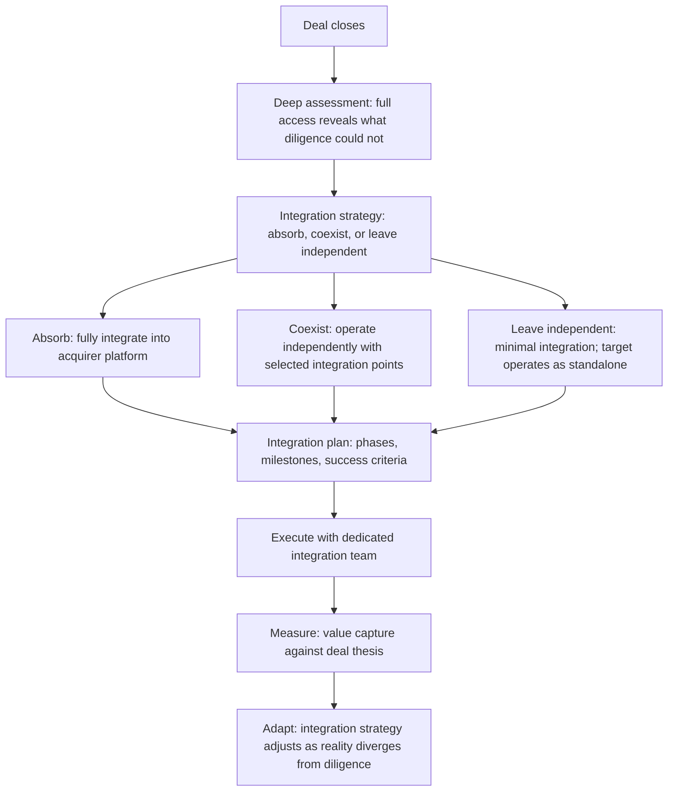

# Technical Due Diligence

> **Core skill:** The principal engineer leads technical evaluation of companies, platforms, and capabilities for mergers and acquisitions — applying a structured due diligence framework, assessing technical risk, and developing post-acquisition integration technical strategy.

## Why This Matters

Acquisitions are decided on financials, strategy, and market position — and they fail on technology. The gap between the deal thesis and the technical reality is where acquisition value is destroyed: systems that cannot integrate, architectures that cannot scale, teams that cannot be retained, technical debt that makes the acquired capability a liability rather than an asset.

The principal engineer leads technical due diligence to close this gap. The output is not a technology audit — it is a risk assessment that shapes the deal terms, the integration plan, and the go/no-go recommendation that the board acts on.

## The Due Diligence Framework

Technical due diligence is structured, repeatable, and independent of the deal thesis. The principal applies the same framework regardless of whether the target is a startup, a platform, or a team.

| Due Diligence Dimension | Key Questions | Data Sources |
|------------------------|---------------|-------------|
| **Architecture** | How is the system architected? Is it modular or monolithic? Does it use modern patterns? What is the technical debt burden? | Architecture documentation, code review, interviews with senior engineers |
| **Code and quality** | What is the codebase size, language mix, test coverage, and quality? Are there critical bugs or security vulnerabilities? | Static analysis, repository access, build pipeline review |
| **Infrastructure and operations** | How is the system deployed, monitored, and operated? What is the reliability track record? What is the infrastructure cost? | Incident history, monitoring dashboards, infrastructure bills, runbooks |
| **Data** | What data does the system hold? How is it structured, governed, and secured? Is there PII or regulated data? | Data schemas, data flow diagrams, compliance certifications |
| **Team** | Who built it? What is their expertise? Will they stay? What is the key-person risk? | Team interviews, retention analysis, organizational structure |
| **IP and dependencies** | What is proprietary vs open-source? What are the critical third-party dependencies and their license terms? | Dependency manifests, license audits, IP assignment records |
| **Security and compliance** | What is the security posture? Are there outstanding vulnerabilities, breaches, or compliance gaps? | Penetration test results, compliance certifications, security incident history |
| **Scalability and limits** | Can the system scale to the acquiring organization's needs? What are the known limits? | Load test results, capacity planning documents, architecture constraints |

## Technical Risk Assessment

Every due diligence finding is translated into a risk that the deal team can evaluate. The principal assesses probability, impact, and mitigation cost.

| Risk Category | Example Finding | Risk Assessment |
|--------------|----------------|-----------------|
| **Integration risk** | Target architecture is incompatible with acquirer's platform; integration will require significant rework | Probability: High. Impact: 12-24 month integration delay. Mitigation cost: $X million. |
| **Key-person risk** | Target system was built by two engineers; neither has signed a retention agreement | Probability: Medium. Impact: System becomes unmaintainable within 6 months. Mitigation: Retention packages; knowledge transfer plan. |
| **Technical debt risk** | Codebase has no tests, no CI/CD, and accumulated 4 years of unmanaged debt | Probability: High (debt is certain). Impact: Velocity will drop; any feature work requires debt reduction first. Mitigation cost: $X million and 12 months. |
| **License and IP risk** | Critical dependency uses a copyleft license incompatible with acquirer's licensing model | Probability: Low (replacement exists). Impact: Legal exposure if not addressed. Mitigation: Replace dependency; legal review. |
| **Security risk** | Penetration test found critical vulnerabilities; target has no security team | Probability: Medium (exploitation). Impact: Breach could expose acquirer to liability. Mitigation: Remediation before close or price adjustment. |
| **Scalability risk** | System architected for 1000 users; acquirer needs 1M users | Probability: Certain. Impact: Rewrite or major rearchitecture required. Mitigation cost: $X million; factor into deal price. |

## The Due Diligence Report

The principal produces a report that the board and deal team can act on. It is concise, risk-focused, and decisive.

```markdown
# Technical Due Diligence Report: [Target Name]

## Executive Summary
[One paragraph: overall technical assessment and recommendation]

## Architecture Summary
[One paragraph: what the system is, how it is built, key architectural characteristics]

## Risk Assessment
| Risk | Probability | Impact | Mitigation Cost | Mitigation Timeline |
|------|------------|--------|-----------------|---------------------|

## Integration Assessment
| Integration Area | Compatibility | Effort | Risk |
|-----------------|--------------|--------|------|

## Team Assessment
| Role | Key Person? | Retention Risk | Recommendation |
|------|-----------|---------------|----------------|

## Financial Impact
| Cost Category | Estimate | Timeline |
|--------------|---------|----------|
| Integration | | |
| Remediation | | |
| Platform adaptation | | |
| Retention | | |

## Recommendation
[Go / Go with conditions / No-go]

## Conditions (if Go with conditions)
1. [Condition]: [Rationale and timeline]
2. [Condition]: [Rationale and timeline]
```

## Post-Acquisition Integration Technical Strategy

Due diligence is the input; integration is the execution. The principal develops the technical integration strategy that protects the acquired value while merging it into the acquiring organization.



| Integration Model | When to Use | Risk |
|------------------|-------------|------|
| **Absorb** | The acquired capability must be deeply integrated into the acquirer's platform; the target's independent identity is not valuable | Highest integration cost and risk; culture clash; talent attrition |
| **Coexist** | The acquired capability benefits from independence but needs selected integration points (identity, data, APIs) | Medium integration cost; risk of indefinite coexistence without full value capture |
| **Leave independent** | The acquisition is a portfolio play; the target's independent brand, culture, and technology are the source of value | Lowest integration cost; risk of no synergy capture; deal thesis may be unrealized |

## Practical Applications

### Due Diligence Checklist

- [ ] A standard due diligence framework exists covering architecture, code, infrastructure, data, team, IP, security, and scalability
- [ ] Every finding is translated into a risk with probability, impact, and mitigation cost
- [ ] The due diligence report includes a clear recommendation: go, go with conditions, or no-go
- [ ] Conditions attached to a go recommendation are specific, actionable, and timed
- [ ] Post-acquisition integration strategy is developed before the deal closes, not after
- [ ] Integration model (absorb, coexist, independent) is chosen deliberately and documented

### Technical Diligence Request Template

```markdown
# Technical Due Diligence Request

## Target
[Company name, product, or capability being evaluated]

## Deal Thesis
[Why the organization is considering this acquisition: what value it expects]

## Key Technical Questions
1. [Question one]
2. [Question two]

## Constraints
- Access: [What technical access is available: code, team, documentation]
- Timeline: [When the assessment is needed]
- Budget: [Resources available for the diligence effort]

## Known Risks
[Any technical risks already identified]
```

## Common Pitfalls

| Pitfall | Why It Is a Problem | Better Approach |
|---------|---------------------|-----------------|
| **Due diligence after the deal** | Technical risks discovered post-close are expensive and may have been deal-breakers | Pre-close technical due diligence as a standard, non-negotiable process |
| **Diligence as a technology audit** | Lists technology characteristics without translating them into business risk | Every finding becomes a risk with probability, impact, and mitigation cost |
| **Integration strategy designed after close** | Integration decisions made under pressure without diligence data; value leaks | Develop integration strategy during diligence; refine with deep access after close |
| **Key-person risk underestimated** | The system is the people who built it; they leave and the capability is lost | Retention analysis with named individuals; retention agreements as conditions of close |
| **Technical debt treated as a footnote** | Debt is acknowledged but not priced into the deal or the integration plan | Quantify debt remediation cost; factor into deal price or integration budget |
| **Recommendation hedged to avoid conflict** | "Go with conditions" when the conditions are unachievable; nobody wants to kill the deal | Make the recommendation clear and defensible; the board needs an honest technical assessment |

## Success Indicators

- Technical due diligence findings change deal terms, conditions, or go/no-go decisions
- Post-acquisition integration plans are developed during diligence and executed after close
- Integration surprises are rare and, when they occur, are within the risk ranges identified during diligence
- Key-person retention agreements are in place before close for all identified critical individuals
- The deal thesis is validated or challenged by the technical assessment before the board commits

## Related Topics

- [[01_Enterprise_Systems_Thinking]]
- [[02_Systems_of_Systems_Architecture]]
- [[06_Strategic_Technology_Decisions]]
- [[01_Technology_Strategy/03_Investment_Strategy_and_Capital_Allocation|Investment Strategy and Capital Allocation]]
- [[career-path/03_Staff_Engineer/05_Systems_Thinking_and_Organizational_Design/00_overview|Systems Thinking and Organizational Design (Staff)]]

## Summary

Technical due diligence means leading the technical evaluation of companies, platforms, and capabilities for mergers and acquisitions — applying a structured framework across architecture, code, infrastructure, data, team, IP, security, and scalability, translating every finding into a risk with probability, impact, and mitigation cost, producing a report with a clear recommendation the board can act on, and developing post-acquisition integration strategy before the deal closes. The principal ensures the deal thesis survives contact with technical reality.