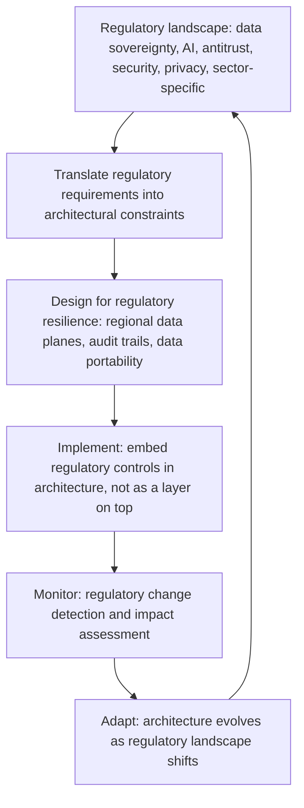

# Regulatory and Geopolitical Thinking

> **Core skill:** The principal engineer understands how regulation and geopolitics shape technology architecture — designing for data sovereignty, AI regulation, antitrust, and security frameworks, assessing geopolitical technology risk, and building regulatory resilience into systems from inception.

## Why This Matters

Technology architecture is increasingly shaped by forces outside the organization: data sovereignty laws that mandate where data can reside, AI regulations that constrain what models can do, antitrust actions that limit how platforms can integrate, security frameworks that dictate how systems must be protected. Architecture designed without these forces is architecture designed for a world that no longer exists.

The principal engineer treats regulation as an architecture driver — not a compliance checklist applied after the design is complete. This is the difference between systems that absorb regulatory change and systems that are broken by it. In a world where the regulatory landscape shifts every year, regulatory resilience is a competitive advantage.

## Regulation as Architecture Driver

Regulation is not an external constraint to be satisfied after the system is built. It is a set of architectural requirements that shape the system's fundamental design.

| Regulatory Domain | Architectural Implication | Design Response |
|------------------|--------------------------|-----------------|
| **Data sovereignty** | Data must reside, be processed, and be accessed within specific jurisdictions | Regional data planes; data residency controls; cross-border data transfer gates |
| **AI regulation** | AI systems must be explainable, fair, auditable, and subject to human oversight | Model cards; audit trails; fairness monitoring; human-in-the-loop architecture |
| **Antitrust** | Platforms cannot self-preference or bundle in ways that exclude competitors | API-first design; data portability; interoperable interfaces; fair access controls |
| **Security frameworks** | Systems must meet specific security standards with auditable evidence | Security controls as code; continuous compliance monitoring; evidence collection automation |
| **Privacy regulation** | Personal data must be minimized, purpose-limited, and deletable on request | Data minimization architecture; purpose-based access controls; automated deletion pipelines |
| **Sector-specific regulation** | Financial services, healthcare, defense: each imposes unique technical requirements | Domain-specific architecture patterns; regulatory specialist review at design stage |

## Data Sovereignty and Regional Architecture

Data sovereignty is the most architecturally consequential regulatory domain. It forces regional deployment, data isolation, and cross-border controls that fundamentally shape system architecture.

| Data Sovereignty Requirement | Architectural Pattern | Implementation |
|-----------------------------|---------------------|----------------|
| Data must reside in-region | Regional data planes with local storage and processing | Deploy in region; data never leaves regional boundary |
| Cross-border transfer restricted | Data transfer gates with legal basis validation | Transfer API with legal basis check; audit log of all transfers |
| Access from outside the region controlled | Regional access controls; geo-fenced API endpoints | Identity-aware proxy; region-scoped access policies |
| Right to deletion enforceable across regions | Global deletion orchestration with regional execution | Deletion API propagates to all regional data planes; verification step |
| Data processing must be in-region | Regional compute; no cross-region processing pipelines | Compute deployed alongside data; processing jobs execute in region |



## Geopolitical Technology Risk

Geopolitical risk is the newest and least mature dimension of technology strategy. The principal assesses how geopolitical tension affects technology supply chains, vendor relationships, and operational continuity.

| Geopolitical Risk | Technology Impact | Mitigation Strategy |
|------------------|-------------------|---------------------|
| **Technology export controls** | Cannot use certain hardware, software, or cloud services in specific regions | Multi-vendor architecture; regional technology stacks; export control compliance program |
| **Vendor national security restrictions** | Critical vendor is restricted or blocked in operating regions | Vendor diversification; no single-country dependency for critical infrastructure |
| **Data access by foreign governments** | Data hosted in a jurisdiction is subject to that government's access laws | Data classification by sensitivity; jurisdiction selection based on legal exposure |
| **Supply chain disruption** | Critical hardware or software supply chain disrupted by geopolitical events | Supply chain mapping; multi-source strategy; strategic inventory for critical components |
| **Sanctions and trade restrictions** | Cannot transact with entities in sanctioned jurisdictions | Sanctions screening; entity verification; jurisdiction-based access controls |
| **Internet fragmentation** | The global internet fragments into regional networks with different rules | Multi-region architecture that does not assume a single global network |

## Designing for Regulatory Resilience

Regulatory resilience is the ability of a system to absorb regulatory change without architectural redesign. The principal designs for it from inception.

| Resilience Principle | Description | Architectural Implementation |
|---------------------|-------------|---------------------------|
| **Jurisdiction isolation** | Each jurisdiction's data and processing is isolated so regulatory changes in one jurisdiction do not force global redesign | Regional data planes; jurisdiction-scoped services; no global data sharing by default |
| **Policy as code** | Regulatory rules are encoded as executable policies, not documented procedures | Policy engine; automated enforcement; audit trail for every policy decision |
| **Data minimization by design** | Only collect and retain data necessary for operation; less data means less regulatory surface area | Purpose-based data collection; automated retention enforcement; deletion by default |
| **Auditability as architecture** | Every action that affects regulated data or processes is recorded and retrievable | Immutable audit logs; cryptographic integrity; standard audit query interface |
| **Interoperability as compliance** | Systems designed for data portability and interoperability meet antitrust and data access requirements naturally | Standard APIs; documented data formats; data export capabilities |

## The Regulatory Horizon Scan

The principal maintains a regulatory horizon scan — a forward-looking assessment of regulatory changes that will affect technology architecture before those changes become compliance deadlines.

| Horizon Scan Element | Activity |
|---------------------|----------|
| **Proposed regulation tracking** | Monitor proposed regulations in every operating jurisdiction; assess technology impact |
| **Industry precedent analysis** | Track how regulators have acted against peers; identify patterns that signal future enforcement |
| **Standards body engagement** | Participate in standards development that will become regulatory requirements |
| **Regulatory scenario planning** | Develop scenarios: what if regulation X passes in form Y? What changes to architecture would be required? |
| **Compliance timeline mapping** | For each significant regulatory change, map the timeline: proposal, enactment, enforcement, and the architecture changes needed at each stage |

## Practical Applications

### Regulatory Resilience Checklist

- [ ] Regulatory requirements are treated as architecture drivers, not post-design compliance checklists
- [ ] Data sovereignty architecture includes regional data planes with jurisdiction isolation
- [ ] Geopolitical technology risk is assessed for critical vendors, supply chains, and operating regions
- [ ] Policy-as-code patterns are used for regulatory rule enforcement with audit trails
- [ ] A regulatory horizon scan is maintained and reviewed quarterly
- [ ] Regulatory resilience principles are embedded in architecture standards and design reviews
- [ ] Data minimization and auditability are default architectural properties, not add-ons

### Regulatory Impact Assessment Template

```markdown
# Regulatory Impact Assessment: [Regulation Name]

## Regulation Summary
[Jurisdiction, scope, key requirements, timeline: proposed, enacted, enforcement]

## Technology Impact
| System/Component | Impact (High/Medium/Low) | Required Change | Timeline |
|-----------------|-------------------------|-----------------|----------|

## Architecture Implications
[How the regulation changes architecture requirements: data, processing, access, audit]

## Compliance Approach
[How the organization will comply: architecture changes, process changes, both]

## Risk Assessment
| Risk | Likelihood | Impact | Mitigation |
|------|-----------|--------|------------|

## Cost Estimate
| Change | Investment Required | Timeline |
|--------|-------------------|----------|

## Recommendation
[One paragraph with rationale]
```

## Common Pitfalls

| Pitfall | Why It Is a Problem | Better Approach |
|---------|---------------------|-----------------|
| **Regulation as afterthought** | Architecture designed then retrofitted for compliance; retrofit is more expensive and less effective | Treat regulation as an architecture driver from inception; embed in design reviews |
| **Compliance as a single-jurisdiction exercise** | Architecture designed for one jurisdiction fails when the organization expands or regulation changes | Design for jurisdiction isolation; assume multi-jurisdiction operation from the start |
| **Geopolitical risk ignored until crisis** | Vendor blocked, supply chain disrupted, sanctions imposed — all were foreseeable | Maintain a geopolitical risk assessment for critical dependencies; diversify before the crisis |
| **Policy as documentation** | Regulatory rules exist in policy documents nobody reads; enforcement is manual and inconsistent | Implement policy as code; automated enforcement ensures rules are followed consistently |
| **Data hoarding** | Organizations collect and retain data "just in case"; every byte is regulatory surface area | Data minimization by design; automated retention and deletion; collect only what is needed |
| **Regulatory horizon scan as annual exercise** | Misses regulatory changes that arrive between scans | Continuous monitoring with quarterly structured assessment and impact analysis |

## Success Indicators

- Regulatory changes are absorbed through configuration changes, not architectural redesigns
- Data sovereignty requirements are met with regional architecture deployed before enforcement deadlines
- Geopolitical risk assessments drive vendor diversification before crises force it
- Policy-as-code enforcement produces audit trails that satisfy regulators without manual effort
- The regulatory horizon scan identifies architecture-impacting changes with enough lead time to respond

## Related Topics

- [[01_Enterprise_Systems_Thinking]]
- [[02_Systems_of_Systems_Architecture]]
- [[03_Ecosystem_and_Industry_Analysis]]
- [[01_Technology_Strategy/00_overview|Technology Strategy]]
- [[career-path/03_Staff_Engineer/05_Systems_Thinking_and_Organizational_Design/00_overview|Systems Thinking and Organizational Design (Staff)]]

## Summary

Regulatory and geopolitical thinking means treating regulation as an architecture driver — designing for data sovereignty, AI regulation, antitrust, and security frameworks from inception, assessing geopolitical technology risk for critical dependencies and operating regions, building regulatory resilience through jurisdiction isolation, policy as code, and data minimization, and maintaining a regulatory horizon scan that identifies architecture-impacting changes before they become compliance deadlines. The principal ensures the organization's technology architecture is designed for the regulatory world it will inhabit, not the one it wishes existed.