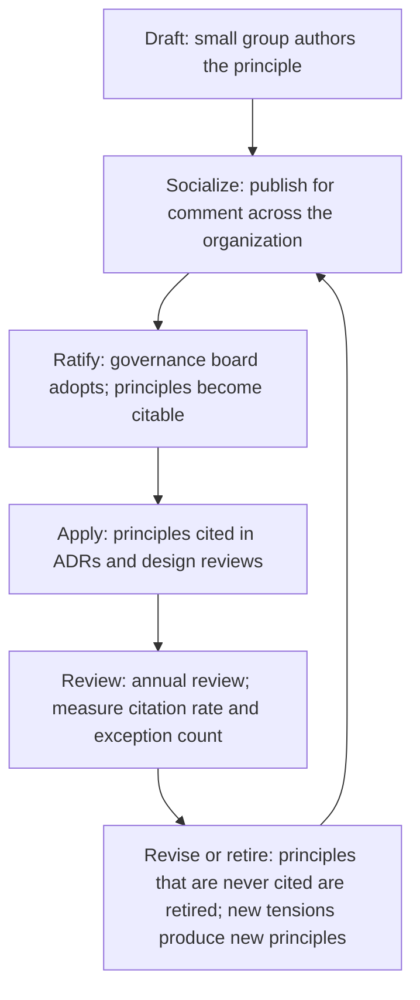

# Technical Principles

> **Core skill:** The principal writes technical principles that are specific enough to decline work by and abstract enough to guide decisions the principal never sees — a set of 5 to 12 statements that make the right thing the default thing across hundreds of engineers.

## Why This Matters

At 500+ engineers, the principal cannot review every design. The mechanism that replaces direct oversight is a set of technical principles — published, socialized, and ratified — that make decisions reviewable by their own logic. A well-written principle is a design constraint that travels: every engineer who internalizes "we prefer boring technology for non-differentiating problems" makes twenty decisions consistent with the organization's architecture without ever asking for review.

Principles fail in two directions. Platitudes — "move fast," "be excellent" — offer no trade-off guidance; nobody can decline a proposal by citing them. Overly specific rules — "use Go for all services" — break the moment the context changes and teach teams to route around governance entirely. The principal's craft is the gap between these extremes: principles that name the trade-off, survive context shifts, and earn citation in ADRs across the organization.

## What Principles Are — and Are Not

Principles occupy a distinct category between rules and goals. Confusing the categories is the most common governance mistake at principal scale.

| Category | Definition | Example | Enforcement |
|----------|------------|---------|-------------|
| **Principle** | A trade-off preference that guides decisions | "We optimize for operability over development speed when they conflict" | Cited in decisions; deviations documented |
| **Rule** | A mandatory constraint | "All services must expose health checks" | Automated enforcement; violations are bugs |
| **Standard** | A default choice with agreed scope | "Postgres is the default relational database" | Exceptions require documented rationale |
| **Goal** | A desired outcome | "Reduce p99 latency by 30 percent" | Measured; doesn't constrain design choices |

Principles guide the space rules cannot reach: the novel decisions, the ambiguous trade-offs, the choices between two defensible paths. Rules automate the known. Principles educate the unknown.

## Writing Principles That Work

A principle worth writing must pass two tests: it is specific enough that a team can decline a proposal by citing it, and it is abstract enough to apply across products and platforms the principal cannot anticipate.

### The Specificity Test

| Weak Principle | Strong Principle | Why the Strong One Works |
|---------------|------------------|-------------------------|
| "We value simplicity" | "We choose the simplest system that meets the current requirements, not the one that anticipates unconfirmed future needs" | Names the trade-off: current needs vs future anticipation |
| "We are cloud-native" | "We run on managed cloud services for non-differentiating infrastructure; we build our own only when the managed option lacks a required capability and building is cheaper than the capability gap" | Names the threshold for exception |
| "We care about security" | "Security controls must be deployable by the team that owns the service, not gated by a central team, and must fail open to operation during incidents" | Names the ownership model and the incident trade-off |

### The Abstraction Test

A principle that names a specific technology — "use Kubernetes" or "use React" — is a standard, not a principle. It ages poorly and invites routing-around. The principle underneath it is: "We prefer technologies with large active communities and proven operational tooling over bespoke or niche alternatives, all else equal." That principle survives Kubernetes giving way to something else.

### Principle Structure

Every principle follows the same three-part structure:

| Component | Purpose | Example |
|-----------|---------|---------|
| **Statement** | The trade-off preference in one sentence | "We optimize for operability over development speed when they conflict" |
| **Rationale** | Why this trade-off serves the organization's strategy | "Operability is the compounding cost; development speed is the one-time cost. A system that takes two weeks longer to build but requires zero pages at 3 AM is cheaper over its lifetime" |
| **Application guidance** | How to apply it in practice, including the test for an exception | "Ask: will this design page an on-call engineer at scale? If yes, the design is not complete. Exceptions require a documented operability plan signed by the team's manager" |

## Principle Set Size and Composition

The set must be small enough to be remembered and applied without looking it up. Five to twelve principles is the working range. Fewer than five means the principles are too abstract to guide; more than twelve means they are rules disguised as principles, or they duplicate each other.

| Set Size | Character | Risk |
|----------|-----------|------|
| 5-7 | Focused, memorable | May leave gaps in ambiguous domains |
| 8-10 | Comprehensive, still wieldy | Some principles may rarely be cited |
| 11-12 | Exhaustive | Cognitive load; some will be rules in disguise |
| 13+ | A rulebook, not principles | Nobody remembers them; nobody cites them |

The composition should cover the organization's recurring tensions: build vs buy, consistency vs autonomy, speed vs safety, innovation vs stability, platform vs product. Every principle should map to at least one tension the organization actually feels. A principle that never gets cited in a year is either undiscoverable or irrelevant — cut it.

## The Principle Lifecycle

Principles are not written once and carved in stone. They have a lifecycle that mirrors the organization's evolution.



Each phase has a distinct artifact and audience:

| Phase | Artifact | Audience | Duration |
|-------|----------|----------|----------|
| Draft | Working document with rationale and examples | 3-5 authors including the principal | 2-4 weeks |
| Socialize | Published draft with comment mechanism | All senior engineers; architecture community | 2-4 weeks |
| Ratify | Final version with adoption date | Governance board or CTO | One meeting |
| Apply | Published principles page; linked from ADR templates | Entire engineering organization | Ongoing |
| Review | Citation metrics, exception register analysis | Principal and governance board | Annual |

## Principles Anti-Patterns

| Anti-Pattern | What It Looks Like | Why It Fails | Fix |
|-------------|-------------------|--------------|-----|
| **The aspirational poster** | "We are innovative, collaborative, and customer-obsessed" | No trade-off; no decision guidance; universally true and therefore useless | Replace with: "We innovate on differentiating capabilities and use proven solutions for everything else" |
| **The technology catalog** | "We use Kafka for event streaming, Postgres for persistence..." | Standard disguised as principle; breaks when technology changes | Extract the principle: "We prefer asynchronous communication with at-least-once delivery for inter-service data flow" |
| **The rulebook** | "All microservices must register with the service mesh within 30 seconds of startup" | Automatable and should be; clutters the principle space | Move to automated enforcement; keep only the principle: "Services must be discoverable and routable without manual configuration" |
| **The stale set** | Principles written three years ago, never reviewed, never cited | Organization has outgrown them; they describe a past company | Annual review; retire uncited principles; add principles for new tensions |
| **The bypassed set** | Principles exist but teams cite the VP's blog post instead | Principles lack authority or discoverability | Embed in ADR template; cite in design review checklists; the principal models citation |

## Practical Applications

### Principle Drafting Checklist

- [ ] Names a real trade-off the organization faces
- [ ] Specific enough to decline a proposal by citing it
- [ ] Abstract enough to survive technology and organizational changes
- [ ] Includes rationale that connects to the organization's strategy
- [ ] Includes application guidance — how to apply it and the exception test
- [ ] The complete set is 5-12 principles
- [ ] Every principle maps to at least one organizational tension
- [ ] Principles are discoverable: linked from ADR templates and design review checklists

### Principles Template for an ADR

```markdown
## Principles Considered
| Principle | How This Decision Applies It | How This Decision Deviates |
|-----------|------------------------------|---------------------------|
| [Principle name] | [Application] | [Deviation with rationale, or "N/A"] |
```

## Common Pitfalls

| Pitfall | Why It Is a Problem | Better Approach |
|---------|---------------------|-----------------|
| **Principles as platitudes** | "Be excellent" offers no trade-off guidance and is never cited to decline work | Name the trade-off: what we choose over what, and why |
| **Too many principles** | Above twelve, nobody remembers them; they become shelfware | Five to twelve; retire any principle uncited for a year |
| **Principles that are rules** | Automatable constraints in the principle set dilute attention from real trade-offs | Move rules to automated enforcement; keep only the principle behind the rule |
| **No exception path** | Principles become rigid law; teams route around them or request constant dispensations | Every principle includes its exception test: what condition justifies deviation |
| **Principles without rationale** | Teams apply them literally without understanding intent; edge cases break | Include rationale: why this trade-off serves the organization's strategy |
| **Principles written in isolation** | The principal's solo principles lack legitimacy and are ignored | Draft with 3-5 senior engineers; socialize across the architecture community |

## Success Indicators

- Principles are cited in ADRs, design reviews, and investment cases across the organization
- Teams decline their own proposals by referencing a principle before any reviewer does
- The exception path is used infrequently — and when used, the rationale is documented
- Annual principle review produces meaningful revisions: some retired, some added
- New engineers can name the most-cited principles within their first month

## Related Topics

- [[02_Architecture_Governance_at_Scale]]: the governance framework principles operate within
- [[03_Technical_Standards_Strategy]]: standards as defaults derived from principles
- [[04_Decision_Rights_and_Delegation]]: who decides when principles are ambiguous
- [[05_Exception_and_Escalation_Management]]: the principled exception path
- [[07_Technology_Advisory_and_Review_Boards]]: the board that ratifies and reviews principles

## Summary

Technical principles are the principal's highest-leverage artifact at scale: 5 to 12 trade-off statements, each specific enough to decline work by and abstract enough to survive the organization's evolution. Written with rationale and application guidance, socialized with the architecture community, ratified by governance, and reviewed annually, principles make the right thing the default thing — auto-scaling the principal's judgment to decisions they will never see.