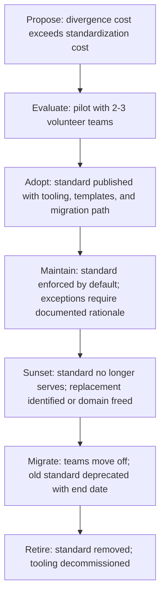

# Technical Standards Strategy

> **Core skill:** The principal decides which technologies and practices to standardize — and which to leave free — based on the economic rule that a standard is justified only when the cost of the standard is less than the cost of divergence without it.

## Why This Matters

At 500+ engineers, every unstandardized technology choice is a compounding cost: each team learns a different database, builds different deployment patterns, and hires for different skill sets. The operation team runs N different things, the security team audits N different things, and an engineer transferring teams re-ramps on every new stack. Standardization reduces this combinatorial cost. But standardization also has a cost: it constrains teams, slows adoption of superior alternatives, and creates a compliance overhead that teams resent.

The principal's standards strategy is an economic decision executed with organizational judgment. The core rubric — standardize when the cost of the standard is less than the cost of divergence — looks clean on paper. In practice, both costs are estimates, both change over time, and both are contested by the teams that live under the standard or the divergence. The principal's skill is making the decision transparently, revisiting it on evidence, and knowing when a standard has become a millstone.

## The Standardization Decision

Not everything should be standardized. The decision to standardize is a function of three factors: the divergence cost, the standardization cost, and the organization's risk profile.

### What to Standardize

| Domain | Standardize When | Leave Free When |
|--------|-----------------|-----------------|
| **Languages** | 2-3 languages cover 90 percent of the workload; the operational tooling, hiring pipeline, and library ecosystem are mature | The domain genuinely requires a different paradigm; the standard languages lack required capabilities |
| **Databases** | One relational, one document, one key-value store cover the workload spectrum; operational runbooks and backup patterns exist | A specialized data model is core to the product and no standard database supports it |
| **Infrastructure** | Container orchestration, CI/CD, observability, and secrets management are undifferentiated heavy lifting | The organization's scale or compliance requirements genuinely exceed what standard tooling supports |
| **Frameworks** | One or two per language cover the common patterns; internal libraries and security patches are shared | A framework is abandoned upstream; the standard framework blocks a required capability |
| **Communication protocols** | gRPC, REST, or async messaging for inter-service communication; one event schema format | A protocol is required by an external integration or standard |
| **Security and compliance** | Always standardized: authentication, authorization, secret management, audit logging | Never: security is not a domain for local innovation |

### The Divergence Cost Calculation

The cost of divergence is the sum of costs the organization pays because teams choose differently:

| Cost Category | Description | Example |
|---------------|-------------|---------|
| **Operational diversity** | Each new technology requires new runbooks, monitoring, backups, and incident response patterns | Three different databases mean three different backup tools and three different on-call expertise requirements |
| **Engineer mobility** | Engineers transferring between teams lose productivity during re-ramp | A Python engineer moving to a Go team needs 4-6 weeks to become effective |
| **Hiring fragmentation** | Hiring pipelines must cover N stacks instead of focusing depth on few | Job descriptions list five languages; candidates self-select out |
| **Security surface area** | Each new technology is a new attack surface, new dependency tree, new CVE stream | Five web frameworks mean five sets of security patches to track and apply |
| **Vendor and license complexity** | Each new technology introduces new license terms, support contracts, and vendor relationships | Open-source license compliance across 50+ direct dependencies |
| **Knowledge fragmentation** | Best practices, patterns, and gotchas are distributed across silos instead of shared | The "right way to do auth" is different on every team |

The cost of divergence is not the cost of the technology — it is the systemic cost of diversity multiplied by the number of teams that diverge.

## The Standard Lifecycle

Standards, like principles, have a lifecycle. A standard that never changes is a standard that has become irrelevant or oppressive.



| Phase | Duration | Key Activity | Owner |
|-------|----------|-------------|-------|
| Propose | 2-4 weeks | Write the business case: divergence cost, standardization cost, risk | Principal or senior architect |
| Evaluate | 4-8 weeks | Pilot with volunteer teams; collect data on ramp cost, productivity, and edge cases | Pilot teams plus principal |
| Adopt | 2-4 weeks | Publish standard, reference implementation, migration guide, and exception process | Principal and governance board |
| Maintain | 1-3 years | Tooling improvements; periodic review of exception rate; standard vs industry evolution | Platform or architecture team |
| Sunset | 3-6 months | Announce deprecation with end date; identify migration path | Principal |
| Migrate | 6-12 months | Teams migrate; exceptions for late migration with documented rationale | Teams with principal oversight |
| Retire | One quarter after migration complete | Remove tooling, runbooks, and documentation; close the exception register | Platform team |

## Standards as Defaults, Not Laws

The effective standard is a default — the path of least resistance — not a law enforced by compliance police. The distinction matters because laws invite routing-around; defaults invite adoption.

| Law Model | Default Model |
|-----------|---------------|
| "All services must use Postgres" | "Postgres is the default relational database; new services start with Postgres unless the team documents why another database is required" |
| Compliance enforced by architecture review | Adoption driven by tooling, templates, and the ease of the default path |
| Exceptions require board approval | Exceptions require documented rationale; board reviews aggregate exception patterns |
| Teams feel constrained and resentful | Teams feel supported and choose the default because it is easier |

The default model is not weak. The default model is stronger because it scales: teams adopt the standard because it is the best path for them, not because they were forced. The principal's role is to make the default path so well-paved that deviation is the harder choice.

## Sunsetting Standards

Every standard should include its sunset condition at adoption. Without a sunset condition, standards accumulate until the organization is buried under them.

| Sunset Trigger | Example |
|---------------|---------|
| **Technology obsolescence** | The standard technology is no longer actively maintained upstream |
| **Industry shift** | A new paradigm makes the standard pattern obsolete; the industry has moved |
| **Exception rate** | Exception rate exceeds 30 percent of new projects for two consecutive quarters — the standard is no longer serving |
| **Cost inversion** | The cost of maintaining the standard's tooling exceeds the divergence cost it was meant to prevent |
| **Organizational change** | The organization's strategy or structure changes; the standard no longer fits |

When a standard sunsets, the migration off it is as deliberate as the adoption onto it was. Unmaintained standards left in place are technical debt with organizational memory loss — nobody remembers why it exists, but everyone must comply.

## Practical Applications

### Standards Decision Template

```markdown
# Standard Proposal: [Technology or Practice]

## Divergence Cost
- Current state: [how many teams use what]
- Cost of divergence: [operational diversity, mobility, hiring, security — quantified where possible]

## Standardization Proposal
- Proposed standard: [technology or practice]
- Scope: [which teams, which use cases]
- Standardization cost: [tooling, migration, training, ramp time]

## Alternatives Considered
| Alternative | Why Not |
|-------------|---------|
| [Alt A] | [reason] |
| [Alt B] | [reason] |

## Exception Criteria
- When deviation is justified: [conditions]
- Exception documentation required: [ADR or exception register entry]

## Sunset Conditions
- This standard should be reviewed when: [trigger]
- Expected review date: [date]
```

### Standards Health Checklist

- [ ] Every standard has a documented rationale: divergence cost exceeds standardization cost
- [ ] Every standard includes exception criteria and the documentation path for deviations
- [ ] Every standard includes its sunset conditions at adoption
- [ ] Standards are reviewed annually; standards with exception rates above 30 percent are candidates for revision or sunset
- [ ] The default path for each standard is the easiest path: tooling, templates, and documentation make compliance effortless

## Common Pitfalls

| Pitfall | Why It Is a Problem | Better Approach |
|---------|---------------------|-----------------|
| **Standardizing too early** | The technology is immature; the standard locks in a suboptimal choice before the organization understands the domain | Standardize after the organization has experience with the technology in production; pilot before adopting |
| **Standardizing everything** | Every technology choice becomes a standard; teams have no autonomy; innovation dies | Standardize only where divergence cost demonstrably exceeds standardization cost |
| **Standards without exceptions** | Rigid compliance breeds resentment; teams route around standards entirely | Every standard includes its exception criteria and documentation path |
| **Standards without tooling** | "The standard is X" with no paved path; adoption is painful and compliance is spotty | Invest in templates, libraries, and automation that make the standard the easiest choice |
| **Zombie standards** | Standards that no longer serve but have never been formally deprecated | Sunset condition at adoption; annual review; deprecate standards that fail the economic test |
| **Standards as punishment** | Standards imposed after an incident as a reaction, without economic justification | Separate incident response (rule changes) from standards strategy (economic decisions) |

## Success Indicators

- New projects and services adopt the standard by default without being told
- Exception rate is low and stable; exceptions carry documented, principled rationale
- Standards are reviewed annually; sunset standards are deprecated with migration paths
- Engineers describe standards as "the paved road" not "the rules"
- The standards portfolio shrinks when standards no longer earn their keep

## Related Topics

- [[01_Technical_Principles]]: principles guide which standards to create
- [[02_Architecture_Governance_at_Scale]]: standards as part of the governance model
- [[04_Decision_Rights_and_Delegation]]: who decides standards and exceptions
- [[05_Exception_and_Escalation_Management]]: the principled exception path for standards
- [[career-path/06_Software_Architect/04_Architecture_Evaluation_and_Trade_Offs/00_overview|Architecture Evaluation and Trade Offs (Architect)]]: the evaluation methods for technology choices

## Summary

The standards strategy is an economic function: standardize when the cost of the standard is less than the cost of divergence, make the standard the default path through tooling and templates, provide a principled exception path, and include the sunset condition at adoption. Standards are defaults, not laws — they work because they are the easiest path, not because they are enforced. The principal owns the portfolio: what to standardize, when to adopt, when to sunset, and the economic case for each.