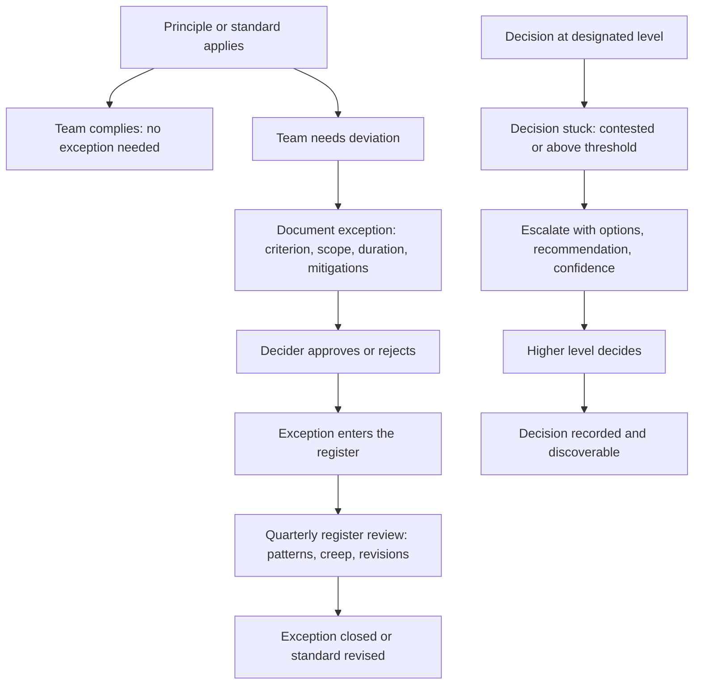

# Exception and Escalation Management

> **Core skill:** The principal designs the exception path to be principled, documented, and time-boxed — and the escalation path to be a designed channel that moves stuck decisions upward with options, not complaints.

## Why This Matters

Every principle and standard eventually meets a situation it was not designed for. When the exception path is absent or ad-hoc, two things happen: teams either comply with principles that hurt them — breeding resentment and workarounds — or they ignore principles entirely — breeding chaos. When the escalation path is absent or invisible, decisions that should move upward instead sit unresolved, or they land on the principal's desk through backchannels, unaccompanied by analysis.

The principal designs both paths. The exception path makes deviation safe: principled, documented, time-boxed, and reviewed. The escalation path makes moving a decision upward a structured act — the escalator brings options, analysis, and a recommendation, not a problem dump. Both paths are signals of governance health: a working exception path has low volume and high documentation quality; a working escalation path is used rarely and resolves quickly.

## Principled Exceptions

An exception is a documented, time-boxed deviation from a principle or standard. It is not a workaround, not a violation, and not a permanent exemption. The distinction is the documentation.

### Exception Criteria

An exception is justified when it meets one of these criteria, and the justification is documented:

| Criterion | Description | Example |
|-----------|-------------|---------|
| **Domain mismatch** | The principle or standard was designed for a domain the team does not operate in | A standard that assumes cloud-native deployment applied to an on-premises product |
| **Transient necessity** | The team must deviate temporarily to meet a business commitment, with a plan to converge | A team uses a non-standard database to ship a customer commitment in Q2, with migration to the standard planned for Q3 |
| **Capability gap** | The standard does not support a required capability, and building around the gap is more expensive than deviating | The standard database lacks a required consistency model, and the workaround is a distributed transaction layer |
| **Innovation carve-out** | The team is exploring a new technology or pattern that, if successful, may become a future standard | A team pilots a new language for a specific workload class, with success criteria and a decision gate |
| **Legacy compatibility** | The team must interface with a legacy system that pre-dates the standard | An acquisition's tech stack that will be migrated over 18 months |

### Exception Documentation

Every exception is documented with a lightweight record that captures the decision and its boundaries:

```markdown
# Exception-[NNNN]: [Standard or Principle] — [Team or System]

- **Standard or Principle:** [link]
- **Criterion:** [domain mismatch / transient necessity / capability gap / innovation carve-out / legacy compatibility]
- **Scope:** [what is excepted, bounded as precisely as possible]
- **Duration:** [end date or review date]
- **Rationale:** [why compliance is more costly than the exception, in the current context]
- **Mitigations:** [what the team will do to limit the exception's blast radius]
- **Review:** [date when the exception will be reviewed for continuation or closure]
- **Approved by:** [decider per the decision rights framework]
```

### The Exception Register

The exception register is the aggregate view of all active exceptions across the organization. It is the principal's dashboard for governance health — a rising exception count or a cluster of exceptions against a single standard is a signal that the standard needs revision.

| Field | Purpose |
|-------|---------|
| Exception ID | Unique identifier, linked to the full exception record |
| Standard or Principle | The governance artifact being excepted from |
| Team | The excepting team |
| Criterion | The justification category |
| Start date | When the exception began |
| End date | When the exception expires or is reviewed |
| Status | Active, closed, or converted-to-permanent |
| Review date | Next scheduled review |

The register is reviewed quarterly by the principal. Patterns in the register — a single principle generating 40 percent of exceptions, or exceptions that are perpetually renewed — trigger revision of the principle or standard, not just more exceptions.

## Exception Creep

Exception creep is the slow erosion of governance when exceptions accumulate without review and become the de facto rule. The signal: a standard exists on paper but most teams operate under exceptions, and new teams are advised "just file the exception, everyone does."

| Sign of Exception Creep | What It Means | Response |
|------------------------|---------------|----------|
| Exception rate exceeds 30 percent for a standard | The standard does not fit the organization's actual context | Revise or sunset the standard |
| Exceptions renewed for more than two cycles | The exception is permanent but undocumented as such | Either formalize the exception as a new standard variant or enforce convergence |
| New teams file exceptions as their first interaction with governance | Governance is perceived as an obstacle, not a support | Simplify the standard; reduce compliance friction |
| Exception documentation quality declines over time | Exception process is becoming a rubber stamp | Reinforce documentation requirements; audit exception quality quarterly |

The principal's defense against exception creep is the quarterly exception register review: patterns are surfaced, standards are revised, and permanent exceptions are either formalized or closed.

## Escalation as a Designed Path

Escalation is not failure — it is the governance system moving a decision to the right level when it cannot be resolved where it sits. The designed escalation path has three properties: it is known, it is structured, and it moves decisions upward with options, not complaints.

### The Escalation Conversation

An escalation that arrives as "we cannot decide, you figure it out" is a problem dump. An escalation that arrives as "we cannot decide between A and B; here are the trade-offs; we lean toward A for these reasons" is a decision with a missing decider. The principal expects the latter.

| Escalation Component | What It Must Include |
|----------------------|---------------------|
| **The decision being escalated** | One sentence: what needs to be decided |
| **Why it cannot be decided at the current level** | Contested by whom; exceeds what authority; sets what precedent |
| **Options considered** | At least two real options, with trade-offs priced |
| **Recommendation** | Which option the escalator recommends and why |
| **Confidence** | How certain the recommendation is |
| **What the escalation recipient needs to decide** | The specific question the recipient must answer |

### Escalation Paths by Decision Class

| Decision Class | First Escalation | Second Escalation | Final |
|---------------|-----------------|-------------------|-------|
| Service architecture | Domain architect | Principal | CTO |
| Technology selection | Principal | Governance board | CTO |
| Standard exception | Principal | Governance board | CTO |
| Build vs buy above threshold | Principal | CTO | CEO or board |
| Principle revision | Principal | Governance board | CTO |

### Escalation Anti-Patterns

| Anti-Pattern | What It Looks Like | Fix |
|-------------|-------------------|------|
| **The problem dump** | "We have a conflict about the database choice" with no analysis | Return with a request for options and a recommendation |
| **The end-run** | Escalating to the CTO directly, bypassing the escalation path | Reinforce the path; the CTO returns the decision to the path |
| **The forever escalation** | A decision escalates and sits unresolved for months | Escalation timeouts: if not decided in two cycles, the lower-level recommendation stands |
| **The escalating escalator** | Every decision is escalated "to be safe" | Refuse to decide at the wrong level; send back with guidance |

## The Exception and Escalation System



## Practical Applications

### Exception Management Checklist

- [ ] Every principle and standard has published exception criteria
- [ ] Exception records are documented with criterion, scope, duration, and mitigations
- [ ] An exception register exists and is reviewed quarterly
- [ ] Exception rate per standard is tracked and triggers revision above 30 percent
- [ ] Exceptions renewed for more than two cycles are escalated to the principal
- [ ] Exception documentation quality is audited periodically

### Escalation Readiness Checklist

- [ ] Escalation paths are documented for each decision class
- [ ] Escalations include options, recommendation, and confidence — not just the problem
- [ ] Escalation timeouts exist: unresolved escalations default to the lower-level recommendation
- [ ] The escalation recipient returns decisions that should not have escalated with guidance

## Common Pitfalls

| Pitfall | Why It Is a Problem | Better Approach |
|---------|---------------------|-----------------|
| **No exception path** | Teams are forced to comply with standards that harm them or to violate standards silently | Design the exception path: principled, documented, time-boxed, reviewed |
| **Exception path as rubber stamp** | Every exception is approved without scrutiny; standards become meaningless | Exception criteria gate approval; quarterly register review surfaces patterns |
| **Exception creep unrecognized** | Standards exist on paper; reality is the aggregate of exceptions | Monitor exception rate per standard; revise standards when rate exceeds 30 percent |
| **Escalation as problem dump** | Escalations arrive as conflicts without analysis; the principal must do the work | Require options, trade-offs, recommendation, and confidence in every escalation |
| **Escalation path invisible** | Teams do not know how to escalate; decisions stall or go through backchannels | Publish escalation paths; make them as visible as decision rights |
| **Permanent exceptions** | Exceptions with no end date become the rule without the legitimacy | Every exception has an end date or review date; perpetual exceptions must be formalized |

## Success Indicators

- Exception rate per standard is low and stable; clusters of exceptions trigger standard revision
- Exception records are high quality: criterion, scope, duration, mitigations all documented
- Escalations arrive with options, trade-offs, and recommendations
- Escalation volume is low; decisions are made at their designated level
- No exception is older than its scheduled review date
- The exception register is reviewed quarterly and drives governance improvements

## Related Topics

- [[01_Technical_Principles]]: the principles exceptions deviate from
- [[03_Technical_Standards_Strategy]]: the standards exceptions deviate from
- [[04_Decision_Rights_and_Delegation]]: who approves exceptions and receives escalations
- [[06_Risk_Governance]]: exceptions that introduce risk must be tracked in the risk framework
- [[07_Technology_Advisory_and_Review_Boards]]: the board's role in exception patterns and escalations

## Summary

The exception path and the escalation path are the governance system's safety valves: exceptions allow principled, documented, time-boxed deviation from standards, tracked in a register that drives standard revision when patterns emerge; escalations move stuck decisions upward with options and recommendations, not complaints. The principal designs both paths, monitors the exception register for creep, and refuses to accept escalations that are problem dumps — because a working governance system makes deviation safe and escalation structured.