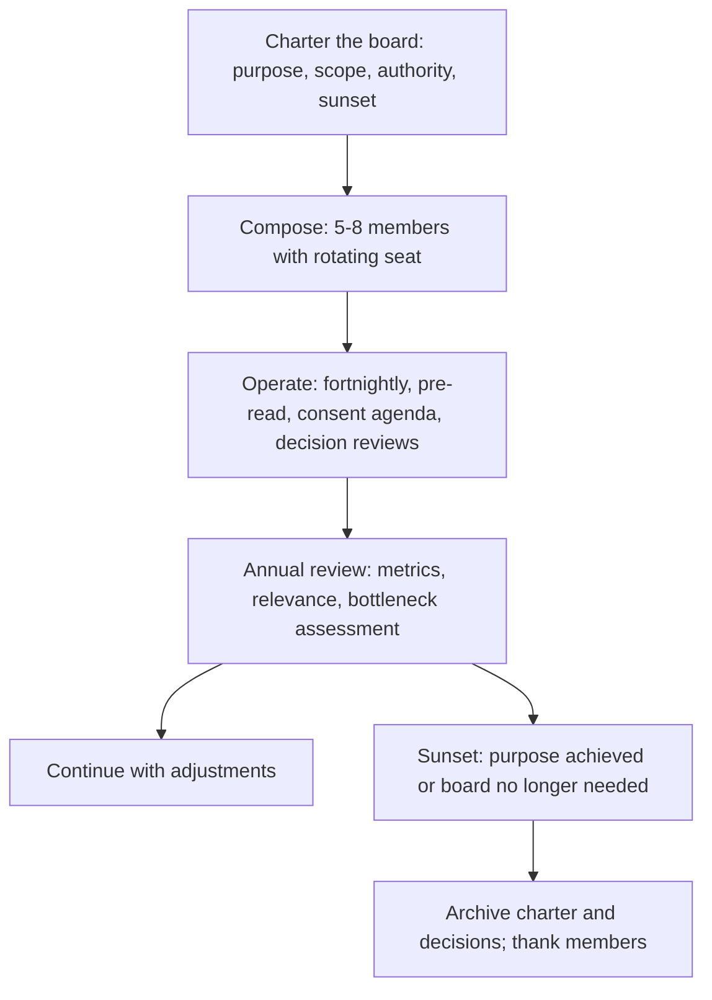

# Technology Advisory and Review Boards

> **Core skill:** The principal designs, charters, and runs technology advisory and review boards that advise and ratify without bottlenecking — and knows when a board has served its purpose and should be sunset.

## Why This Matters

At 500+ engineers, the governance system needs a forum where consequential technical decisions are reviewed for consistency with principles, standards, and systemic risk. That forum is the technology advisory board — but only if it is designed to advise, not to gate. A board that gates every decision is a bottleneck that slows the organization; a board that advises on a bounded class of material decisions is a governance force multiplier.

The principal owns the board design: its charter, its composition, its scope, and its relationship to decision rights. The board is not a standing committee that accumulates permanent members and permanent meetings — it is a governance mechanism with a purpose, and when that purpose is served or outgrown, the board is re-chartered or sunset. The principal's skill is running boards that the organization values, not boards the organization routes around.

## Board Design: Advisory vs Decision-Making

The first and most consequential design choice is whether the board advises or decides. The distinction shapes everything else.

| Dimension | Advisory Board | Decision-Making Board |
|-----------|---------------|----------------------|
| **Authority** | Recommends; the decider decides with the board's input | Decides; the decision is final unless escalated |
| **Bottleneck risk** | Low: the decider is not blocked on board schedule | High: decisions queue for board meetings |
| **Accountability** | Diffuse: the board recommends, the decider is accountable | Concentrated: the board is collectively accountable |
| **Best for** | Organizations that value speed and team autonomy; board ensures consistency | Organizations with high regulatory or systemic risk; board ensures compliance |
| **Principal's role** | Chair or member; the principal's judgment informs, does not override | Chair; the principal may hold a tie-breaking or veto role |

At scale, the advisory model is preferred: the board reviews, the decider decides. The board's value is not in approval but in the consistent application of principles and the detection of systemic risk that a single decider might miss. A board that must approve every decision discovers that decisions are made elsewhere and brought to the board for ratification after the fact — governance theater.

## Board Composition

A board's composition determines its legitimacy and its blind spots. Too many members and the board cannot decide; too few and it misses perspectives; the wrong mix and it becomes a political forum.

| Role | Count | What They Bring | Selection |
|------|-------|----------------|-----------|
| **Chair (principal or senior architect)** | 1 | Governance design; principle authorship; the tie to strategy | By role |
| **Senior architects** | 2-3 | Deep architecture judgment; cross-domain perspective | By demonstrated architecture impact, not title |
| **Senior engineering leaders** | 2-3 | Delivery reality; organizational context; resource constraints | By role or appointment |
| **Rotating member** | 1 | Fresh perspective; ground truth from teams; prevents board insularity | Term-limited: 6-12 months, rotating across domains |

Total size: 5-8 members. Above 8, the board becomes a meeting, not a decision forum. The rotating member is a critical design element: it prevents the board from becoming a closed circle that is disconnected from the engineering reality it governs.

## Board Charter

Every board has a written charter that defines its reason for existing, its scope, its authority, and its lifespan. A board without a charter drifts.

| Charter Element | Content |
|----------------|---------|
| **Purpose** | Why the board exists: what governance gap it fills |
| **Scope** | What classes of decisions the board reviews; what materiality threshold triggers review |
| **Authority** | Advisory or decision-making; what happens when the decider disagrees with the board |
| **Membership** | Composition, selection, terms, and chair |
| **Cadence** | Meeting frequency, duration, and pre-read deadline |
| **Decision record** | How board reviews are documented and published |
| **Relationship to governance** | How the board relates to principles, standards, decision rights, and the exception register |
| **Sunset condition** | When the board will be reviewed for continuation, re-chartering, or dissolution |

## Running Boards That Do Not Bottleneck

A board becomes a bottleneck when its meeting cadence is the rate limiter for organizational decisions. The principal prevents this with structural choices:

| Bottleneck Cause | Prevention |
|-----------------|------------|
| **Board reviews every decision** | Scope to material decisions only: new platforms, new languages, architecture spanning 3+ teams, exceptions that set precedent |
| **Board meets too infrequently** | Fortnightly cadence; decisions that cannot wait are reviewed async by the chair with post-hoc board ratification |
| **Board meetings re-present the material** | Pre-read materials due 48 hours before; the meeting resolves open questions, does not re-present |
| **Board members are unavailable** | Quorum is 3 members including the chair; decisions made at quorum are board decisions |
| **Board is the only review path** | Decisions within standards and below the materiality threshold do not need board review at all |

The board's throughput is measured by decision lead time: the time from submission to review completion. A healthy board completes reviews in one cycle. A board that routinely takes two or more cycles needs scope reduction or cadence increase.

### The Board Meeting Format

A well-run board meeting follows a strict format that protects time for the decisions that need it.

| Segment | Duration | Activity |
|---------|----------|----------|
| Consent agenda | 5 minutes | Decisions that are within standards and below threshold, submitted for awareness only; approved unless a member objects |
| Decision reviews | 15-20 minutes each | 2-3 material decisions: pre-read assumed; the proposer presents context in 3 minutes; the board discusses and recommends |
| Exception pattern review | 10 minutes | Quarterly: exception register patterns that may signal a standard needing revision |
| Systemic risk review | 10 minutes | Quarterly: new systemic risks identified since the last review |
| Governance health | 5 minutes | Metrics: ADR volume, exception rate, lead time, citation rate |

## Board Evolution as the Organization Grows

The board design that works at 300 engineers fails at 1000. The board must evolve — and the principal must recognize when the current design is breaking.

| Organization Size | Board Model | Rationale |
|-------------------|-------------|-----------|
| 100-300 | No formal board; principal plus senior architects meet ad-hoc | Decision volume does not justify a standing board |
| 300-800 | Single advisory board; fortnighly; 5-7 members | One board can cover the material decision volume |
| 800-2000 | Single advisory board plus domain-level architecture forums | Domain forums handle domain-specific decisions; the advisory board handles enterprise-wide decisions and standards |
| 2000+ | Enterprise architecture board plus domain boards; the principal governs the governance | Enterprise board sets principles and standards; domain boards handle domain architecture within enterprise guardrails |

## Sunsetting a Board

Every board should include its sunset condition in its charter. A board created for a specific purpose — a cloud migration, a monolith decomposition — should dissolve when that purpose is achieved. A standing board should be reviewed annually for continued necessity.

| Sunset Trigger | Example |
|---------------|---------|
| **Purpose achieved** | Migration complete; the migration review board dissolves |
| **Decision volume below threshold** | The board reviews fewer than one material decision per month for two quarters — the organization has outgrown the need or the scope is too narrow |
| **Board is a bottleneck** | Decision lead time consistently exceeds two cycles despite scope and cadence adjustments — the board model is wrong for this organization |
| **Decisions bypass the board** | Teams consistently make material decisions without board review and the board discovers them post-hoc — the board has lost legitimacy |
| **Duplicate governance** | Another governance mechanism (standards automation, principle citation, decision rights) has made the board redundant |

Sunsetting a board is not failure — it is governance hygiene. A board that outlives its purpose becomes a drag on the organization.



## Practical Applications

### Board Design Checklist

- [ ] Board has a written charter with purpose, scope, authority, and sunset condition
- [ ] Board is advisory, not decision-making — it recommends, the decider decides
- [ ] Size is 5-8 members including a rotating seat
- [ ] Scope is bounded to material decisions only
- [ ] Cadence is fortnightly with pre-read materials due 48 hours before
- [ ] Meeting format protects time for decision reviews and governance health
- [ ] Board is reviewed annually for relevance and bottleneck signals
- [ ] Sunset condition is included in the charter at creation

### Board Charter Template

```markdown
# Charter: [Board Name]

## Purpose
[Why this board exists]

## Scope
- Decisions reviewed: [decision classes and materiality threshold]
- Decisions not reviewed: [explicit exclusions]

## Authority
- Type: Advisory / Decision-making
- When the decider disagrees: [process]

## Membership
- Chair: [role]
- Members: [count, composition, selection, terms]
- Rotating member: [term, selection]

## Operations
- Cadence: [frequency, duration]
- Pre-read deadline: [hours before meeting]
- Quorum: [number]
- Decision record: [how reviews are documented and published]

## Governance Relationship
- Principles: [how the board applies them]
- Standards: [how the board reviews exceptions]
- Decision rights: [how the board fits the framework]

## Sunset
- Review date: [date]
- Sunset conditions: [triggers]
```

## Common Pitfalls

| Pitfall | Why It Is a Problem | Better Approach |
|---------|---------------------|-----------------|
| **Board as approval gate** | Every decision must be approved; the board is the bottleneck | Advisory model: review and recommend; the decider decides |
| **Board without charter** | Scope expands to fill available time; the board reviews everything and decides nothing | Written charter with explicit scope, authority, and sunset condition |
| **Permanent membership** | The board becomes a status marker; membership is forever; fresh perspectives absent | Term limits and rotating seats; membership is service, not status |
| **Board that re-presents material** | Meetings are reading sessions; 90 minutes spent on what could be pre-read | Pre-read 48 hours before; the meeting resolves open questions only |
| **No sunset condition** | Board exists because it has always existed; nobody questions its relevance | Sunset condition in the charter; annual review of necessity |
| **Decisions bypassing the board** | The board discovers material decisions post-hoc; governance is theater | Fix scope or authority; if the board is irrelevant, sunset it |

## Success Indicators

- Decision lead time is one cycle or less; no team is blocked waiting for a board meeting
- Board recommendations are cited in decision records and followed more often than not
- Board composition rotates; membership is not a permanent appointment
- The board's sunset condition is reviewed annually; at least one board has been sunset or re-chartered
- Teams submit decisions for review voluntarily because the review adds value

## Related Topics

- [[01_Technical_Principles]]: the principles the board applies in reviews
- [[02_Architecture_Governance_at_Scale]]: the governance model the board operates within
- [[03_Technical_Standards_Strategy]]: the standards the board reviews exceptions against
- [[04_Decision_Rights_and_Delegation]]: the decision framework the board fits into
- [[05_Exception_and_Escalation_Management]]: the exception patterns the board reviews

## Summary

Technology advisory and review boards are the governance forum where consequential technical decisions are reviewed for consistency — but only if designed to advise, not to gate. The principal charters the board with explicit purpose, scope, authority, and sunset condition; composes it with 5-8 members including a rotating seat; runs it on a fortnightly cadence with pre-read discipline; and reviews it annually for relevance. A board that bottlenecks is re-scoped or re-cadenced; a board that has served its purpose is sunset — because governance mechanisms must earn their keep or be removed.