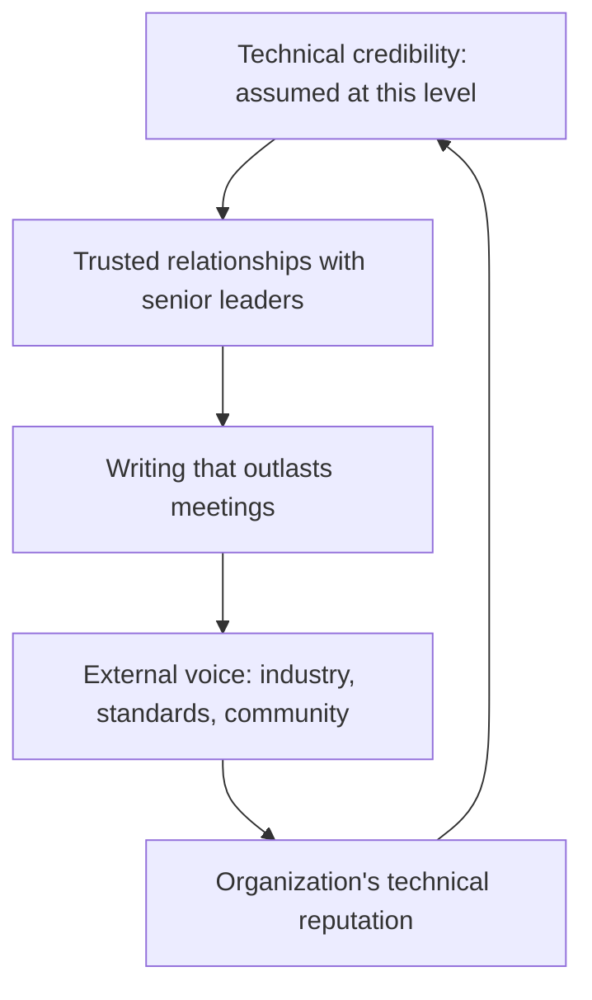

# Organizational Influence

> **Core capability:** The principal engineer shapes decisions across executive, technical, and product groups — building trusted advisory relationships, writing for organizational impact, and representing the organization in external technical forums.

## Why This Matters

At principal level, influence moves from meetings and proposals to relationships and reputation. The principal's audience includes the CEO, the board, the CTO, and the external technical community. The work is rarely technical depth (that is assumed); it is translation: making technical debt legible to a CFO, making a platform investment case readable by a board, making the organization's technical story compelling to the industry.

This area is also where the principal's career widens beyond the org: keynotes, standards bodies, open-source governance, industry consortia. The external voice is not ego — it is the organization's technical credibility, recruiting pipeline, and partnership leverage, all shaped by one voice.

## Topics in This Capability Area

| Topic | Core Skill | When It Matters |
|-------|------------|-----------------|
| [[01_Executive_Communication]] | Making technical reality legible to C-suite and board | Investment asks; risk reporting; strategy reviews |
| [[02_Advisory_Relationships]] | Building trusted advisor status with senior leaders | Continuous; built before needed |
| [[03_Writing_for_Organizational_Impact]] | White papers, strategy memos, technology position papers | Major decisions; industry positioning |
| [[04_External_Technical_Representation]] | Industry consortia, standards bodies, open-source governance | Standards evolution; partnerships; recruiting |
| [[05_Cross_Functional_Coalitions]] | Building alliances across product, finance, legal, security | Major investments; policy changes |
| [[06_Organizational_Conflict_Resolution]] | Resolving technical and strategic conflicts at senior levels | Leadership deadlocks; contested decisions |
| [[07_Public_Technical_Voice]] | Conference keynotes, thought leadership, the org's external brand | Industry visibility; talent attraction |

## The Influence Ladder at Principal Scale

Influence compounds — each layer feeds the next.

## Staff vs Principal

| Activity | Staff Engineer | Principal and Distinguished Engineer |
|----------|----------------|---------------------------------------|
| Audience | Engineering and product leadership | C-suite, board, external industry |
| Writing | Proposals and strategy docs | White papers, position papers, board memos |
| External | Occasional conference talks | Standards bodies, consortia, industry leadership |
| Conflict | Resolves team and cross-team | Resolves senior leadership deadlocks |
| Relationships | Peer and manager level | Executive and board level |

## Practical Applications

### Organizational Influence Checklist

- [ ] Executive communications translate technical reality into business terms without distortion
- [ ] A current board-level technology briefing exists and is refreshed annually
- [ ] The organization is represented in at least one external technical body relevant to its strategy
- [ ] Major cross-functional decisions are pre-aligned through built relationships
- [ ] The organization's external technical voice is deliberate, not accidental

## Common Pitfalls

| Pitfall | Why It Is a Problem | Better Approach |
|---------|---------------------|-----------------|
| **Technical avoidance** | Dumbing down for executives produces bad decisions | Translate, don't simplify; respect the audience's intelligence |
| **External voice as ego** | Keynotes that promote the person, not the organization's work | Represent the org's technical story; credit flows to the teams |
| **Coalition only during crisis** | Relationships built under pressure are transactional | Build cross-functional relationships before needing them |

## Success Indicators

- Executives seek your counsel before major technical decisions
- Board presentations pair business outcomes with technology implications
- Industry partners and consortia seek the organization's technical participation
- Cross-functional decisions land with pre-alignment, not meeting battles

## Related Capabilities

- [[01_Technology_Strategy/00_overview|Technology Strategy]]: the content influence communicates
- [[03_Decision_Governance_and_Principles/00_overview|Decision Governance and Principles]]: governance that makes influence systemic
- [[career-path/03_Staff_Engineer/04_Influence_and_Alignment/00_overview|Influence and Alignment (Staff)]]: the multi-team foundation this scales to executive level
- [[career-path/11_Engineering_Manager/05_Organizational_Awareness_and_Influence/00_overview|Organizational Awareness and Influence (EM)]]: the manager's parallel craft

## Summary

Organizational influence at principal level is translation, relationships, and external voice — making technology legible to executives, trusted advisor status built over years, writing that shapes decisions at the highest level, and representing the organization's technical story to the industry. The principal's influence is the organization's technical credibility made audible.