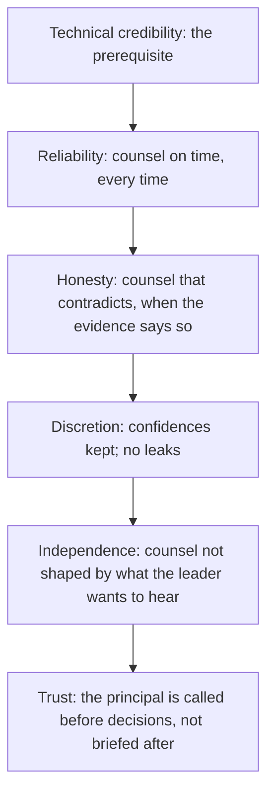

# Advisory Relationships

> **Core skill:** The principal builds the trusted advisor position with senior leaders — earned over years through reliability, honesty, and discretion — so that counsel is sought before decisions, not offered after them.

## Why This Matters

At principal level, influence is not exercised in meetings — it is exercised in relationships built over years. The trusted advisor position is not a role on an org chart; it is a reputation earned through consistent behavior: reliable analysis delivered on time, honest assessment even when it contradicts the leader's inclination, and the discretion to handle sensitive information without leaking it. When this reputation is established, the principal is called before decisions are made — not briefed after them.

The trusted advisor position is fragile. It is built over years and lost in a single breach of trust: a recommendation that proved wrong and was not accompanied by a candid post-mortem, a confidence shared outside the relationship, advice that served the principal's agenda rather than the leader's interest. The principal who maintains this position across multiple leaders, organizational changes, and contested decisions is the principal whose influence compounds.

## The Relationship Map

The principal's advisory relationships are not random — they are a deliberate map of who needs technical counsel and how that counsel is best delivered.

| Relationship | What They Need | How the Principal Delivers | Frequency |
|-------------|---------------|---------------------------|-----------|
| **CTO or VP Engineering** | Technology strategy counsel; options and trade-offs for major decisions; honest assessment of engineering health | Regular 1:1s; written memos for consequential decisions; unscheduled access for urgent matters | Weekly or bi-weekly |
| **CEO** | Strategic implications of technology; competitive positioning; major investment framing | Periodic briefings; written memos for decisions that reach the CEO; presence in strategy reviews | Monthly or quarterly |
| **CFO** | Technology cost structure; ROI of investment; risk as financial exposure | Annual investment review; on-demand cost analysis; risk briefing before audit committee meetings | Quarterly or on-demand |
| **CPO** | Technology's impact on product velocity and capability; build vs buy analysis; platform roadmap | Joint product-technology strategy sessions; build vs buy memos | Monthly or per planning cycle |
| **General Counsel or CISO** | Technology risk posture; compliance readiness; incident response capability | Risk briefings; compliance readiness reviews; post-incident analysis | Quarterly or on-demand |
| **Board members** | Technology governance health; strategic technology bets; major risks | Board presentations; pre-meeting briefings for technology-fluent board members | Quarterly or per board meeting |

## Advising vs Deciding

The trusted advisor advises — they do not decide. The distinction is critical for maintaining the advisory relationship: the moment the principal confuses advising with deciding, the relationship shifts from trusted counsel to contested authority.

| Advising | Deciding |
|----------|----------|
| "Here are the options, the trade-offs, and my recommendation. The decision is yours." | "We should do X." (without presenting the alternatives or the leader's decision space) |
| "My confidence in this recommendation is medium-high. What would change it is new data on Y." | "This is the right choice." (without stating confidence or uncertainty) |
| "You decided on X. Here is how I will support that decision." | "You made the wrong call." (public disagreement with a decision already made) |
| "Last quarter's decision on X had these outcomes. Here is what we learned." | Silent when a decision the principal advised against produces good results |

The principal's obligation is to provide the best counsel — honest, complete, and accompanied by confidence levels. The leader's obligation is to decide. When the leader decides against the principal's counsel, the principal's job is to support the decision and track the outcomes, not to undermine it.

## Handling Disagreement With Executives

Disagreement with an executive is not a breach of the advisory relationship — it is the relationship's test. Handled well, it strengthens the relationship. Handled poorly, it breaks it.

| Situation | Wrong Response | Right Response |
|-----------|---------------|----------------|
| **Executive leans toward an option the principal believes is wrong** | "That will fail." | "That option has these three risks. Here is how likely each is to materialize and what the impact would be. If you accept those risks, the option is viable. If you want to reduce them, option B addresses all three with this cost." |
| **Executive makes a decision the principal advised against** | Public disagreement; passive resistance; "I told you so" later | "Understood. I will support the decision. Let us define the signals we will watch to know if the decision needs revisiting." |
| **Executive dismisses the principal's technical concern** | Escalating the concern through other channels | "I want to make sure I have communicated the risk clearly. Can I restate it in different terms? If after that you still see it differently, I will support your call." |
| **Executive makes a decision based on incomplete technical information** | "You do not understand the technology." | "There is an additional technical factor that might change the trade-off. May I walk you through it? It takes three minutes." |

## When Your Advice Is Ignored

Advice will be ignored — it is the nature of the advisory role. The principal's response determines whether the relationship survives.

| Principle | Practice |
|-----------|----------|
| **Do not take it personally** | The decision is about the organization, not about you. The executive has information you may not have. |
| **Support the decision** | Once decided, your role is to make the decision work, not to prove it wrong. |
| **Track the outcomes** | Define, with the executive if possible, the signals that will indicate whether the decision is working. Review them together. |
| **Do not say "I told you so"** | When outcomes validate your original advice, present the data neutrally: "The signals we defined are trending this way. Here are the options from here." |
| **Stay in the relationship** | The advisory relationship is not contingent on your advice being taken. The leader who ignores your advice today may seek it urgently tomorrow. |

## Maintaining Independence

The trusted advisor must maintain independence — from the leader's agenda, from organizational politics, and from the temptation to tell the leader what they want to hear. Independence is what makes the advice worth seeking.

| Independence Threat | Manifestation | Defense |
|--------------------|---------------|---------|
| **Agreement bias** | The principal unconsciously aligns advice with what the leader wants | State your recommendation before hearing the leader's view; write the memo before the conversation |
| **Access dependency** | The principal softens advice to preserve access to the leader | Remember: access earned through candor is durable; access earned through agreement is fragile |
| **Organizational politics** | The principal's advice serves one faction's agenda | The test: would you give the same advice if the leader were from a different faction? |
| **Career concern** | The principal avoids difficult advice that might affect their standing | The principal's career at this level is defined by impact, not by agreement. Difficult advice that proves right is the strongest career signal. |



## Practical Applications

### Advisory Relationship Checklist

- [ ] A relationship map exists: who needs technical counsel and how it is delivered
- [ ] Regular cadence with each key relationship: 1:1s, briefings, or written memos
- [ ] Advice includes confidence levels and what would change the recommendation
- [ ] Disagreement is handled as information, not as conflict
- [ ] When advice is ignored, the principal supports the decision and tracks outcomes
- [ ] Independence is maintained: advice is what the evidence says, not what the leader wants to hear

### Trust Audit

Periodically audit the health of each advisory relationship:

```markdown
| Relationship | Last Meaningful Counsel | Advice Taken | Advice Ignored | Outcome of Ignored Advice | Trust Health |
|-------------|------------------------|-------------|---------------|--------------------------|-------------|
| CTO | [date] | [decision] | [decision] | [outcome] | [strong / stable / needs attention] |
```

## Common Pitfalls

| Pitfall | Why It Is a Problem | Better Approach |
|---------|---------------------|-----------------|
| **Advising without being asked** | Unsolicited advice is perceived as criticism; the relationship is not yet advisory | Build the relationship before offering counsel; earn the right to be heard |
| **Confusing advising with deciding** | The principal pressures the leader to follow the recommendation; the relationship becomes contested | Advise with options and confidence; the leader decides; the principal supports |
| **Hiding uncertainty** | Certainty theater destroys credibility when the outcome differs | State confidence honestly; name what would change the recommendation |
| **Taking ignored advice personally** | The principal withdraws or becomes adversarial; the relationship breaks | Support the decision; track outcomes; stay in the relationship |
| **Access as the goal** | The principal measures influence by meeting count, not impact | Measure by decisions influenced, not meetings attended |
| **Advice that serves the principal** | The principal recommends what advances their own agenda, not what serves the leader | The test: would you give the same advice anonymously, with no career consequence? |

## Success Indicators

- Leaders seek the principal's counsel before making consequential technical decisions
- The principal is included in strategy discussions, not just execution briefings
- When the principal's advice is ignored, the leader returns for the next decision
- Disagreements strengthen the relationship, not strain it
- The principal maintains advisory relationships across leadership changes
- The principal can name a decision where their advice was ignored and they supported it fully

## Related Topics

- [[01_Executive_Communication]]: the communication craft that makes advice legible
- [[03_Writing_for_Organizational_Impact]]: the written artifacts that carry advice beyond the conversation
- [[06_Organizational_Conflict_Resolution]]: the advisory role in resolving leadership deadlocks
- [[01_Technology_Strategy/00_overview|Technology Strategy]]: the content of the strategic counsel
- [[career-path/03_Staff_Engineer/04_Influence_and_Alignment/05_Influencing_Leadership|Influencing Leadership (Staff)]]: the leadership influence foundation

## Summary

Advisory relationships are the principal's influence at scale — built over years through reliability, honesty, discretion, and independence, so that counsel is sought before decisions, not offered after them. The principal maintains a deliberate relationship map, distinguishes advising from deciding, handles disagreement as the relationship's test rather than its breach, supports decisions even when advice is ignored, and preserves independence as the source of counsel's value. The trusted advisor position is earned in every interaction and can be lost in one — and the principal who maintains it across leaders, decisions, and organizational change is the principal whose influence compounds.