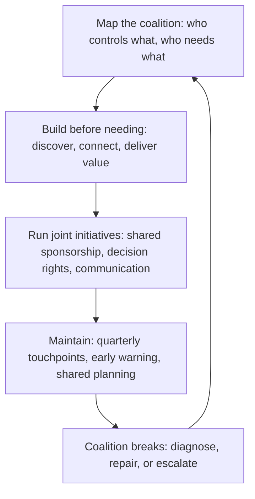

# Cross Functional Coalitions

> **Core skill:** The principal builds and maintains alliances with leaders across finance, legal, security, product, and operations — so that major technical initiatives land with pre-alignment, not meeting battles.

## Why This Matters

At principal level, consequential technical initiatives cannot succeed within engineering alone. A platform investment needs the CFO to fund it and the CPO to prioritize the capacity it consumes. A security architecture change needs the CISO to endorse it and legal to confirm compliance. A build vs buy decision needs procurement to negotiate it and finance to model it. Every major initiative is a cross-functional endeavor, and the principal who lacks relationships with the leaders of those functions will spend their influence fighting battles in meetings that should have been won in conversations beforehand.

Cross-functional coalitions are not political alliances — they are the recognition that technical decisions have financial, legal, security, product, and operational dimensions, and that the principal must bring those functions into the decision before it is made, not after it is contested. The coalition is built before it is needed, maintained between initiatives, and tested when interests diverge.

## The Coalition Map

The principal maintains a deliberate map of cross-functional relationships: who holds what authority over the dimensions of technical decisions, and what the relationship needs to function.

| Function | What They Control | What the Principal Needs From Them | What They Need From the Principal |
|----------|------------------|-----------------------------------|-----------------------------------|
| **Finance** | Budget; capital allocation; ROI modeling; cost structure | Funding for major investments; cost modeling that reflects technical reality; partnership on build vs buy economics | Technology costs translated into financial models; honest ROI projections; early warning of cost overruns |
| **Legal** | Compliance; contracts; intellectual property; regulatory exposure | Guidance on compliance requirements before architecture is set; contract review for vendor and partner agreements; IP strategy for open-source contributions | Early visibility into technology choices that have legal implications; technology explanations in terms legal can assess |
| **Security (CISO)** | Security architecture; risk acceptance; incident response authority | Endorsement of security architecture decisions; shared risk assessment; coordinated incident response | Early visibility into technology changes that affect the security posture; architectural context for security assessments |
| **Product (CPO)** | Product strategy; roadmap priority; build vs buy scope | Alignment on platform vs product investment; capacity allocation for technical initiatives; shared product-technology strategy | Technology's impact on product velocity and capability; honest assessments of what is technically feasible |
| **Operations** | Production environment; incident management; capacity planning | Operational requirements surfaced before architecture is set; partnership on reliability and observability standards | Architecture decisions that consider operational reality; early visibility into changes that affect production |
| **People and recruiting** | Hiring pipeline; compensation; career frameworks | Partnership on technical hiring strategy; career ladder alignment; employer brand for technical recruiting | Technology direction that shapes hiring needs; technical credibility for employer brand |

## Building Coalitions Before Needing Them

The coalition that is built during a crisis is transactional — it lasts as long as the crisis. The coalition that is built between crises is durable.

| Stage | Activity | Timing |
|-------|----------|--------|
| **Discovery** | Identify the leaders whose functions intersect with technology decisions; understand their priorities, constraints, and language | First 90 days in role, or annually for existing relationships |
| **Connection** | Establish a regular cadence: quarterly 1:1s, joint planning sessions, or shared working groups | Within 6 months of identifying the relationship |
| **Value delivery** | Deliver something the other function needs before asking for something you need: a cost model for finance, a compliance assessment for legal, a security architecture review for the CISO | Before the first ask |
| **Joint initiative** | Run a small cross-functional initiative together: a build vs buy analysis with finance, a compliance architecture review with legal, a security standard with the CISO | Within the first year |
| **Maintenance** | Regular touchpoints; sharing relevant information before it is asked for; celebrating joint wins | Ongoing, at least quarterly |

## Running Cross-Functional Technical Initiatives

When a technical initiative requires cross-functional participation, the principal runs it as a coalition effort, not an engineering effort with stakeholders informed.

### Cross-Functional Initiative Structure

| Element | Design |
|---------|--------|
| **Sponsorship** | At least one executive sponsor from each affected function. The principal is the technical sponsor; finance, legal, or product leaders are co-sponsors. |
| **Decision rights** | Defined explicitly: which decisions are the principal's, which are the CFO's, which are joint, and what the escalation path is for disagreements. |
| **Working group** | Representatives from each function, empowered to do the work and authorized to make recommendations to sponsors. The principal chairs or co-chairs. |
| **Communication** | Regular updates to all sponsors in a shared format; no function learns about a decision through backchannels. |
| **Success measures** | Defined jointly and measured in terms each function values: not just technical metrics, but cost, compliance, risk, and product outcomes. |

### The Joint Decision Memo

When a cross-functional initiative reaches a decision point, the principal writes a joint memo that reflects the coalition's shared analysis, not just engineering's recommendation:

```markdown
# Joint Decision Memo: [Decision]

## Sponsors
- Technical: [principal]
- Financial: [CFO or delegate]
- Legal: [GC or delegate]
- Product: [CPO or delegate]
- Security: [CISO or delegate]

## Decision Requested
[What is being decided, by whom, by when]

## Functional Assessments
| Function | Assessment | Risk | Recommendation |
|----------|-----------|------|---------------|
| Engineering | [assessment] | [risk] | [recommendation] |
| Finance | [assessment] | [risk] | [recommendation] |
| Legal | [assessment] | [risk] | [recommendation] |
| Security | [assessment] | [risk] | [recommendation] |

## Joint Recommendation
[The coalition's shared recommendation, with any dissenting views documented]
```

## Coalition Maintenance

Coalitions decay without maintenance. The principal invests in maintaining relationships between initiatives.

| Maintenance Practice | Frequency | Activity |
|---------------------|-----------|----------|
| **Quarterly touchpoint** | Quarterly | 30-minute 1:1 with each key functional leader: what is coming that affects their function, what they need from engineering |
| **Shared planning** | Per planning cycle | Joint planning sessions where engineering, product, and finance align on the investment portfolio for the coming cycle |
| **Early warning** | On-demand | The principal alerts functional leaders to technology changes that will affect them before the change is public |
| **Joint win celebration** | After joint initiatives | The principal ensures credit flows to all coalition partners, not just engineering |
| **Coalition health check** | Semi-annual | Honest assessment with each partner: is the relationship working? What needs to change? |

## When Coalitions Break

Coalitions break when interests diverge, when trust is breached, or when one partner consistently takes without giving. The principal's response determines whether the coalition can be repaired.

| Break Signal | Diagnosis | Response |
|-------------|-----------|----------|
| **Partner disengages** | The partner stops attending, responding, or contributing | Direct conversation: "I have noticed less engagement. Is the coalition no longer serving your needs, or is there something I should be doing differently?" |
| **Decisions are contested in meetings** | Pre-alignment has failed; the coalition is not doing its work | Return to pre-alignment: the principal meets with the partner before the next meeting to resolve the disagreement outside the room |
| **Partner blocks unilaterally** | A function exercises a veto without coalition discussion | Escalation to the partner's leader or joint escalation to the CEO if the block threatens an organization-critical initiative |
| **Trust breach** | A partner shares confidential coalition discussion outside the coalition | Direct conversation: name the breach, describe its impact on trust, and ask what will change |
| **Irreconcilable interest divergence** | The functions' interests genuinely conflict and no compromise is possible | Escalate to the CEO with a joint memo describing the conflict and the options for resolution |



## Practical Applications

### Coalition Map Template

```markdown
# Cross-Functional Coalition Map

| Function | Leader | What They Control | What I Need | What They Need | Relationship Health | Last Touchpoint | Next Touchpoint |
|----------|--------|-------------------|-------------|---------------|--------------------|----------------|-----------------|
| Finance | [name] | [budget, ROI, cost] | [need] | [need] | [strong / stable / needs attention] | [date] | [date] |
| Legal | [name] | [compliance, IP, contracts] | [need] | [need] | [strong / stable / needs attention] | [date] | [date] |
```

### Coalition Health Checklist

- [ ] A coalition map exists with all functions that intersect with technology decisions
- [ ] Each key relationship has a regular cadence: at least quarterly
- [ ] Value has been delivered to each partner before major asks are made
- [ ] At least one joint cross-functional initiative has been completed
- [ ] Joint decision memos are used for cross-functional decisions
- [ ] Coalition health is reviewed semi-annually with each partner
- [ ] Broken coalitions are addressed directly, not ignored until they block an initiative

## Common Pitfalls

| Pitfall | Why It Is a Problem | Better Approach |
|---------|---------------------|-----------------|
| **Coalition only during crisis** | Relationships built under pressure are transactional and brittle | Build relationships before needing them; deliver value before asking for it |
| **Engineering-only framing** | The principal presents decisions in engineering terms and expects other functions to adapt | Frame decisions in terms each function values: cost for finance, risk for legal, velocity for product |
| **Taking without giving** | The principal always asks and never delivers; partners disengage | Deliver something the partner needs before asking for something you need |
| **No joint sponsorship** | Cross-functional initiatives have only engineering sponsorship; other functions are stakeholders, not owners | Every affected function provides a co-sponsor; the initiative is jointly owned |
| **Credit hoarding** | The principal takes credit for coalition successes; partners resent it | Credit flows to all partners; the principal celebrates the coalition, not themselves |
| **Ignoring broken coalitions** | A broken coalition blocks initiatives; the principal works around it instead of repairing it | Address breaks directly; escalate if irreconcilable; do not pretend the coalition exists when it does not |

## Success Indicators

- Major technical initiatives land with pre-alignment from affected functions
- Functional leaders seek the principal's input before decisions that affect technology
- Cross-functional initiatives have joint sponsorship and shared success measures
- Credit for joint successes flows to all partners
- The coalition map is current and every key relationship has had a touchpoint this quarter

## Related Topics

- [[01_Executive_Communication]]: the communication craft for each functional audience
- [[02_Advisory_Relationships]]: the one-on-one advisory dimension of coalition relationships
- [[06_Organizational_Conflict_Resolution]]: resolving conflicts when coalitions break
- [[01_Technology_Strategy/00_overview|Technology Strategy]]: the content coalitions align around
- [[career-path/11_Engineering_Manager/05_Organizational_Awareness_and_Influence/00_overview|Organizational Awareness and Influence (EM)]]: the manager's parallel coalition craft

## Summary

Cross-functional coalitions are the principal's mechanism for making major technical initiatives succeed across organizational boundaries. Built before they are needed — through discovery, connection, value delivery, and joint initiatives — and maintained between initiatives through regular touchpoints and early warning, coalitions turn meeting battles into pre-aligned decisions. The principal maintains a coalition map, runs cross-functional initiatives with joint sponsorship and shared decision rights, and addresses broken coalitions directly because a coalition that exists only in the principal's mind is a liability, not an asset.