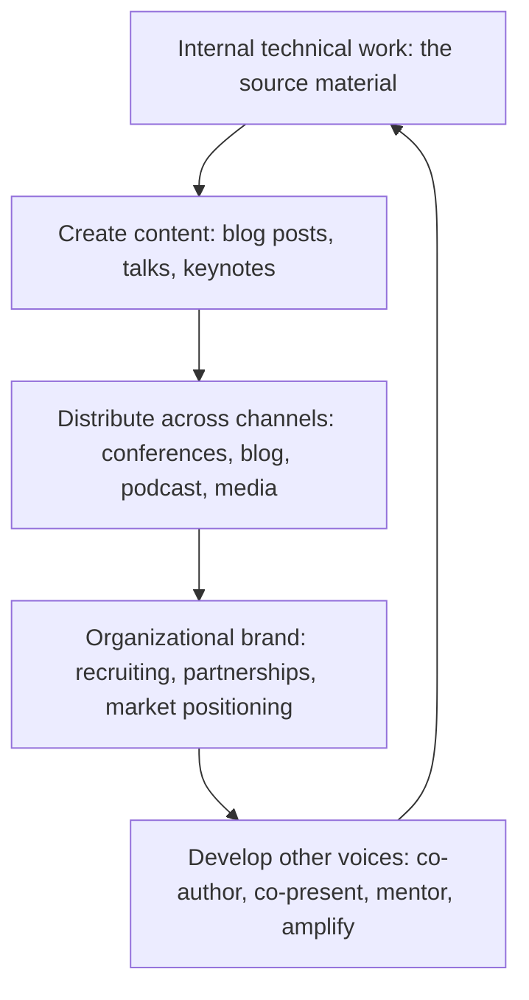

# Public Technical Voice

> **Core skill:** The principal develops and exercises an external technical voice — through conference keynotes, industry thought leadership, technical blog strategy, and media presence — that builds the organization's technical brand without becoming personal ego.

## Why This Matters

At principal level, the external voice is not a perk — it is an organizational asset. Conference keynotes position the organization's technology story in the industry narrative. Technical blog posts attract the engineers the organization wants to hire. Podcast appearances and media presence shape how analysts, partners, and potential customers understand the organization's technical capability. A principal with a strong external voice makes the organization technically legible to the outside world; a principal without one leaves that legibility to competitors, gossip, or silence.

The external voice is also fragile. It can shift from organizational brand-building to personal ego — keynotes that promote the principal, not the organization's work. It can consume time that the organization needs internally. It can create a single point of external representation that disappears when the principal leaves. The principal's skill is developing an external voice that serves the organization, balances visibility with internal work, and develops other voices so the organization's external presence is not one person deep.

## The External Voice Portfolio

The principal's external voice is not a single activity — it is a portfolio of channels, each with a distinct audience, purpose, and investment.

| Channel | Audience | Purpose | Frequency | Investment |
|---------|----------|---------|-----------|------------|
| **Conference keynotes** | Industry peers; potential hires; analysts; partners | Position the organization's technology story in the industry narrative; attract talent; shape market perception | 1-3 per year | 2-4 weeks preparation per keynote |
| **Conference talks** | Technical practitioners | Share technical depth; build credibility with the engineering community; recruit senior engineers | 2-4 per year | 1-2 weeks preparation per talk |
| **Technical blog** | Engineering community; candidates; internal engineers | Publish the organization's technical thinking; create a searchable corpus of the organization's engineering approach | 4-12 posts per year (some ghostwritten or co-authored) | 1-3 days per post |
| **Podcast appearances** | Broad technical audience; potential hires | Reach audiences that do not attend conferences; humanize the organization's technical story | 2-4 per year | 2-4 hours per appearance |
| **Media and analyst engagement** | Industry analysts; technology press | Shape how the organization is covered in industry reports and press | 2-4 per year | 1-2 days per engagement |
| **Social media presence** | Broad technical community | Amplify the organization's technical content; engage with industry conversations; build individual credibility | Ongoing, light-touch | 15-30 minutes per day |

## The External Voice as Organizational Brand

The principal's external voice is not about the principal — it is about the organization's technical story, told through a credible narrator. The distinction matters because an external voice built on personal brand leaves with the person; an external voice built on the organization's technical story persists.

| Personal Brand Voice | Organizational Brand Voice |
|---------------------|---------------------------|
| "I built this system..." | "Our team built this system, and here is the architecture that made it possible..." |
| Keynote about the principal's career journey | Keynote about the organization's technology strategy and the results it produced |
| Blog posts on the principal's personal blog | Blog posts on the organization's engineering blog, credited to the principal and the teams that did the work |
| Social media presence focused on personal opinions | Social media presence that amplifies the organization's technical content and engages industry conversations relevant to the organization |
| External presence that disappears when the principal leaves | External presence that continues because other voices have been developed |

The test: if the principal left tomorrow, would the organization's external technical voice survive? If not, the voice is personal brand, not organizational asset.

## Keynote Strategy

A principal's keynote is not a conference talk writ large — it is a strategic communication designed to position the organization's technology story in the industry narrative.

### Keynote Structure

| Segment | Duration | Content |
|---------|----------|---------|
| **The hook** | 2-3 minutes | A story, a surprising data point, or a question that captures the audience's attention and frames the talk's thesis |
| **The industry context** | 5-7 minutes | What is happening in the industry that makes this talk relevant now; the trend or challenge the organization is responding to |
| **The organization's approach** | 10-15 minutes | How the organization is addressing the challenge: the principles, the architecture, the results. Technical depth with narrative clarity. |
| **The results and lessons** | 5-7 minutes | What the organization learned; what worked, what did not; what the audience can apply |
| **The call to action** | 2-3 minutes | What the audience should do with what they learned; how to engage with the organization's work |

### Keynote Quality Standards

| Dimension | Standard |
|-----------|----------|
| **One idea** | The keynote communicates one idea, not five. The audience remembers one thing — make it the right thing. |
| **Stories over slides** | Stories carry technical depth better than bullet points. A story about a production incident teaches more than a diagram of the architecture that prevented it. |
| **Credit the teams** | Every result is a team result. Name the teams, show their photos, celebrate their work. The principal is the narrator, not the hero. |
| **Technical depth without exclusion** | The keynote is accessible to a broad audience without dumbing down. Technical depth is in the stories, not in the jargon. |
| **Rehearsed, not read** | The keynote is delivered from memory, not from slides or notes. The principal knows the material cold. |

## Technical Blog Strategy

The organization's technical blog is the most scalable external voice channel — it is discoverable forever, searchable, and not gated by conference acceptances.

| Blog Post Type | Purpose | Example |
|---------------|---------|---------|
| **Technical deep-dive** | Share technical depth; attract engineers who want to work on hard problems | "How We Migrated 500 Services to a New Service Mesh With Zero Downtime" |
| **Principle and practice** | Share the organization's engineering philosophy; attract engineers who share the values | "Why We Optimize for Operability Over Development Speed" |
| **Post-mortem** | Share incident analysis transparently; build trust through honesty | "The Outage of October 3rd: What Happened, What We Learned, What We Changed" |
| **Research and experiment** | Share early-stage technical exploration; position the organization as an innovator | "Experimenting With Formal Verification for Our Payment Pipeline" |
| **Engineering culture** | Share how the organization works; attract engineers who want that culture | "How We Run Architecture Reviews Without Bottlenecks" |

### Blog Post Quality Standards

| Dimension | Standard |
|-----------|----------|
| **One takeaway** | Every post has a clear takeaway for the reader. The reader finishes knowing something they can apply. |
| **Honest about failure** | Posts that only share successes are not credible. Share what went wrong and what was learned. |
| **Technical specificity** | Name the technologies, the numbers, the trade-offs. Vague posts do not build credibility. |
| **Credit the authors** | Every post carries the names of the engineers who did the work, even if the principal is the primary author. |

## Balancing External Visibility With Internal Work

The external voice consumes time that could be spent on internal work. The principal manages this tension deliberately.

| Principle | Practice |
|-----------|----------|
| **External serves internal** | The external voice exists to serve the organization's goals: recruiting, partnership, market positioning. If it is not serving those goals, reduce it. |
| **Time-box external investment** | Set an annual external time budget: e.g., 20 percent of time for external activities. Track against it. |
| **Batch external content** | A single technical deep-dive can become a blog post, a conference talk, and a podcast appearance. Create once, distribute across channels. |
| **Co-author to scale** | Not every blog post needs the principal as primary author. Co-author with the engineers who did the work; the principal provides framing and narrative structure. |
| **Say no to most invitations** | The principal will be invited to far more than they can accept. Decline most; accept only those that serve the organization's external strategy. |

## Developing Other External Voices

The principal should not be the organization's only external voice. Developing other voices is an investment in the organization's long-term external presence.

| Development Stage | Activity | Principal's Role |
|------------------|----------|-----------------|
| **Identify** | Find senior and staff engineers with technical depth, communication skill, and interest in external visibility | The principal identifies and invites |
| **Co-present** | The developing voice co-presents a conference talk or co-authors a blog post with the principal | The principal provides structure, narrative, and rehearsal |
| **Mentor** | The developing voice presents independently; the principal reviews content and provides feedback | The principal reviews, does not rewrite |
| **Amplify** | The developed voice has their own external presence; the principal amplifies it through their own channels | The principal signals: "This person speaks for our engineering organization" |
| **Repeat** | The developed voice mentors the next developing voice | The principal oversees the pipeline |



## Practical Applications

### External Voice Strategy Template

```markdown
# External Voice Strategy [Year]

## Objectives
- Primary: [recruiting, market positioning, partnership development, or talent brand]
- Secondary: [supporting objectives]

## Key Messages
- [Message 1]: the one thing the organization wants the industry to associate with its technology
- [Message 2]
- [Message 3]

## Channel Plan
| Channel | Activity | Timing | Owner | Investment |
|---------|----------|--------|-------|------------|
| Keynote | [conference, topic] | [date] | [name] | [time] |
| Blog | [post topic] | [date] | [author] | [time] |

## Time Budget
- Total external time: [percentage or days]
- Allocation by channel: [breakdown]

## Pipeline
| Developing Voice | Stage | Next Activity | Timeline |
|-----------------|-------|--------------|----------|
| [name] | [co-present / mentor / amplify] | [activity] | [date] |
```

### External Voice Health Checklist

- [ ] An annual external voice strategy exists with objectives and key messages
- [ ] External activities serve the organization's goals: recruiting, partnership, market positioning
- [ ] External time is budgeted and tracked
- [ ] Content is batched: one effort, multiple channels
- [ ] Credit flows to the teams that did the work, not just the principal
- [ ] At least one other external voice is in active development
- [ ] The external voice portfolio is reviewed annually for strategic alignment

## Common Pitfalls

| Pitfall | Why It Is a Problem | Better Approach |
|---------|---------------------|-----------------|
| **External voice as ego** | Keynotes and blog posts promote the principal; the organization's work is background | Make the organization's technology story the subject; credit the teams; the principal is the narrator |
| **No strategy** | External activities are ad-hoc — whatever conference accepts, whatever blog post is convenient | Annual external voice strategy with objectives, key messages, and a channel plan |
| **External at the expense of internal** | The principal is always traveling, always writing externally; internal influence atrophies | Time-box external investment; external serves internal, not the reverse |
| **Single point of external voice** | Only the principal represents the organization externally; voice disappears when the principal leaves | Develop other voices: co-author, co-present, mentor, amplify |
| **Shallow content** | Blog posts that are "we are hiring" with no technical depth; keynotes that are motivational without substance | Technical depth in every external artifact; the content must be worth the audience's time |
| **No internal coordination** | External messaging contradicts internal reality; candidates join and discover a different organization | Align external messaging with internal reality; the external voice describes the organization that exists, not the one that is aspired to |

## Success Indicators

- The organization is known in the industry for its technology, not just its products
- Candidates reference the principal's writing or talks in interviews
- Conference organizers invite the principal; the principal does not have to submit to CFPs
- At least one other engineer has an independent external voice developed through the principal's mentorship
- The external voice survives the principal's departure because other voices continue

## Related Topics

- [[04_External_Technical_Representation]]: the standards and consortia dimension of external presence
- [[03_Writing_for_Organizational_Impact]]: the writing craft behind external content
- [[01_Technology_Strategy/00_overview|Technology Strategy]]: the content the external voice communicates
- [[career-path/03_Staff_Engineer/04_Influence_and_Alignment/00_overview|Influence and Alignment (Staff)]]: the influence foundation this scales to external audiences
- [[career-path/02_Senior_Software_Engineer/06_Communication_and_Influence/01_Technical_Writing|Technical Writing (Senior)]]: the writing foundation

## Summary

The public technical voice is the principal's mechanism for building the organization's external technical brand — through conference keynotes, technical blog strategy, podcast appearances, and media presence that position the organization's technology story in the industry narrative. The voice is an organizational asset, not personal ego: credit flows to the teams, content serves the organization's goals, external time is budgeted, and other voices are developed so the organization's external presence is not a single point of failure. The principal's external voice makes the organization technically legible to the outside world — attracting talent, partners, and market attention that silence cannot reach.