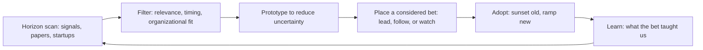

# Future Readiness and Research

> **Core capability:** The principal engineer scans the technology horizon, de-risks the future through prototypes and research, and builds the organization's capacity to adopt emerging technology before competitors do.

## Why This Matters

Organizations fail the future in two ways: adopting every new technology and losing coherence, or adopting nothing and losing relevance. The principal holds the balance — knowing which signals are early indicators of real shifts, which prototypes reduce genuine uncertainty, and when the organization should lead on adoption versus follow safely.

This area is also about institutionalizing readiness: research partnerships, internal labs, innovation mechanisms, and the culture that treats exploration as legitimate work, not slack. Without a principal who owns readiness, the future is someone's 20% time — and it shows.

## Topics in This Capability Area

| Topic | Core Skill | When It Matters |
|-------|------------|-----------------|
| [[01_Technology_Foresight]] | Horizon scanning; distinguishing signal from noise at enterprise scale | Continuously; annual strategy cycles |
| [[02_Emerging_Technology_Adoption_Strategy]] | Deciding when to lead, follow, or wait on new technology | New paradigms; disruptive shifts |
| [[03_Prototyping_and_Proof_of_Concept_Leadership]] | De-risking bets through experimentation | Before major investments |
| [[04_Research_Partnerships_and_Innovation_Ecosystems]] | Building academic, industry, and vendor research collaborations | Long-term capability building |
| [[05_Technical_Debt_Futures]] | Projecting debt growth and making the long-term case for modernization | Investment cycles; platform evolution |
| [[06_Decision_Making_Under_Deep_Uncertainty]] | Scenario planning, option value, hedging technical bets | Major irreversible decisions |
| [[07_Innovation_Mechanisms_and_Culture]] | Designing labs, funds, time, and incentives for innovation | Organizational growth; competitive pressure |

## The Foresight-to-Adoption Pipeline

The pipeline converts noise into organizational capability — not every quarter, but every year.

## Staff vs Principal

| Activity | Staff Engineer | Principal and Distinguished Engineer |
|----------|----------------|---------------------------------------|
| Horizon | Identifies near-term technology shifts | Scans multi-year technology trends and paradigm shifts |
| Prototypes | Runs spikes to inform architecture decisions | Designs research programs that reduce org-scale uncertainty |
| Partnerships | Technical evaluation of vendors | Builds research partnerships with academia and industry |
| Innovation | Proposes improvements | Designs the org's innovation mechanisms |

## Practical Applications

### Future Readiness Checklist

- [ ] A technology radar exists, is updated annually, and connects to strategy
- [ ] At least one major emerging technology is being de-risked through active prototyping
- [ ] Research partnerships exist with at least one academic or industry institution
- [ ] Technical debt futures are projected and inform investment cases
- [ ] The organization has a deliberate adoption posture for its top 3-5 technology shifts

## Common Pitfalls

| Pitfall | Why It Is a Problem | Better Approach |
|---------|---------------------|-----------------|
| **Hype-driven adoption** | Every new technology gets a pilot; nothing reaches production | Filter through strategy; adopt with commitment |
| **No-bets posture** | The organization never leads; always follows | Choose 1-2 strategic bets to lead on |
| **Research as hobby** | Prototypes that never connect to adoption decisions | Each prototype has exit criteria and an adoption gate |
| **Innovation theater** | Labs and hackathons without connection to real problems | Innovation tied to strategic bets and measurable outcomes |

## Success Indicators

- The technology radar predicts significant shifts before competitors act on them
- Major technology bets have clear de-risking evidence from prototyping
- Research partnerships produce tangible organizational capability
- Innovation mechanisms produce a pipeline of adopted improvements

## Related Capabilities

- [[01_Technology_Strategy/00_overview|Technology Strategy]]: foresight feeds strategy; strategy selects bets
- [[02_Enterprise_and_Systems_of_Systems_Thinking/00_overview|Enterprise and Systems of Systems Thinking]]: ecosystem analysis for technology trends
- [[career-path/03_Staff_Engineer/03_Technical_Strategy/02_Technology_Betting|Technology Betting (Staff)]]: the bet-sizing foundation this scales
- [[career-path/18_Applied_AI_Engineer/00_overview|Applied AI Engineer]]: one domain where future readiness is critical today

## Summary

Future readiness is the principal's institutional bet on tomorrow: scanning the horizon, de-risking through prototypes and research, choosing when to lead versus follow, and building the innovation mechanisms that treat exploration as legitimate work. The organization that never bets on the future arrives there unprepared — and the principal is the person paid to prevent that.