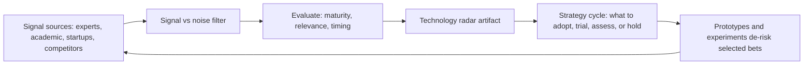

# Technology Foresight

> **Core skill:** The principal engineer builds and operates the organization's horizon-scanning capability — separating genuine technology signals from noise, maintaining the technology radar, and connecting foresight to strategic decisions at enterprise scale.

## Why This Matters

Most organizations discover technology shifts through vendor sales calls, competitor press releases, or the loudest internal enthusiast. The result is reactive adoption: decisions driven by marketing noise rather than structured evaluation of what matters. Technology foresight replaces noise with signal — a systematic capability that identifies emerging technologies, evaluates their maturity and relevance, and feeds curated insight into the strategy cycle before decisions become urgent.

The principal's foresight responsibility is distinct from the staff engineer's near-term horizon scanning. At this level, the span extends to multi-year paradigm shifts — changes in computing models, platform architectures, or industry dynamics that rewrite assumptions. The principal must also institutionalize the capability so that foresight survives individual departure: the technology radar is an artifact, the expert network is maintained, and the scanning process runs on a cadence that does not depend on a single person's curiosity.

## The Technology Radar

The radar is the central foresight artifact — a living map of technologies positioned by maturity and organizational relevance. It answers the question: what should we be watching, learning, or adopting?

| Ring | Meaning | Organizational Response |
|------|---------|------------------------|
| **Adopt** | Proven and strategic; should be the default | Standardize; build org capability |
| **Trial** | Promising for specific use cases; worth active exploration | Run prototypes; de-risk with bounded experiments |
| **Assess** | Worth understanding; not yet ready for investment | Deepen knowledge through research and conference tracking |
| **Hold** | Evaluated and deferred; not relevant now | Record the evaluation; revisit at the next radar cycle |

| Quadrant | Scope | Example Categories |
|----------|-------|-------------------|
| **Techniques** | How we build: processes, practices, methods | Event-driven architecture, chaos engineering, continuous verification |
| **Tools** | What we build with: frameworks, platforms, services | Observability platforms, service meshes, LLM coding assistants |
| **Platforms** | What we build on: infrastructure, runtimes, standards | Kubernetes, WASM, confidential computing |
| **Languages and Frameworks** | What we express in: programming languages, DSLs, libraries | Rust, WebAssembly, GraphQL federation |

The radar is updated annually with quarterly checkpoint reviews. Each entry carries an evidence trail: the signal sources, the evaluation rationale, and the recommended posture for the coming cycle.

## Signal Sources and Scanning Methods

Systematic foresight requires multiple input channels. No single source is reliable enough on its own.

| Method | What It Produces | Cadence | Principal's Role |
|--------|-----------------|---------|-----------------|
| **Expert networks** | Curated insight from researchers, practitioners, and domain specialists | Quarterly interviews or roundtables | Build and maintain the network; synthesize findings |
| **Academic monitoring** | Early research signals from top conferences and journals | Per-conference digest | Identify conferences that matter; assign coverage |
| **Startup and venture tracking** | Market signals from funding rounds, new entrants, and acquisition patterns | Monthly scan | Filter for organizational relevance; connect to strategy |
| **Competitor technology intelligence** | Adversary posture on specific technologies | Continuous with quarterly synthesis | Frame the intelligence questions; prevent confirmation bias |
| **Internal experimentation results** | Data from prototypes and PoCs that tested a signal | Per-experiment | Ensure experiment results feed back into the radar |
| **Industry analyst synthesis** | Aggregated market perspective (Gartner, Forrester, Thoughtworks) | Annual | Treat as one input among many; never the sole source |

The principal's role is not to read every paper or attend every conference. It is to design the scanning system, assign coverage across the organization, and synthesize the signals into a coherent view that strategy can consume.

## Signal vs Noise: The Discrimination Framework

Not every new technology matters. The principal must distinguish signals — indicators of genuine, durable change — from noise: hype cycles, vendor narratives, and enthusiasm masquerading as evidence.

| Signal Characteristic | Noise Characteristic |
|----------------------|---------------------|
| Sustained attention across independent sources over multiple quarters | Sudden spike in attention from a single source or community |
| Multiple organizations report measurable outcomes from adoption | Anecdotal success stories without quantitative evidence |
| Ecosystem growth: tools, talent, training, and community infrastructure | Single-vendor dependency with no independent ecosystem |
| Solves a problem the organization actually has or will have | Solves a problem the organization does not experience |
| Aligned with the organization's strategic direction and capability profile | Misaligned: requires capabilities the organization cannot build |

The framework is applied at each radar review. A technology that scores high on noise characteristics stays in Hold or is removed entirely.

## The Foresight Pipeline



The pipeline is a feedback loop: experiments produce data that refines the radar, and the radar feeds strategy decisions that trigger new experiments. The cycle turns annually with quarterly checkpoints.

## Operating the Radar at Enterprise Scale

| Activity | Owner | Cadence |
|----------|-------|---------|
| **Radar update** | Principal with technology strategy group | Annual, with quarterly checkpoint |
| **Signal collection** | Distributed: senior and staff engineers assigned to quadrants | Continuous |
| **Signal synthesis** | Principal or designated radar editor | Quarterly |
| **Adoption posture review** | Principal with CTO/VPE | Annual, aligned to strategy cycle |
| **Radar publication** | Principal | After each update; visible to the entire engineering org |

The radar is not a private artifact. Publication forces rigor: when every engineer can see why a technology sits in Adopt versus Hold, the evaluation must withstand scrutiny. Publication also creates buy-in — engineers who see their input reflected in the radar are more likely to trust its recommendations.

## Practical Applications

### Foresight Readiness Checklist

- [ ] A technology radar exists, is published org-wide, and updated within the last 12 months
- [ ] At least three independent signal sources feed the radar (not only analyst reports)
- [ ] Each radar entry has a written evaluation rationale and evidence trail
- [ ] Quarterly signal synthesis sessions are on the calendar with named participants
- [ ] The radar connects visibly to the annual technology strategy: each Adopt entry maps to an investment
- [ ] Expert network contacts are maintained; no single person holds all the relationships

### Radar Entry Template

```markdown
# Radar Entry: [Technology Name]

- Quadrant: [Techniques | Tools | Platforms | Languages and Frameworks]
- Ring: [Adopt | Trial | Assess | Hold]
- Maturity: [Emerging | Early Adopter | Early Majority | Late Majority | Declining]
- Relevance: [Strategic | Useful | Niche | Irrelevant]
- Signal sources: [conference paper / startup funding / competitor adoption / internal experiment]
- Rationale: [why this ring; what evidence supports it]
- Recommended posture for next cycle: [move ring / stay / remove]
- Who evaluated: [names]
- Review date: [date]
```

## Common Pitfalls

| Pitfall | Why It Is a Problem | Better Approach |
|---------|---------------------|-----------------|
| **Analyst report as sole signal** | Gartner and Forrester are lagging indicators; competitors read the same reports | Analyst reports are one input among several; supplement with primary signals |
| **Radar without strategy connection** | A beautiful radar that nobody uses to make decisions | Every Adopt entry maps to an investment; every Trial maps to a prototype |
| **Single-person scanning** | Foresight dies when the scanner leaves | Distribute coverage across senior and staff engineers; assign quadrants |
| **No evidence trail** | Evaluation rationale lost; decisions appear arbitrary | Write the rationale for every radar entry; revisit it at review time |
| **Technology enthusiasm as signal** | The loudest internal advocate determines what gets attention | Apply the signal-vs-noise framework before every evaluation |
| **Radar updated only in crisis** | The radar becomes a post-hoc justification for decisions already made | Annual update, quarterly checkpoint; the radar guides decisions, not the reverse |

## Success Indicators

- The technology radar predicts at least one significant industry shift before competitors act on it
- Strategy documents reference the radar: investment decisions trace back to radar evaluations
- Engineers across the organization can describe the radar's rings and what they mean for daily choices
- At least one technology was moved from Hold to Adopt based on new evidence, demonstrating the radar is alive
- Signal sources are maintained even when the principal is unavailable for a quarter
- The radar is cited in board-level or C-suite technology discussions as the org's view of the landscape

## Related Topics

- [[02_Emerging_Technology_Adoption_Strategy]]: the adoption posture decisions foresight enables
- [[03_Prototyping_and_Proof_of_Concept_Leadership]]: the experimental layer that validates foresight signals
- [[01_Technology_Strategy/00_overview|Technology Strategy]]: the strategy cycle that consumes radar output
- [[career-path/03_Staff_Engineer/03_Technical_Strategy/02_Technology_Betting|Technology Betting (Staff)]]: the bet-sizing discipline foresight feeds
- [[career-path/18_Applied_AI_Engineer/00_overview|Applied AI Engineer]]: a domain where foresight is urgent today

## Summary

Technology foresight is the principal's structured attention to the future: building and operating a technology radar that converts signals from expert networks, academic monitoring, startup tracking, and competitor intelligence into a coherent organizational view of what to adopt, trial, assess, or hold. The radar is a living artifact updated annually with quarterly checkpoints, supported by an evidence trail that forces rigor and a distributed scanning network that survives individual departure. The measure of foresight is not the radar's beauty — it is whether strategy decisions cite the radar and whether the organization sees the next shift before competitors do.