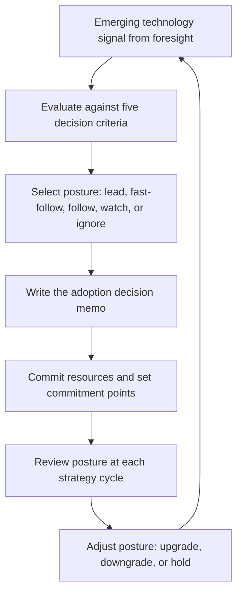

# Emerging Technology Adoption Strategy

> **Core skill:** The principal engineer defines the organization's deliberate posture on every significant emerging technology — choosing when to lead, fast-follow, follow, watch, or ignore — and writes the adoption decision memo that commits resources and sets exit criteria.

## Why This Matters

Organizations default to two failure modes on emerging technology: adopting everything new and losing coherence, or adopting nothing and losing relevance. The first produces a graveyard of half-adopted frameworks and abandoned platforms. The second produces a competitive disadvantage that compounds silently — the organization wakes up five years late to a shift its competitors rode from the start.

The principal's role is to make the posture deliberate. For each significant technology shift, the organization should be able to state its posture — lead, fast-follow, follow, watch, or ignore — and cite the reasoning. Deliberate postures are force-multiplying because they concentrate investment: leading on one technology means you are not leading on five others, and that honesty prevents the portfolio from becoming unfunded aspiration.

## The Adoption Posture Spectrum

| Posture | Definition | Organizational Commitment | Risk Profile |
|---------|-----------|--------------------------|-------------|
| **Lead** | Invest first; shape the ecosystem and set the standard | Heavy: dedicated team, public contribution, thought leadership | High risk, high differentiation potential |
| **Fast-follow** | Adopt early after leaders prove viability; compete on execution | Moderate: learning team, integration investment, rapid adoption | Medium risk, execution advantage |
| **Follow** | Adopt when the technology is mainstream and ecosystem is mature | Light: standard adoption, training, incremental migration | Low risk, no differentiation |
| **Watch** | Monitor without investment; reassess at each strategy cycle | Minimal: horizon scanning only; no capacity committed | Risk of falling behind if posture is wrong |
| **Ignore** | Deliberately not adopting; the technology does not fit strategy | None | Risk of misjudgment if posture is wrong |

The spectrum is not a maturity ladder — not every technology graduates from Watch to Lead. The right posture for most technologies is Follow or Watch. The principal's discipline is reserving Lead and Fast-follow for the one or two technologies where the organization can genuinely differentiate.

## Decision Criteria Per Posture

Selecting the right posture requires answering five questions for each technology.

| Criterion | Question | Lead Threshold | Fast-Follow Threshold | Follow Threshold |
|-----------|----------|---------------|----------------------|-----------------|
| **Strategic fit** | Does this technology differentiate our core business? | Directly enables a strategic differentiator | Supports a strategic capability | Improves commodity operations |
| **Organizational readiness** | Do we have the talent and absorptive capacity to adopt? | World-class team available; training capacity allocated | Strong team can learn; training plan exists | Standard hiring and training path exists |
| **Ecosystem maturity** | Is the technology, tooling, and community self-sustaining? | We are willing to contribute to ecosystem gaps | Ecosystem is early but trajectory is clear | Ecosystem is established and stable |
| **Reversibility** | Can we exit if the technology fails to deliver? | Irreversible: we are betting the org's direction | Partially reversible: integration layer limits lock-in | Fully reversible: exit costs are manageable |
| **Timing** | Is now the right moment or would a delay improve outcomes? | First-mover advantage is real and defensible | Early evidence of production viability exists | Technology is proven across multiple organizations |

A technology that fails to meet the threshold for at least Follow remains in Watch. A technology that does not align with strategy at all moves to Ignore — and the principal's job includes defending that decision against internal enthusiasm.

## When to Lead

Leading is the most expensive posture and should be reserved for technologies where the organization can build a durable advantage. The conditions for leading are specific and rare.

| Condition | Why It Matters | Test |
|-----------|---------------|------|
| **Strategic differentiation** | Leading on commodity technology wastes capacity | Does this technology change how customers choose between us and competitors? |
| **Absorptive capacity** | Leading requires world-class talent and dedicated investment | Can we name the team, the leader, and the protected capacity for 18 months? |
| **Ecosystem influence** | Leading means shaping standards, not just adopting them | Are we willing to contribute upstream, publish, and speak publicly? |
| **First-mover durability** | The advantage must survive fast-followers | Does leading create a moat: data, network effects, integration depth, or brand? |
| **Executive sponsorship** | Leading bets need air cover when they wobble | Does the CTO/VPE understand the risk and commit to the timeline? |

If three or more conditions are absent, the organization should fast-follow or follow — not lead. The principal's hardest discipline is saying no to leading when the enthusiasm is high but the conditions are not met.

## When to Follow

Following is not failure. For the majority of technologies, following is the correct posture. The organization gets proven technology without the cost of discovery.

| Indicator | Why Following Is Correct |
|-----------|--------------------------|
| The technology solves a commodity capability: logging, CI/CD, infrastructure provisioning | Differentiation comes from how you use it, not from having it first |
| The ecosystem is immature: documentation is sparse, talent is scarce, tooling is fragile | Let the ecosystem mature; adopt when the path is paved |
| The organization lacks absorptive capacity: teams are fully loaded, training budget is zero | Adopting early with no capacity guarantees failure |
| Multiple credible competitors have already adopted and published results | Learn from their mistakes; adopt with their playbook |

The discipline of following is honesty: calling a commodity a commodity instead of pretending it is strategic. Organizations that lead on too many fronts lead on none — they just take risks without capturing returns.

## The Adoption Decision Memo

Every posture change — from Watch to Trial, Trial to Adopt, or Adopt to Retire — is documented in a decision memo that survives the decision-makers.

```markdown
# Adoption Decision Memo: [Technology Name]

- Current posture: [Lead | Fast-Follow | Follow | Watch | Ignore]
- Proposed posture: [new posture]
- Strategic rationale: [why this posture; what evidence supports it]
- Decision criteria assessment: [score against the five criteria]
- What we give up: [what other bets lose capacity to fund this one]
- Adoption plan: [team, timeline, commitment points, training]
- Exit criteria: [conditions that trigger a posture downgrade]
- Reversibility: [one-way or two-way door; cost of reversal at each commitment point]
- Owner: [name of accountable principal or director]
- Review date: [next posture review]
- Approved by: [CTO, VPE, or architecture review board]
```

The memo is public. When every engineer can read why the organization is leading on Rust but following on WebAssembly, the posture is accountable — and the principal's reasoning is tested by the organization's collective intelligence.

## Posture Portfolio Management

The portfolio view prevents posture inflation: declaring ten Leads when only two can be funded.

| Portfolio Element | Healthy Range | Warning Signal |
|-------------------|---------------|---------------|
| **Lead postures** | 1-2 at any time | 3 or more: capacity is spread too thin |
| **Fast-follow postures** | 2-3 | 5 or more: the org is reacting, not choosing |
| **Posture changes per year** | 3-5 entries change ring | No changes: the radar is dead; 10+ changes: chasing shiny |
| **Ignore postures that hold** | Posture survives annual review with evidence | Posture flips to Follow after one enthusiastic hire |



## Practical Applications

### Adoption Strategy Checklist

- [ ] Every significant emerging technology has a documented posture (Lead, Fast-Follow, Follow, Watch, or Ignore)
- [ ] Lead postures are capped at 2; each has named team, leader, and protected capacity
- [ ] The five decision criteria are applied before any posture upgrade
- [ ] Adoption decision memos are written for every posture change and are publicly visible
- [ ] The posture portfolio is reviewed at each annual strategy cycle
- [ ] At least one technology was downgraded (Lead to Follow, or Trial to Hold) based on evidence in the last review
- [ ] The Ignore posture is used deliberately, not as the default for things nobody has evaluated

## Common Pitfalls

| Pitfall | Why It Is a Problem | Better Approach |
|---------|---------------------|-----------------|
| **Posture inflation** | Everything is Lead because nobody wants to admit they are following | Cap Lead at 2; force trade-off conversations when a third is proposed |
| **Default Follow** | The organization never leads; differentiation erodes over a decade | Choose 1-2 strategic bets where the conditions for leading are met |
| **No written rationale** | Posture decisions are tribal knowledge; they flip when advocates leave | Write an adoption decision memo for every posture change |
| **Leading without absorptive capacity** | The technology is adopted in name but never reaches production competence | Assess absorptive capacity before the posture decision; be honest about team readiness |
| **Posture as permanence** | A technology on Watch stays there for five years without re-evaluation | Annual posture review; every entry gets re-examined |
| **Ignoring with prejudice** | Dismissing a technology because the first evaluation was shallow or old | Document the evaluation; revisit when evidence changes |

## Success Indicators

- Every engineer can name the 1-2 technologies the organization is leading on and why
- The adoption decision memo for each posture change is publicly accessible and cited in strategy documents
- At least one posture was downgraded based on evidence in the last review cycle
- The organization's adoption posture on key technologies is consistent with its competitive position in the market
- Posture decisions survive the departure of their original advocates

## Related Topics

- [[01_Technology_Foresight]]: the scanning capability that identifies what to posture on
- [[03_Prototyping_and_Proof_of_Concept_Leadership]]: the de-risking layer before posture commitments
- [[01_Technology_Strategy/00_overview|Technology Strategy]]: where adoption postures become strategy
- [[career-path/03_Staff_Engineer/03_Technical_Strategy/02_Technology_Betting|Technology Betting (Staff)]]: the bet taxonomy this scales to org-level
- [[career-path/18_Applied_AI_Engineer/00_overview|Applied AI Engineer]]: a domain where posture decisions are urgent and consequential

## Summary

Emerging technology adoption strategy is the principal's discipline of deliberate posture: classifying every significant technology as Lead, Fast-Follow, Follow, Watch, or Ignore based on strategic fit, organizational readiness, ecosystem maturity, reversibility, and timing. The posture portfolio is managed as a constrained set — no more than two Leads at any time — with every posture change documented in a public adoption decision memo that survives the decision-makers. The discipline is not picking winners; it is reserving the most expensive postures for the technologies that genuinely differentiate, following deliberately on everything else, and re-examining every posture annually.