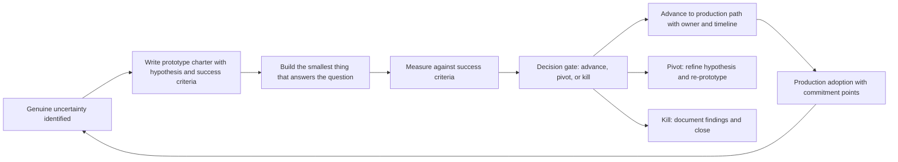

# Prototyping and Proof of Concept Leadership

> **Core skill:** The principal engineer designs and leads large-scale prototypes and research spikes that answer genuine organizational uncertainty, using the prototype charter to make every experiment a decision — not a hobby — with clear success criteria, exit gates, and a path to production for those that pass.

## Why This Matters

Prototypes that drift are one of the most expensive forms of organizational waste: teams spend months building things that were never intended to ship, learning nothing transferable, and producing artifacts that nobody can use. The principal's job is to make every prototype a structured experiment — a hypothesis tested under controlled conditions, with success criteria named before the first line of code, and an explicit decision gate at the end.

At the principal level, prototyping shifts from team-scale spikes to organization-scale research programs. These are not two-week explorations of a library; they are multi-team efforts that test whether a new architecture, platform, or paradigm can support production workloads at the organization's scale. The principal designs the experiment, frames the hypothesis, selects the right scope for genuine uncertainty reduction, and ensures the results inform real investment decisions rather than gathering dust.

## The Prototype Charter

Every prototype that consumes more than a few engineer-weeks gets a charter — a written document that makes the experiment a decision, not an exploration.

```markdown
# Prototype Charter: [Name]

- Hypothesis: [the belief we are testing; what we expect to find]
- Method: [what we will build, how we will test it, what data we will collect]
- Scope boundary: [what is in scope; what is explicitly excluded to prevent drift]
- Success criteria: [the quantitative or qualitative evidence that confirms the hypothesis]
- Failure criteria: [the evidence that disproves the hypothesis]
- Duration: [start date, end date, with a hard stop]
- Team: [names, roles, percentage allocation]
- Decision gate: [who decides to advance, pivot, or kill; when they decide]
- Output artifact: [the deliverable: a report, a demo, a running system, a recommendation]
- Production path: [if successful: what happens next; who owns the transition]
```

The charter is public. When everyone can read the hypothesis and the success criteria, the experiment cannot be retconned into a success after the fact — and the political pressure to declare everything a win is preempted by the written record.

## Designing Experiments That Answer Genuine Uncertainty

Not all uncertainty deserves a prototype. The principal must distinguish between genuine uncertainty — things the organization does not know and needs to know before committing — and engineering anxiety: the desire for certainty that cannot be achieved without shipping.

| Uncertainty Type | Prototype Design | Example |
|-----------------|------------------|---------|
| **Performance** | Build a scaled-down version of the critical path; measure under load | Can this event store handle 50K writes per second with the latency budget we need? |
| **Integration complexity** | Wire the new component into the existing system at one integration point | Does this identity provider actually work with our 15 legacy services? |
| **Developer experience** | Have one team use the new tool/platform for a real feature; measure friction | Can a typical product team adopt this new deployment pipeline without losing velocity? |
| **Operational readiness** | Run the new component in production shadow mode; observe failure modes | What breaks when this service runs at 3 AM with real traffic patterns? |
| **Ecosystem viability** | Build a non-trivial feature using only community libraries and documentation | Is the library ecosystem mature enough to support our use case without us writing everything? |

The prototype scope should be the smallest thing that answers the uncertainty — not a miniature version of the production system. The principal's discipline is scope negotiation: resisting the pressure to build more than the hypothesis requires.

## Prototype Scale and Scope

| Scale | Scope | Duration | Team Size | When to Use |
|-------|-------|----------|-----------|-------------|
| **Spike** | One specific question: a library, an API call, a query pattern | Days to 1 week | 1-2 engineers | Technical unknowns with narrow scope |
| **Focused prototype** | One system component tested in isolation | 2-4 weeks | 2-3 engineers | Single-dimension uncertainty: performance, integration |
| **Integration prototype** | Multiple components wired together; end-to-end path | 4-8 weeks | 3-5 engineers | Cross-system uncertainty: does the architecture hold together? |
| **Production shadow** | The new system runs on real traffic without serving users | 8-12 weeks | 4-8 engineers | Operational uncertainty: what happens under real conditions? |

The principal sponsors integration prototypes and production shadows. Spikes and focused prototypes are delegated to staff and senior engineers but reviewed at decision gates.

## The Prototype-to-Production Pipeline



The pipeline is a funnel: many spikes, fewer prototypes, very few production transitions. The principal owns the funnel design and the decision gates.

## Killing Prototypes

The hardest prototype discipline is killing the ones that disprove their hypothesis. Organizations resist killing experiments for the same reasons they resist killing any investment: sunk cost, advocate attachment, and the political cost of admitting a bet did not work out.

| Kill Signal | Response |
|-------------|----------|
| Failure criteria triggered | Kill immediately; document findings; celebrate the learning |
| Hypothesis disproven but team wants to "try a different approach" | Require a new charter with a new hypothesis; do not extend the current prototype |
| Prototype succeeded but production path is unclear | Do not advance; resolve the production path before committing more capacity |
| Prototype drifted beyond scope without answering the original question | Kill or restart with scope discipline; the current effort is not a prototype |

The principal models kill discipline: publicly celebrating a killed prototype whose findings saved the organization from a bad investment. The message is that killing is not failure — it is the expected outcome of honest experimentation — and the career consequence for a well-run killed prototype is positive, not negative.

## Prototype Governance

| Decision | Who Decides | When |
|----------|-------------|------|
| **Charter approval** | Principal or architecture review board | Before capacity is allocated |
| **Mid-experiment check** | Principal or sponsor | At the halfway point: is the hypothesis still testable? |
| **Decision gate** | Principal with charter signatories | At the scheduled end date; no extensions without a new charter |
| **Production transition** | CTO, VPE, or senior architecture board | When the prototype passes its success criteria and a production path exists |

## Practical Applications

### Prototype Readiness Checklist

- [ ] Every prototype above spike scale has a written charter with hypothesis, success criteria, and failure criteria
- [ ] The prototype scope is the smallest thing that answers the uncertainty — nothing more
- [ ] Decision gates are on the calendar before the prototype starts
- [ ] The production path is identified before the prototype begins: who owns the transition if it succeeds
- [ ] At least one prototype was killed on failure criteria in the last two cycles
- [ ] Killed prototypes produce learning artifacts that are published and referenced in later decisions

## Common Pitfalls

| Pitfall | Why It Is a Problem | Better Approach |
|---------|---------------------|-----------------|
| **Prototype as production** | The prototype ships because nobody planned the transition | Write the production path into the charter before starting |
| **No failure criteria** | Every prototype is declared a success regardless of evidence | Name failure criteria in the charter; honor them at the decision gate |
| **Scope creep** | The prototype grows into a partial production system that is neither experiment nor product | Hard scope boundary in the charter; one scope gatekeeper with authority to say no |
| **Indefinite timeline** | Prototypes drift past their end date without a decision | Hard stop date in the charter; extensions require a new charter |
| **Learning that stays local** | The team learned something important but nobody else knows | Output artifact requirement: every prototype produces a written report or recorded demo |
| **No capacity for transition** | Prototype succeeds but the team that would adopt it is fully loaded | Confirm absorptive capacity before charter approval |

## Success Indicators

- Every prototype above spike scale has a written charter that anyone in the org can read
- Decision gates happen on schedule; prototypes do not drift past their end dates
- At least one prototype was killed on failure criteria and the killing is publicly celebrated as learning
- Prototype findings — both positive and negative — are cited in later architecture and investment decisions
- The ratio of prototypes that advance to production is tracked and compared against industry benchmarks for the domain
- Engineers volunteer for prototype teams because they trust the learning is valued regardless of outcome

## Related Topics

- [[01_Technology_Foresight]]: the scanning that identifies uncertainties worth prototyping
- [[02_Emerging_Technology_Adoption_Strategy]]: the posture decisions prototypes de-risk
- [[04_Research_Partnerships_and_Innovation_Ecosystems]]: academic and industry collaborations that produce prototype candidates
- [[career-path/03_Staff_Engineer/03_Technical_Strategy/02_Technology_Betting|Technology Betting (Staff)]]: the bet framework that prototypes test
- [[02_Enterprise_and_Systems_of_Systems_Thinking/00_overview|Enterprise and Systems of Systems Thinking]]: the system-level thinking needed for integration prototypes

## Summary

Prototyping at the principal level is structured experimentation at organizational scale: every prototype that consumes meaningful capacity gets a written charter with hypothesis, success criteria, failure criteria, a hard stop date, and a named decision gate. The prototype scope is the smallest thing that answers genuine uncertainty — not a miniature production system — and the pipeline from prototype to production is designed before the experiment begins. The principal's hardest discipline is killing prototypes that disprove their hypothesis and celebrating those kills as the expected, valuable output of honest experimentation.