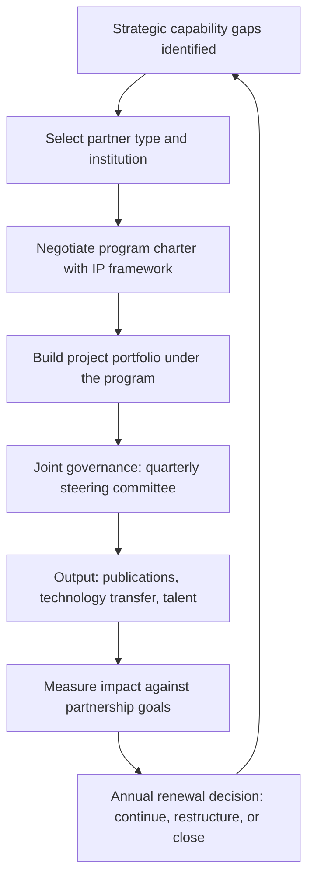

# Research Partnerships and Innovation Ecosystems

> **Core skill:** The principal engineer builds and sustains research partnerships with academic institutions, industry research labs, and vendor innovation programs — structuring collaborations that produce tangible organizational capability while navigating IP, publication, and incentive alignment across fundamentally different organizational cultures.

## Why This Matters

No organization can invent everything internally. The capabilities that will matter in five years are being developed today in academic labs, industry research groups, and startup ecosystems. Organizations that lack deliberate research partnerships discover these capabilities through hiring or acquisition — expensive, reactive mechanisms that compound the cost of being late.

The principal's role is to build the bridges: selecting the right partners, structuring research programs that align academic incentives (publication, novelty) with organizational incentives (capability, differentiation), and managing the IP and publication tensions that kill most collaborations. A well-structured research partnership is a low-cost option on the future — the organization pays attention and modest funding now for the right to adopt early when the research matures.

## Partnership Types and Selection

| Partnership Type | What It Produces | Duration | Organizational Commitment | Best For |
|-----------------|------------------|----------|--------------------------|----------|
| **Academic research collaboration** | Published papers, PhD student engagement, foundational capability exploration | 2-5 years | Funding, data, problem statements, co-supervision | Deep technology bets; talent pipeline |
| **Industry research lab engagement** | Joint prototypes, shared infrastructure, pre-competitive standards | 1-3 years | Engineering time, infrastructure access, co-development | Applied research near production |
| **Vendor innovation partnership** | Early access to vendor roadmaps, co-development of features, influence on product direction | 6-18 months | Adoption commitment, design partnership, reference customer status | Platform and tooling bets |
| **Open-source community participation** | Influence over project direction, capability building, reputation | Ongoing | Contributor time, maintainer development, community leadership | Commodity capabilities; ecosystem influence |
| **Startup collaboration and corporate venture** | Early access to emerging technology, acquisition optionality, market intelligence | Variable | Investment, design partnership, integration | Disruptive technology monitoring |

The principal selects the partnership type based on the capability gap and the time horizon. Near-term capability needs (1-2 years) favor vendor partnerships. Long-term exploration (3-5 years) favors academic collaborations. Everything in between is the domain of industry labs and open-source engagement.

## Selecting Partners

| Criterion | Why It Matters | Assessment Method |
|-----------|---------------|-------------------|
| **Research alignment** | The partner's research direction must intersect with the organization's strategic interests | Review publications, talk to faculty, assess trajectory over 3 years |
| **Cultural compatibility** | Academic and industry timelines, incentives, and communication norms differ fundamentally | Joint workshop before committing; test collaboration on a small project first |
| **IP terms viability** | The organization needs access to results; the partner needs publication rights | Negotiate terms before the first project starts; do not defer IP discussions |
| **Talent pipeline potential** | Partnerships that produce hiring are more sustainable than those that only produce papers | Assess PhD placement history; create internship and postdoc pathways |
| **Institutional stability** | A partnership that depends on one professor is fragile | Diversify across faculty; confirm department-level commitment, not individual |

The principal's partnership portfolio should include 2-4 active collaborations at any time, with a mix of types and time horizons. More than that and attention fragments; fewer and the portfolio is not diversified.

## Structuring Research Programs

A research program is not a single project — it is an umbrella that supports multiple investigations under a shared theme, with governance that keeps both parties aligned.

| Component | Description | Example |
|-----------|-------------|---------|
| **Program charter** | Shared research theme, objectives, and success measures | "Scalable machine learning on heterogeneous hardware" |
| **Project portfolio** | 2-4 active projects under the theme, each with a named hypothesis | "Benchmarking sparse transformer inference on FPGA accelerators" |
| **Joint governance** | Quarterly steering committee: principal, faculty lead, one industry researcher | Progress review, resource allocation, project kill or pivot decisions |
| **Researcher exchange** | PhD interns at the organization; industry engineers visiting the lab | One intern per project per year; one visiting researcher per program |
| **IP framework** | Pre-negotiated: ownership, publication review, commercialization rights | Organization gets first right of refusal on commercialization; researcher gets publication right with 90-day review |
| **Output cadence** | Named deliverables on a schedule | Annual research report, one joint publication, one internal tech transfer |

## IP and Publication Considerations

The tension between academic publication needs and organizational IP protection is the most common failure mode for research partnerships.

| Issue | Academic Perspective | Organizational Perspective | Resolution Pattern |
|-------|---------------------|---------------------------|-------------------|
| **Publication timing** | Publish as soon as results are validated | File patents before publication; protect competitive advantage | 90-day review window before publication for patent filing and sensitivity review |
| **IP ownership** | University owns inventions made with university resources | Organization wants exclusive access to commercially relevant IP | Organization gets exclusive commercial license with a royalty back to the university; publication rights preserved |
| **Open-source release** | Code should be open to enable reproducibility | Code may contain competitive differentiation | Open-source the research artifacts; keep the production engineering proprietary |
| **Confidential data** | Research needs real data for validity | Real data cannot leave the organization | Provide synthetic or anonymized data; run experiments inside the organization's infrastructure |

The principal negotiates these terms once per partnership program, not once per project. A framework agreement that covers all projects under the program reduces friction and prevents IP discussions from killing momentum.

## Measuring Research Partnership Impact

| Measure | What It Shows | Collection Method |
|---------|---------------|-------------------|
| **Technology transferred to production** | The partnership produced capability the organization uses | Track patents, production features, and tools sourced from partnership output |
| **Talent hired** | PhD graduates and postdocs joined the organization | HR tracking; partnership as pipeline metric |
| **Publications with organizational impact** | Joint papers that advanced the field and the organization's reputation | Citation tracking; internal readership and application |
| **Early signal advantage** | The partnership gave the organization early warning of an industry shift | Post-hoc assessment: when did partners first discuss a shift, and when did it become industry-visible? |
| **Program renewal rate** | Partners want to continue; neither side is coasting | Annual renewal decision with explicit renewal criteria |



## Practical Applications

### Research Partnership Checklist

- [ ] Partnership portfolio includes 2-4 active collaborations with a documented mix of types and time horizons
- [ ] Each program has a written charter, IP framework, and joint governance structure
- [ ] At least one researcher exchange (intern or visiting researcher) is active per program
- [ ] Partnership impact is measured annually: technology transferred, talent hired, early signals captured
- [ ] At least one partnership was restructured or closed based on impact review in the last two years
- [ ] IP terms are negotiated before the first project starts; publication review windows are honored on schedule

### Partnership Charter Template

```markdown
# Research Partnership Charter: [Program Name]

- Partner: [institution, department, faculty lead]
- Research theme: [shared question or capability area]
- Duration: [start date, renewal date]
- Projects: [list of active projects with hypotheses and timelines]
- Governance: [steering committee members, meeting cadence]
- IP framework: [ownership, publication review, commercialization rights]
- Exchange program: [internship slots, visiting researcher commitments]
- Success measures: [technology transfer, talent, publication, early signal]
- Renewal criteria: [conditions for continuation beyond the current term]
```

## Common Pitfalls

| Pitfall | Why It Is a Problem | Better Approach |
|---------|---------------------|-----------------|
| **IP negotiation deferred** | The collaboration starts on enthusiasm; IP fights later kill the relationship | Negotiate and sign the IP framework before the first project starts |
| **Single-faculty dependency** | The partnership dies when the professor moves institutions | Diversify across faculty; get department-level commitment |
| **No technology transfer path** | Research produces papers but no organizational capability | Include a named tech transfer owner and a production adoption gate in the charter |
| **Publication blockage** | The organization sits on papers for competitive reasons; researchers lose trust | 90-day review window with a default of approval; block only when genuinely sensitive |
| **Partnership as charity** | Funding flows with no expectation of return; the organization gets nothing | Measure impact annually; close partnerships that do not produce value |
| **Too many partnerships** | Attention fragments across 8 collaborations; none gets adequate engagement | Cap at 4 active partnerships; close one before opening another |

## Success Indicators

- At least one technology in production traces its origin to a research partnership
- PhD graduates from partner institutions join the organization as senior or staff engineers
- The organization is cited in academic publications as an industry collaborator
- Partnership renewal decisions are informed by impact data, not inertia
- The principal can name the specific capability gap each partnership addresses

## Related Topics

- [[01_Technology_Foresight]]: partnerships as a primary signal source for the radar
- [[03_Prototyping_and_Proof_of_Concept_Leadership]]: prototypes that emerge from research collaborations
- [[07_Innovation_Mechanisms_and_Culture]]: internal innovation structures that complement external partnerships
- [[02_Enterprise_and_Systems_of_Systems_Thinking/00_overview|Enterprise and Systems of Systems Thinking]]: ecosystem thinking for partnership selection
- [[career-path/18_Applied_AI_Engineer/00_overview|Applied AI Engineer]]: AI research partnerships as the canonical current example

## Summary

Research partnerships and innovation ecosystems are the principal's external innovation capacity: selecting academic, industry, vendor, and open-source partners aligned with strategic capability gaps, structuring programs with pre-negotiated IP frameworks that respect both publication needs and commercialization rights, and governing the portfolio through joint steering committees and annual impact reviews. The well-run partnership is a low-cost option on the future — producing technology, talent, and early signals — and the principal's discipline is treating it as a managed investment, not charity, closing those that do not deliver and doubling down on those that do.