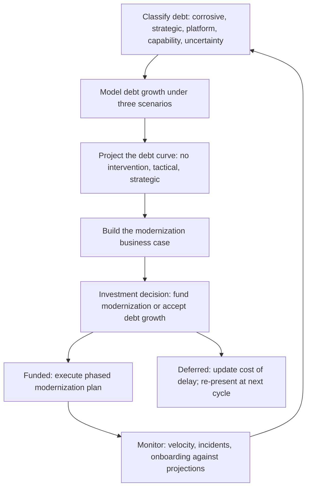

# Technical Debt Futures

> **Core skill:** The principal engineer projects how technical debt will grow under different scenarios, makes the long-term modernization business case that survives quarterly cost pressure, and distinguishes between debt that is corrosive, debt that is intentional, and debt that is a rational response to genuine uncertainty.

## Why This Matters

Technical debt is the easiest investment to defer and the hardest to fund. Every quarter, the business case for a feature ships in dollars and the business case for paying down debt ships in engineering intuition — and dollars win. The principal's job is to close that gap: projecting debt growth forward, quantifying the compounding cost of inaction, and making the modernization case in language that financial decision-makers recognize.

At the principal level, debt analysis is not a list of grievances about messy code. It is scenario modeling: given current architecture, team allocation, and growth trajectory, what does the debt curve look like in 2, 3, and 5 years? Where does it cross from manageable to crisis? And what investment now prevents a forced rewrite later? The principal translates engineering intuition into a business case that can compete for capital.

## Debt Classification

Not all technical debt is the same. The principal must classify debt by its impact and intentionality before any conversation about remediation makes sense.

| Debt Type | Definition | Example | Mitigation Posture |
|-----------|-----------|---------|-------------------|
| **Corrosive debt** | Accreted through neglect; compounds silently and reduces velocity every quarter | A core service with no tests, no documentation, and known crash-inducing edge cases | Remediate aggressively: this is an emergency wearing a routine label |
| **Strategic debt** | Taken on deliberately to accelerate time-to-market with a documented plan to repay | A monolith deployed first to capture a market window, with a documented decomposition roadmap | Monitor repayment schedule; escalate if the plan slips |
| **Platform debt** | Inherited from platform choices that aged poorly; expensive to change but stable | A self-managed database cluster that should be a managed service but is not failing | Schedule remediation at platform refresh cycles; do not emergency-rewrite |
| **Capability debt** | Missing capability that the organization needs but has not built; invisible until it blocks something | No observability platform; every incident investigation is a manual log grep | Build the capability as a platform investment, not a debt repayment |
| **Uncertainty debt** | Rational under-investment because the domain is shifting; building now would lock in the wrong thing | Delaying a data pipeline architecture because the ML platform strategy is unresolved | Time-box the uncertainty; decide by a named date |

Corrosive debt is the priority. Strategic debt is acceptable if the repayment plan is real. Platform debt is managed on the platform lifecycle. Uncertainty debt is rational and should not be prematurely "fixed" until the uncertainty resolves.

## Projecting Debt Growth: Models and Scenarios

The principal builds forward-looking models, not backward-looking audits. A debt model projects where the organization will be, not where it has been.

| Model Component | What It Quantifies | Data Source |
|----------------|-------------------|-------------|
| **Velocity erosion** | How much slower teams get per quarter due to accumulated debt in the systems they touch | Cycle time trends; team surveys; incident frequency |
| **Incident cost growth** | How much more the organization spends on incidents and remediation as debt accumulates | Incident count and severity trends; mean time to recovery |
| **Onboarding degradation** | How much longer new engineers take to become productive as system complexity grows | Time-to-first-commit and time-to-on-call metrics |
| **Migration cost escalation** | How much more expensive a rewrite or migration becomes with each quarter of delay | Migration cost estimates at T0, T+1 year, T+2 years; compound with growth |
| **Opportunity cost** | What the organization cannot build because capacity is consumed by debt drag | Feature throughput trends; abandoned or deferred capability investments |

### The Debt Projection Curve

Build three scenarios for every significant debt cluster:

| Scenario | Assumption | Investment Posture |
|----------|-----------|-------------------|
| **No intervention** | No dedicated debt repayment; teams address debt only within feature work | Baseline: what happens if we do nothing |
| **Tactical remediation** | Teams allocate 20% capacity to debt in their own systems | Partial: slows the curve but does not bend it |
| **Strategic modernization** | Dedicated team(s) address systemic debt with platform investment | Transformational: bends the curve downward |

The gap between the No Intervention curve and the Strategic Modernization curve is the cost of inaction. The principal's business case is built on that gap — and the compound cost of delaying intervention.

## The Modernization Business Case

A modernization business case speaks three languages: engineering (what changes), product (what improves for users), and finance (what it costs and what it returns).

| Section | Audience | Content |
|---------|----------|---------|
| **Current state** | All | Quantified debt: velocity erosion, incident cost, onboarding time, with trend lines |
| **Future state** | Engineering | Target architecture, capability improvements, debt eliminated |
| **Investment required** | Finance | Engineer-months, calendar quarters, opportunity cost of diverted capacity |
| **Return on investment** | Finance, Product | Velocity recovery, incident reduction, capability enablement, risk reduction — in dollars or delivery capacity |
| **Cost of delay** | Finance, Executive | How much more expensive and risky remediation becomes each quarter of inaction |
| **Non-investment scenario** | All | What happens if we do nothing: the projected crisis point |
| **Phased plan** | All | Commitment points, milestones, success measures per phase |

The principal writes the current state and the cost of delay. The rest is co-authored with engineering leadership and finance partners. The case must survive quarterly budget pressure — which means it is updated with fresh data each quarter and the cost of delay is recalculated from the present, not from the original proposal date.

## When Debt Is Intentional

Not all debt is failure. Some debt is a deliberate trade-off: the organization borrows speed now and commits to repaying later. The discipline is making the borrowing explicit.

| Intentional Debt Pattern | When It Is Rational | Required Safeguards |
|-------------------------|--------------------|---------------------|
| **Market window acceleration** | Launching a product before competitors capture the market | Documented repayment plan with dates and owner; executive sponsor accountable for honoring the plan |
| **Learning-first investment** | Building minimally to learn before committing to a durable architecture | Time-boxed learning period; rewrite commitment after learning resolves uncertainty |
| **Acquisition integration debt** | Integrating an acquired company's systems on a compressed timeline | Integration roadmap with explicit modernization milestones; budget reserved for the work |
| **Regulatory deadline compliance** | Shipping compliance changes by a hard regulatory date | Post-deadline remediation sprint scheduled before the deadline arrives |

The principal's role in intentional debt: require the repayment plan before the borrowing begins. Debt taken without a plan is corrosive debt with a better story.

## The Debt Futures Pipeline



## Practical Applications

### Debt Futures Checklist

- [ ] Debt is classified by type (corrosive, strategic, platform, capability, uncertainty) and documented
- [ ] Debt projection models exist for the top 3-5 debt clusters with trend data over at least 4 quarters
- [ ] A modernization business case exists for at least one significant debt cluster and is updated quarterly
- [ ] The cost of delay is calculated and presented with every deferral decision
- [ ] Intentional debt has a written repayment plan before the borrowing begins
- [ ] Debt projections are a standing input to the annual technology strategy and investment cycle

### Debt Projection Summary Template

```markdown
# Debt Projection: [Debt Cluster Name]

- Type: [Corrosive | Strategic | Platform | Capability | Uncertainty]
- Systems affected: [list]
- Teams affected: [list]
- Current impact: [velocity erosion %, incident count, onboarding time]
- Projection at T+2 years (no intervention): [impact forecast]
- Projection at T+2 years (strategic): [impact forecast after remediation]
- Cost of delay per quarter: [engineer-months, risk escalation]
- Modernization investment: [engineer-months, calendar time]
- Next review: [date]
```

## Common Pitfalls

| Pitfall | Why It Is a Problem | Better Approach |
|---------|---------------------|-----------------|
| **Debt as engineering emotion** | "The code is terrible" is not a business case; it is a feeling | Quantify debt through velocity, incidents, and onboarding metrics |
| **Debt repayment as all-or-nothing** | The modernization proposal is a rewrite so large it never gets funded | Phase the plan; show value at each commitment point |
| **Ignoring intentional debt** | Treating all debt as failure alienates teams who borrowed speed deliberately | Distinguish intentional debt with a repayment plan from corrosive debt without one |
| **No cost of delay** | Every quarter, the modernization case sounds the same; urgency never escalates | Calculate and present the cost of delay each quarter; show the compounding effect |
| **Projections without data** | The debt curve is hand-drawn on intuition; nobody believes it | Use cycle time, incident, and onboarding data; show trend lines, not snapshots |
| **Remediating uncertainty debt** | Investing heavily in a system whose future is unknown locks in the wrong architecture | Time-box the uncertainty; remediate only when the direction is clear |

## Success Indicators

- Debt projections influence at least one investment decision per strategy cycle
- The cost of delay is a recognized metric in engineering leadership discussions
- At least one intentional debt item has a documented repayment plan that is on schedule
- Modernization investments are phased and show measurable velocity or incident improvement at each milestone
- The organization can name its top 3 debt clusters and their projected trajectories

## Related Topics

- [[01_Technology_Foresight]]: foresight that identifies when platform choices will become debt
- [[06_Decision_Making_Under_Deep_Uncertainty]]: methods for deciding when to remediate under uncertainty
- [[03_Decision_Governance_and_Principles/00_overview|Decision Governance and Principles]]: the investment governance that funds modernization
- [[01_Technology_Strategy/00_overview|Technology Strategy]]: the strategy cycle that incorporates debt projections
- [[career-path/03_Staff_Engineer/06_Technical_Risk_and_Judgment/02_Architecture_Erosion|Architecture Erosion (Staff)]]: the erosion patterns that become debt futures

## Summary

Technical debt futures is the principal's forward-looking discipline: classifying debt by type and intentionality, projecting growth under multiple scenarios with quantitative models, building modernization business cases that translate engineering drag into financial cost of delay, and distinguishing corrosive debt from intentional borrowing with a documented repayment plan. The measure of success is not zero debt — it is that debt projections inform investment decisions and that the organization can name the date when each intentional debt will be repaid.