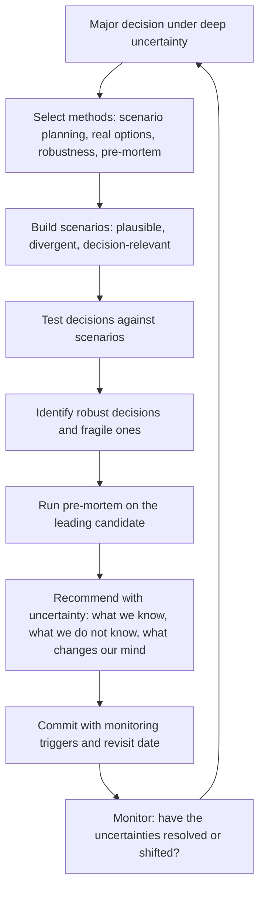

# Decision Making Under Deep Uncertainty

> **Core skill:** The principal engineer makes and frames major technical decisions when probabilities are unknown — using scenario planning, real options thinking, robustness testing, and minimax regret to guide irreversible investments, and communicating uncertainty to decision-makers without paralysis.

## Why This Matters

The hardest decisions in technology strategy are not the ones where you know the odds. They are the ones where the future is genuinely unknown: a platform choice that will shape a decade of work, a build-versus-buy decision where neither path is clearly superior, an architectural bet where the winning pattern will not be evident for years. Under deep uncertainty, standard decision tools fail — net present value requires a discount rate you cannot estimate, expected value requires probabilities you do not have.

The principal's role is to bring structure to these decisions: methods that produce defensible choices without pretending uncertainty can be eliminated, and communication that helps leadership understand what is known, what is not, and what evidence would change the decision. The goal is not certainty — it is a decision process that the organization can defend after the outcome is known.

## Decision Methods for Deep Uncertainty

| Method | How It Works | Best For | Limitation |
|--------|-------------|----------|------------|
| **Scenario planning** | Build 3-4 plausible futures; test decisions against each; prefer decisions that perform well across scenarios | Long-horizon architecture bets; platform strategy | Scenarios can embed hidden assumptions; quality depends on scenario diversity |
| **Real options** | Structure decisions as options that can be exercised later: small investment now buys the right to invest more when uncertainty resolves | Build-versus-buy; emerging technology adoption timing | Options have a cost; too many options become an unfunded portfolio |
| **Robustness testing** | Stress-test the preferred decision against extreme but plausible conditions; does it survive the worst case? | Mission-critical infrastructure; security architecture | The worst case is often worse than imagined; testing is bounded by imagination |
| **Minimax regret** | Choose the option that minimizes the maximum possible regret — the gap between what you chose and what you wish you had chosen | One-way door decisions; choices with asymmetric downside | Requires enumerating all possible regret scenarios; can produce conservative choices |
| **Pre-mortem at investment scale** | Before committing, assume the decision failed and work backward: what caused the failure? | Large investments; multi-year programs | Only surfaces known failure modes; cannot anticipate black swans |

The principal selects the method based on the decision's characteristics: horizon, reversibility, cost, and information availability. Most significant decisions use more than one method — scenario planning to frame the possibilities, real options to preserve flexibility, and a pre-mortem to surface hidden risks.

## Scenario Planning in Practice

Scenario planning is the workhorse method for multi-year technology strategy. The discipline is building scenarios that are plausible, divergent, and decision-relevant.

| Scenario Attribute | Requirement | Example |
|-------------------|-------------|---------|
| **Plausible** | Each scenario could happen; none is fantasy | "Cloud costs triple due to compute demand" is plausible; "alien technology arrives" is not |
| **Divergent** | Scenarios differ on the dimensions that matter for the decision | If the decision is about on-premises investment, scenarios must diverge on cloud cost, regulation, and talent availability |
| **Decision-relevant** | The scenarios differentiate between the candidate decisions | If every scenario favors the same decision, the scenarios are not adding information |
| **Named and narrated** | Each scenario has a memorable name and a short narrative | "Cloud Consolidation": hyperscalers capture 80% of enterprise compute; regulatory pressure favors concentration |

### Scenario Construction Process

| Step | Activity | Output |
|------|----------|--------|
| **Identify driving forces** | List the external factors that shape the decision's outcome | Technology maturity, regulation, competitor behavior, talent market, cost curves |
| **Rank by impact and uncertainty** | High-impact, high-uncertainty forces are the scenario axes | Two axes: typically the two highest-scoring forces |
| **Build the scenario matrix** | Four quadrants from two axes; each quadrant is a scenario | "High regulation + Rapid technology maturity" is one scenario |
| **Flesh out the narratives** | Write a one-page description of each scenario: what the world looks like, who wins, what matters | Qualitative narrative, not quantitative forecast |
| **Test the decisions** | For each candidate decision, assess performance in each scenario | Score or rank: which decision performs best in which scenarios? |

The output is not a prediction. It is a map of possibilities that reveals which decisions are robust (perform well across scenarios) and which are fragile (perform well in only one).

## Real Options Thinking

A real option is the right — but not the obligation — to make a larger investment later. In technology strategy, real options take several forms.

| Option Type | Technology Example | Exercise Trigger |
|-------------|-------------------|-----------------|
| **Deferral option** | Wait one quarter before committing to a new database; use the time to run benchmarks | Evidence that the leading candidate can meet the scale requirement |
| **Staged investment** | Build a prototype with 2 engineers before committing a 10-engineer team | Prototype passes success criteria; production path is confirmed |
| **Abandonment option** | Structure the contract or architecture so exit costs are bounded | Exit criteria triggered; better alternative emerges |
| **Growth option** | Invest in a platform component that enables future capabilities even if none are committed | A new product opportunity requires the capability the platform enables |

The principal's discipline: every major investment proposal should identify the real options embedded in it and the cost of those options. An option that costs nothing still consumes attention — and attention is finite.

## The Pre-Mortem at Investment Scale

The pre-mortem is a structured exercise: before committing to a decision, the team assumes the decision failed catastrophically and writes the post-mortem. The exercise surfaces risks that optimism suppresses.

| Pre-Mortem Step | Activity | Output |
|----------------|-----------|--------|
| **Failure assumption** | "It is 2029. The [decision] has failed. Write the post-mortem." | A list of failure causes, prioritized by plausibility and impact |
| **Cause clustering** | Group failure causes into themes: technology, organization, market, execution | Thematic risk map |
| **Mitigation design** | For each high-priority cause: what would we do differently now? | Design changes, monitoring triggers, exit criteria |
| **Decision adjustment** | Revise the decision or its implementation based on pre-mortem findings | Updated decision memo with risk mitigations |

The pre-mortem is not a box-checking exercise. It is a genuine attempt to kill the decision — and if the decision survives, it is stronger for having faced its own failure modes.

## Communicating Uncertainty to Decision-Makers

The principal's hardest communication challenge: presenting a decision under deep uncertainty to executives who want a recommendation, not a seminar.

| Communication Element | What It Conveys | Example |
|----------------------|-----------------|---------|
| **What we know** | The facts, data, and analysis that are not in dispute | "Our current architecture cannot handle the projected load at the 18-month horizon" |
| **What we do not know** | The genuine uncertainties that drive the scenario spread | "We cannot predict whether the ecosystem for Platform A or Platform B will be larger in 2028" |
| **What would change our mind** | The evidence that would flip the recommendation | "If Platform A ships its announced performance improvements by Q3, it becomes the clear choice" |
| **The recommendation with uncertainty** | "We recommend X, with the understanding that Y is the key uncertainty; we monitor Z and revisit at date D" | A decision, not a discussion — with a stated trigger for revisiting |
| **The cost of being wrong** | What happens if the recommendation is wrong and what the organization loses | "If we choose A and B wins, we lose 6 months of migration work and roughly 3 engineer-years" |

The framing is: here is what we recommend, here is what we do not know, here is when we will know more, and here is what we lose if we are wrong. Executives can commit to that.

## The Uncertainty Decision Framework



## Practical Applications

### Uncertainty Decision Checklist

- [ ] The decision method (scenario planning, real options, robustness, pre-mortem) is selected and documented before analysis begins
- [ ] Scenarios are plausible, divergent, and decision-relevant; not straw men that all favor the preferred option
- [ ] Real options are identified in every major investment proposal, with exercise triggers and option costs
- [ ] A pre-mortem is run on any decision exceeding a defined investment threshold (e.g., 50 engineer-years or a one-way door)
- [ ] The decision recommendation communicates what is known, what is not known, and what evidence would change the recommendation
- [ ] Monitoring triggers and a revisit date are set at the time of commitment

### Decision Memo Template Under Uncertainty

```markdown
# Decision Memo: [Decision Name]

- Decision: [what we are deciding]
- Candidate options: [list with brief descriptions]
- Scenarios considered: [scenario names and brief narratives]
- Robustness assessment: [which options perform well across scenarios; which are fragile]
- Real options embedded: [deferral, staging, abandonment, growth options with exercise triggers]
- Pre-mortem findings: [top failure causes and mitigations]
- Recommendation: [chosen option with uncertainty caveats]
- What we do not know: [genuine uncertainties with impact on the recommendation]
- What would change our mind: [evidence triggers for revisiting]
- Cost of being wrong: [if we are wrong, what happens and what it costs]
- Monitoring triggers: [what we watch and when we revisit]
- Decision date: [date]
- Revisit date: [date]
```

## Common Pitfalls

| Pitfall | Why It Is a Problem | Better Approach |
|---------|---------------------|-----------------|
| **Certainty theater** | Presenting a decision as certain when it is not; decision-makers lose trust when surprises arrive | Communicate uncertainty explicitly: what is known, what is not, what changes the recommendation |
| **Straw-man scenarios** | Building scenarios that all favor the preferred option; no genuine stress on the decision | Require at least one scenario where the preferred option fails; test it honestly |
| **Analysis paralysis** | Endless modeling delays the decision; the cost of delay exceeds the value of more analysis | Set a decision date; commit on schedule with the information available at that date |
| **Options without exercise triggers** | Real options are mentioned but nobody knows when to exercise them | Name exercise triggers in the decision memo; put them on a calendar |
| **Pre-mortem as ritual** | The pre-mortem is run but findings are ignored because the decision is already made | Run the pre-mortem early enough to change the decision; act on at least one finding |
| **One method only** | Relying on scenario planning alone when real options could preserve flexibility | Use multiple methods; they are complementary, not alternative |

## Success Indicators

- Major investment decisions are accompanied by scenario analysis and pre-mortem findings
- At least one decision was modified or deferred based on scenario testing or pre-mortem results
- Decision memos state what would change the recommendation and when the decision will be revisited
- Revisit dates are honored; decisions are re-examined when monitoring triggers fire
- Leadership can articulate the uncertainties behind a major decision and the conditions under which it would be reversed

## Related Topics

- [[05_Technical_Debt_Futures]]: debt models that inform uncertainty analysis on modernization timing
- [[03_Prototyping_and_Proof_of_Concept_Leadership]]: prototypes that resolve specific uncertainties before commitment
- [[03_Decision_Governance_and_Principles/00_overview|Decision Governance and Principles]]: the governance framework for major decisions
- [[career-path/03_Staff_Engineer/03_Technical_Strategy/02_Technology_Betting|Technology Betting (Staff)]]: the bet framework that handles known risks
- [[career-path/03_Staff_Engineer/05_Systems_Thinking_and_Organizational_Design/06_Models_for_Decision_Making|Models for Decision Making (Staff)]]: decision-modeling foundations

## Summary

Decision making under deep uncertainty is the principal's method for structuring choices when probabilities are unknown: selecting from scenario planning, real options, robustness testing, minimax regret, and pre-mortems based on the decision's characteristics, building scenarios that genuinely stress candidate options, identifying real options that preserve flexibility, and communicating recommendations with explicit acknowledgment of what is not known, what would change the recommendation, and when the decision will be revisited. The discipline is not eliminating uncertainty — it is making defensible decisions despite it and building monitoring triggers that ensure the organization adapts when uncertainty resolves.