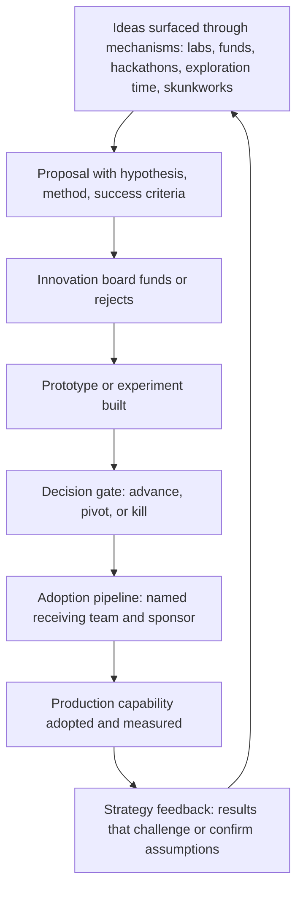

# Innovation Mechanisms and Culture

> **Core skill:** The principal engineer designs the organization's innovation capacity — internal labs, innovation funds, hackathon programs, dedicated exploration time, and skunkworks — and governs them so that exploration produces adopted capability, not innovation theater.

## Why This Matters

Innovation without mechanism is aspiration. When organizations declare "we value innovation" without structures that protect exploration from the gravity of quarterly delivery, innovation happens only when someone steals time from their day job — and the first thing cut under pressure is the thing that was never formally allocated. The principal's role is to design the mechanisms: structural commitments of time, money, and attention that treat exploration as legitimate work.

The harder discipline is governing innovation so that it connects to strategy and adoption. Labs that produce prototypes nobody uses, hackathons that generate enthusiasm that dissipates by Monday, and innovation funds that become slush funds for pet projects — these are innovation theater. The principal designs mechanisms that produce a pipeline of adopted improvements, measured by input quality (how the organization explores) and output adoption (what the exploration produces that ships).

## Innovation Mechanism Portfolio

| Mechanism | What It Is | Duration | Investment | Best For |
|-----------|-----------|----------|------------|----------|
| **Internal research lab** | A dedicated team exploring long-horizon problems; protected from quarterly delivery pressure | Ongoing (2+ year horizon) | High: dedicated headcount, infrastructure, leadership | Foundational technology bets; multi-year capability building |
| **Innovation fund** | A budget that teams compete for to pursue ideas outside their roadmap | Per-project (3-6 months) | Medium: pooled funding, rotating participation | Bottom-up innovation; ideas that do not fit any team's roadmap |
| **Dedicated exploration time** | Scheduled time (20% or similar) for engineers to pursue self-directed technical work | Ongoing (hours per week or sprint) | Low-medium: capacity allocation within existing teams | Capability building; tooling improvements; cross-pollination |
| **Hackathon program** | Time-boxed, high-energy events where cross-functional teams build working prototypes | 1-3 days, quarterly or biannual | Low: event logistics, prize budget | Energy, culture, cross-team collaboration, rapid prototyping |
| **Skunkworks** | A small team operating outside normal process to pursue a high-risk, high-reward idea | Bounded (3-12 months) | Medium: dedicated small team with autonomy | Radical ideas that would be killed by normal governance |
| **Innovation sprint** | A team takes a full sprint or cycle to explore a hypothesis with structured output | Per sprint (1-2 weeks) | Low: capacity allocation within existing teams | Hypothesis testing with immediate feedback |

The principal designs the portfolio based on organizational size, maturity, and strategic needs. A 50-person startup might only need exploration time and occasional hackathons. A 5,000-person engineering organization needs a lab, a fund, and a hackathon program — with the principal governing the connections between them.

## Innovation Metrics: Inputs, Not Outputs

The most common innovation failure is measuring output before the mechanism is mature. Innovation investments need input metrics first — is the organization actually exploring? — and output metrics later — is exploration producing adopted capability?

| Metric Type | Metric | What It Measures | When to Use |
|-------------|--------|-----------------|-------------|
| **Input** | Participation rate | Percentage of engineers who engaged with at least one innovation mechanism this year | First 2 years of a new mechanism |
| **Input** | Ideas surfaced | Number of proposals submitted to the innovation fund or hackathon program | Every cycle; trend over time |
| **Input** | Cross-team collaboration | Percentage of innovation projects that include members from multiple teams | Every cycle; a leading indicator of organizational learning |
| **Process** | Ideas to prototype rate | Percentage of submitted ideas that received funding and produced a working prototype | After year 1; measure funnel efficiency |
| **Process** | Prototype to adoption rate | Percentage of prototypes that graduated to a funded production project | After year 1; the key conversion metric |
| **Output** | Adopted capability from innovation | Production features, platforms, or tools that trace their origin to an innovation mechanism | After year 2; the ultimate measure |
| **Output** | Revenue or cost impact | Dollar impact of innovations that shipped | After year 3; requires a mature pipeline |

The principal protects early-stage innovation from premature output pressure. A hackathon program measured by production features in its first year will produce safe, incremental ideas — the opposite of what innovation mechanisms are for.

## Innovation Governance

Governance distinguishes innovation from chaos. Without governance, innovation mechanisms become unfunded mandates or slush funds. With too much governance, they become committees that kill everything interesting.

| Governance Element | What It Does | How It Works |
|-------------------|-------------|--------------|
| **Innovation board** | Reviews proposals, allocates funds, tracks the innovation portfolio | Cross-functional: principal, senior engineering leaders, product, and a rotating engineer member |
| **Proposal template** | Standardizes what every innovation proposal must answer | Hypothesis, method, success criteria, required resources, adoption path if successful |
| **Decision gates** | Points where innovation projects are reviewed for continuation or termination | Monthly or quarterly; same discipline as prototype gates |
| **Adoption pipeline** | The defined path from innovation prototype to funded production project | Named owner on the receiving team; adoption commitment before innovation project completes |
| **Portfolio view** | All active innovation projects visible in one place with status, investment, and expected outcome | Updated quarterly; reviewed by the innovation board |

The principal chairs the innovation board or delegates it to a trusted staff engineer. The principal's role is not to evaluate every proposal — it is to design the governance that evaluates proposals fairly, funds the best ones, and ensures the adoption pipeline exists.

## Connecting Innovation to Strategy

Innovation disconnected from strategy produces interesting but irrelevant output. Innovation tied too tightly to strategy produces incremental improvements dressed as breakthroughs. The principal holds the balance.

| Connection | How It Works | Example |
|-----------|-------------|---------|
| **Strategic themes** | The innovation fund publishes 2-3 strategic themes each cycle; proposals that align get priority but unaligned proposals are still considered | "Edge computing resilience" as a theme; proposals on this theme get preference but a brilliant database idea is not rejected |
| **Lab alignment** | The internal lab's research agenda is co-developed with the technology strategy group | The lab explores distributed systems patterns that support the 3-year platform strategy |
| **Adoption sponsorship** | Every innovation project that reaches prototype stage names a potential adopting team and a sponsor on that team | The adopting team commits to evaluating the prototype, not to adopting it |
| **Strategy feedback** | Innovation results that challenge strategy assumptions are surfaced to the strategy process | A prototype demonstrates that a key strategy assumption is false; the strategy adapts |

## The Innovation Pipeline



## Practical Applications

### Innovation Mechanism Checklist

- [ ] At least two innovation mechanisms are live and resourced (not aspirational): e.g., a fund and a hackathon program
- [ ] Innovation metrics track inputs (participation, ideas surfaced) in early years and outputs (adoptions, impact) after maturity
- [ ] An innovation board exists, meets on a defined cadence, and publishes its decisions
- [ ] The adoption pipeline is defined: every funded project knows who evaluates it for production adoption
- [ ] Strategic themes guide but do not gate innovation proposals
- [ ] Innovation results are fed back into the technology strategy cycle

### Innovation Proposal Template

```markdown
# Innovation Proposal: [Name]

- Hypothesis: [what we believe; what we will test]
- Method: [how we will test it; what we will build]
- Success criteria: [evidence that confirms the hypothesis]
- Required resources: [engineer-weeks, infrastructure, access, budget]
- Duration: [start and end dates]
- Strategic theme alignment: [which theme, if any; non-aligned is acceptable]
- Adoption path: [potential receiving team and sponsor, if known]
- Team: [names; cross-team participation encouraged]
```

## Common Pitfalls

| Pitfall | Why It Is a Problem | Better Approach |
|---------|---------------------|-----------------|
| **Innovation theater** | Labs, hackathons, and funds exist but produce nothing adopted | Measure adoption rate; close mechanisms that do not convert |
| **Premature output metrics** | Measuring production impact in year one kills risk-taking | Input metrics first; output metrics after the pipeline matures |
| **Innovation as elite activity** | Only a small group of designated innovators participates | Open innovation mechanisms to every engineer; the best idea can come from anywhere |
| **No adoption pipeline** | Prototypes are built but nobody is responsible for evaluating or adopting them | Every funded project names a receiving team and sponsor before the prototype completes |
| **Strategy disconnection** | Innovation produces interesting things that nobody needs | Publish strategic themes; require adoption path identification |
| **Mechanism proliferation** | Too many mechanisms fragment attention; none get adequate participation | Cap at 3-4 mechanisms; close one before opening another |

## Success Indicators

- At least one production capability in the last 18 months traces its origin to an innovation mechanism
- Innovation participation spans multiple teams and seniority levels; it is not concentrated in a single group
- The innovation board can describe the active portfolio and the status of each project
- At least one innovation project was killed at a decision gate, demonstrating the governance is real
- Engineers can name at least one innovation mechanism they could use if they had an idea

## Related Topics

- [[03_Prototyping_and_Proof_of_Concept_Leadership]]: the prototype discipline that innovation mechanisms feed
- [[04_Research_Partnerships_and_Innovation_Ecosystems]]: external partnerships that complement internal innovation
- [[01_Technology_Strategy/00_overview|Technology Strategy]]: the strategy cycle that sets innovation themes and receives innovation feedback
- [[career-path/03_Staff_Engineer/07_Organizational_Learning_and_Mentoring/03_Communities_of_Practice|Communities of Practice (Staff)]]: the community structures that surface innovation ideas
- [[career-path/18_Applied_AI_Engineer/00_overview|Applied AI Engineer]]: an innovation domain where mechanism design is urgent

## Summary

Innovation mechanisms and culture are the principal's structural commitment to exploration: designing a portfolio of labs, funds, hackathons, exploration time, and skunkworks that protect innovation from quarterly delivery pressure, governing them through an innovation board and decision gates that connect exploration to adoption, and measuring input quality before output impact so that mechanisms have time to mature before they are judged. The principal's legacy is not any single innovation — it is the mechanisms that keep producing innovation after the principal moves on.