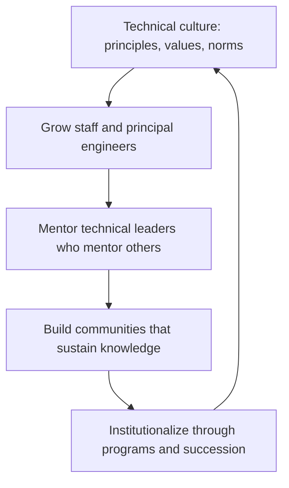

# Technical Culture and Leadership Development

> **Core capability:** The principal engineer builds the organization's technical culture — growing the next generation of staff and principal engineers, mentoring technical leaders, and leaving a legacy of engineering excellence that outlasts any individual.

## Why This Matters

The principal's most durable output is not a strategy document or an architecture — it is the technical leaders they grow. A principal who builds a bench of staff engineers, fosters a culture of technical excellence, and institutionalizes mentoring and community multiplies their impact for a decade after they leave.

At this level, mentoring shifts from individuals to systems: designing the programs, communities, and incentives that produce technical leaders at scale. The principal is also the culture carrier — the person whose behavior signals what the organization truly values in its senior engineers.

## Topics in This Capability Area

| Topic | Core Skill | When It Matters |
|-------|------------|-----------------|
| [[01_Building_Technical_Culture_at_Scale]] | Defining, modeling, and reinforcing engineering values | Always; culture degrades without attention |
| [[02_Growing_Staff_and_Principal_Engineers]] | Developing the pipeline from senior to staff and beyond | Succession planning; org growth |
| [[03_Mentoring_Technical_Leaders]] | Mentoring mentors; coaching staff engineers and tech leads | Leadership bench building |
| [[04_Technical_Community_Building]] | Building internal conferences, guilds, communities of practice | Knowledge sharing; cross-pollination |
| [[05_Diversity_in_Technical_Leadership]] | Building inclusive pathways to technical leadership | Representation gaps; pipeline diversity |
| [[06_Knowledge_Continuity_and_Succession]] | Ensuring technical knowledge survives attrition | Key-person risk; organizational memory |
| [[07_Engineering_Excellence_Programs]] | Recognition, internal publication, technical brand programs | Retention; quality signals; culture reinforcement |

## The Leadership Pipeline

The loop compounds: each generation of leaders builds the next.

## Staff vs Principal

| Activity | Staff Engineer | Principal and Distinguished Engineer |
|----------|----------------|---------------------------------------|
| Mentoring | Mentors seniors and leads | Mentors staff engineers and technical leaders |
| Culture | Models desired behavior | Owns culture strategy and institutionalization |
| Community | Runs a guild or community | Owns the community and knowledge-sharing architecture |
| Succession | Builds succession for their own role | Owns the technical leadership pipeline for the org |
| Recognition | Contributes to promotion cases | Designs recognition programs and advancement frameworks |

## Practical Applications

### Technical Culture Checklist

- [ ] Technical culture principles are written, communicated, and visible in decisions
- [ ] A pipeline of staff and principal candidates exists with development plans
- [ ] Technical communities meet, produce artifacts, and sustain without the principal's presence
- [ ] Knowledge continuity is measured: bus factor, onboarding speed, decision findability
- [ ] Engineering excellence is recognized through programs that set the standard

## Common Pitfalls

| Pitfall | Why It Is a Problem | Better Approach |
|---------|---------------------|-----------------|
| **Culture by personality** | Culture dies when the principal leaves | Institutionalize: programs, principles, communities |
| **Mentoring-as-monopoly** | One person gatekeeps all technical growth | Develop multiple mentors; grow mentor-of-mentors |
| **Community theater** | Guilds that meet but produce nothing | Output-focused communities: standards, reviews, learning artifacts |
| **Invisible succession** | No named successors; key-person risk unmanaged | Explicit succession plans for critical technical roles |

## Success Indicators

- Multiple staff and principal candidates progress through the pipeline each year
- Technical communities produce artifacts used in daily work
- The organization's technical culture is described consistently by new hires and veterans
- Key-person departures do not cause knowledge loss or capability gaps
- Promotion cases for staff+ cite the development programs the principal designed

## Related Capabilities

- [[01_Technology_Strategy/00_overview|Technology Strategy]]: culture enables strategy execution
- [[04_Organizational_Influence/00_overview|Organizational Influence]]: external voice shapes the internal culture
- [[career-path/03_Staff_Engineer/07_Organizational_Learning_and_Mentoring/00_overview|Organizational Learning and Mentoring (Staff)]]: the multi-team foundation this institutionalizes
- [[career-path/11_Engineering_Manager/01_People_Development/00_overview|People Development (EM)]]: the manager's complementary development role

## Summary

Technical culture and leadership development is the principal's compound interest: building a culture that produces excellent engineers, growing the staff and principal pipeline, mentoring technical leaders, institutionalizing communities and knowledge, and designing recognition that sets the standard. The principal's legacy is not a system — it is the people who can build systems without them.