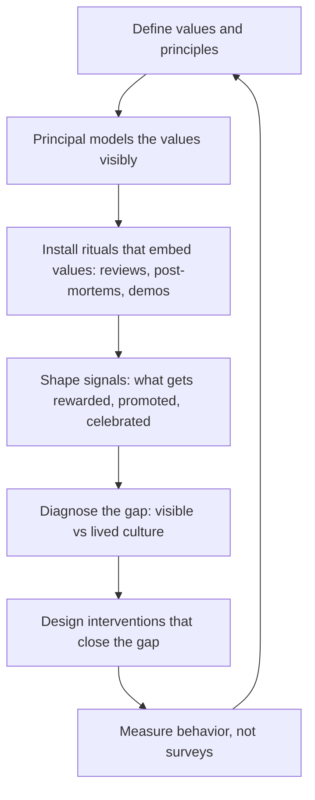

# Building Technical Culture at Scale

> **Core skill:** The principal engineer defines, models, and reinforces the organization's technical culture — the values, norms, rituals, and signals that shape how engineering work gets done — and designs interventions that close the gap between the stated culture and the lived one.

## Why This Matters

Every organization has a technical culture, whether it was designed or not. The undesigned culture is the aggregate of the loudest voices, the most recent crises, and the patterns that happened to survive. It rewards whatever got rewarded last, values whatever the last promoted principal valued, and drifts with every leadership change. The principal's role is to make culture deliberate: defining what the organization values, modeling it visibly, and building the rituals and signals that reinforce it at scale.

Culture is also the principal's most durable output. Strategies are replaced, architectures evolve, and platforms are rebuilt — but the engineering culture a principal builds persists through those changes and shapes the quality of every decision made after the principal leaves. A principal who builds a culture of rigorous design review, blameless post-incident learning, and generous mentoring has multiplied their impact into every engineer who works in that culture for a decade.

## What Org-Scale Technical Culture Is

Technical culture is not the mission statement on the wall. It is the set of shared beliefs, norms, and behaviors that determine what actually happens when nobody is watching.

| Layer | What It Is | Example | How It Is Changed |
|-------|-----------|---------|-------------------|
| **Values** | The principles the organization claims to hold | "We value simplicity over cleverness" | Stated by leadership; proved or disproved by decisions |
| **Norms** | The unwritten rules that govern daily behavior | Code review thoroughness, on-call response expectations, meeting punctuality | Changed by modeling and reinforcement over quarters |
| **Rituals** | The recurring practices that embed values | Architecture review boards, blameless post-mortems, demo days | Designed and institutionalized; survive individual departure |
| **Signals** | What the organization rewards, promotes, and celebrates | Who gets promoted to principal, what projects get funded, what behavior gets public recognition | Changed by changing what leadership visibly rewards |

The principal operates at all four layers: articulating values, modeling norms, designing rituals, and shaping the signals that tell engineers what the organization truly cares about.

## Diagnosing Culture: Visible vs Lived

The gap between the visible culture (what is written, said, and announced) and the lived culture (what engineers experience daily) is where the principal's diagnostic work begins.

| Diagnostic Method | What It Reveals | How to Use It |
|-------------------|----------------|---------------|
| **Decision archaeology** | The gap between stated values and actual decisions | Look at the last 5 major technical decisions; do they reflect the stated principles? If "we value simplicity" but every decision added complexity, the value is aspirational |
| **Promotion pattern analysis** | What the organization actually rewards | Who was promoted to staff and principal in the last 3 years? What did they do? That is the real career ladder |
| **Exit interview synthesis** | What drives engineers to leave | Are departing engineers citing culture misalignment? Which specific norms? |
| **New hire onboarding experience** | What newcomers absorb as "how things work here" | Interview hires at 3 and 6 months: what surprised them about how work actually gets done? |
| **Incident and retrospective quality** | Whether the organization learns or blames | Do post-incident reviews produce process changes, or do they produce scapegoats? |

The diagnostic output is a culture gap analysis: a frank assessment of where the lived culture diverges from the stated culture, with specific, observable examples.

## The Principal as Culture Carrier

The principal's most powerful culture tool is their own behavior. Engineers at every level watch what the principal does — which decisions they praise, which they question, what they spend time on — and calibrate their own behavior accordingly.

| Behavior | What It Signals | Culture It Builds |
|----------|----------------|-------------------|
| **Spending time on code and design reviews** | Technical depth matters at every level | A culture where seniority does not excuse distance from the work |
| **Publicly admitting mistakes and what was learned** | Learning is valued over being right | Psychological safety; blameless culture |
| **Crediting others for ideas and work** | Generosity is the norm for senior leaders | A culture where credit-hoarding is visibly un-leaderlike |
| **Asking "what is the simplest thing that could work" in architecture reviews** | Simplicity is a genuine value, not a slogan | A culture that resists complexity as the default |
| **Mentoring visibly and publicly** | Developing others is core to the role, not a side activity | A culture where senior engineers are expected to mentor |
| **Defending a team that made a reasonable decision that failed** | Risk-taking with good process is supported | A culture where risk is acceptable when process is sound |

The principal does not need to be the best coder, the best architect, or the best public speaker. They need to be the most consistent culture model — the person whose behavior other leaders imitate because it visibly works.

## Culture Interventions That Stick

Culture change fails when it is announced rather than embedded. The principal designs interventions that change behavior, not just language.

| Intervention | How It Works | Duration to Stick | Example |
|-------------|-------------|-------------------|---------|
| **Decision principle adoption** | A principle is adopted and every significant decision is reviewed against it | 6-12 months | "No new service without a documented SLO" becomes a design review gate |
| **Ritual installation** | A new recurring practice that embeds a value | 3-6 months per ritual | Monthly architecture review that is open to all engineers, with a published record |
| **Recognition redesign** | What gets celebrated changes; the awards, spot bonuses, and public praise shift | 6-12 months | A quarterly "Simplification Award" that celebrates teams who removed complexity |
| **Promotion criteria adjustment** | The staff and principal promotion criteria explicitly include culture behaviors | 12-24 months | "Demonstrated mentoring impact" becomes a required element in the staff promotion case |
| **Leadership modeling cascade** | The principal models; directors and staff engineers follow; the behavior spreads | 12-24 months | Three levels of leadership visibly prioritizing technical quality over deadline heroics |

The principal selects 1-2 interventions per year and drives them to completion. Culture change through ten simultaneous initiatives is culture change through zero.

## Measuring Culture Beyond Surveys

Engagement surveys are lagging indicators. The principal supplements them with behavioral metrics that reveal culture in action.

| Measure | What It Reveals | Data Source |
|---------|-----------------|-------------|
| **Design review participation** | Whether technical depth is valued and accessible | Attendance and contribution patterns at architecture reviews |
| **Post-incident action item completion** | Whether learning leads to change | Percentage of post-incident action items completed within the committed timeframe |
| **Internal mobility to technical tracks** | Whether the IC path is seen as viable and prestigious | Ratio of engineers who move from management back to IC versus the reverse |
| **Cross-team contribution rate** | Whether engineers feel ownership beyond their team | Percentage of engineers who contributed code, reviews, or design feedback outside their team this quarter |
| **Mentoring relationship density** | Whether knowledge transfer is institutionalized | Number of active mentoring relationships per senior-plus engineer; mentee satisfaction |
| **Decision rationale accessibility** | Whether decisions are made transparently | Percentage of architecture decisions with a written rationale accessible to all engineers |

## The Culture Loop



## Practical Applications

### Culture Health Checklist

- [ ] Technical values and principles are written, specific, and visible to every engineer
- [ ] A culture gap analysis was performed in the last 12 months with specific, observable findings
- [ ] At least one culture intervention is active with a named owner, timeline, and success measure
- [ ] Promotion criteria for staff and principal include culture behaviors (mentoring, knowledge sharing, decision transparency)
- [ ] Culture is measured through behavioral metrics, not only engagement surveys
- [ ] The principal's own behavior is periodically assessed against the stated values

### Culture Values Template

```markdown
# Engineering Values: [Organization Name]

## Our Principles
1. [Principle 1]: [what it means in practice; what it looks like when honored; what it looks like when violated]
2. [Principle 2]: [same structure]
3. [Principle 3]: [same structure]

## How We Practice These
- Design reviews evaluate against these principles
- Promotions cite specific examples of these principles in action
- Post-incident reviews reference which principle was upheld or violated
- Our principal and staff engineers model these principles publicly

## Review Cadence
These principles are reviewed annually. Last reviewed: [date].
```

## Common Pitfalls

| Pitfall | Why It Is a Problem | Better Approach |
|---------|---------------------|-----------------|
| **Culture by slogan** | Values on a wiki page that nobody uses to make decisions | Embed values in decision processes: design reviews, promotion cases, funding decisions |
| **Principal as solo carrier** | Culture depends on one person; it collapses when they leave | Build a culture carrier cohort: staff engineers and directors who model and reinforce |
| **Survey-only measurement** | Annual engagement surveys are too slow and too abstract to drive change | Supplement with behavioral metrics: review participation, mentoring density, decision accessibility |
| **Too many interventions** | Ten culture initiatives compete for attention; none stick | Choose 1-2 per year; drive them to completion before opening new ones |
| **Values that tolerate violations** | A stated value that is contradicted by a visible leadership decision destroys trust | When a decision violates a stated value, acknowledge it and explain the trade-off |
| **Culture as HR function** | Culture is delegated to people operations; engineering leadership disclaims ownership | The principal owns technical culture; HR supports but does not lead |

## Success Indicators

- Engineers at all levels can name the organization's technical values and describe how they affect daily work
- The culture gap analysis shows the lived culture converging toward the stated culture over 2-3 years
- Promotion cases for staff and principal cite culture behaviors with specific examples
- At least one culture ritual (architecture review, post-mortem, demo day) runs on cadence without the principal's direct involvement
- Exit interviews show declining rates of culture-related departures

## Related Topics

- [[02_Growing_Staff_and_Principal_Engineers]]: the pipeline that culture enables
- [[03_Mentoring_Technical_Leaders]]: mentoring as a culture behavior
- [[04_Technical_Community_Building]]: communities as culture rituals
- [[04_Organizational_Influence/00_overview|Organizational Influence]]: the external voice that shapes internal culture
- [[career-path/03_Staff_Engineer/07_Organizational_Learning_and_Mentoring/00_overview|Organizational Learning and Mentoring (Staff)]]: the team-level culture practices

## Summary

Building technical culture at scale is the principal's deliberate design of what the organization values and how it behaves: defining specific, actionable principles; diagnosing the gap between visible and lived culture through decision archaeology and promotion pattern analysis; modeling the desired behaviors visibly and consistently; installing rituals that embed values into daily work; shaping the signals of what gets rewarded, promoted, and celebrated; and measuring culture through behavioral metrics, not engagement surveys alone. The principal's legacy is not a strategy document — it is an engineering organization whose culture produces excellent work without the principal in the room.