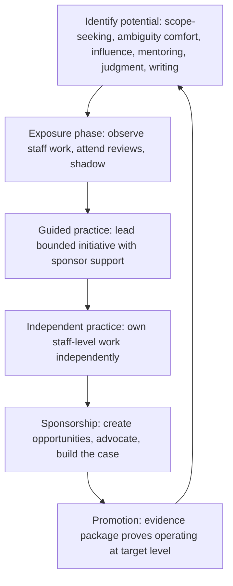

# Growing Staff and Principal Engineers

> **Core skill:** The principal engineer builds the pipeline from senior to staff and principal — identifying potential early, designing development arcs that build track records, sponsoring candidates into scope, and constructing promotion cases that withstand scrutiny.

## Why This Matters

The staff and principal pipeline is the organization's technical leadership supply chain. When the pipeline is weak, the organization promotes engineers who are not ready — producing staff engineers who do senior work with a better title, eroding the role's credibility. When the pipeline is absent, the organization hires externally for technical leadership, importing culture and paying premiums for capability it could have grown.

The principal owns this pipeline. Not as an HR function — as a leadership function. The principal identifies engineers with the potential for staff and principal scope, designs development arcs that build the necessary skills and track records, sponsors candidates into the work that proves readiness, and writes or reviews the promotion cases that evidence the transition. A principal who grows three staff engineers has multiplied their impact more than a principal who wrote three strategy documents.

## Identifying Potential

Staff and principal potential is not senior performance at higher volume. It is a distinct set of capabilities that must be spotted before they are fully formed.

| Potential Signal | What It Looks Like | Why It Matters |
|-----------------|--------------------|----------------|
| **Scope-seeking behavior** | The engineer naturally gravitates toward problems that span multiple teams, even when their role does not require it | Staff work is scope work; engineers who stay within their team's boundaries by default will struggle to expand |
| **Ambiguity comfort** | The engineer thrives on poorly defined problems; they structure the unstructured rather than waiting for requirements | Staff and principal work is defined by ambiguity; the role is to create clarity, not receive it |
| **Influence without authority** | The engineer changes decisions outside their team through the quality of their reasoning, not their position | Staff and principal roles have wide scope but narrow authority; influence is the primary tool |
| **Mentoring appetite** | The engineer invests in others' growth without being asked; their mentees cite them as career-defining | Staff and principal roles include mentoring as a core responsibility, not an optional activity |
| **Technical judgment in depth** | The engineer can reason about trade-offs at multiple levels: code, architecture, organization, and business | Principal decisions span all four levels; judgment that works at only one level is insufficient |
| **Written communication clarity** | The engineer produces written artifacts — design docs, proposals, post-mortems — that influence decisions | Writing is the principal's scaling mechanism; candidates who cannot write clearly cannot lead at scale |

The principal identifies candidates through observation, not through manager nominations alone. The best potential signals emerge in architecture reviews, incident response, cross-team working groups, and the written artifacts engineers produce voluntarily.

## The Development Arc

Growing a staff or principal engineer takes 2-4 years of deliberate development. The arc is not a checklist — it is a sequence of expanding scope with support that gradually recedes.

| Phase | Duration | Focus | Principal's Role |
|-------|----------|-------|-----------------|
| **Exposure** | 6-12 months | Candidate observes staff-level work: sits in architecture reviews, joins cross-team design discussions, shadows the principal | Invite; explain context; debrief after each exposure |
| **Guided practice** | 6-12 months | Candidate leads a bounded staff-level initiative with the principal as sponsor and safety net | Assign scope; review work; provide air cover; ensure the candidate gets credit |
| **Independent practice** | 6-12 months | Candidate owns a staff-level initiative independently; principal is available but not directing | Step back; review at milestones; resist the urge to take over when it gets hard |
| **Sponsorship** | 6-12 months | Candidate builds the track record for promotion; principal sponsors them into the work and writes the case | Create opportunities; advocate in promotion discussions; construct the evidence package |

The arc is not linear for every candidate. Some engineers need more time in guided practice. Some skip exposure because they have already done the work informally. The principal calibrates the arc to the candidate.

## Sponsorship vs Mentoring

Sponsorship and mentoring are distinct and both are essential for growing staff and principal engineers.

| Activity | Mentoring | Sponsorship |
|----------|-----------|-------------|
| **What it is** | Advising, coaching, providing feedback and development guidance | Creating opportunities, advocating for the candidate, putting them into the work that proves readiness |
| **Who does it** | Any experienced engineer or leader | Someone with the organizational power to open doors |
| **Visibility** | Often private; between mentor and mentee | Public; the sponsor's reputation is attached to the candidate's performance |
| **Primary risk** | Advice that does not fit the candidate's context | Sponsoring a candidate who is not ready; the sponsor's judgment is questioned |

The principal provides both: mentoring in private, sponsorship in public. The distinction matters because many organizations have mentoring programs but no sponsorship culture — mentors advise but nobody opens doors. The principal's sponsorship is the door-opening: "I believe this engineer is ready for this scope; I am attaching my reputation to their success."

## The Promotion Case

A staff or principal promotion case is not a performance review. It is an evidence package that proves the candidate is already operating at the target level.

| Case Element | What It Contains | Common Failure Mode |
|-------------|-----------------|---------------------|
| **Scope evidence** | 3-5 examples of work that affected multiple teams with measurable impact | Examples are team-level, not org-level; the scope does not match the target level |
| **Influence evidence** | Specific decisions the candidate changed through reasoning, not authority; who they influenced and how | Vague claims of "influence" without named decisions or people |
| **Mentoring evidence** | Mentees who cite the candidate as career-defining; growth of those mentees after the relationship | A list of people the candidate "mentored" without evidence of their growth |
| **Technical judgment evidence** | Decisions where the candidate's judgment produced a better outcome than the default path | Retelling of decisions where the candidate was right; no evidence the alternative would have been worse |
| **Writing and communication evidence** | Written artifacts — design docs, proposals, post-mortems, strategy — that influenced org-level decisions | Artifacts that were written but not read or acted upon |
| **Peer and stakeholder feedback** | Direct quotes from engineers, managers, and leaders describing the candidate's impact | Generic praise without specific examples |

The principal's role in the promotion case: ensure the evidence is specific, verifiable, and demonstrates the candidate is already doing the work — not that they are "ready to try."

## Growing Multiple Candidates

A healthy pipeline has multiple candidates at different stages. The principal manages the pipeline as a portfolio.

| Pipeline Element | Healthy State | Warning Signal |
|-----------------|---------------|---------------|
| **Staff candidates in development** | 3-5 engineers at different phases | Only 1 candidate; pipeline is fragile |
| **Principal candidates in development** | 1-2 engineers in independent practice or sponsorship | No principal candidates identified |
| **Promotion velocity** | 1-2 staff promotions per year in a large org | No promotions in 2+ years; pipeline is blocked |
| **Candidate diversity** | Candidates span multiple teams, backgrounds, and paths | All candidates are from one team or one archetype |
| **External hires at staff+** | Occasional, deliberate hires that fill specific gaps | Every staff+ hire is external; internal pipeline is not producing |



## Practical Applications

### Pipeline Health Checklist

- [ ] At least 3-5 engineers are identified as staff candidates with documented development arcs
- [ ] At least 1-2 engineers are identified as principal candidates
- [ ] Each candidate has a named sponsor (not necessarily the principal for every candidate)
- [ ] Development arcs are reviewed quarterly: is the candidate progressing through phases?
- [ ] Promotion cases contain specific, verifiable evidence — not generic claims
- [ ] At least one staff promotion was achieved in the last 18 months

### Development Arc Template

```markdown
# Development Arc: [Candidate Name]

- Current level: [Senior / Staff]
- Target level: [Staff / Principal]
- Identified potential signals: [specific examples of scope-seeking, ambiguity comfort, influence, mentoring, judgment, writing]
- Current phase: [Exposure / Guided Practice / Independent Practice / Sponsorship]
- Development focus for this quarter: [specific skill or experience gap to close]
- Sponsor: [name]
- Next phase transition criteria: [what must be true to advance to the next phase]
- Promotion timeline estimate: [quarter and year]
```

## Common Pitfalls

| Pitfall | Why It Is a Problem | Better Approach |
|---------|---------------------|-----------------|
| **Promoting senior volume** | An engineer doing more senior work is promoted to staff without staff scope | Require scope evidence: multi-team impact, not high-volume single-team output |
| **Mentoring without sponsorship** | Candidates get advice but never get the opportunities that prove readiness | Sponsorship is active door-opening; assign the candidate to scope work and attach your reputation |
| **Single-candidate pipeline** | The only staff candidate leaves; the pipeline is empty | Maintain 3-5 candidates at different phases; never let the pipeline drop to one |
| **Promotion case by assertion** | "They are ready" without specific evidence; the case fails or produces a weak promotion | Build the evidence package over quarters; every claim cites a specific example |
| **Development arc without feedback** | The candidate does not know they are on an arc or what phase they are in | Share the arc with the candidate; review it together quarterly |
| **Principal as sole sponsor** | Every candidate depends on one person for advocacy; pipeline stalls if the principal is overloaded | Develop other sponsors: staff engineers and directors who can sponsor candidates |

## Success Indicators

- The organization promotes at least one engineer to staff each year from the internal pipeline
- Candidates can describe their development arc and what they are working on this quarter to advance
- Promotion cases are strong: specific, verifiable, and rarely challenged or rejected
- At least one current staff engineer was grown through the principal's pipeline
- External hires at staff+ are deliberate additions to a healthy pipeline, not emergency replacements

## Related Topics

- [[01_Building_Technical_Culture_at_Scale]]: the culture that identifies and rewards staff potential
- [[03_Mentoring_Technical_Leaders]]: mentoring the mentors who develop staff candidates
- [[05_Diversity_in_Technical_Leadership]]: ensuring the pipeline is inclusive
- [[career-path/03_Staff_Engineer/07_Organizational_Learning_and_Mentoring/05_Growing_the_Next_Staff|Growing the Next Staff (Staff)]]: the staff-level perspective on growing peers
- [[career-path/11_Engineering_Manager/01_People_Development/00_overview|People Development (EM)]]: the manager's complementary development role

## Summary

Growing staff and principal engineers is the principal's talent supply chain: identifying potential through signals of scope-seeking, ambiguity comfort, influence, mentoring appetite, and technical judgment; designing development arcs that progress from exposure through guided practice, independent practice, and sponsorship over 2-4 years; actively sponsoring candidates into the work that proves readiness, not just mentoring them in private; and constructing promotion cases with specific, verifiable evidence that the candidate is already operating at the target level. The measure of success is not how many candidates the principal advises — it is how many staff and principal engineers the organization promotes from its own pipeline.