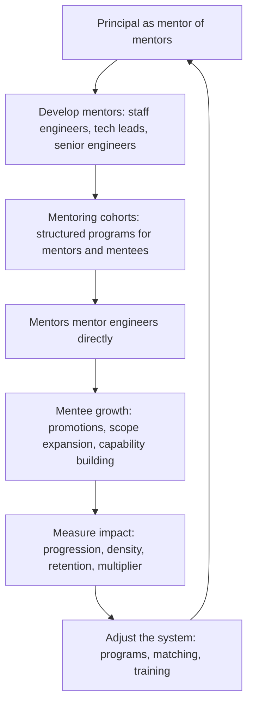

# Mentoring Technical Leaders

> **Core skill:** The principal engineer develops staff engineers and technical leaders who can mentor others — operating as a mentor of mentors, designing mentoring cohorts and programs that scale development beyond one-on-one relationships, and measuring mentoring impact at organizational scale.

## Why This Matters

A principal who mentors ten engineers directly has helped ten engineers. A principal who develops ten mentors — each of whom mentors ten engineers — has helped a hundred. The shift from mentoring individuals to mentoring mentors is the difference between personal impact and organizational leverage. At the principal level, mentoring is not a relationship; it is a system.

The mentor-of-mentors role is also the principal's succession strategy. When staff engineers and technical leads can develop their own people effectively, the principal's departure does not create a mentoring vacuum. The principal's legacy is not the engineers they personally developed — it is the mentoring capability they embedded in the organization's leadership layer.

## The Mentor-of-Mentors Model

The principal mentors the mentors: staff engineers, technical leads, and senior engineers with mentoring appetite who will develop the next layer.

| Mentoring Layer | Who Is Mentored | Who Does the Mentoring | Principal's Role |
|----------------|-----------------|----------------------|-----------------|
| **Direct mentoring** | Individual engineers at any level | Staff engineers, tech leads, senior engineers | Rare; reserved for staff+ engineers and high-potential cases where the principal's specific expertise is needed |
| **Mentor development** | Staff engineers and tech leads who mentor others | Principal | Primary role: develop the mentors' mentoring skills |
| **Mentoring system design** | The organization's mentoring capability as a whole | Principal with engineering leadership | Design cohorts, programs, matching, and measurement |

The principal's calendar should reflect this shift. A principal spending 80% of mentoring time on direct mentoring is operating as a staff engineer with a better title. A principal spending 80% on mentor development and system design is operating at the right level.

## Developing Mentors

Developing a mentor is distinct from mentoring an engineer on technical skills. The principal teaches the meta-skill: how to develop others effectively.

| Mentor Skill | What the Principal Teaches | How It Is Practiced |
|-------------|---------------------------|---------------------|
| **Diagnosis** | How to identify what a mentee actually needs — not what they ask for | Observe the mentor's sessions (with permission); debrief the diagnosis |
| **Question craft** | How to ask questions that build understanding rather than giving answers | Model in the principal's own mentoring; review the mentor's question patterns |
| **Feedback delivery** | How to give feedback that is specific, actionable, and received — not just delivered | Role-play difficult feedback conversations; review real feedback the mentor delivered |
| **Scope calibration** | How to assign stretch work that is challenging but not overwhelming | Review the assignments the mentor gives; adjust scope up or down |
| **Sponsorship** | How to open doors for mentees without doing the work for them | Model sponsorship; review the mentor's sponsorship actions |
| **Letting go** | How to let mentees struggle productively without rescuing them | Debrief moments where the mentor intervened; explore what would have happened if they had waited |

The principal develops mentors through a combination of modeling (the mentor observes the principal mentoring), co-mentoring (principal and mentor mentor together with the principal gradually receding), and supervision (the principal reviews the mentor's mentoring and provides feedback).

## Mentoring Cohorts and Programs

One-on-one mentoring does not scale. The principal designs cohort-based programs that develop multiple mentors and mentees simultaneously.

| Program Type | Structure | Duration | Best For |
|-------------|-----------|----------|----------|
| **Mentor development cohort** | 6-8 staff engineers and tech leads meet monthly with the principal to develop mentoring skills | 6-12 months | Building mentoring capability across the leadership layer |
| **Staff candidate cohort** | 4-6 senior engineers pursuing staff promotion meet biweekly with rotating facilitators (principal, staff engineers) | 6-12 months | Structured development for multiple candidates simultaneously |
| **New tech lead cohort** | All newly promoted tech leads meet monthly for their first 6 months with the principal and experienced tech leads | 6 months | Accelerating new lead effectiveness |
| **Cross-team mentoring pairs** | Structured 6-month pairings across team boundaries with check-in cadence | 6 months per cycle | Breaking silos; cross-pollinating practice |

The principal designs the program structure, selects the participants, and facilitates the first 1-2 cycles. After that, the program should run with staff engineers as facilitators — the principal has designed the system and receded.

## Measuring Mentoring Impact at Scale

Mentoring impact is notoriously hard to measure. The principal focuses on behavioral outcomes, not sentiment.

| Measure | What It Captures | How to Collect |
|---------|-----------------|----------------|
| **Mentee progression** | Percentage of mentees who achieved a promotion, role change, or significant scope expansion within 18 months of the mentoring relationship | HR data correlated with mentoring program participation |
| **Mentoring density** | Number of active mentoring relationships per staff-plus engineer; distribution across teams | Self-report survey with verification; trend over time |
| **Mentor retention** | Percentage of trained mentors still actively mentoring 12 months after program completion | Program follow-up survey |
| **Multiplier effect** | Number of engineers indirectly reached through the mentors the principal developed | Count mentees-of-mentors who cite the mentor as career-defining |
| **Mentee satisfaction specificity** | Not "was your mentor helpful?" but "can you name a specific decision or capability that changed because of your mentor?" | Structured exit interview for each mentoring cycle |

The principal tracks these measures annually and adjusts the mentoring system based on the data. A program with high satisfaction but zero mentee progression is a social club, not a development program.

## Mentoring Across Differences

The principal's mentoring responsibility includes developing technical leaders who are not like them — different backgrounds, different paths, different approaches.

| Practice | Why It Matters | How to Do It |
|----------|---------------|-------------|
| **Avoid cloning** | The principal's path is one path, not the path; mentoring that only develops clones limits the leadership pipeline | Ask: "what does success look like for this person, not for me?" |
| **Active matching** | Mentors and mentees from similar backgrounds often find each other naturally; cross-difference pairs require active design | Design the matching process; do not let it default to "find someone you are comfortable with" |
| **Sponsorship equity** | Sponsorship (opening doors) is unevenly distributed; the principal must track who they sponsor and correct imbalances | Track sponsorship actions by demographics; correct patterns of inequity |
| **Mentor training for inclusion** | Mentors may unconsciously steer mentees toward paths that fit their own assumptions | Include inclusive mentoring practices in mentor development curriculum |

## The Mentoring System



## Practical Applications

### Mentoring System Checklist

- [ ] At least one mentor development cohort is active with 6-8 staff engineers or tech leads
- [ ] The principal's direct mentoring is limited to staff+ engineers and specific high-potential cases
- [ ] Mentoring impact is measured annually: mentee progression, mentoring density, mentor retention
- [ ] At least one mentoring program (cohort, pairs, or new-lead program) runs without the principal facilitating
- [ ] Sponsorship actions are tracked and reviewed for equity
- [ ] Mentor training includes inclusive mentoring practices

### Mentor Development Session Template

```markdown
# Mentor Development Session: [Topic]

## Objective
[What mentor skill this session develops]

## Session Structure
1. Principal models: [demonstrates the skill with a real or simulated mentee]
2. Group practice: [mentors practice with each other; principal observes]
3. Debrief: [what worked; what to adjust; principles extracted]
4. Commitment: [each mentor names one specific change in their next mentoring session]

## Follow-Up
- [Date]: mentors report back on the commitment
```

## Common Pitfalls

| Pitfall | Why It Is a Problem | Better Approach |
|---------|---------------------|-----------------|
| **Mentoring as monopoly** | The principal mentors everyone directly; no mentoring capability is built in others | Shift to mentor-of-mentors; develop staff engineers and tech leads who mentor |
| **Program without progression** | A mentoring program with high satisfaction but zero mentee promotions or scope changes | Measure mentee progression; redesign programs that do not produce outcomes |
| **Mentor cloning** | Mentors develop people who look and think like them; the pipeline narrows | Train mentors in inclusive practice; track mentee demographics against org demographics |
| **Mentoring without sponsorship** | Mentors advise but do not open doors; mentees get insight without opportunity | Teach mentors the difference; include sponsorship actions in mentor development |
| **No measurement** | Mentoring impact is assumed; programs continue without evidence they work | Measure progression, density, and multiplier effect; close programs that do not deliver |
| **Principal as bottleneck** | All mentoring program decisions go through the principal; nothing scales | Design programs to run with staff engineer facilitators; the principal designs and recedes |

## Success Indicators

- At least 3 staff engineers or tech leads developed through the principal's mentor development program are actively mentoring others
- Mentees of the principal's mentees cite their mentor as career-defining
- The mentoring system runs programs that the principal does not personally facilitate
- Mentee progression rates (promotions, scope changes) are measured and improving year over year
- The principal's mentoring calendar is predominantly mentor development, not direct mentoring

## Related Topics

- [[02_Growing_Staff_and_Principal_Engineers]]: the pipeline that mentoring feeds
- [[01_Building_Technical_Culture_at_Scale]]: mentoring as a cultural value
- [[04_Technical_Community_Building]]: communities as mentoring multipliers
- [[career-path/03_Staff_Engineer/07_Organizational_Learning_and_Mentoring/01_Mentoring_Senior_Engineers|Mentoring Senior Engineers (Staff)]]: the staff-level mentoring practice
- [[career-path/11_Engineering_Manager/01_People_Development/00_overview|People Development (EM)]]: the manager's complementary development role

## Summary

Mentoring technical leaders is the principal's shift from individual development to system design: operating as a mentor of mentors who develops staff engineers and tech leads into effective developers of others, designing cohort-based programs that scale mentoring beyond one-on-one relationships, modeling and teaching the meta-skills of diagnosis, question craft, feedback, scope calibration, sponsorship, and letting go, and measuring mentoring impact through mentee progression, mentoring density, and the multiplier effect — not satisfaction surveys. The principal's mentoring legacy is not the engineers they directly developed; it is the mentoring capability that persists in the organization's leadership layer after the principal leaves.