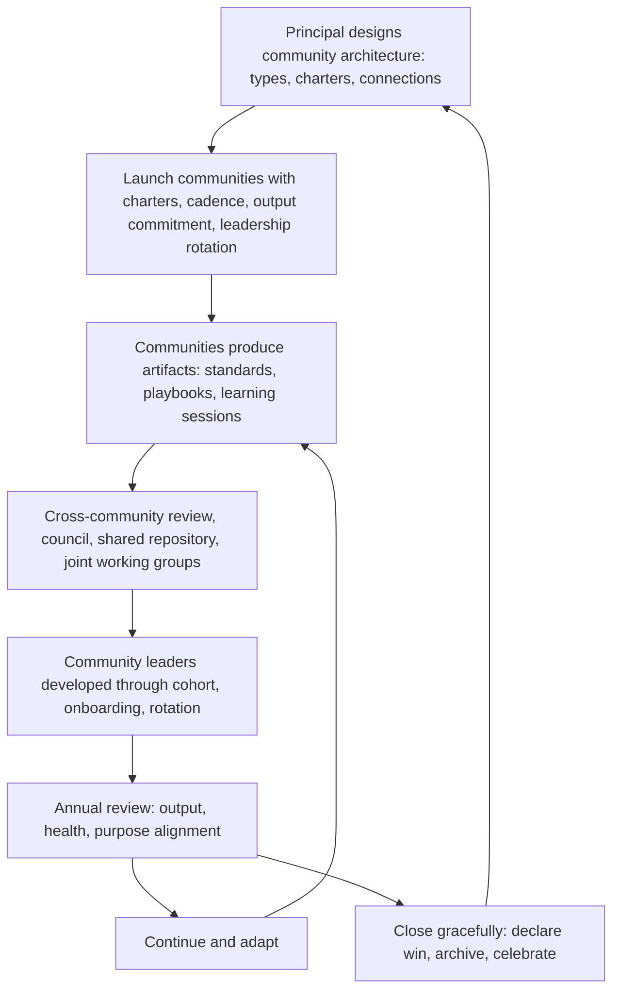

# Technical Community Building

> **Core skill:** The principal engineer designs and sustains the organization's technical community architecture — internal conferences, guilds, communities of practice, and cross-team forums — at a scale where communities learn, produce, and govern themselves without the principal in the room.

## Why This Matters

A staff engineer runs a guild. A principal engineer designs the guild system. At the principal level, community building is not about facilitating a single community — it is about designing the architecture that supports multiple communities, connecting them across the organization, developing community leaders who sustain the work, and ensuring communities produce artifacts that improve daily engineering practice rather than becoming social clubs.

Communities are also the principal's mechanism for scaling culture. A well-designed community system spreads practice, surfaces problems, and builds cross-team relationships at a scale no individual can reach. When a principal builds a community architecture that outlasts their tenure, they have built an engine for organizational learning that compounds for years.

## Community Architecture at Org Scale

At scale, communities are not ad-hoc groups. They are a designed system with multiple types, clear charters, and defined connections.

| Community Type | Scope | Purpose | Example |
|---------------|-------|---------|---------|
| **Guild** | Cross-team practice area | Spread practice; surface shared problems; produce standards and artifacts | The observability guild: on-call practices, SLO standards, monitoring tooling |
| **Chapter** | Craft within a discipline | Develop craft excellence; share techniques; run learning sessions | The backend chapter: language practices, framework evaluation, performance patterns |
| **Community of practice** | Domain of shared interest | Cross-pollinate knowledge; build capability; produce learning artifacts | The machine learning community of practice: model deployment patterns, data pipeline standards |
| **Working group** | Time-boxed problem | Produce a specific output; disband when the output is delivered | The event bus migration working group: standardize event schema, publish migration playbook |
| **Internal conference** | Annual or biannual whole-org event | Share learning; build connections; celebrate practice; set direction | A 2-day internal engineering conference with talks, workshops, and unconference sessions |

The principal designs the community landscape: which community types exist, how they connect, what charters they operate under, and how they interact with formal organizational structures.

## Community Design

A well-designed community has structural elements that keep it focused and productive without becoming governance.

| Design Element | What It Is | Why It Matters |
|---------------|-----------|----------------|
| **Charter** | Written purpose, scope, and explicit "not for" | Prevents governance drift; a community that knows what it is not for is less likely to become a committee |
| **Cadence** | Fixed rhythm of meetings or activities | Survives calendar chaos; communities without a cadence die of scheduling entropy |
| **Output commitment** | Named artifacts the community produces on a schedule | Separates communities from social clubs; every meeting moves an artifact |
| **Leadership rotation** | The chair or facilitator rotates on a schedule | Prevents founder dependency; builds community leadership capacity |
| **Membership model** | How people join, participate, and leave | Open door with clear expectations; membership is earned through contribution |
| **Connection points** | How the community connects to other communities and to formal decision structures | Prevents isolation; community output reaches decision-makers |

The principal designs these elements into every community charter and reviews them annually. A community that has drifted from its charter gets a redesign conversation, not a guilt-fueled continuation.

## Connecting Communities Across the Org

Isolated communities create silos as effectively as isolated teams. The principal designs the connections.

| Connection Type | How It Works | Example |
|----------------|-------------|---------|
| **Cross-community review** | Community A reviews Community B's output before publication | The observability guild reviews the backend chapter's SLO standard proposal |
| **Community council** | One representative from each community meets quarterly to share output, identify overlaps, and resolve conflicts | The infrastructure, backend, frontend, and data chapter leads meet quarterly |
| **Shared artifact repository** | All community output is published in one place, searchable by every engineer | A wiki or knowledge base organized by community; every standard, checklist, and playbook |
| **Joint working groups** | Two or more communities form a temporary working group to address a cross-cutting problem | The backend and observability guilds form a working group on distributed tracing standards |
| **Internal conference tracks** | Communities curate tracks at the internal conference; the conference is where communities showcase output | The ML community of practice curates the AI/ML track; the platform guild curates the infrastructure track |

The principal does not manage every connection. The principal designs the connection architecture and ensures community leaders understand their responsibility to connect.

## Community Leadership Development

Communities die when their leaders burn out or move on. The principal builds community leadership as a deliberate development path.

| Development Activity | What It Involves | Outcome |
|---------------------|-----------------|---------|
| **Community leader identification** | Spotting engineers with community-building appetite and aptitude | A named pipeline of potential community leaders |
| **Leader onboarding** | A structured handoff: the outgoing leader shadows the incoming leader for one cycle | Smooth transitions; no community pauses during leadership change |
| **Leader cohort** | All community leaders meet quarterly with the principal to share practice, solve common problems, and avoid isolation | Community leaders learn from each other; the principal provides air cover and resources |
| **Leadership rotation design** | Every community has a defined leadership term and rotation process | No permanent leaders; leadership experience is distributed across the org |
| **Recognition for community leadership** | Community leadership is recognized in promotion cases and performance cycles | Engineers see community leadership as career-advancing, not career-sidetracking |

## When Communities Should Die

Communities have lifecycles. The principal normalizes graceful endings so that communities are not kept alive by guilt.

| Death Signal | Response |
|-------------|----------|
| Output has stalled for two cycles | Name it: pause, restructure, or close. Do not let a zombie community consume meeting slots |
| The purpose has been absorbed elsewhere | Declare the win and close. "The observability guild's SLO standards are now owned by the platform team. The guild's work is done." |
| The same three people carry everything | Recruit or close. Burnout is not a membership model |
| The community has become a complaint forum without solutions | Restructure with an output commitment or close. Venting is not a community purpose |
| A working group's problem is solved | Close with a written outcome and a celebration. Working groups that never end become permanent committees |

The principal models the graceful close: celebrating what the community achieved, archiving its artifacts, and freeing the energy for new communities. The message is that communities are projects, not permanent structures — and endings are achievements, not failures.

## The Community System



## Practical Applications

### Community Architecture Checklist

- [ ] A community landscape document exists: all active communities, their charters, leaders, and output
- [ ] Every community has a written charter with purpose, scope, and explicit "not for"
- [ ] Community leaders rotate on a defined schedule; no community has had the same leader for more than 2 years
- [ ] Cross-community connections exist: at least one review, council, or shared repository
- [ ] Community leadership is recognized in at least one promotion case in the last 18 months
- [ ] At least one community was closed gracefully with a declared win in the last 2 years

### Community Charter Template

```markdown
# Community Charter: [Community Name]

- Type: [Guild | Chapter | Community of Practice | Working Group | Internal Conference]
- Purpose: [what this community exists to spread, solve, or produce]
- Scope: [topics, activities, domain boundaries]
- Explicitly not for: [governance, decisions, assignments — things the community does not do]
- Cadence: [meeting frequency, standing agenda]
- Output commitment: [named artifact, schedule, adoption target]
- Leadership: [current leader, term length, rotation process]
- Membership: [how to join, expectations of members]
- Connection points: [which other communities or decision bodies this community connects to]
- Review date: [annual charter review]
```

## Common Pitfalls

| Pitfall | Why It Is a Problem | Better Approach |
|---------|---------------------|-----------------|
| **Community inflation** | Every interest group becomes a community; the landscape is unmanageable | Require a charter and output commitment before recognizing a new community |
| **Governance drift** | Communities start making decisions for teams; members stop attending | Charter includes explicit "not for" scope; revisit when governance drift is detected |
| **Founder dependency** | The community runs only when the original founder is engaged | Rotate leadership from day one; set term limits |
| **No output** | Communities meet and talk but produce nothing engineers use | Output commitment in the charter; review output at each annual review |
| **Zombie communities** | Communities that should have died are kept alive by guilt or inertia | Annual review with explicit continuation criteria; normalize the graceful close |
| **Isolation** | Communities operate in silos; their output never reaches other communities or decision-makers | Design cross-community connections; require review and publication across communities |

## Success Indicators

- Every community can name its output from the last two cycles
- Community leadership rotates on schedule; no community is founder-dependent
- A community output (standard, playbook, checklist) is adopted by teams outside the community's immediate membership
- The community landscape is reviewed annually; at least one community was closed or restructured based on the review
- Engineers cite community participation as a meaningful part of their development

## Related Topics

- [[01_Building_Technical_Culture_at_Scale]]: communities as culture rituals
- [[02_Growing_Staff_and_Principal_Engineers]]: community leadership as a development path
- [[03_Mentoring_Technical_Leaders]]: communities as mentoring multipliers
- [[career-path/03_Staff_Engineer/07_Organizational_Learning_and_Mentoring/03_Communities_of_Practice|Communities of Practice (Staff)]]: the staff-level community practice this scales
- [[career-path/03_Staff_Engineer/07_Organizational_Learning_and_Mentoring/05_Growing_the_Next_Staff|Growing the Next Staff (Staff)]]: communities as staff development environments

## Summary

Technical community building at the principal level is designing the organization's community architecture: establishing the community types, charters, cadences, and output commitments that make communities productive rather than social; developing community leaders through rotation, onboarding, and cohort support; connecting communities across the org through cross-review, councils, and shared repositories; and normalizing graceful endings so that communities close when their purpose is done rather than persisting as zombie meetings. The test of the principal's community architecture is that communities learn, produce, and sustain themselves without the principal in the room.