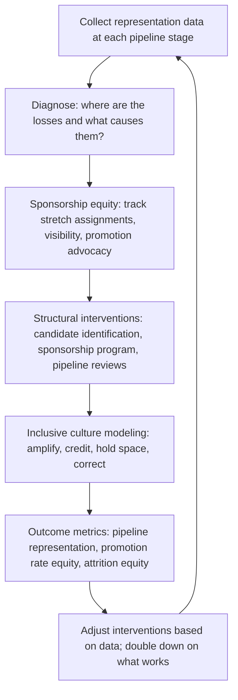

# Diversity in Technical Leadership

> **Core skill:** The principal engineer builds inclusive pathways to technical leadership — using representation data to diagnose pipeline gaps, designing sponsorship programs that open doors equitably, modeling inclusive culture visibly, and measuring progress with outcome metrics, not activity counts.

## Why This Matters

Technical leadership pipelines narrow at every step, and they narrow more for engineers from underrepresented groups. The result is a staff and principal layer that does not reflect the organization it serves — not because of overt exclusion, but because the informal systems that produce technical leaders (sponsorship, stretch assignments, visibility) distribute opportunity unevenly. The principal's role is to make those systems deliberate and equitable.

This is not an HR initiative delegated to diversity committees. It is a leadership responsibility. The principal controls or influences the key levers: who gets sponsored into scope work, whose promotion cases get constructed, whose voice is amplified in architecture reviews, and what behavior is modeled as "what leadership looks like here." A principal who ignores these levers is not neutral — they are passively reinforcing the patterns that produced the current distribution.

## Diagnosing the Pipeline

Before designing interventions, the principal needs data. Pipeline analysis reveals where the losses occur.

| Pipeline Stage | What to Measure | Typical Finding |
|---------------|----------------|-----------------|
| **Entry** | Representation of different groups in engineering hiring versus the available talent pool | Hiring is reasonably representative; the issue is not at entry |
| **Senior promotion** | Promotion rates from mid-level to senior by group | Slight disparities emerge; differences in project assignment and visibility begin to compound |
| **Staff promotion** | Promotion rates from senior to staff by group; time-in-level before promotion | Significant disparities; the informal sponsorship and stretch assignment system drives the gap |
| **Principal promotion** | Representation at principal versus representation at staff | The gap is widest here; the cumulative effect of disparities at every prior stage |
| **Attrition at each stage** | Voluntary and involuntary departure rates by group and level | Higher attrition for underrepresented groups at senior and staff levels; culture and belonging factors |

The principal collects this data annually and presents it to engineering leadership — not as an accusation but as a diagnostic. The question is: where in our pipeline do we lose people, and what in our systems causes the loss?

## Sponsorship as the Primary Lever

The single most powerful intervention for pipeline diversity is equitable sponsorship. Sponsorship — opening doors, assigning stretch work, advocating in promotion discussions — is the mechanism that converts potential into promotion, and it is the mechanism where implicit bias operates most powerfully.

| Sponsorship Practice | What It Looks Like | How the Principal Ensures Equity |
|---------------------|--------------------|----------------------------------|
| **Stretch assignment distribution** | Who gets the high-visibility, high-impact projects that build promotion cases | Track stretch assignments by demographics; correct imbalances quarterly |
| **Architecture review visibility** | Who presents at architecture reviews; whose work is visible to leadership | Ensure the presenting roster reflects the organization; rotate opportunities |
| **Promotion case construction** | Whose promotion cases get built with the same rigor and advocacy | Review promotion cases for evidence quality across groups; do not accept weaker cases for some |
| **External visibility** | Who represents the organization at conferences, in blog posts, and in open-source | Track external opportunities by demographics; distribute strategically |
| **Mentoring access** | Who has access to senior mentors and sponsors who can open doors | Assign sponsors, do not let sponsorship default to "who you happen to know" |

The principal tracks these practices personally. A principal who does not know who they sponsored in the last 12 months — and whether that distribution was equitable — is not managing their most powerful diversity lever.

## Building Inclusive Pathways

Beyond sponsorship, the principal designs structural interventions that make the pathway to technical leadership accessible to a broader population.

| Intervention | How It Works | Expected Impact Timeline |
|-------------|-------------|--------------------------|
| **Staff candidate identification process** | A structured process for identifying staff potential that reduces reliance on informal networks and "who is visible" | 12-24 months to affect promotion cohorts |
| **Sponsorship program** | A formal program that pairs underrepresented senior engineers with principal or director-level sponsors who commit to specific sponsorship actions | 6-12 months to produce first promotion cases |
| **Pipeline review cadence** | Quarterly review of the staff and principal pipeline by demographics, with accountability for disparities | 6-12 months to produce corrective actions |
| **Inclusive promotion criteria** | Promotion criteria that recognize diverse paths to impact — not only the path the current leadership took | 12-24 months to change who gets promoted |
| **Return-to-technical-leadership pathways** | Structured paths for engineers returning from career breaks, management roles, or different domains | 12-24 months to affect the pipeline |

The principal selects 1-2 interventions per year and drives them to measurable impact. The scatter-shot approach — launching five diversity initiatives with no accountability — is performative.

## The Principal's Role in Inclusive Culture

The principal's most visible diversity contribution is the culture they model. Engineers watch how the principal behaves in meetings, whose contributions they amplify, and what behavior they tolerate.

| Behavior | What It Signals | Inclusive Alternative |
|----------|----------------|----------------------|
| **Interrupting or talking over** | Dominant voices are valued over diverse ones | The principal holds space: "Let [name] finish their point" and models not interrupting |
| **Crediting the loudest voice** | Ideas are attributed to whoever said them last or loudest | The principal credits the originator: "Building on [name]'s earlier point" |
| **Ignoring exclusionary behavior** | "Jokes," dismissals, or micro-aggressions are tolerated | The principal names the behavior privately and, if repeated, publicly; silence is endorsement |
| **Defaulting to the same voices** | The same three people get called on in every meeting | The principal actively invites contributions from quieter participants |
| **Assuming homogeneity** | Language and references that assume everyone shares the same background | The principal uses inclusive language and corrects themselves when they slip |

The principal does not need to be perfect. They need to be visibly trying — and visibly course-correcting when they miss. The principal who acknowledges "I just interrupted you; please continue" does more for inclusive culture than the principal who never makes a mistake because they never speak.

## Measuring Progress

Activity metrics (number of diversity events, number of training attendees) are vanity. The principal measures outcomes.

| Outcome Metric | What It Measures | Target |
|---------------|-----------------|--------|
| **Pipeline representation at each level** | The percentage of engineers from underrepresented groups at senior, staff, and principal | Year-over-year improvement toward the representation in the available talent pool |
| **Promotion rate equity** | The ratio of promotion rates between groups, controlling for performance | Ratio approaching 1.0; persistent gaps trigger investigation |
| **Sponsorship distribution** | The demographics of engineers who received stretch assignments, visibility opportunities, and promotion advocacy | Distribution proportional to the eligible population; persistent skew triggers corrective action |
| **Attrition equity** | Voluntary attrition rates by group and level | Rates not significantly different across groups; higher rates for any group trigger investigation |
| **Belonging and inclusion survey specificity** | Not "do you feel included?" but "can you name a specific decision or opportunity that you believe was influenced by your background?" | Declining rates of negative responses; specific follow-up on positive outliers |

The principal reviews these metrics quarterly with engineering leadership. Metrics that do not move for two consecutive quarters indicate that the interventions are not working and need redesign.

## The Diversity Pipeline



## Practical Applications

### Diversity in Technical Leadership Checklist

- [ ] Pipeline representation data is collected annually at each level (senior, staff, principal) and reviewed with engineering leadership
- [ ] The principal tracks their own sponsorship actions by demographics and reviews the distribution quarterly
- [ ] A formal sponsorship program exists for underrepresented senior engineers with named sponsors and specific sponsorship commitments
- [ ] Staff candidate identification uses a structured process, not informal networks
- [ ] Outcome metrics are tracked: pipeline representation, promotion rate equity, attrition equity
- [ ] The principal visibly models inclusive behavior in meetings and corrects themselves publicly when they miss

### Sponsorship Program Template

```markdown
# Sponsorship Program: [Program Name]

- Objective: [specific outcome: e.g., "Increase staff promotions for underrepresented senior engineers by 50% within 18 months"]
- Participants: [sponsorees: names, levels; sponsors: names, levels]
- Sponsor commitments: [list of specific actions each sponsor commits to]
  - Assign at least one high-visibility project per quarter
  - Nominate for at least one external visibility opportunity per year
  - Construct and advocate for the promotion case with specific evidence
- Duration: [12 months, with quarterly checkpoints]
- Success measure: [promotions achieved, scope expansions, visibility opportunities fulfilled]
- Progress review: [quarterly, with program coordinator and sponsor-sponsoree pairs]
```

## Common Pitfalls

| Pitfall | Why It Is a Problem | Better Approach |
|---------|---------------------|-----------------|
| **Activity as proxy for impact** | Counting diversity events and training attendees without measuring pipeline outcomes | Measure outcome metrics: pipeline representation, promotion rate equity, attrition equity |
| **Diversity as HR function** | Diversity is delegated to HR; engineering leadership disclaims ownership | The principal owns the sponsorship and culture levers; HR supports but does not lead |
| **One-and-done training** | A single unconscious bias workshop is treated as having "done diversity" | Ongoing structural interventions; training is a component, not the program |
| **Pipeline blindness** | No data on where in the pipeline representation drops; interventions are guesses | Collect annual pipeline data; diagnose before intervening |
| **Sponsorship by comfort** | Sponsors choose sponsorees who are "like them"; the distribution does not change | Structured matching; track sponsorship demographics; correct imbalances |
| **Perfection paralysis** | Fear of getting inclusion wrong prevents any action | Act, learn, correct publicly; the principal who tries and adjusts is better than the principal who stays silent |

## Success Indicators

- Pipeline representation at staff and principal levels improves year over year
- Promotion rates across groups converge over a 3-year trend
- The principal can name specific sponsorship actions they took in the last quarter and who benefited
- A formal sponsorship program exists and has produced at least one promotion in the last 18 months
- Engineers from underrepresented groups cite the principal's behavior as contributing to an inclusive culture

## Related Topics

- [[02_Growing_Staff_and_Principal_Engineers]]: the pipeline this makes equitable
- [[01_Building_Technical_Culture_at_Scale]]: inclusive culture as a cultural value
- [[06_Knowledge_Continuity_and_Succession]]: succession planning that considers pipeline diversity
- [[04_Organizational_Influence/00_overview|Organizational Influence]]: the external voice that shapes the internal diversity brand
- [[career-path/11_Engineering_Manager/01_People_Development/00_overview|People Development (EM)]]: the manager's complementary role in equitable development

## Summary

Diversity in technical leadership is the principal's responsibility for building equitable pathways: diagnosing the pipeline with representation data to identify where losses occur, wielding sponsorship as the primary lever — tracking who gets stretch assignments, visibility, and promotion advocacy — designing structural interventions like formal sponsorship programs and structured candidate identification, modeling inclusive culture visibly through behavior in meetings and public self-correction, and measuring progress through outcome metrics (pipeline representation, promotion rate equity, attrition equity), not activity counts. The principal who does not know who they sponsored last quarter is not managing their most powerful diversity lever.