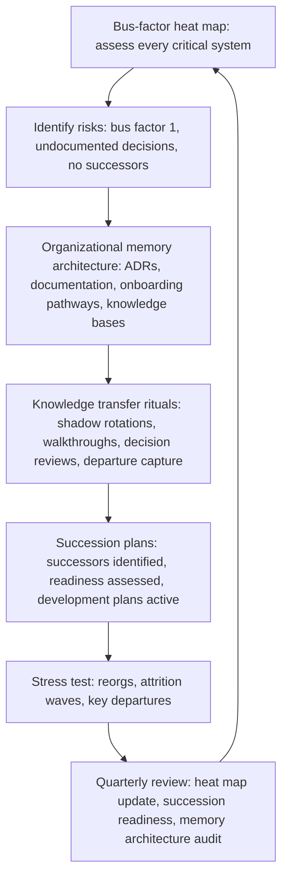

# Knowledge Continuity and Succession

> **Core skill:** The principal engineer ensures that technical knowledge survives attrition — building organizational memory through documentation strategy and decision archaeology, mapping the bus-factor heat map, and designing succession plans that make critical technical roles resilient to departure.

## Why This Matters

Organizations lose technical knowledge in two ways: the slow erosion of memory as people leave and documents rot, and the sudden crisis when a critical person departs and nobody knows how their systems work. The principal's responsibility is to prevent both: building the systems that preserve knowledge and the succession plans that make any individual's departure survivable.

Knowledge continuity is not a documentation problem — it is a design problem. The question is not "did someone write it down?" but "can someone who was not there understand the decision that was made, why it was made, and what alternatives were considered?" That level of continuity requires deliberate architecture: decision records, onboarding pathways, knowledge transfer rituals, and succession plans that are exercised before they are needed.

## The Bus-Factor Heat Map

The bus factor is the number of people who would need to be hit by a bus before a system or capability becomes unmaintainable. A heat map makes bus factors visible and actionable.

| System or Capability | Current Bus Factor | Risk Level | Mitigation Priority |
|---------------------|-------------------|------------|---------------------|
| Core payment processing service | 1 (only one engineer understands the full system) | Critical | Immediate: pair or shadow within 30 days |
| Legacy monolith deployment pipeline | 1 (the engineer who built it) | High | Within 90 days: document and train at least one backup |
| ML model training infrastructure | 2 (two engineers, but both on the same team) | Medium | Within 180 days: cross-train with another team |
| New service launched last quarter | 3 (multiple engineers on the team) | Low | Monitor; ensure bus factor does not degrade |

The principal owns the heat map. It is updated quarterly and reviewed with engineering leadership. Systems with a bus factor of 1 are treated as operational risks with a named mitigation owner and deadline.

## Organizational Memory Architecture

Writing things down is necessary but not sufficient. Knowledge continuity requires an architecture that makes information findable, understandable, and maintainable.

| Memory Layer | What It Contains | Principal's Role |
|-------------|-----------------|-----------------|
| **Decision records** | Architecture Decision Records (ADRs) and strategy decision memos: what was decided, why, what alternatives were considered, and what was explicitly rejected | Define the ADR format and standard; ensure decisions above a threshold are recorded |
| **System documentation** | How systems work: architecture, data flow, operational runbooks, dependency maps | Set the documentation standard; ensure critical systems meet it; audit periodically |
| **Onboarding pathways** | Structured paths for new engineers to become productive on specific systems | Design the onboarding architecture; ensure critical systems have onboarding materials |
| **Knowledge bases** | Searchable repositories of technical knowledge: wikis, internal Q&A, decision logs | Define the knowledge architecture; prevent fragmentation across multiple tools |
| **Oral history capture** | Recorded talks, architecture walkthroughs, and incident retrospectives that capture context that writing cannot | Sponsor recording programs; ensure critical systems have a recorded walkthrough |

The principal's role is not to write all the documentation. It is to design the memory architecture, set the standards, audit compliance on critical systems, and ensure the architecture survives tooling changes.

## Decision Archaeology

Decision archaeology is the practice of recovering the rationale behind past technical decisions when the original decision-makers are gone. The principal institutionalizes this so that "we do not know why we did that" is never an acceptable answer for a critical system.

| Archaeology Method | When to Use | Output |
|-------------------|-------------|--------|
| **ADR reconstruction** | A decision was made but never recorded; the system exists and the rationale must be recovered | A reconstructed ADR: "best understanding of why this decision was made, reconstructed from [sources]" |
| **Decision interview** | The decision-maker is still available but leaving; capture before they go | A recorded interview or written decision narrative with the original decision-maker |
| **Code and commit archaeology** | The rationale is lost but the code and commit history survive | A reconstructed timeline: what changed when, with inferred rationale where possible |
| **Stakeholder reconstruction** | Multiple people were involved; piece together the full picture from their memories | A synthesized decision record: "reconstructed from interviews with [names] on [dates]" |

Decision archaeology is a standing practice, not a crisis response. The principal ensures that critical systems without decision records are scheduled for archaeology before the people who remember leave.

## Knowledge Transfer Rituals

Knowledge transfer fails when it is treated as a handoff document written in the last two weeks. The principal designs rituals that make transfer continuous.

| Ritual | How It Works | Cadence |
|--------|-------------|---------|
| **Shadow rotations** | Engineers rotate through critical systems as secondary on-call, attending standups and reviews | Quarterly rotation schedule |
| **Architecture walkthroughs** | The primary owner of a critical system walks through the architecture for an audience of potential successors | Biannual; recorded for future reference |
| **Decision review sessions** | A periodic review of recent ADRs with the team that owns the system; new members learn the decision history | Monthly or per major decision |
| **Departure knowledge capture** | When a key engineer leaves, a structured capture process runs: decision interviews, documentation audit, handoff pairing | Triggered by departure notice |
| **Incident knowledge sharing** | Post-incident reviews are presented to a cross-team audience, not just the affected team | Per significant incident |

The principal ensures these rituals are on the calendar, resourced, and produce artifacts that survive the people involved.

## Succession Planning for Critical Technical Roles

Succession planning is not a replacement chart. It is a development plan for each critical role that ensures the organization can survive the departure of any individual.

| Succession Element | What It Contains | Principal's Role |
|-------------------|-----------------|-----------------|
| **Role criticality assessment** | Which roles are critical: departure would cause significant operational or strategic damage | Identify critical roles; maintain the list |
| **Successor identification** | For each critical role, 1-2 named successors at varying readiness levels | Ensure successors are identified; validate readiness assessments |
| **Readiness assessment** | For each successor: ready now, ready in 6 months, ready in 12 months, or not yet identified | Challenge overly optimistic readiness assessments |
| **Development plan** | For each successor not yet ready: specific experiences, exposure, and mentoring needed to close the gap | Sponsor the plan; ensure successors get the opportunities they need |
| **Emergency succession** | What happens if the role becomes vacant tomorrow with no ready successor | Define the emergency plan; ensure it is exercised annually |

The succession plan is reviewed quarterly with engineering leadership. A critical role with no identified successor for two consecutive quarters is an escalation — the principal is accountable for resolving it.

## Knowledge Continuity Through Reorgs and Attrition

Reorganizations and attrition waves are the stress tests for knowledge continuity. The principal designs for these events.

| Disruption | Continuity Risk | Mitigation |
|-----------|----------------|-----------|
| **Reorganization** | Teams are reshuffled; system ownership fragments; knowledge scatters | Ownership transition protocol: outgoing team documents current state; incoming team shadows for a transition period; ADRs transfer with system ownership |
| **Attrition wave** | Multiple departures in a short period; bus factors cascade | Trigger emergency knowledge capture for any system where bus factor drops below 2; freeze new work until capture is complete |
| **Key leader departure** | A staff or principal engineer leaves; their mentees and mentored systems lose direction | Succession plan activates; the principal steps into the gap temporarily if needed |
| **Acquisition or divestiture** | Systems are transferred between organizations; knowledge must transfer across company boundaries | Structured knowledge transfer program: documentation audit, recorded walkthroughs, transition support period |

## The Knowledge Continuity System



## Practical Applications

### Knowledge Continuity Checklist

- [ ] A bus-factor heat map exists for all critical systems and is updated quarterly
- [ ] Every system with bus factor 1 has a mitigation plan with a named owner and deadline
- [ ] Architecture Decision Records exist for all significant technical decisions made in the last 2 years
- [ ] At least one knowledge transfer ritual (shadow rotation, walkthrough, decision review) is active per critical system
- [ ] Succession plans exist for all critical technical roles with named successors and readiness assessments
- [ ] A departure knowledge capture process is defined and triggered automatically when a key engineer gives notice

### System Bus-Factor Assessment Template

```markdown
# Bus-Factor Assessment: [System Name]

- System: [name and brief description]
- Criticality: [Critical | High | Medium | Low]
- Primary owners: [names, teams]
- Secondary contributors: [names, teams]
- Current bus factor: [number]
- Risk level: [Critical: bus factor 1 | High: bus factor 2 same team | Medium: bus factor 2 different teams | Low: bus factor 3+]
- Knowledge continuity risks: [undocumented decisions, tribal knowledge, missing runbooks]
- Mitigation plan: [specific actions, owners, deadlines]
- Review date: [next assessment]
```

## Common Pitfalls

| Pitfall | Why It Is a Problem | Better Approach |
|---------|---------------------|-----------------|
| **Documentation as exhaustive specification** | The requirement to document everything produces documents nobody reads or maintains | Document decisions, architecture, and runbooks; skip exhaustive API docs that rot faster than code |
| **Succession plan as org chart** | A list of names with no readiness assessment or development plan | Named successors with readiness levels and development plans; reviewed quarterly |
| **Knowledge transfer as last-two-weeks handoff** | The departing engineer writes a document nobody will read under time pressure | Continuous transfer rituals; the handoff document is a summary, not the primary transfer mechanism |
| **Bus factor as static metric** | The heat map is built once and never updated | Quarterly update; bus factors change with every departure and team change |
| **Decision archaeology as crisis response** | Archaeology is triggered only when something breaks and nobody knows why | Standing practice; critical systems without decision records are scheduled for archaeology proactively |
| **Principal as sole knowledge repository** | The principal holds critical knowledge; their departure would be catastrophic | The principal must have the lowest bus factor of anyone; model knowledge sharing |

## Success Indicators

- No critical system has a bus factor of 1 for more than 90 days
- Every critical technical role has at least one named successor with a development plan
- Architecture Decision Records are findable and cited in new design discussions
- A departing key engineer triggers a knowledge capture process that runs without the principal's intervention
- The organization survives a reorg or attrition event without significant knowledge loss

## Related Topics

- [[02_Growing_Staff_and_Principal_Engineers]]: the pipeline that produces successors
- [[01_Building_Technical_Culture_at_Scale]]: knowledge sharing as a cultural value
- [[05_Diversity_in_Technical_Leadership]]: succession planning that builds diverse pipelines
- [[career-path/03_Staff_Engineer/07_Organizational_Learning_and_Mentoring/07_Knowledge_Continuity|Knowledge Continuity (Staff)]]: the team-level continuity practice
- [[career-path/03_Staff_Engineer/05_Systems_Thinking_and_Organizational_Design/02_Conways_Law_in_Practice|Conways Law in Practice (Staff)]]: organizational structures that affect knowledge flow

## Summary

Knowledge continuity and succession is the principal's insurance against organizational amnesia: building a bus-factor heat map that identifies critical knowledge concentrated in too few people, designing an organizational memory architecture of decision records, system documentation, onboarding pathways, and knowledge bases that make information findable and understandable, institutionalizing knowledge transfer rituals (shadow rotations, walkthroughs, departure capture) that make transfer continuous rather than last-minute, and maintaining succession plans for every critical technical role with named successors, readiness assessments, and development plans that are exercised before they are needed. The principal's own bus factor should be the lowest in the organization — modeling the knowledge sharing they expect from everyone else.