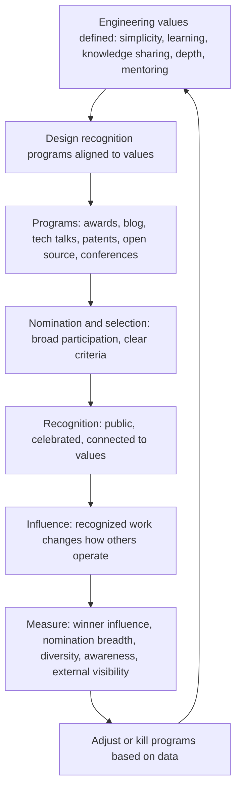

# Engineering Excellence Programs

> **Core skill:** The principal engineer designs recognition and excellence programs — internal awards, publications, patent programs, engineering blogs, and tech talks — that reinforce the organization's technical values and set a visible standard for what great engineering looks like.

## Why This Matters

What an organization celebrates shapes what its engineers aspire to. If the only visible recognition is for shipping features on deadline, engineers optimize for shipping features on deadline — quality, craft, and technical depth become invisible. The principal designs recognition programs that make the full spectrum of engineering excellence visible: the elegant architecture, the carefully considered simplification, the knowledge generously shared, the incident that produced lasting learning.

Recognition programs are also retention and brand mechanisms. Engineers stay where their work is seen and valued. External visibility — through blogs, conference talks, open-source contributions, and patents — builds the organization's engineering brand, which attracts talent and signals technical credibility to customers and partners. The principal architects this visibility.

## Recognition Program Portfolio

| Program Type | What It Recognizes | Cadence | Investment | Best For |
|-------------|--------------------|---------|------------|----------|
| **Internal engineering awards** | Specific achievements: best architecture, best simplification, best post-incident learning, best mentoring | Annual or biannual | Low: award design, judging panel, ceremony | Culture reinforcement; making values tangible |
| **Technical publications and engineering blog** | Written contributions: architecture deep-dives, incident retrospectives, technical tutorials, research summaries | Ongoing (weekly to monthly posts) | Medium: editorial support, review process, promotion | External brand; internal knowledge sharing; engineer development |
| **Tech talks program** | Presentations on technical work, lessons learned, and explorations | Weekly, biweekly, or monthly | Low: scheduling, recording, promotion | Cross-team learning; presentation skill development; visibility for presenters |
| **Patent and invention program** | Novel technical contributions with commercial or defensive value | Ongoing | Medium: patent attorney review, filing costs, inventor awards | IP protection; inventor recognition; external technical credibility |
| **Open-source contribution recognition** | Significant contributions to open-source projects, especially those the organization depends on | Ongoing and annual highlight | Low: recognition, spot awards, conference sponsorship | Ecosystem influence; engineer development; recruitment brand |
| **External conference participation** | Engineers representing the organization at industry conferences | Per conference cycle | Medium: travel, tickets, talk preparation support | External brand; engineer development; recruitment; competitive intelligence |

The principal designs the portfolio based on organizational size, maturity, and strategic goals. A portfolio that only has an annual award and nothing else recognizes excellence once a year and forgets it the other 364 days. A healthy portfolio has multiple programs at different cadences so recognition is continuous.

## Designing Recognition That Reinforces Values

The most common recognition failure is programs that recognize the wrong things. An "Innovation Award" that goes to the team that shipped the most features rewards volume, not innovation. The principal designs programs so that the award criteria are the values in action.

| Value | Award or Recognition | Selection Criteria | Example Winner |
|-------|---------------------|-------------------|----------------|
| Simplicity | Simplification Award | Removed significant complexity; measured reduction in system surface area, incident rate, or onboarding time | The team that decommissioned three legacy services and merged their functionality into one well-designed replacement |
| Learning from failure | Post-Incident Learning Award | An incident post-mortem that produced specific, adopted process changes and has been cited by other teams | An incident review that led to a new deployment safety check adopted by 12 teams |
| Knowledge sharing | Knowledge Multiplier Award | Writing, talks, or mentoring that demonstrably improved other engineers' capability | A staff engineer whose architecture deep-dive series is used as onboarding material across the organization |
| Technical depth | Deep Dive Award | An investigation or design that demonstrated exceptional technical depth and influenced an org-level decision | A performance investigation that identified a subtle concurrency bug and produced a fix adopted by the platform team |
| Mentoring | Mentoring Impact Award | Mentees who cite the mentor as career-defining and have achieved measurable growth | A principal whose mentees include two newly promoted staff engineers and three tech leads |

The selection criteria are public. Every engineer should be able to read the criteria and know what they would need to do to be recognized. That clarity is what makes recognition a culture mechanism, not a popularity contest.

## The Principal as Recognition Architect

The principal's role in recognition is not to hand out awards — it is to design the system that produces the right awards going to the right people for the right reasons.

| Activity | What the Principal Does |
|----------|------------------------|
| **Program design** | Defines the award categories, selection criteria, nomination process, judging panel, and ceremony format |
| **Values alignment** | Ensures every recognition program maps to a stated engineering value; kills programs that do not |
| **Judging panel selection** | Recruits a diverse, cross-organization panel; rotates membership to prevent capture |
| **Nomination encouragement** | Actively encourages nominations for quiet contributors whose work might otherwise be invisible |
| **Ceremony presence** | Attends and speaks at recognition events; the principal's presence signals that the recognition matters |
| **Program review** | Reviews each program's impact annually: who was recognized, did it reflect the org's values, did winners influence others? |

After the first 1-2 cycles, the principal should not be the person running the programs. Staff engineers, tech leads, and engineering managers should run them — the principal has designed the system and receded to ensure it is institutionalized, not personality-dependent.

## The Engineering Blog and External Voice

The engineering blog is the organization's most visible technical brand asset. The principal shapes it.

| Blog Element | Principal's Role |
|-------------|-----------------|
| **Editorial strategy** | Defines the themes and topics the blog should cover; ensures alignment with the technology strategy |
| **Author development** | Encourages and supports engineers to write; reviews drafts for technical accuracy and strategic alignment |
| **Quality standard** | Sets the bar: every post should teach something that another engineering team could apply |
| **Publication cadence** | Ensures the blog publishes regularly; an engineering blog that posts twice a year signals decline |
| **External reach** | Promotes posts through the principal's network; connects blog content to conference talk proposals |

The engineering blog serves three audiences simultaneously: external engineers who might join the organization, internal engineers who learn from their peers, and industry peers who form their impression of the organization's technical caliber. The principal ensures the blog serves all three.

## Measuring Program Impact

Recognition programs are evaluated on behavioral outcomes, not participation counts.

| Measure | What It Reveals | Data Source |
|---------|-----------------|-------------|
| **Winner influence** | Did the recognized work change how other teams operate? | Adoption of practices demonstrated or described by award winners |
| **Nomination breadth** | Are nominations coming from across the organization, or from the same teams every cycle? | Nomination source analysis; a narrow source base indicates low awareness or trust |
| **Winner diversity** | Do winners reflect the organization's diversity or are they concentrated in one demographic? | Demographic analysis of winners vs eligible population |
| **Engineer awareness** | Can engineers name the award categories and what they recognize? | Pulse survey: "name one engineering award and what it recognizes" |
| **External visibility metrics** | Blog readership, conference talks accepted, open-source contribution volume | Analytics; conference acceptance rates; contribution metrics |

The principal reviews these measures annually and adjusts or kills programs that are not producing the intended behavioral outcomes.

## The Excellence Program System



## Practical Applications

### Excellence Program Checklist

- [ ] At least three recognition programs are active (e.g., awards, blog, tech talks) with documented selection criteria
- [ ] Every recognition program maps to a stated engineering value; programs that do not are redesigned or killed
- [ ] Nomination processes are open and broad; at least 20% of the engineering org submits or receives a nomination annually
- [ ] The engineering blog publishes at least monthly and posts are shared externally
- [ ] At least one recognition program is run by someone other than the principal
- [ ] Program impact is measured annually: winner influence, nomination breadth, winner diversity

### Award Program Design Template

```markdown
# Award Program: [Award Name]

- Value recognized: [which engineering value this award reinforces]
- Criteria: [specific, observable criteria; what the winner did and what impact it had]
- Eligible: [who can be nominated; who can nominate]
- Nomination process: [how to nominate; what evidence to provide; deadline]
- Judging panel: [names, roles, rotation schedule]
- Selection process: [how winners are chosen; how conflicts of interest are managed]
- Recognition format: [ceremony, announcement, prize, public narrative about why they won]
- Cadence: [annual, biannual, quarterly]
- Program review: [date of next impact review]
```

## Common Pitfalls

| Pitfall | Why It Is a Problem | Better Approach |
|---------|---------------------|-----------------|
| **Volume recognition** | Awards go to the most visible work, not the most excellent work | Criteria emphasize impact, craft, and learning — not volume or visibility |
| **Awards as popularity contest** | Winners are whoever is best-known, not whoever did the best work | Blind or criteria-driven judging; diverse panel; nomination outreach for quiet contributors |
| **Programs without values alignment** | Recognition programs that do not reinforce stated engineering values create confusion about what matters | Map every program to a value; kill programs that do not align |
| **Principal as award emperor** | The principal personally selects winners; the program is perceived as favoritism | Design a judging panel with diverse membership and rotation; the principal may sit on it but does not control it |
| **Blog that dies** | The engineering blog launches with enthusiasm and publishes nothing after month three | Assign editorial ownership; set a publication cadence; make blog posts count toward performance |
| **Recognition as apology for low compensation** | Awards are used to substitute for competitive pay or promotion | Recognition complements compensation; it does not replace it and must not be used that way |

## Success Indicators

- At least one recognition program has produced a winner whose work was subsequently adopted by multiple teams
- The engineering blog publishes on a regular cadence and posts are cited externally
- Engineers across the organization can name at least one award category and what it recognizes
- Recognition program winners reflect the diversity of the engineering organization
- At least one program was redesigned or killed based on impact review

## Related Topics

- [[01_Building_Technical_Culture_at_Scale]]: the values that recognition programs reinforce
- [[02_Growing_Staff_and_Principal_Engineers]]: recognition as a signal in promotion cases
- [[04_Technical_Community_Building]]: communities as recognition distribution channels
- [[04_Organizational_Influence/00_overview|Organizational Influence]]: the external voice these programs amplify
- [[career-path/03_Staff_Engineer/07_Organizational_Learning_and_Mentoring/03_Communities_of_Practice|Communities of Practice (Staff)]]: communities that produce recognition-worthy work

## Summary

Engineering excellence programs are the principal's design for what gets celebrated: creating a portfolio of awards, publications, tech talks, patents, open-source recognition, and conference participation that maps every program to a stated engineering value, defines selection criteria that reward craft and impact over volume and visibility, builds judging and editorial systems that survive the principal's direct involvement, and measures impact through behavioral outcomes — did recognized work change how other teams operate — rather than participation counts. The organization that celebrates the right work produces more of it; the principal designs the celebration to produce more of what the engineering culture needs.