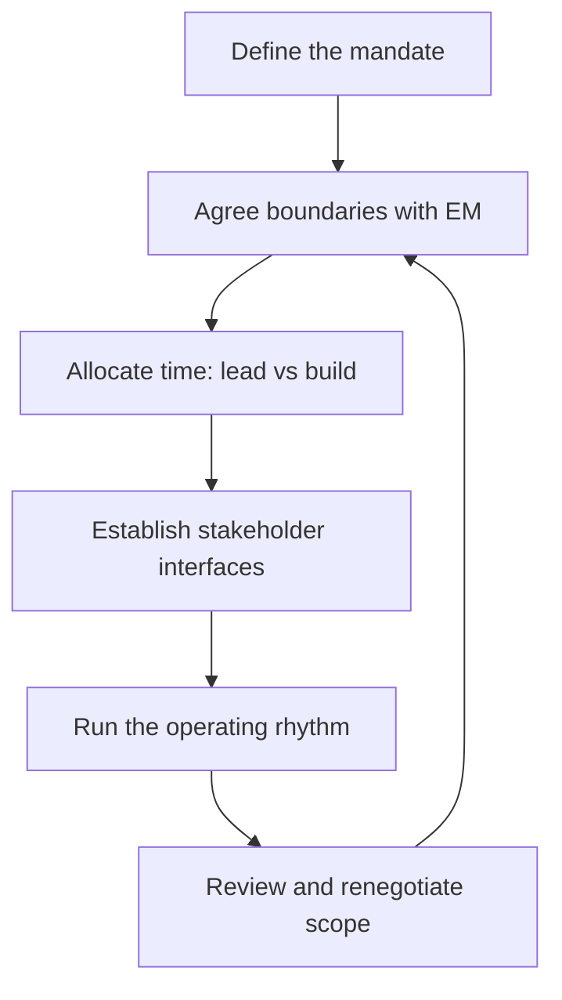

# The Tech Lead Role and Operating Model

> **Core capability:** A tech lead creates a coherent technical result with a team. This area defines what the role is accountable for, how it pairs with the engineering manager, and how to operate when authority is incomplete.

## Why This Matters

The tech lead role is the most misunderstood role on an engineering team. It is not "the most senior engineer," not "a junior manager," and not "the person who approves pull requests." Organizations define it differently — a formal position, a rotating responsibility, or a set of duties folded into a senior engineer's job.

A tech lead who has not defined their own operating model drifts into one of two failure modes: becoming a **bottleneck** (every decision routes through them) or becoming an **absent architect** (technical direction dissolves into whatever each engineer prefers). This area establishes the mandate first, so the skills in later areas have something to stand on.

## Topics in This Capability Area

| Topic | Core Skill | When It Matters |
|-------|------------|-----------------|
| [[01_The_Tech_Lead_Mandate]] | Defining what the role is accountable for | Role start, scope disputes, performance expectations |
| [[02_The_Tech_Lead_Engineering_Manager_Partnership]] | Dividing responsibility with the EM | Any team with both roles; deciding the fork |
| [[03_The_Player_Coach_Dilemma]] | Balancing individual contribution with leadership | Every week of the job; time allocation |
| [[04_Tech_Lead_Scope_and_System_Boundaries]] | Choosing the right scope of ownership | Team formation, system splits, multi-team work |
| [[05_Navigating_Ambiguity_and_Incomplete_Authority]] | Leading when you cannot decide alone | Cross-team initiatives, shared platforms |
| [[06_Working_With_Stakeholders]] | Representing the team and its system upward and sideways | Planning, escalations, expectation setting |
| [[07_First_90_Days_as_Tech_Lead]] | Transitioning from senior engineer to tech lead | New role, new team, inherited system |

## The Operating Model

The model is a loop, not a ladder: scope and time allocation are renegotiated as the team and system change.

## The Accountability Triangle

| Accountability | What it means | What it does NOT mean |
|----------------|---------------|----------------------|
| **The technical outcome** | The system works, evolves, and serves its users | Writing most of the code yourself |
| **The technical direction** | The team knows where the system is going and why | Deciding every detail unilaterally |
| **The team's technical capability** | Engineers can operate and decide without you | Being the only one who understands the system |

## Practical Applications

### Operating Model Checklist

Review quarterly, or whenever the team changes shape:

- [ ] The mandate is written down and the team can state it in one sentence
- [ ] TL/EM responsibility split is explicit, with no orphaned decisions
- [ ] Time allocation between leading and building is deliberate and visible
- [ ] System boundaries are defined, and outside-boundary work has an escalation path
- [ ] Stakeholder interfaces are known: who we talk to, on what cadence
- [ ] The operating rhythm (syncs, reviews, planning) fits in sustainable hours
- [ ] Scope was re-negotiated the last time the system or team grew

## Common Pitfalls

| Pitfall | Why It Is a Problem | Better Approach |
|---------|---------------------|-----------------|
| **Undefined mandate** | Everyone assumes a different job; gaps and overlaps emerge | Write the mandate down; agree it with EM and team |
| **Doing both roles badly** | Half managing, half leading, neither well | Explicit partnership with the EM, or explicit dual-role agreement |
| **100% leadership or 100% coding** | Either loses credibility or loses the team | Deliberate time allocation, protected and visible |
| **Scope creep** | Trying to own everything touching the system | Define system boundaries; escalate outside them |

## Success Indicators

- The team can state what you are accountable for — in one sentence
- Decisions happen without you more often than with you
- The EM partnership has no orphaned responsibilities
- Stakeholders know when to come to you and when not to

## Related Capabilities

- [[02_System_Ownership_and_Production_Responsibility/00_overview|System Ownership and Production Responsibility]]: the mandate expressed as ownership of a running system
- [[03_Technical_Direction_and_Architecture/00_overview|Technical Direction and Architecture]]: the mandate expressed as direction-setting
- [[career-path/02_Senior_Software_Engineer/07_Mentoring_and_Team_Leadership/07_Leading_Without_Authority|Leading Without Authority (Senior)]]: the senior-level foundation this role builds on

## Summary

The tech lead role succeeds or fails on the clarity of its operating model. Define the mandate, split responsibility explicitly with the engineering manager, protect a sustainable lead/build balance, and renegotiate as the system grows. Everything else in this path is a skill hanging off this frame.
