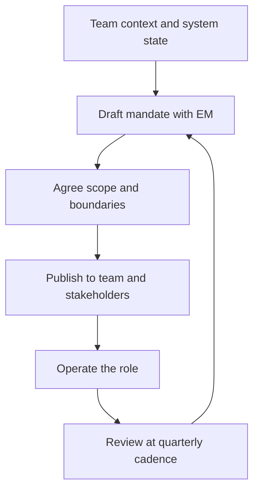

# The Tech Lead Mandate

> **Core skill:** Defining and negotiating what the tech lead role is accountable for — the technical outcome, the technical direction, and the team's technical capability — and making that definition visible to the team and to stakeholders.

## Why This Matters

Most tech lead problems are not technical problems; they are problems of unclear accountability. When the mandate is undefined, the engineering manager assumes you handle the technical details, the team assumes you decide everything, and you assume you will still have time to code. Three different jobs are being imagined by three different groups, and none of them is the job you actually signed up for.

A written mandate turns this around. It makes the boundaries of the role explicit: what you are accountable for, what you are not, and where your authority starts and ends. It is the document the team, the EM, and your manager can point to when scope disputes arise — and they will arise.

The mandate is not a job description. It is a working agreement, negotiated when you start and renegotiated when the team, the system, or the organization changes. A mandate you wrote once and filed away is already stale.

## The Mandate Triangle

The tech lead mandate rests on three accountabilities. Each one has a meaning and a common misinterpretation:

| Accountability | What it means | What it does NOT mean |
|----------------|---------------|----------------------|
| **The technical outcome** | The system works, evolves, and serves its users | Writing most of the code yourself |
| **The technical direction** | The team knows where the system is going and why | Deciding every detail unilaterally |
| **The team's technical capability** | Engineers can operate and decide without you | Being the only one who understands the system |

The three legs support each other. If direction is unclear, the outcome decays as engineers optimize locally. If capability is weak, direction becomes a monologue. If the outcome fails, no amount of good direction compensates.

## Adjacent Accountabilities

Some responsibilities sit near the role without belonging squarely inside it. The mandate should say where each one lives:

| Responsibility | Default home | Notes |
|----------------|--------------|-------|
| Delivery commitments | EM and PM | TL supplies estimates and risk assessment |
| People management | EM | TL supplies technical performance input |
| Incident response | Shared | TL owns technical response; EM owns staff communication |
| Hiring | Shared | TL owns the technical bar; EM owns the process |
| Process improvement | Shared | TL owns technical quality; EM owns team dynamics |
| Budget and headcount | EM | TL supplies the technical justification |

The point is not that this table is right for every organization — it is that someone writes the table down. Orphaned responsibilities are the silent cost of an unwritten mandate.



## Mandate vs Job Description

| Dimension | Job description | Mandate document |
|-----------|-----------------|------------------|
| Purpose | Recruitment and compensation | Operating agreement |
| Audience | HR and candidates | Team, EM, stakeholders |
| Content | Skills and responsibilities | Accountabilities, boundaries, decision rights |
| Lifetime | Years | Months; renegotiated as context changes |
| Ownership | Written by the organization | Written by you, agreed with EM and manager |

## Writing the Mandate Document

A good mandate fits on one page. It answers five questions:

1. What am I accountable for?
2. What am I explicitly not accountable for?
3. What decisions do I own outright?
4. What decisions require agreement with the EM or stakeholders?
5. What will I be measured against this quarter?

## Signals the Mandate Is Unclear

- The EM and you both believe you own delivery dates
- Engineers ask you for approval on decisions you thought were theirs
- Stakeholders bypass you to ask engineers for technical commitments
- Your calendar fills with work nobody assigned to anyone
- Performance feedback mentions responsibilities you never accepted

If two or more of these are true, the mandate needs renegotiation, not harder work.

## Practical Applications

```markdown
## Tech Lead Mandate — [Team name]

### Accountable for
- [ ] Technical outcome: [system or product scope]
- [ ] Technical direction: [vision, ADRs, standards]
- [ ] Team technical capability: [growth targets, review practice]

### Explicitly not accountable for
- [ ] People management, performance reviews, compensation
- [ ] [anything else the organization owns elsewhere]

### Decision rights
- Own outright: [list]
- Shared with EM: [list]
- Escalate to manager: [list]

### This quarter I will be measured against
- [ ] [outcome metric]
- [ ] [direction artifact]
- [ ] [capability signal]
```

Checklist before publishing:

- [ ] EM has read it and agrees with every line
- [ ] Your manager has seen it and raised no objections
- [ ] The team has been told what changes and what does not
- [ ] A review date is set (quarterly by default)

## Common Pitfalls

| Pitfall | Why It Is a Problem | Better Approach |
|---------|---------------------|-----------------|
| **Unwritten mandate** | Everyone imagines a different job; gaps and overlaps emerge silently | Write it down, even a rough draft, then iterate |
| **Mandate as job description** | A static skills list settles nothing and goes stale | Frame it as accountabilities, boundaries, and decision rights |
| **Negotiated once** | Team, system, and organization change; the agreement does not | Put a review date inside the document itself |
| **Accepting everything** | Scope creep until the role is unplayable | Name what you are not accountable for as loudly as what you are |
| **Solo mandate** | The EM, team, and stakeholders never sign up to their half | Publish it; disagreement at publication is cheaper than at incident time |

## Success Indicators

- The team can state what you are accountable for in one sentence
- Scope disputes resolve by pointing at the mandate, not by argument
- Stakeholders know when to come to you and when to go to the EM
- Your calendar reflects the mandate: no orphaned work, no surprising approvals
- The mandate changes at most once or twice a year, and deliberately

## Related Topics

- [[02_The_Tech_Lead_Engineering_Manager_Partnership]]: the mandate's most important boundary is the one with the EM
- [[04_Tech_Lead_Scope_and_System_Boundaries]]: the mandate becomes concrete through system boundaries
- [[07_First_90_Days_as_Tech_Lead]]: negotiating the mandate is the first-90-days milestone
- [[05_Team_Development_and_Mentoring_Leadership/00_overview|Team Development and Mentoring Leadership]]: team capability is one leg of the triangle
- [[career-path/02_Senior_Software_Engineer/01_Technical_Ownership/00_overview|Technical Ownership (Senior)]]: the personal ownership this mandate extends to a team

## Summary

The tech lead mandate is a one-page working agreement covering the technical outcome, the technical direction, and the team's technical capability — plus the boundaries around them. Written, agreed with the EM and manager, and reviewed on a cadence, it converts role ambiguity into decision clarity. Unwritten, it guarantees the three most expensive failure modes of the role: overlap, gaps, and drift.
