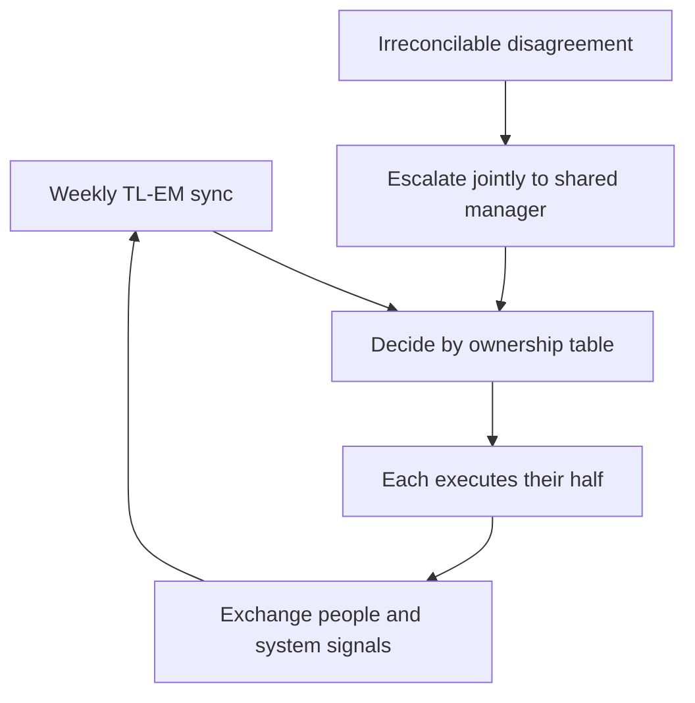

# The Tech Lead Engineering Manager Partnership

> **Core skill:** Dividing responsibility with the engineering manager so every team accountability has exactly one owner and the two roles reinforce rather than collide.

## Why This Matters

The tech lead and the engineering manager are the two leadership seats on a team. When the division between them is implicit, three failure modes appear: the same decision gets made twice (conflict), no one makes it (gap), or each defers to the other (paralysis). All three look identical from outside — a team that stalls on things it should be able to decide.

The cleanest division in common use: the TL owns the system and its outcome; the EM owns the people and team health. Everything else is negotiated against that spine, decision by decision. The negotiation is not a one-time event — it is a standing item in a weekly sync that never gets cancelled.

## The Division Principle

| Dimension | Tech lead owns | EM owns |
|-----------|----------------|---------|
| Primary object | The system and its outcome | The people and team health |
| Output | Technical decisions, direction, quality | Performance, growth, dynamics, process |
| Failure they answer for | System failures, technical debt | Attrition, burnout, interpersonal breakdown |
| Input to the other | Technical performance signals | Team context and capacity signals |

The division is a starting point, not a fence. Both roles need visibility into both halves — the TL needs to know when an engineer is struggling, the EM needs to know when a subsystem is rotting. The difference is who is accountable for acting.

## Decision Ownership

A RACI-style table removes most partnership friction before it starts. For each common decision, one role is accountable and the other is consulted or informed:

| Decision | TL | EM | Notes |
|----------|----|----|-------|
| Hiring technical bar | A | C | TL owns the interview rubric and final technical call |
| Hiring process and offer | C | A | EM owns process, compensation, and the decision |
| Performance feedback | C | A | TL supplies technical evidence; EM owns the review |
| Promotion readiness | C | A | TL owns the technical readiness signal |
| Technical direction and architecture | A | I | EM consulted on team impact |
| Delivery commitments | C | A | TL owns estimates and risk; EM owns the commitment |
| On-call design and rotation | A | C | EM consulted on workload and wellbeing |
| Roadmap priorities | C | A | TL advises on cost and risk; PM and EM own priorities |
| Incident response | A | C | TL owns technical response; EM owns communications |
| Process and rituals | C | A | TL owns technical-quality rituals; EM owns team rituals |

A = accountable, C = consulted, I = informed. The specific letters matter less than that the table exists and both parties have argued over it once.

## The Weekly TL-EM Sync

The partnership lives or dies on a regular sync. Thirty minutes, weekly, same slot:

```markdown
## TL-EM Sync — [date]

### Decisions needed this week
- [ ] Decision: [what] | Owner: [TL or EM] | Deadline: [when]

### Delivery and risk
- [ ] Commitments at risk and why
- [ ] Technical blockers the EM should know about

### People signals
- [ ] Engineers of note: wins, struggles, growth signals
- [ ] Workload and burnout watch: [names and areas]

### System health
- [ ] Debt items that need capacity
- [ ] Production incidents or near-misses this week

### The partnership itself
- [ ] Anything either of us is about to decide alone that affects the other
- [ ] Disagreements that need escalation to [manager name]
```

If the sync is skipped twice in a row, treat it as an incident — that is exactly when the partnership silently drifts.

## The Dual-Role Case

Some organizations merge the roles: one person is both TL and EM. It can work in small teams or early-stage companies, and it carries specific failure modes that a split role does not:

| Failure mode | What it looks like | Mitigation |
|--------------|--------------------|------------|
| **No peer for people issues** | Performance conversations become technical arguments | Manager-of-managers review of people decisions; external coach |
| **Conflicted feedback** | Engineers cannot tell technical feedback from career feedback | Separate the conversations explicitly, and in time |
| **Bottleneck leadership** | One person owns decisions, reviews, and 1:1s | Ruthless delegation of one track or the other |
| **No escalation path** | The person engineers would escalate to is the problem | Defined escalation to the manager's manager; skip-level cadence |
| **Mandate inflation** | The role grows until neither job is done well | Quarterly audit of where time actually goes |

If you are a dual-role TL and EM, write the two roles as two columns in your mandate and track time against each. The roles do not merge just because one person holds them.



## Practical Applications

Checklist for establishing or repairing the partnership:

- [ ] Write the decision ownership table with the EM, line by line
- [ ] Agree the weekly sync slot and put it in both calendars
- [ ] Publish the division to the team: who to go to for what
- [ ] Agree what gets escalated, and to whom, when the two of you disagree
- [ ] Review the division quarterly and after any team change
- [ ] If dual-role, track time against each role for a month and audit the split

## Common Pitfalls

| Pitfall | Why It Is a Problem | Better Approach |
|---------|---------------------|-----------------|
| **Implicit division** | Both assume ownership, or neither does; conflict or gaps appear | Write the ownership table and argue over it once |
| **Sync decay** | Skipped syncs hide drift until a crisis surfaces it | Never cancel the sync; reschedule it, and track a skip counter |
| **Public disagreement** | Team takes sides; decisions get relitigated through the team | Disagree in private, present one decision in public |
| **TL as EM's deputy** | People decisions leak onto the TL; the EM abdicates | Escalate back to the ownership table; both enforce it |
| **Frozen partnership** | Team and org changed but the division never did | Review quarterly and after any team or org change |
| **Escalation paralysis** | Disagreements sit unresolved because escalation feels like failure | Escalation is the plan, not a breakdown; name the path in advance |

## Success Indicators

- The team knows who to approach for what without asking
- No decision is waiting because the TL and EM are still talking about it
- Feedback to engineers arrives with both technical and people evidence
- The sync is 30 minutes and almost never runs over
- Disagreements between the roles are rare and escalate cleanly when they happen

## Related Topics

- [[01_The_Tech_Lead_Mandate]]: the partnership is the mandate's sharpest boundary
- [[03_The_Player_Coach_Dilemma]]: the EM relationship defines how much of the coach job you hold
- [[06_Working_With_Stakeholders]]: the TL and EM present a single front outward
- [[05_Team_Development_and_Mentoring_Leadership/00_overview|Team Development and Mentoring Leadership]]: the people half of the division

## Summary

The TL-EM partnership converts role ambiguity into explicit decision ownership: the TL owns the system and its outcome, the EM owns the people and team health, and every common decision is assigned once in a table both have argued over. A weekly 30-minute sync keeps the division alive. Dual-role arrangements work only with explicit time separation and an escalation path outside the role holder.
