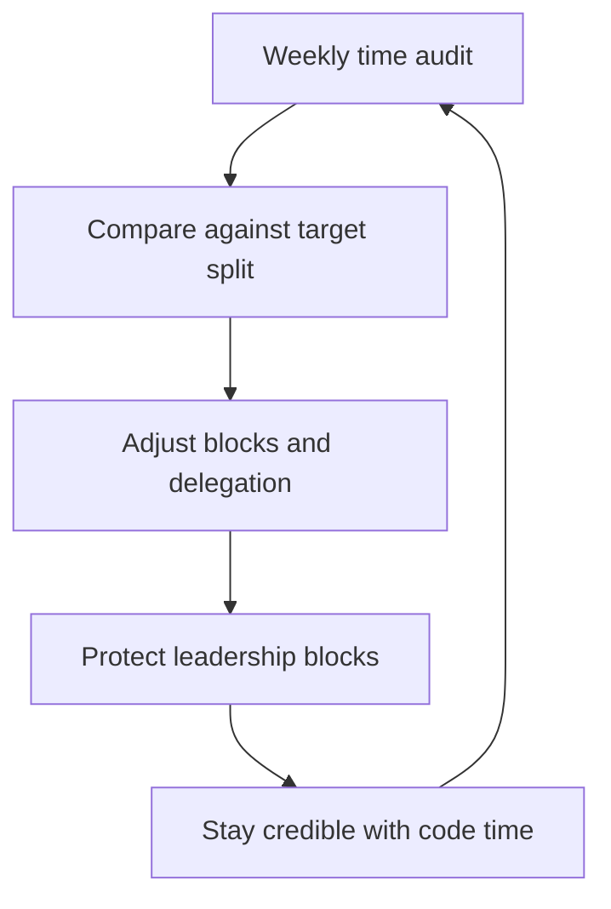

# The Player Coach Dilemma

> **Core skill:** Allocating your own time between building and leading — protecting the leadership work while keeping enough hands-on work to stay credible.

## Why This Matters

The tech lead job contains two jobs: the player (writing code, debugging, shipping) and the coach (direction, reviews, mentoring, stakeholder work). Neither disappears, and both expand to fill available time. Without a deliberate allocation model, one wins by default — usually the player, because coding is concrete, rewarding, and what got you promoted.

The cost of the wrong default is either a bottleneck (you on every critical path) or a system that drifts (you nowhere near the code). Both are survivable for a quarter and fatal over a year.

## The Two Jobs

| Work type | Examples | What it produces |
|-----------|----------|------------------|
| Player work | Features, fixes, debugging, pull requests you write | Direct output you can see today |
| Coach work | Design reviews, standards, ADRs, technical mentoring, roadmap | Output multiplied through the team |
| Credibility work | Reading code, attending design discussions, being in incidents | The right to be heard when you lead |

The third row is the one most leads skip, and it is the one that makes the first two work. Credibility is an asset that depreciates daily and can only be re-earned in code.

## Time Allocation Models

The right split depends on team maturity. The split describes the leadership portion of your time — the part not spent on your own code:

| Team state | Typical split (code : leadership) | Why |
|------------|----------------------------------|-----|
| New team, new system, few seniors | 70 : 30 | You carry delivery while the team forms |
| Stable team, mixed experience | 50 : 50 | Balance direct output with reviews and mentoring |
| Mature team, strong seniors | 30 : 70 | Direction, standards, and stakeholder work dominate |
| Team in crisis or incident-heavy | Variable, never 0 : 100 | You must stay close enough to code to lead the response |

The split is a quarterly decision, not a weekly mood. Write it down, tell the team, and review it each quarter against what actually happened.

## Protecting the Leadership Blocks

Leadership work loses to coding work in a fair fight, so it needs structural protection:

- Block coach work in the calendar in recurring slots: review hours, standards hours, stakeholder hours
- Treat a blocked leadership slot as non-negotiable against ad-hoc coding requests
- Batch similar work: all design reviews together, all stakeholder updates together
- Make leadership output visible — accepted ADR, published review, updated roadmap — so the blocks demonstrably produce things

## The Cost of Context Switching

| Switch | Typical cost | Mitigation |
|--------|--------------|------------|
| Code to review to code | 15-30 minutes of re-focus per switch | Batch reviews; review in fixed slots |
| Deep design thinking to chat | An hour of productive thought lost | Do design work in blocks, not in gaps |
| Incident mode to feature work | Rest of the day degraded | Rotate incident ownership; keep feature days clean |
| Meeting-heavy days | No deep work left | Protect two deep-work days per week |

The goal is not zero switching — the role is switching. The goal is to make switches deliberate and batched rather than reactive.

## When to Code and When Not To

| Situation | Code yourself | Delegate and coach |
|-----------|---------------|--------------------|
| Spike or prototype for an unknown | Yes — speed and judgment matter | No |
| Risky core of a critical change | Yes, or pair with the owner | No |
| Teaching a complex area | Yes — as pair or reviewer | No |
| Production incident diagnosis | Yes — you are the responder | No |
| Critical-path feature with a deadline | Only if you are the fastest; otherwise you become the risk | Hand to the owner, stay as reviewer |
| Everything interesting | No — interest is not a prioritization principle | Give growth opportunities to others |
| Work a teammate needs to grow | No — that is the mentoring plan | Delegate with support |

The rule of thumb: code where your judgment is the scarce resource, not where your typing is.

## Player-Coach Failure Modes

| Failure mode | Symptoms | Recovery |
|--------------|----------|----------|
| **Bottleneck** | Pull requests wait for you; decisions wait for you; velocity is your availability | Delegate review authority; codify decisions in ADRs and standards |
| **Absent lead** | Direction drifts; standards rot; you discover problems in incidents | Rebuild the calendar around coach work; re-enter design discussions |
| **Hero coder** | You ship the hard stuff alone; the team watches | Hand over the hard stuff with pairing and review structure |
| **Full-time manager** | You never touch code; credibility and judgment decay | Schedule deliberate code time: hard bugs, code reading, incident work |



## Practical Applications

Weekly time audit template:

```markdown
## Time Audit — [week]

### Where the time went
- [ ] Player work: [hours] — [what was built]
- [ ] Coach work: [hours] — [reviews, standards, mentoring]
- [ ] Credibility work: [hours] — [code reading, incidents]
- [ ] Meetings and overhead: [hours] — [what they were for]

### Target vs actual
- [ ] Target split: [e.g. 50-50] | Actual: [e.g. 65-35]
- [ ] Largest deviation: [where it came from]

### Next week
- [ ] One piece of player work to delegate or pair
- [ ] One leadership block to protect harder
- [ ] One credibility activity to schedule
```

Run the audit weekly for a month, then monthly.

## Common Pitfalls

| Pitfall | Why It Is a Problem | Better Approach |
|---------|---------------------|-----------------|
| **No written split** | Coding wins by default and leadership decays invisibly | Write the quarterly target split and publish it |
| **Calendar without blocks** | Coach work squeezes into gaps and never gets deep attention | Put leadership blocks in the calendar as recurring appointments |
| **Saying yes to every hard bug** | You become the bottleneck the team routes around | Ask: is my judgment needed, or just my typing? |
| **Delegating without support** | The team inherits hard work with no structure and fails | Delegate with pairing, review structure, and a safety net |
| **Skipping credibility work** | Your technical judgment goes stale and reviews lose force | Schedule code time; make it as protected as the blocks |
| **Auditing without adjusting** | The audit becomes a guilt ritual with no output | End every audit with one concrete change for next week |

## Success Indicators

- The team can say what you are working on this week, player and coach
- No pull request or decision waits on you for more than a day
- You can name the last three things you built and the last three you enabled
- Your calendar shows protected leadership blocks that survive the week
- The quarterly time audit matches the quarterly intent within ten points

## Related Topics

- [[01_The_Tech_Lead_Mandate]]: the mandate defines what the coach half must produce
- [[02_The_Tech_Lead_Engineering_Manager_Partnership]]: the EM absorbs people work so you can stay technical
- [[07_First_90_Days_as_Tech_Lead]]: the split is negotiated explicitly in the first quarter
- [[04_Team_Delivery_and_Execution_Leadership/00_overview|Delivery and Execution Leadership]]: protecting capacity is a delivery skill

## Summary

The player-coach dilemma is an allocation problem, not a personality trait. A quarterly target split (roughly 70/30 down to 30/70 depending on team maturity), protected calendar blocks for leadership work, batched context switches, and a weekly time audit keep the balance honest. Code where your judgment is scarce; delegate where your typing is.
