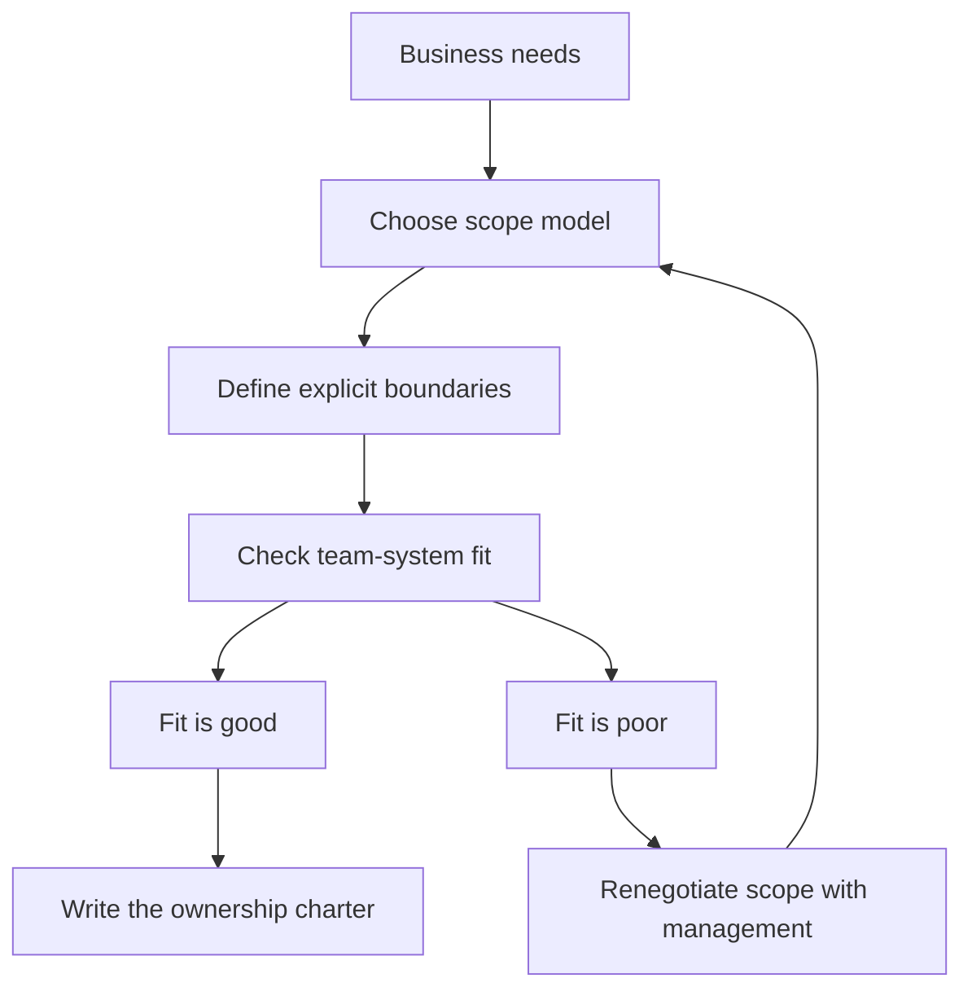

# Tech Lead Scope and System Boundaries

> **Core skill:** Choosing and defending the scope of ownership — which system or systems the team owns, where the boundary sits, and what lives outside it.

## Why This Matters

Scope determines whether the team can actually own outcomes. Too narrow, and the team becomes a feature factory: everything it delivers depends on other teams, its engineers never see an outcome through, and accountability dissolves into dependencies. Too wide, and the team owns things it cannot operate: review load explodes, nobody is deep anywhere, and incidents happen in areas no one truly understands.

Scope decisions are made once and felt for years. They are shaped by the organization's team structure, by the system's shape, and by Conway's law — and once set, they are surprisingly hard to change. That is why the tech lead treats scope as a deliberate, renegotiable contract rather than an inheritance to accept.

## Scope Options

| Scope model | When it fits | Risks to manage |
|-------------|--------------|-----------------|
| One team, one system | The system is coherent and the team is sized to it | System grows beyond the team; boundary blurs over time |
| One team, multiple systems | Small, related systems; shared patterns and infrastructure | Attention fragments; each system gets shallow ownership |
| Multi-team, one system | Large system with clear internal seams and interfaces | Interface governance becomes a full-time job |
| Team plus platform | Team owns a system that others consume | Consumer teams become stakeholders you must serve |

There is no right answer in the abstract. The test is concrete: can the team state what it owns, operate what it owns, and be held accountable for its outcomes without depending on unowned gray zones?

## Defining the System Boundary

A boundary is not a diagram line; it is a set of explicit agreements. The ownership charter must specify:

| Boundary element | What to define | Example |
|------------------|----------------|---------|
| Interfaces | The contracts across the boundary and who may change them | Public API versioning policy, message schemas |
| Data ownership | Which data the team owns, reads, or only consumes | Team owns its domain tables; warehouse reads via views |
| Deployment scope | Which services, jobs, and infrastructure the team operates | Services, cron jobs, queues, feature flags |
| External touchpoints | Where other teams or vendors enter the system | Auth provider, payment gateway, upstream platform |

A boundary that only exists in your head will be crossed daily. A boundary written into interface contracts, ownership files, and on-call scope will be defended automatically.

## Conway's Law and Team-System Fit

Conway's law says the system's structure will mirror the team's communication structure — and that the mirror is often accidental. When the team structure and the system structure disagree, friction shows up as endless coordination meetings around a single awkward seam.

The practical rule: put the seam where the ownership line is. If two teams must cooperate constantly, they should own different layers of the same system, not fight over one shared component. When a system split is proposed, ask first whether a team split can achieve the same decoupling — and vice versa.



## Symptoms of Scope Misfit

| Symptom | Likely cause | First move |
|---------|--------------|------------|
| Cross-team meetings dominate the calendar | Boundary cuts through a high-coordination seam | Move the boundary, or formalize the interface |
| Ownership disputes over one component | Gray zone nobody chartered | Name an owner and a change policy for the gray zone |
| Team cannot ship without another team's permission | Too many shared dependencies inside the scope | Internalize the dependency or renegotiate the scope |
| Parts of the system nobody can explain | Scope wider than the team's attention | Split the system, or accept shallow ownership explicitly |
| Engineers leave to avoid the gray zones | Chronic ambiguity around accountability | Charter every gray zone, even if the answer is shared |

## Renegotiating Scope with Management

Scope renegotiation is a normal leadership act, not a complaint. The sequence that works:

1. Gather evidence: where time goes, which coordination costs dominate, which outcomes are at risk
2. Frame the problem in outcome terms — delivery speed, incident risk, quality — not in team-structure preferences
3. Offer two or three scope options with trade-offs, and a recommendation
4. Name the transition cost and the transition plan for each option
5. Get the decision recorded, then re-charter ownership and communicate to the team

Management will not renegotiate scope on the strength of "this is annoying." They will renegotiate on the strength of "this boundary costs us a week per quarter and produced two incidents last year."

## Practical Applications

```markdown
## Ownership Charter — [Team name]

### We own
- [ ] Services and jobs: [list]
- [ ] Data: [domains and stores]
- [ ] Interfaces we control: [list]
- [ ] On-call and operations for: [list]

### We consume but do not own
- [ ] [dependency, with owning team]

### Boundary rules
- [ ] Interface changes: [policy, e.g. additive only, versioned]
- [ ] Data access outside the team: [policy]
- [ ] Who may change our interfaces: [policy]

### Gray zones and their resolution
- [ ] [gray zone] -> [owner or shared decision process]

### Review
- [ ] Next boundary review: [date]
```

Checklist:

- [ ] Every service and data store has exactly one owning team
- [ ] Every interface has a change policy
- [ ] Gray zones are named, not ignored
- [ ] The charter is published where other teams can find it

## Common Pitfalls

| Pitfall | Why It Is a Problem | Better Approach |
|---------|---------------------|-----------------|
| **Inherited scope** | You accept whatever boundary exists without testing it | Audit the boundary in your first quarter; renegotiate if it misfits |
| **Boundary in your head** | Everyone crosses it daily because it was never written | Charter interfaces, data, and deployment scope explicitly |
| **Scope by enthusiasm** | The team absorbs systems because they are interesting | Accept only what the team can operate and be accountable for |
| **Conway ignored** | Team structure fights the system structure forever | Move the seam to the ownership line, in one direction or the other |
| **Renegotiating once** | Team, product, and system change; the scope does not | Review the charter quarterly and after any org change |
| **Gray zones unowned** | Disputes and neglect breed in unnamed territory | Name every gray zone and give it an owner or a decision process |

## Success Indicators

- Every component the team touches has a named owner and a change policy
- The team can list its systems without hesitation and its gray zones on request
- Cross-team coordination happens at interfaces, not inside the team's work
- Scope disputes are rare, and when they occur they resolve via the charter
- The scope has changed deliberately at least once in the last year — proof it is managed

## Related Topics

- [[01_The_Tech_Lead_Mandate]]: the mandate becomes concrete through the boundaries you choose
- [[05_Navigating_Ambiguity_and_Incomplete_Authority]]: cross-boundary work is where authority gets incomplete
- [[02_System_Ownership_and_Production_Responsibility/00_overview|System Ownership and Production Responsibility]]: the charter is the foundation of system ownership
- [[career-path/06_Software_Architect/00_overview|Software Architect]]: boundary design is the architect's native discipline

## Summary

Scope and system boundaries turn the mandate into something operable: a charter that says what the team owns, what it consumes, where its interfaces sit, and who resolves its gray zones. Choose the scope model deliberately, check it against Conway's law, and renegotiate it with management when the evidence says the boundary is costing outcomes. An unchartered boundary is not neutrality — it is drift.
